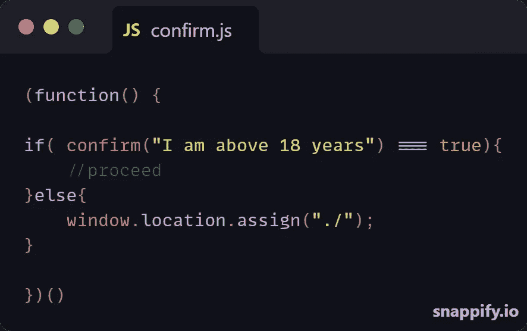
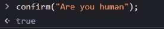

# 使用 JavaScript 内置的 Confirm()函数

> 原文：<https://medium.com/nerd-for-tech/using-javascripts-inbuilt-confirm-function-6e2e6f904d40?source=collection_archive---------4----------------------->

我相信您知道内置的 confirm()函数，它提示用户确认一个动作。

这个内置函数的返回类型为布尔值，其值可以是*真*或*假*。

*   当你给出肯定的回答时为真
*   当您提供否定回答或取消提示时为 FALSE。

让我们在我们的控制台上试试这个。

这是我点击*确定*时的输出。

在上面的输出中，我提供了肯定的响应，返回值为 *TRUE* 。

# 应用

在您的表单中，您可能希望用户使用事件监听器 **onsubmit** 并传递 **return confirm("您确定吗？")**。

现在，这将提示用户消息*您确定要提交吗？*。如果用户提供了肯定的回答，表单就可以提交，但是如果用户提供了否定的回答，表单就不能提交。

## 在你的职责范围内

有一种方法可以在函数块中使用这个内置函数。

假设我们的应用程序上有一个按钮，允许用户删除所有记录。有必要准备好这个提示，这样操作就不会因为点击按钮而被错误地执行。

例如，我们有一个这样的按钮；

不能在按钮上直接使用 **onsubmit** 属性，因为它不是一个表单。所以在你的功能块里，你可以做一些像；

上面的代码非常简单，因为我们使用了一个条件语句来显示消息并检查返回值。

首先，点击按钮后，会提示用户*您确定要全部删除吗？*当用户提供肯定的响应时，其余的代码将会执行。但是如果用户给出否定的回答，什么都不会发生。

## 替代行动

您还可以修改代码以基于否定响应执行操作。

假设我们有一个年龄限制的网站，我们可以*不安全地*检查用户是否低于某个年龄，就像这样；

使用 **else{}** 块，您可以在得到否定响应时执行一个动作。

# 结论

与使用 onsubmit 属性相反，您可以在函数中使用条件语句来显示提示，如果用户提供了肯定的响应就继续，如果提供了否定的响应就执行操作。

谢谢大家！