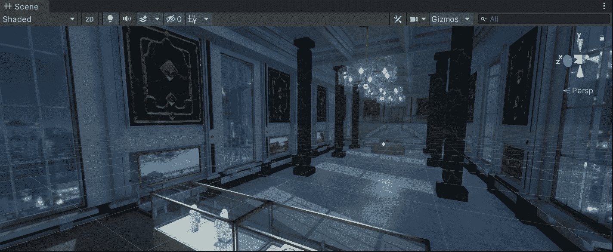
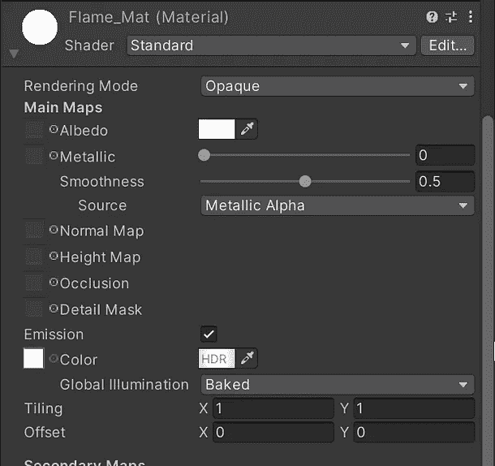
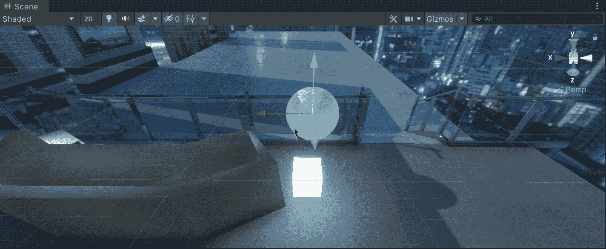
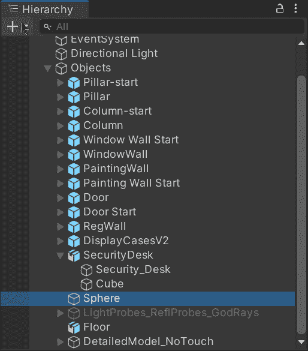
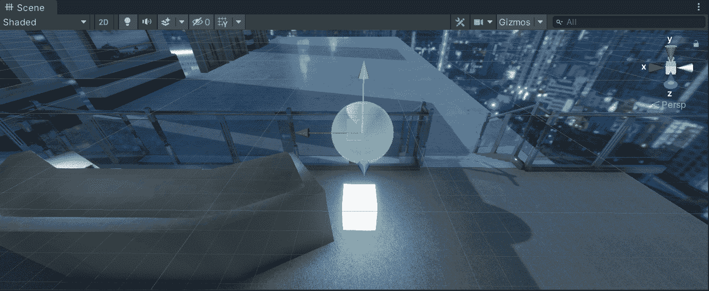
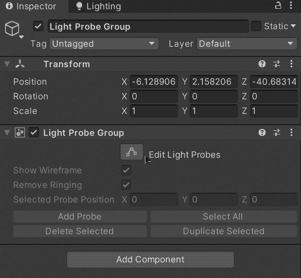
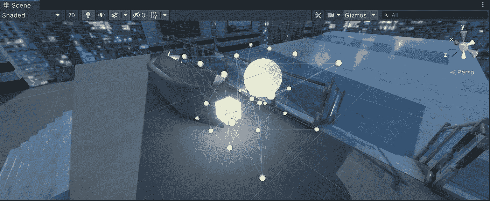
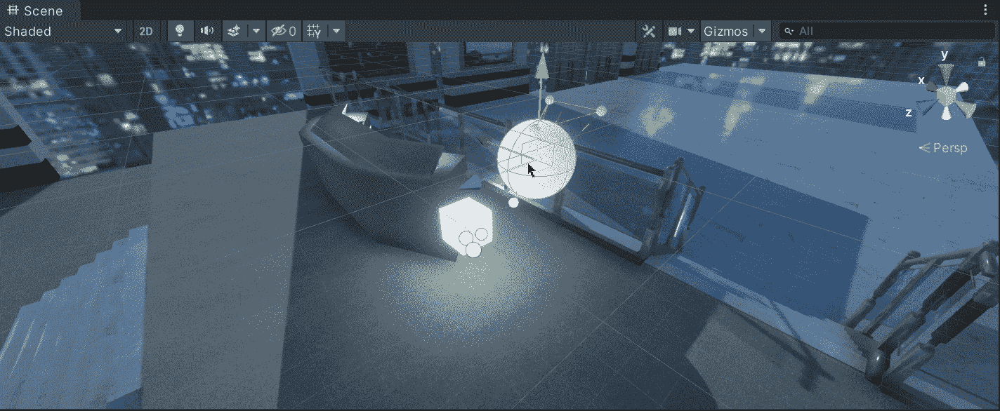
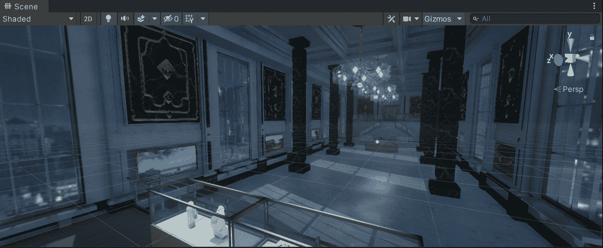

# 在 Unity 中使用光探头

> 原文：<https://medium.com/nerd-for-tech/using-light-probes-in-unity-56bcedd1aafd?source=collection_archive---------2----------------------->

## 统一指南

## 关于在 Unity 中使用光探头的快速指南

**目标**:在场景中使用灯光探针将烘焙的灯光投射到动态物体上。

在上一篇文章中，我介绍了 3D 版 Unity 的一些环境和灯光方面的内容[。现在，是时候创建和使用光探头，用 Unity 在动态对象中投射烘焙光了。](/nerd-for-tech/3d-environment-lighting-unity-d7deee1aaebf)

# 创建光探针

在我们当前的场景中，我们有一个立方体，它不使用平行光，而是包含一个定制的材质，通过发射通道发射白光。正如你在下一张 gif 中看到的，当它移动时，光线不会影响它前面的球体:

因此，为了显示球体移动时的照明效果，我们可以使用光探头。让我们通过点击 *+* > *灯* > *灯探针组*来创建一个组:

如果您想了解更多关于光探头组的信息，您可以访问 Unity 文档:

 [## 光探针组

### 切换到脚本来放置灯光探针到你的场景中，你必须使用一个带有灯光探针组组件的游戏对象…

docs.unity3d.com](https://docs.unity3d.com/2018.4/Documentation/Manual/class-LightProbeGroup.html) 

一旦光探头组被创建，我们将能够在场景中看到立方体的烘焙光如何开始对前面的空间(包括球体)产生效果:

# 实施光探头

现在，为了修改我们组中 8 个光探头的位置，我们需要点击检查器中的*编辑光探头*按钮。此外，还有另外 4 个按钮，允许我们添加、选择、删除或复制我们组中的光探头:

因此，为了用一种真实的方法处理烘焙的光，让我们编辑光探测器来覆盖立方体附近的一个简单区域。光探头在它们之间插入光的水平。如果一个光探头靠近烘焙灯，而下一个光探头不靠近烘焙灯，当我们靠近第二个光探头时，通过它们之间的光量会减少。

你可以在下一张 gif 中看到它是如何工作的。一旦我把新的光探头移到没有烘烤光的位置，光强度就会降低:

灯光探测器将存储关于场景中烘焙灯光的信息，以便我们可以有一种方法来显示穿过场景中空白空间的灯光:

现在，由于光探头组，当我们移动球体时，我们将能够注意到当光进入另一组连接的光探头(黄线)时，反射的光的水平发生了变化:

这样，我们可以使用灯光探针在更大的场景中插入烘焙灯光。使用它们将提高游戏的性能。

就是这样，我们在 Unity 中使用光探针来处理与烘焙光的交互！:d .我将在下一篇文章中看到你，在那里我将展示 Unity 中反射探头和屏幕空间反射之间的区别。

> *如果你想更多地了解我，欢迎登陆*[***LinkedIn***](https://www.linkedin.com/in/fas444/)**或访问我的* [***网站***](http://fernandoalcasan.com/) *:D**