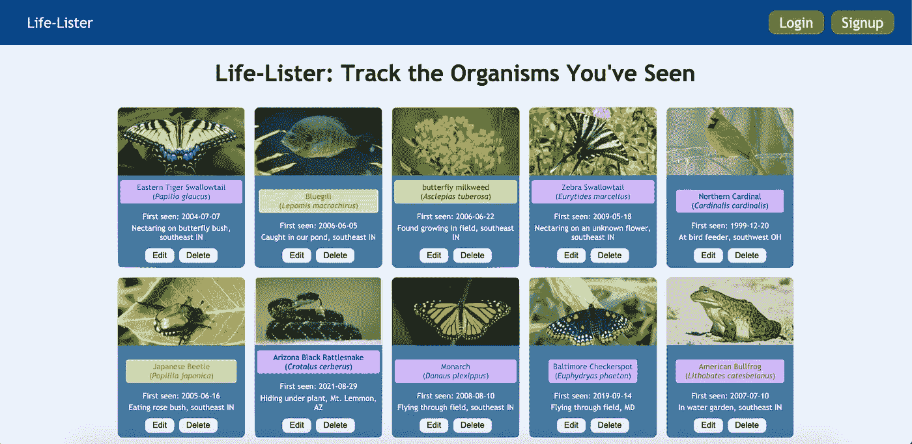
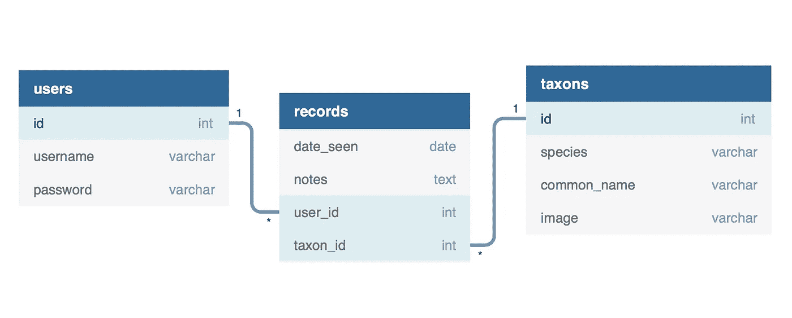

# 在 Rails 项目中使用 Net::HTTP

> 原文：<https://medium.com/nerd-for-tech/using-net-http-in-a-rails-project-1cdcc5b3a99c?source=collection_archive---------3----------------------->



我的项目主页

我最近完成了我的第一个 Ruby on Rails 项目，我很兴奋地创建了它。我的项目名为 [Life-Lister](https://life-lister.herokuapp.com) ，是一个允许用户创建生活列表(详细列出一个人见过的每一种生物)并与其他人分享的应用程序。生命列表主要由鸟类和蝴蝶使用，但我的应用程序适用于所有类型的生物。

我希望实现的一个特性是能够提交一个生物体的名称(以及关于观察的细节),并让我的前端神奇地生成一个记录，其中包含生物体的学名、俗名和照片，以及用户输入的细节。为了做到这一点，我计划再次利用 Naturalist API (我在我的第一个[普通 JavaScript 项目](https://megan-mccarty.medium.com/javascript-and-scope-what-i-learned-from-my-first-javascript-project-9fecc0943a1b)中使用了它)，但是我必须在后端处理 fetch 请求，这是我以前从未做过的事情。

但是，在我开始处理获取请求之前，我需要首先为项目绘制模型。我决定我需要三个模型:一个用户、一个分类单元(保存一个有机体对象)和一个记录(保存关于一个特定发现的信息)。一个用户可能有许多记录，一个分类单元也可能有许多记录。一个记录可能同时属于一个用户和一个分类单元。下面是我提出的数据库模式的图表，使用 [db.diagram](https://dbdiagram.io/home) 生成:



一旦我建立了我的模型，我就使用一个名为 Net:HTTP 的库，它内置在 Rails 中。在我的项目的 app 文件夹中，我创建了一个名为 services 的新目录，在里面，我创建了一个新的类来处理我的 fetch 请求:

```
# services/inaturalist_api.rbrequire 'net/http'class InaturalistApi
  def self.fetch(taxon)
    url = URI("https://api.inaturalist.org/v1/taxa?q=#{taxon}&rank_level=10")
    res = Net::HTTP.get(url)
    JSON.parse(res)
  end
end
```

HTTP 使得在 Rails 中进行获取请求变得非常容易。在我的自定义类方法`#fetch`中，我为用户通过前端提交的生物体名称传递了一个参数。因为 iNaturalist API 超级灵活，我不用写什么复杂的逻辑来判断输入的名字是通用名还是学名；我可以把它直接插入网址。获取请求的响应被保存到变量`res`，最后一行将`res`解析成 JSON。

接下来，我在分类模型中创建了一个定制的类方法，`#taxon_from_api`:

```
# models/taxon.rbclass Taxon < ApplicationRecord
  ... def self.taxon_from_api(result)
    self.find_or_create_by(
      species: result['results'].first['name'],
      common_name: result['results'].first['preferred_common_name'],
      image: result['results'].first['default_photo']['medium_url']
    )
  end
end
```

正如我的自定义类方法的名字所暗示的那样，我从 iNaturalist API 中获取信息并保存到我的数据库中。我使用了活动记录中的一个内置类方法`#find_or_create_by`，这样，如果几个用户看到了帝王蝶，我就没有重复的帝王蝶分类对象。相反，如果帝王蝶已经存在，我们就使用它；如果没有，则创建一个新的分类对象。从 JSON 响应中，我可以获取物种名、通用名和图像，并将其保存到我的 API 的数据库中。

最后，我需要将所有东西连接在一起。因为用户实际上是提交一个表单来创建一个新的记录对象(而不是一个新的分类对象)，所以我需要处理记录控制器内部的一切，特别是在`#create`方法中:

```
# controllers/records_controller.rbclass RecordsController < ApplicationController
  ... def create
    taxon_entered = params[:taxon]
    result = InaturalistApi.fetch(taxon_entered)
    taxon = Taxon.taxon_from_api(result)
```

首先，我在前端从用户输入中获取分类单元的名称(使用 params)，并将其保存到变量`taxon_entered`。我将该变量传递到我的自定义`#fetch`方法中，并将结果保存到名副其实的变量`result`中。(我喜欢 Rails 的一点是，不像使用 Django 或 React JS，我不需要导出`InaturalistApi`类及其自定义的`#fetch`方法，并将它们导入我的控制器。)接下来，我将`result`传递给分类定制方法`#taxon_from_api`，查看该记录是否已经存在于我的数据库中，如果不存在，为我创建一个新对象。到目前为止一切顺利！

然后我在我的`#create`方法中添加了另一行来获取当前登录的用户(因为我需要知道这个新记录属于谁！):

```
user = User.find_by(id: session[:user_id])
```

然后，剩下的方法如下:

```
record = Record.create!(
  category: params[:category],
  date_seen: params[:date],
  notes: params[:notes],
  taxon_id: taxon.id,
  user_id: user.id
)render json: record, status: :created
```

既然我已经有了分类单元和用户，那么我可以用用户从前端输入的细节创建一个新的记录对象。

总之，我的`#create`方法看起来是这样的:

```
def create
  taxon_entered = params[:taxon]
  result = InaturalistApi.fetch(taxon_entered)
  taxon = Taxon.taxon_from_api(result) user = User.find_by(id: session[:user_id]) record = Record.create!(
    category: params[:category],
    date_seen: params[:date],
    notes: params[:notes],
    taxon_id: taxon.id,
    user_id: user.id
  ) render json: record, status: :created
end
```

就是这样！现在，用户可以提交一个详细记录(包括分类单元和观察细节)的表单，并让该记录显示用户不需要提供的图像和专有名称。成功！

如果你想看我的项目，在 Github 上有回购:[后端](https://github.com/Meganmccarty/life-lister-rails) (Rails)和[前端](https://github.com/Meganmccarty/life-lister-react) (React JS)。还可以查看[直播项目](https://life-lister.herokuapp.com)。