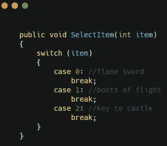
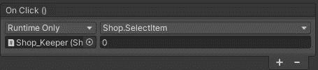
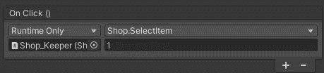
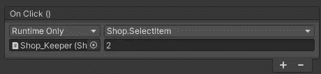
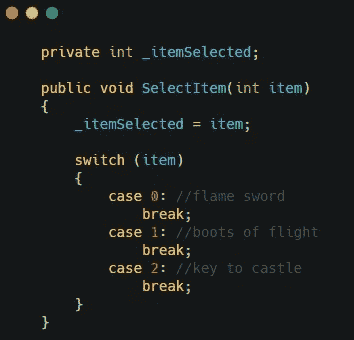
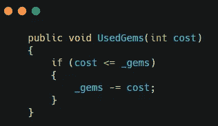
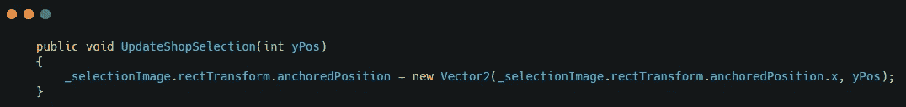
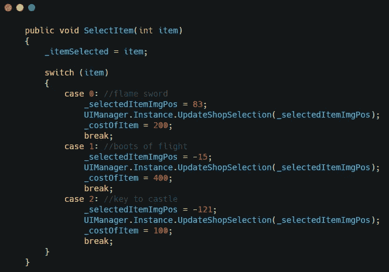
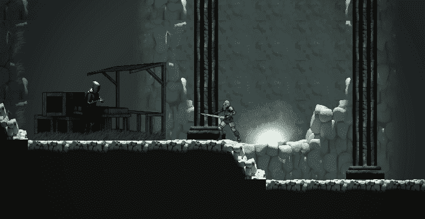

# 在 Unity 中使用 OnClick 事件

> 原文：<https://medium.com/nerd-for-tech/using-onclick-events-in-unity-5b9cbcf595a?source=collection_archive---------1----------------------->

我一直在为我的游戏开商店。在本文中，我将介绍如何使用 unity 的 UI 系统和 OnClick 事件来设置商店的功能。

首先，事件需要函数来调用。在打开商店 UI 的脚本中，创建一个方法，该方法接受一个 int 值，并根据该 int 值和一个 switch 语句确定您选择的商品。

保存并转到 unity 将事件添加到按钮。对于每个按钮，将脚本所在的商家游戏对象添加到 OnClick 事件中。选择正确的方法，并将正确的数字添加到方法中。

现在，项目的按钮点击将实际上是正确的。

现在，为了使用 buy 按钮，我们将为它创建一个使用方法。首先，创建一个保存所选项目的值的变量。

buy buttons 方法将使用所选项目的值，并确定给玩家的价格。你需要创建一个变量来保存物品的价格成本，以及一个方法来确保玩家有足够的宝石来购买物品。

注意:项目成本在项目按钮的 switch 语句中设置

这将允许玩家购买物品，如果他们有足够的宝石。

我还添加了一个显示所选项目的栏。

注意:在 UIManager 中

这给了商店更好的感觉。

