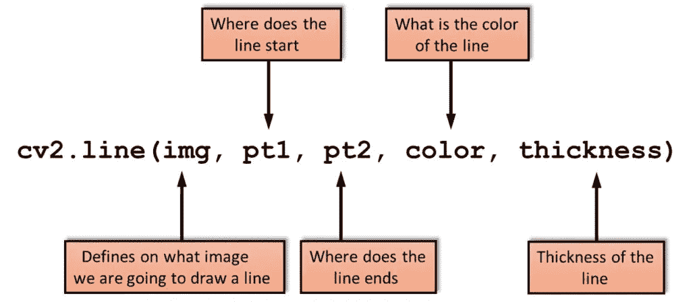
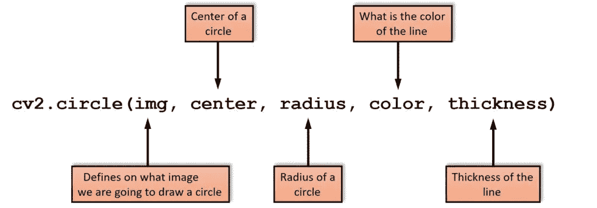
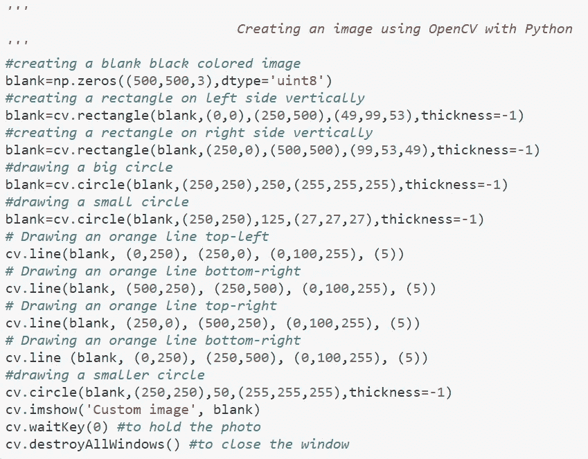
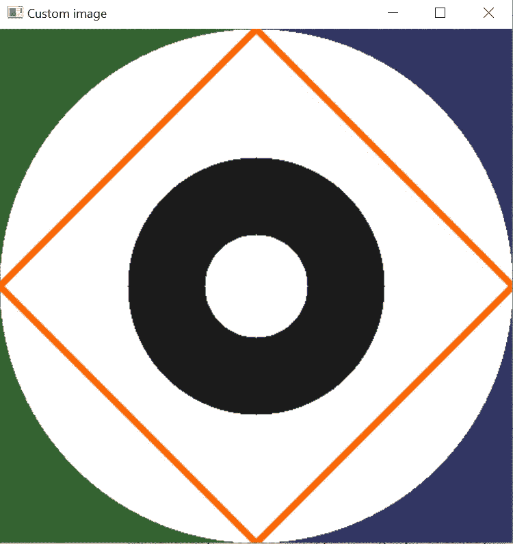
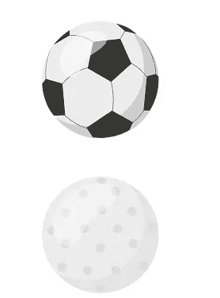
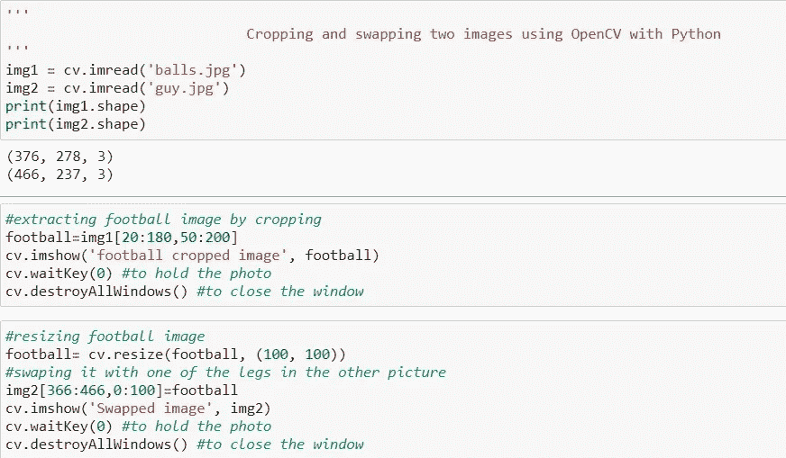
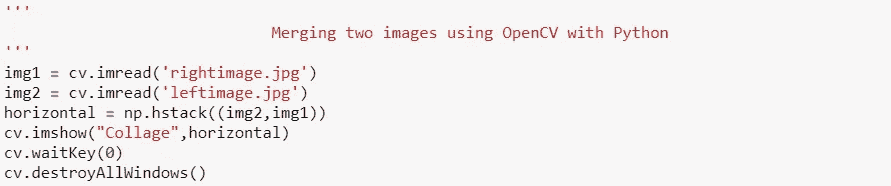
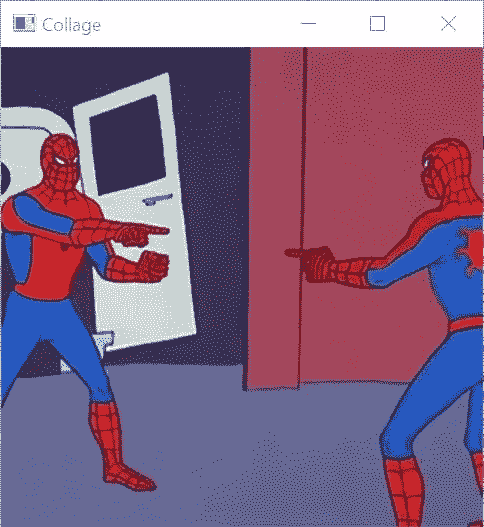

# 使用 OpenCV 和 Python 对图像执行基本操作

> 原文：<https://medium.com/nerd-for-tech/using-opencv-with-python-to-perform-basic-operations-on-images-bb396153ae2a?source=collection_archive---------8----------------------->

# **目标:**

执行以下任务-

📌使用 Python 代码自己创建图像

📌拍摄两张图像，裁剪图像的一部分并交换。

📌拍摄两张图像，并将其组合成一张图像。

# 方法:

为了执行以下任务，我们将使用 OpenCV 和 Python，ide 是 Jupyter notebook。

## 我们来看看 Python 中的 OpenCV 是什么？

因此，OpenCV-Python 是一个 Python 绑定库，旨在解决计算机视觉问题。它使用了 **Numpy** ，这是一个具有 MATLAB 风格语法的高度优化的数值运算库。所有 OpenCV 数组结构都与 Numpy 数组相互转换。这也使得与使用 Numpy 的其他库(如 SciPy 和 Matplotlib)的集成更加容易。

> 所以让我们开始吧！

## 📌使用 Python 代码自己创建图像:

为此，我们可以参考 OpenCV 中的图形绘制功能。

*   **画线:**要画线，需要传递线的起点和终点坐标。

*   **画矩形:**画矩形，需要矩形的左上角和右下角。

画矩形的函数是`cv2.rectangle()`。矩形由两个对角上的两个点定义。第一个在左上角，第二个在右下角。请记住，厚度参数的负值会给我们一个填充的形状作为输出。

*   **画圆:**要画圆，需要它的圆心坐标和半径。

下面是我如何使用上述函数创建自定义图像的一个片段:

代码片段

输出

## 📌拍摄两张图像，裁剪图像的一部分并交换。

这里要注意的重要一点是切片函数，因为图像只是 2D/3D 阵列，我们可以对它们执行切片函数来提取图像的特定部分。

`<cropped_image_variable>=image[starty:endy, startx:endx]`

starty:endy 切片提供图像中的*行*(因为*y*-轴是行数)，而 startx:endx 提供*列*(因为*x*-轴是列数)。

以下是用于执行任务的图像。

球

一个人

代码片段

输出

## 📌拍摄两张图像，并将其组合成一张图像

在 OpenCV 中，使用 Numpy 数组合并到图像有不同的方法，其中一种方法是:

## hstack():

`numpy.**hstack**` ( *图普*)

*   按顺序水平堆叠数组(按列)。
*   这相当于沿第二个轴串联，只是一维数组沿第一个轴串联。重建除以`**hsplit**`的数组。
*   这个函数对于多达 3 维的数组最有意义。例如，对于具有高度(第一轴)、宽度(第二轴)和 r/g/b 通道(第三轴)的像素数据。函数`[**concatenate**](https://numpy.org/doc/stable/reference/generated/numpy.concatenate.html#numpy.concatenate)`、`[**stack**](https://numpy.org/doc/stable/reference/generated/numpy.stack.html#numpy.stack)`和`[**block**](https://numpy.org/doc/stable/reference/generated/numpy.block.html#numpy.block)`提供了更一般的堆叠和连接操作。

> **参数:****tup:***n 数组序列*
> 
> 除了第二个轴之外，数组必须具有相同的形状，一维数组除外，一维数组可以是任意长度。
> 
> **返回** : **堆栈:***n 数组*
> 
> 由给定数组堆叠而成的数组。

以下是用于执行任务的图像:

img1

img2

代码片段

输出

> 用于上述任务的 GitHub 资源库:[https://GitHub . com/AmimaShifa/Working-with-OpenCV-with-Python](https://github.com/AmimaShifa/Working-with-OpenCV-with-Python)