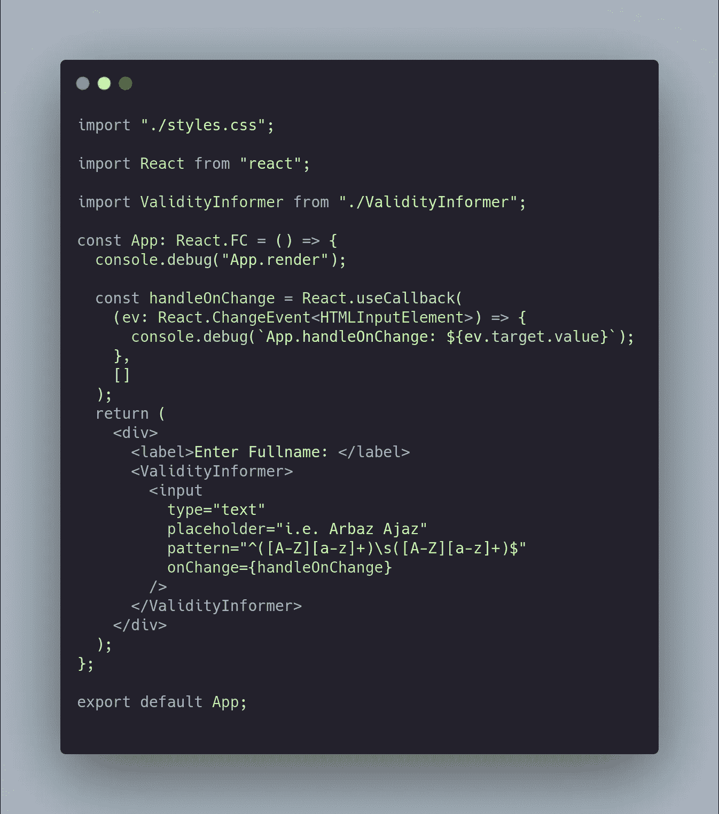
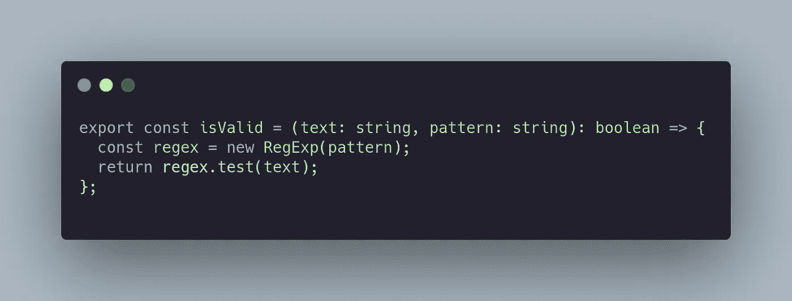
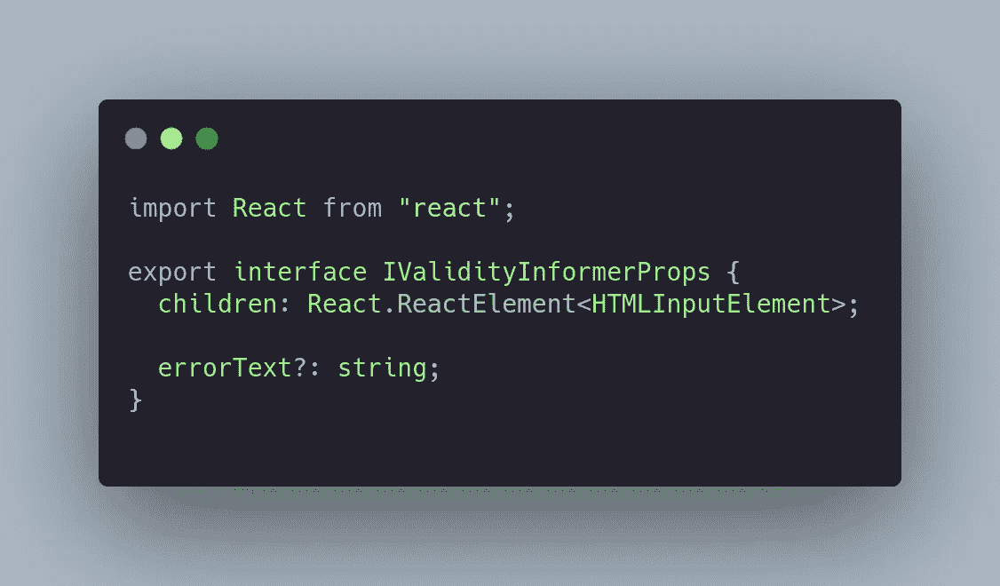
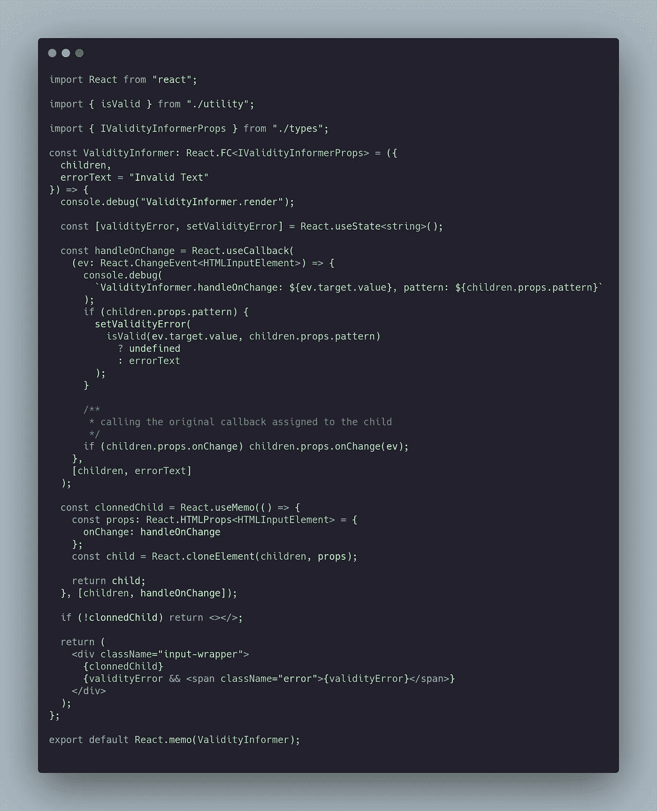
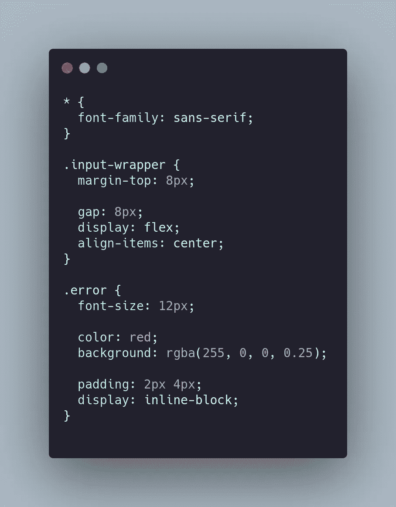

# 使用 React.cloneElement()评估输入字段的有效性。

> 原文：<https://medium.com/nerd-for-tech/using-react-cloneelement-to-assess-validity-of-an-input-field-da11bf6c10a2?source=collection_archive---------12----------------------->

React 有一组顶级 API，可以用来在某些场景下编写更干净的代码。

> 但是在你使用它们之前，你需要让所有和你一起工作的人达成共识。写一个干净的代码意味着它能被其他人容易地阅读和理解。

## 解释实施:

您可以从`React.cloneElement`上的[文档](https://reactjs.org/docs/react-api.html#cloneelement)中了解更多信息。在本文中，我使用了`React.cloneElement`来访问子元素的`pattern`和`onChange` `prop`来评估值是否有效。如果该值无效，则输入字段旁边会显示一个错误。

# 履行

我们使用传递给子组件的 props，并将功能附加到它的回调中，以检查值是否有效，即传递传递给子/输入组件的 regex 模式。

## 沙盒:

以下是沙盒的链接:[https://code sandbox . io/s/github/arbaz 52/react-clone-element-assesse-field-validity](https://codesandbox.io/s/github/arbaz52/react-clone-element-assess-field-validity)

[App](https://codesandbox.io/s/github/arbaz52/react-clone-element-assess-field-validity?file=/src/App.tsx) 组件

效用[功能](https://codesandbox.io/s/github/arbaz52/react-clone-element-assess-field-validity?file=/src/utility.ts)

[Props](https://codesandbox.io/s/github/arbaz52/react-clone-element-assess-field-validity?file=/src/types.ts) 需要 [ValidityInformer](https://codesandbox.io/s/github/arbaz52/react-clone-element-assess-field-validity?file=/src/ValidityInformer.tsx) 组件

## 有效性通知组件

实现要求组件是一个`HTMLInputElement`，但是你可以随意选择。

[ValidityInformer](https://codesandbox.io/s/github/arbaz52/react-clone-element-assess-field-validity?file=/src/ValidityInformer.tsx) 组件

[款式](https://codesandbox.io/s/github/arbaz52/react-clone-element-assess-field-validity?file=/src/styles.css)

## 现场演示: