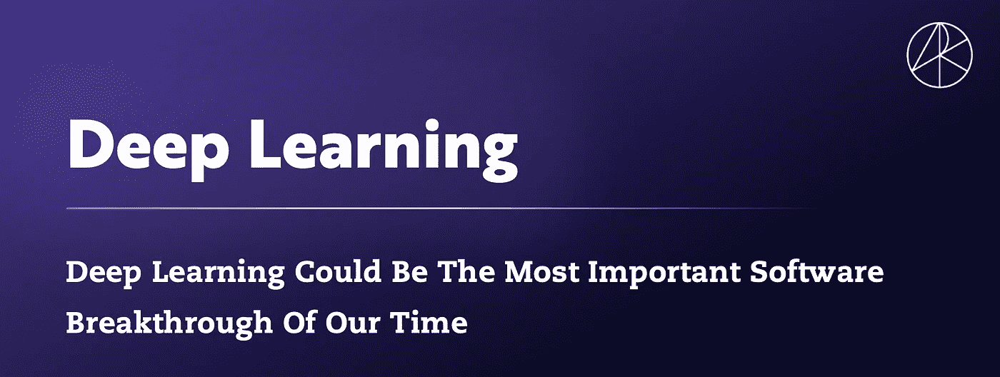
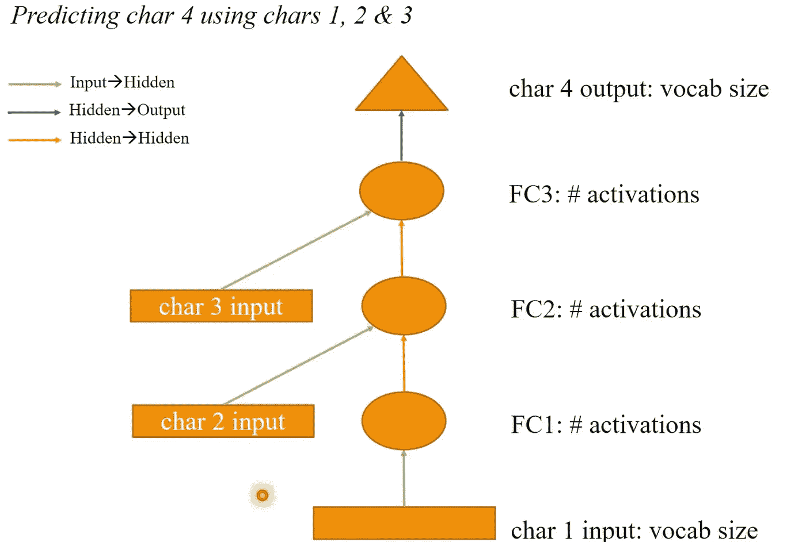
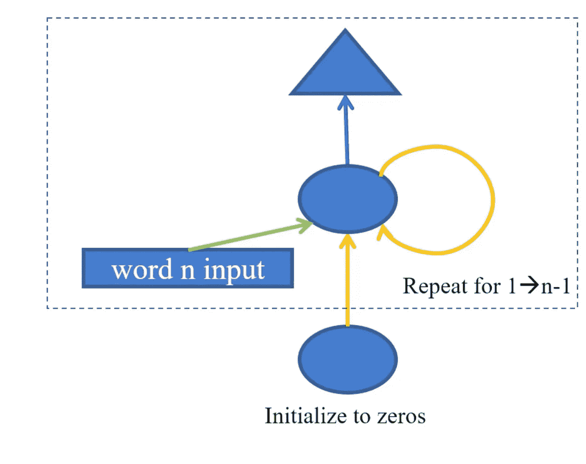

# 使用 RNN 生成文本—使用快速人工智能和 Pytorch

> 原文：<https://medium.com/nerd-for-tech/using-rnn-to-generate-text-using-fast-ai-pytorch-29b77179791?source=collection_archive---------13----------------------->

**RNNs(递归神经网络)**对于许多机器学习和自然语言处理任务来说，功能极其多样，非常强大——尤其是当你处理非结构化的复杂数据集时——这是大多数数据集。

我在互联网上发现了这个智慧的金块——Siri 和谷歌语音搜索只是冰山一角

> 递归**神经网络** ( **RNN** )是最先进的序列数据算法，被苹果的 Siri 和谷歌的语音搜索所使用。由于有内部存储器，它是第一个记住其输入的算法，这使它非常适合涉及顺序数据的**机器学习**问题。

ARK Investment Management 是华尔街表现最好的基金之一，它认为深度学习是值得关注的软件突破，这是正确的。点击这里查看更多:[https://ark-funds.com/](https://ark-funds.com/)



来源:方舟投资管理有限责任公司，2020 年

这是一篇介绍使用 **Pytorch** 和 **FastAI** (我最喜欢的深度学习库)构建 RNN 的小文章。 [Pytorch](https://pytorch.org/) 网站将其定义为“加速从研究原型到生产部署路径的开源机器学习框架”。PyTorch 日益成为研究人员构建深度学习算法的首选框架。完全是开源的，让我好开心:)。本文基于杰瑞米·霍华德关于语言建模的演讲。参观 https://www.fast.ai/

语言建模的维基百科定义是这样的:

> 统计语言模型是单词序列的概率分布[。给定这样一个序列，比如长度为 *m* ，它给整个序列分配一个概率。](https://en.wikipedia.org/wiki/Probability_distribution)
> 
> 语言模型提供[上下文](https://en.wikipedia.org/wiki/Context_(language_use))来区分听起来相似的单词和短语。例如，在美国英语中,“识别语音”和“破坏美丽的海滩”听起来很相似，但意思不同。
> 
> 数据稀疏是构建语言模型的一个主要问题。大多数可能的单词序列在训练中没有观察到。一种解决方案是假设一个单词的概率只取决于前面的 *n* 个单词。当 *n* = 1 时，这被称为 [*n* -gram](https://en.wikipedia.org/wiki/N-gram) 模型或 unigram 模型。unigram 模型也被称为[单词包模型](https://en.wikipedia.org/wiki/Bag_of_words_model)。
> 
> 估计不同短语的[相对可能性](https://en.wikipedia.org/wiki/Relative_likelihood)在许多[自然语言处理](https://en.wikipedia.org/wiki/Natural_language_processing)应用中是有用的，尤其是那些生成文本作为输出的应用。语言建模用于[语音识别](https://en.wikipedia.org/wiki/Speech_recognition)、[、](https://en.wikipedia.org/wiki/Language_model#cite_note-1)、[机器翻译](https://en.wikipedia.org/wiki/Machine_translation)、[、【2】、](https://en.wikipedia.org/wiki/Language_model#cite_note-Semantic_parsing_as_machine_translation-2)、[词性标注](https://en.wikipedia.org/wiki/Part-of-speech_tagging)、[句法分析](https://en.wikipedia.org/wiki/Parsing)、[、](https://en.wikipedia.org/wiki/Language_model#cite_note-Semantic_parsing_as_machine_translation-2)、[光学字符识别](https://en.wikipedia.org/wiki/Optical_Character_Recognition)、[手写识别](https://en.wikipedia.org/wiki/Handwriting_recognition)、[、](https://en.wikipedia.org/wiki/Language_model#cite_note-3)、[信息检索](https://en.wikipedia.org/wiki/Information_retrieval)等"

这篇文章一点也不全面。但这是一种快速接触 DL 代码的方法。让我们暂时忘记数据，只看模型框架和它是如何构建的，以及它看起来是什么样子。你也可以在这里听讲座:[https://youtu.be/l1rlFh0PmZw](https://youtu.be/l1rlFh0PmZw)。

但是首先:关于 ReLu 的一个说明:

# 整流线性激活功能或 **ReLU**

整流线性激活函数简称 **ReLU** 是一个分段线性函数，如果输入为正，则直接输出，否则输出零。它已经成为许多类型的神经网络的默认激活函数，因为使用它的模型更容易训练，并且通常可以实现更好的性能。

校正的线性单元是深度学习模型中最常用的激活函数。如果接收到任何负输入，函数返回 0，但是对于任何正值 xx，它返回该值。所以可以写成

*f(x)=max(0，x)*

图形看起来是这样的


热卢

[https://www . ka ggle . com/dans Becker/rectified-linear-units-relu-in-deep-learning](https://www.kaggle.com/dansbecker/rectified-linear-units-relu-in-deep-learning)

这是你唯一需要的进口货。除了 Pytorch (obvs)

```
from fastai.text import *
```

# **型号**

如果我们知道一个短语的前 3 个字符，让我们试着预测它的第 4 个字符。让我们举个例子，比如，“你过得怎么样？”。那么你要预测的字符是' '，前面三个字符是' h '，' o '，和' w '。这些是字符级模型，不要被误认为是单词级模型。单词级模型将按照“如何”、“是”、“你”的顺序预测“你”。字符级模型和单词级模型构成了文本生成问题的基础。获取数据集——看看 UCI 知识库或 Kaggle。

**注:batch norm 1d**——对构建神经网络有帮助的最重要的一个函数——是一个 FastAI 模块。剩下的是本地 PyTorch 函数。



```
class Model0(nn.Module):
    def __init__(self):
        super().__init__()
        self.i_h = nn.Embedding(nv,nh)  # green arrow
        self.h_h = nn.Linear(nh,nh)     # brown arrow
        self.h_o = nn.Linear(nh,nv)     # blue arrow
        self.bn = nn.BatchNorm1d(nh)

    def forward(self, x):
        h = self.bn(F.relu(self.i_h(x[:,0])))
        if x.shape[1]>1:
            h = h + self.i_h(x[:,1])
            h = self.bn(F.relu(self.h_h(h)))
        if x.shape[1]>2:
            h = h + self.i_h(x[:,2])
            h = self.bn(F.relu(self.h_h(h)))
        return self.h_o(h)
```

# 多全连接模型

之前，我们只是预测一行文本中的最后一个单词。给定 70 个代币，代币 71 是什么？这种方法丢弃了大量数据。为什么不从令牌 1 预测令牌 2，然后预测令牌 3，再预测令牌 4，以此类推？为此，我们将修改我们的模型



多全连接模型:预测单词 2 到 n，使用单词 1 到 n-1

```
To address this issue, let’s keep the hidden state from the previous line of text, so we are not starting over again on each new line of text.class Model3(nn.Module):
    def __init__(self):
        super().__init__()
        self.i_h = nn.Embedding(nv,nh)
        self.h_h = nn.Linear(nh,nh)
        self.h_o = nn.Linear(nh,nv)
        self.bn = nn.BatchNorm1d(nh)
        self.h = torch.zeros(bs, nh).cuda()

    def forward(self, x):
        res = []
        h = self.h
        for i in range(x.shape[1]):
            h = h + self.i_h(x[:,i])
            h = F.relu(self.h_h(h))
            res.append(self.bn(h))
        self.h = h.detach()
        res = torch.stack(res, dim=1)
        res = self.h_o(res) //this is the part?
        return res
```

# 皮托尔彻·RNN

Pytorch RNN 没有 BatchNorm1dFlat，这会增加计算时间并降低精度。当你有很长的时间尺度和更深的网络时，这些就变得不可能训练了。解决这个问题的一个方法是添加 mini-NN 来决定保留多少绿色箭头和多少橙色箭头。这些小型 nn 可以是 gru 或 LSTMs。这些将在另一篇文章中讨论。

```
class Model4(nn.Module):
    def __init__(self):
        super().__init__()
        self.i_h = nn.Embedding(nv,nh)
        self.rnn = nn.RNN(nh,nh, batch_first=True)
        self.h_o = nn.Linear(nh,nv)
        self.bn = BatchNorm1dFlat(nh)
        self.h = torch.zeros(1, bs, nh).cuda()

    def forward(self, x):
        res,h = self.rnn(self.i_h(x), self.h)
        self.h = h.detach()
        return self.h_o(self.bn(res))
```