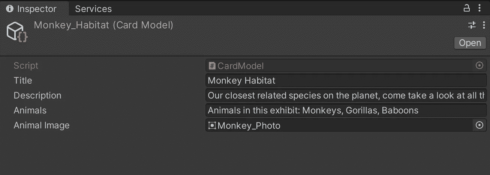
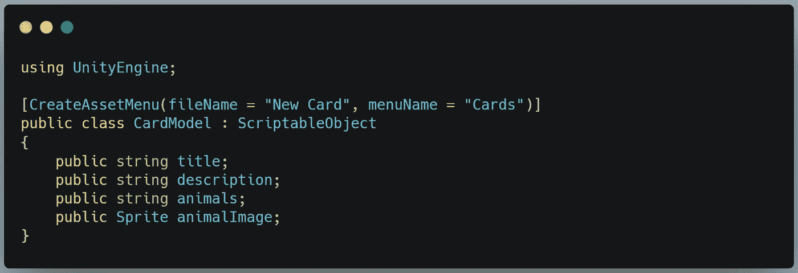
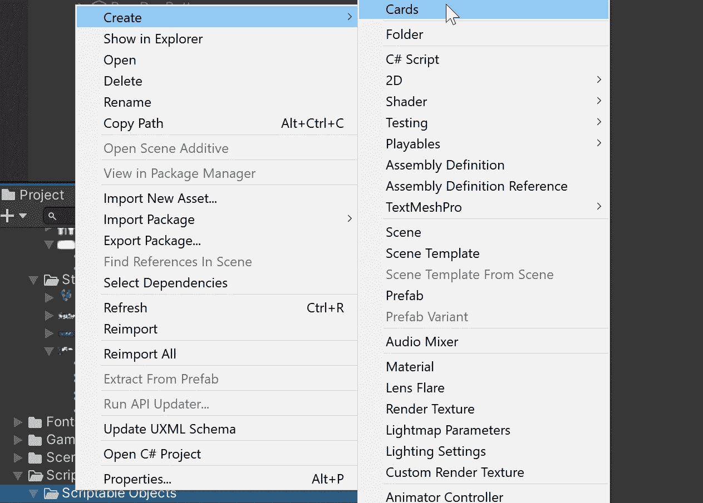
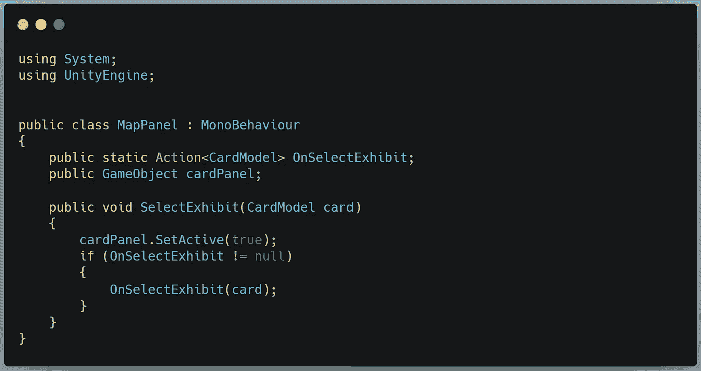
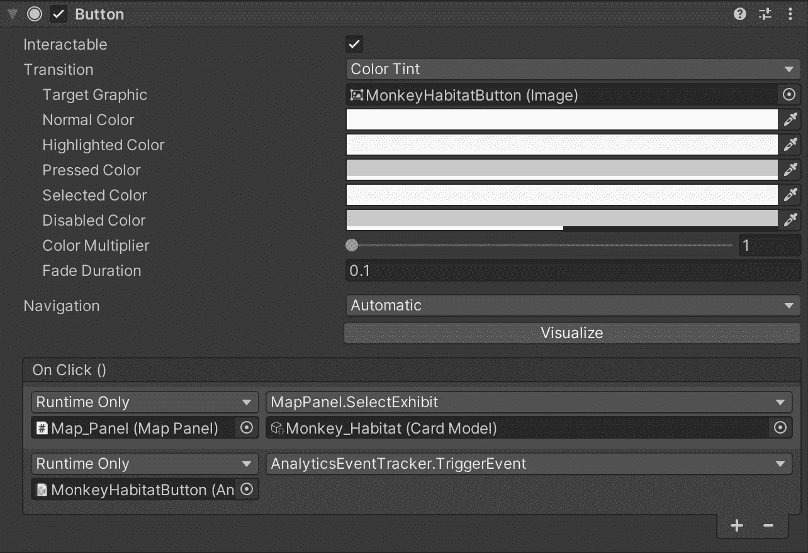
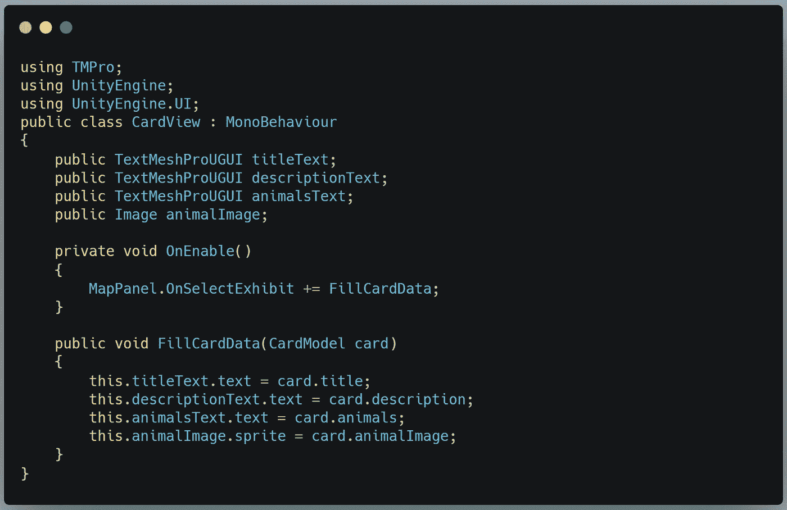

# 在 Unity 中使用脚本化对象

> 原文：<https://medium.com/nerd-for-tech/using-scriptable-objects-in-unity-97c2658ea855?source=collection_archive---------8----------------------->

## 不要灰心丧气，要模板化

是时候胡闹了。

今天的项目是一个非常简单的应用程序，有一些我以前没有写过的功能。第一个是**可脚本化的对象**。

本质上，可脚本化的对象是数据的容器。您可以设计一个通用数据模板，使用该模板创建资产，并在代码中引用这些资产来填充运行时对象中的数据。这是避免重复乏味工作的好方法。

我们正在开发的应用程序是一个互动的动物园地图。动物园顾客可以在他们的移动设备上使用地图来查看动物园中每个展览的详细信息，以及定位这些展览和公园设施。这是地图:

每个展品标签都是一个按钮。这个想法是，当我们点击一个展览时，我们会看到一个类似这样的面板:

让我们仔细看看可脚本化的对象是如何帮助我们的。

## **可脚本化的对象**

现在，我们可以为每个展品创建单独的卡片(毕竟只有 6 张)，但这仍然是大量重复的工作。想象一下，如果我们有 60 个展品！这就是可脚本化对象的用武之地。我们将为需要替换的卡片的每个部分创建变量，然后我们可以将数据从我们的可脚本化对象加载到应用程序中的展示卡中。

是时候看看这在 C#中是如何实现的了:

所以，我们做了两件事来实现这个工作:我们继承了 unity 引擎。ScriptableObject 类，我们正在添加一些编辑器脚本，它将在 Create Asset 菜单上放置一个条目，这将允许我们基于 CardModel 创建可脚本化的对象。

接下来，我们将创建对象并用数据填充它们。通过在项目视图中右键单击并选择 Create > Cards，我们将基于 CardModel 脚本创建一个新的可脚本化的对象资产。

我们可以在这里填入适当的数据。但是它是如何被填充到我们的卡片面板中的呢？

为此，我们将创建一个操作。

## **行动和事件**

现在，我们的数据在等待我们使用的可脚本化的对象中。我们需要一个脚本来负责改变卡片视图——我们称之为 CardView——但是它如何知道在哪里找到数据或者使用什么数据呢？

为此，我们将创建另一个脚本来与地图面板上的所有按钮进行交互。我们称之为地图面板。

地图面板脚本如下所示:

我们做的第一件事是声明一个动作。动作本质上是封装在一行代码中的委托和事件。我们将委托给任何接受 CardModel 参数的方法，并且我们正在监视 SelectExhibit 上的事件。

接下来我们有 SelectExhibit(CardModel card)方法。在这里，我们打开 cardPanel 对象，并通知任何侦听 OnSelectExhibit 事件的人，同时传入 card 脚本化对象供侦听器使用。

SelectExhibit 由 UI 按钮的 OnClick 操作调用，该操作还将相关的可脚本化对象传递给 MapPanel 类以发送给侦听器。

我们明天将讨论分析活动。

所以，按钮告诉地图面板什么按钮被按下。地图面板告诉任何脚本监听什么按钮被按下。现在，CardView 类可以开始工作了:

这里的关键部分是 OnEnable()方法和 FillCardData(CardModel card)方法。

在 OnEnable 中，我们用我们的匹配方法:FillCardData(CardModel card)订阅 OnSelectExhibit 事件。

在 FillCardData 中，我们将这个脚本的**中的所有字段分配给从单击按钮传递给它的卡片可脚本化对象中的相应字段。**

现在我们只有一个 Exhibit Card 面板，它可以立即填充来自任何基于 CardModel 类的可脚本化对象的数据。我们要看奇迹发生吗？

我们将:

嘿，太棒了！

这就是我今天的内容。明天，我们将使用 Unity Analytics 来跟踪用户请求每个展览信息的频率。