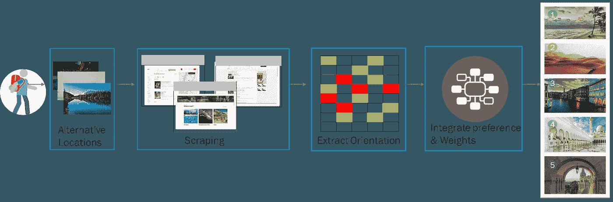

# 运用社会智慧帮助旅行者选择下一个目的地

> 原文：<https://medium.com/nerd-for-tech/using-social-wisdom-to-help-travelers-select-their-next-destination-88cc9c4af288?source=collection_archive---------2----------------------->

新冠肺炎渐渐平静下来，旅行者们开始了一生一次的旅行。机器学习能否帮助旅行者获得变革性和有意义的旅行体验？

卢卡·布拉沃——昂斯普拉什

当我们进入 COVID 19 疫情的长尾时，我们见证了寻求旅行的旅行者人数的记录。根据 Expedia——2022 年将是羊年(所有旅行中最棒的),追求变革和有意义的旅行体验。无论出于何种动机，旅行者都可以通过在线旅游平台，以用户生成的评论、意见、照片和视频的形式，了解其他旅行者的详细经历。可用数据的丰富程度与偏见相混淆，通常不是由诚实的经纪人提供的。在下面的文章中，我将回顾使用机器学习来帮助旅行者规划他们一生的旅行所面临的挑战和机遇。

# 支离破碎的旅行者之旅

通过社交网络，如 Yelp、谷歌、猫途鹰、foursquare 等，旅游网站的大量旅游评论变得越来越容易获得。这些评论支持不同类型的信息，包括游览景点、游览时间、游记和旅行者的基本资料、标签、排名、评论文本和景点的基本属性。原则上，这些网站增强了旅游社区的能力，允许用户绕过财政激励的旅行社、活动代理和旅游局。随着时间的推移，随着在线旅游信息量和旅游工具数量的增长，计划和预订旅行的复杂性也在增加。这些评论的感知价值反映在数百万人生产和消费与旅游目的地和旅游活动相关的内容上。尼尔森研究发现，在 76 次在线会议中，旅行者平均花费 53 天时间访问 28 个不同的网站，超过 50%的旅行者会查看社交媒体上的旅行提示。在旅途中发现要做的事情或改变计划进一步增加了这种复杂性。

约翰·马泰丘克——昂斯普拉什

# 信息过载

来自经验丰富的旅行者的大量评论对旅行者选择目的地有着深远的影响。然而，随着旅行者数量的增加，全球旅游的增加(把 COVID 放在一边)导致在线评论数量迅速增加。潜在旅行者很难甚至不可能详细浏览和分析景点评论。大量冗余和无意义的信息干扰了潜在旅行者的判断，造成了大量的信息过载问题。更不用说，这些旅游评论网站上出现的虚假数据，就像 Tripadvisor 的[案例一样，保证不依赖单一来源。](https://www.thetimes.co.uk/article/hotel-and-caf-cheats-are-caught-trying-to-buy-tripadvisor-stars-027fbcwc8)

当一个潜在的旅行者想要去某个地方旅行时，他或她脑海中会有一组可能的目的地。然而，潜在的旅行者在几个备选方案之间犹豫不决，因为他对备选方案的了解有限，并且不一定具备优先选择目的地所需的专业知识。因此，他开始阅读关于替代品的在线评论。潜在旅行者希望从各个方面对备选目的地进行最全面的评估和分析，但由于有限的了解、时间限制或懒惰，通常会忽略一些重要的方面，这可能导致决策错误，即没有选择最有利的位置。

# 用社会智慧来帮助一个困惑的旅行者

为了解决潜在旅行者的旅行决策问题，我们需要为旅行者提供一个景点排名的决策辅助工具，降低决策失误的风险。为此，我们可以从大量的在线评论中提取有意义和有用的信息，然后根据旅行者的个人偏好对备选方案进行排序。

为了建立这样一个有效的决策支持系统，我们需要做以下工作:

1.  创建一个网络爬虫来抓取和预处理在线评论。
2.  提取与旅行者相关的方面，并计算情感倾向。
3.  确定排名系统的权重和标准。

这个流程的主要挑战是分析旅行者评论。句子结构复杂，缺乏组织，容易产生偏见，这使得用传统的方法很难解决。

情感分析是近年来自然语言处理中一种新的分析方法。这种方法主要用于分析带有情感内容的文本和判断情感极性。情感分析分为三个层次:文档级、句子级和方面级。文档级识别整个文档的情感极性，句子级识别文本中每个句子的情感极性。上述两个层次的情感分析都致力于观点的极性分类，却忽略了评价对象或目标的提取。方面级别的情感分析(即，细粒度级别)识别对应于文本的每个方面的情感极性。在点评中，旅行者可能会对目的地的食物、交通、文化和其他方面提出自己的看法。提取的因素可以是正面的、中性的、负面的或其他类别。所有知名的人工智能(AI)服务平台都提供支持类似分析的服务。当前的方向分析有局限性，因为它倾向于提供一个分数，该分数不一定描绘这些评论的决定性或模糊性(但这是另一篇文章的讨论)。

排名将根据加权的旅行者偏好和评论分数来确定。不同的评论有不同的重要性级别，这取决于诸如评论日期、有用性投票、评论总数和评论者经验(基于帖子数量)等因素。

收集和分析社会智慧的系统

# 建立信任

一旦我们通过了创建一个有效的景点社交智能排名系统(比提供的简短描述复杂得多)的技术障碍，我们需要获得游客的信任。如果整个目的是帮助旅行者基于无限的可用数据做出更明智的决定，我们如何获得他的信任？

这涉及到如何在人类和人工智能之间建立合作的更广泛的问题，但为了我们的讨论，我认为我们需要通过一个 onboarding 过程为旅行者提供输入(合作)排名系统的方法，在这个过程中，旅行者提供他的个人偏好，并可以感觉到这如何影响目的地和景点的排名。另一个关键方面是分享和从朋友和专家社区获得关于排名结果的反馈的能力。这将提供更多的反馈来评估推荐系统的水平(反馈将进一步改进它)

# 下一步是什么

offer 期待着产生大量的数据，这是一个无与伦比的机会来更好地了解旅行者的体验。这将帮助旅行者创建个性化的旅程，帮助他们避免无休止的在线搜索、碎片化的体验、旅行焦虑，并提高他们的决策技能。大量可用数据、不同地理位置、兴趣和经验水平的各种用户，为进一步洞察景点并将其与正确的用户匹配提供了基础。这些对旅行者世界的洞察对于旅游业、地方政府和相关目的地营销组织至关重要。它们还可以更好地确定广告活动的目标。

# 来源

 [## 一种基于机器学习的使用地理标记照片对游客和当地人进行分类的方法

### 在旅游依赖型城市中，研究旅游流的时空分布和动态对旅游资源的开发至关重要

link.springer.com](https://link.springer.com/article/10.1007/s40558-021-00208-3)  [## 在线旅行社在酒店业的发展

### 友敌。这很好地概括了旅游业供应商和在线旅行社之间的关系…

hoteltechreport.com](https://hoteltechreport.com/news/otas-problems)  [## 比较在线旅游评论平台作为目的地形象信息代理

### 在线旅游评论已被广泛用作旅游研究的重要数据源。通常，数据用于…

link.springer.com](https://link.springer.com/article/10.1007/s40558-021-00201-w) 

[https://www . researchgate . net/publication/326847186 _ A _ data-driven _ approach _ to _ exploring _ similarities _ of _ tourism _ attracts _ through _ online _ reviews](https://www.researchgate.net/publication/326847186_A_data-driven_approach_to_exploring_similarities_of_tourist_attractions_through_online_reviews)

[https://link . springer . com/article/10.1007/s 40815-021-01131-9](https://link.springer.com/article/10.1007/s40815-021-01131-9)

[https://www . Washington post . com/news/food/WP/2017/12/08/it-was-londons-top-rated-restaurant-just-one-problem-it-not-exist/？variant=c44b726edf25a662](https://www.washingtonpost.com/news/food/wp/2017/12/08/it-was-londons-top-rated-restaurant-just-one-problem-it-didnt-exist/?variant=c44b726edf25a662)

[https://www . granthaalayah publication . org/journals/index . PHP/granthaalayah/article/view/4178/4266](https://www.granthaalayahpublication.org/journals/index.php/granthaalayah/article/view/4178/4266)

[https://jespublication.com/upload/2022-V13I3032.pdf](https://jespublication.com/upload/2022-V13I3032.pdf)

[https://ieeexplore.ieee.org/document/9102673](https://ieeexplore.ieee.org/document/9102673)

[https://news room . Expedia . com/2021-11-30-The-GOAT-mind-Expedia-reveals-2022s-biest-travel-trend](https://newsroom.expedia.com/2021-11-30-The-GOAT-mindset-Expedia-reveals-2022s-biggest-travel-trend)

[https://www . electrivai . net/blog/applied-ai-helps-companies-with-post-covid-travel-rush](https://www.electrifai.net/blog/applied-ai-helps-companies-with-post-covid-travel-rush)

[https://business . adobe . com/au/resources/digital-trends-in-travel-and-hospitality . html](https://business.adobe.com/au/resources/digital-trends-in-travel-and-hospitality.html)