# 在 Unity 中使用音效

> 原文：<https://medium.com/nerd-for-tech/using-sound-effects-in-unity-c003d4d21154?source=collection_archive---------18----------------------->

## 统一指南

## 关于如何在 Unity 中使用音效的快速指南

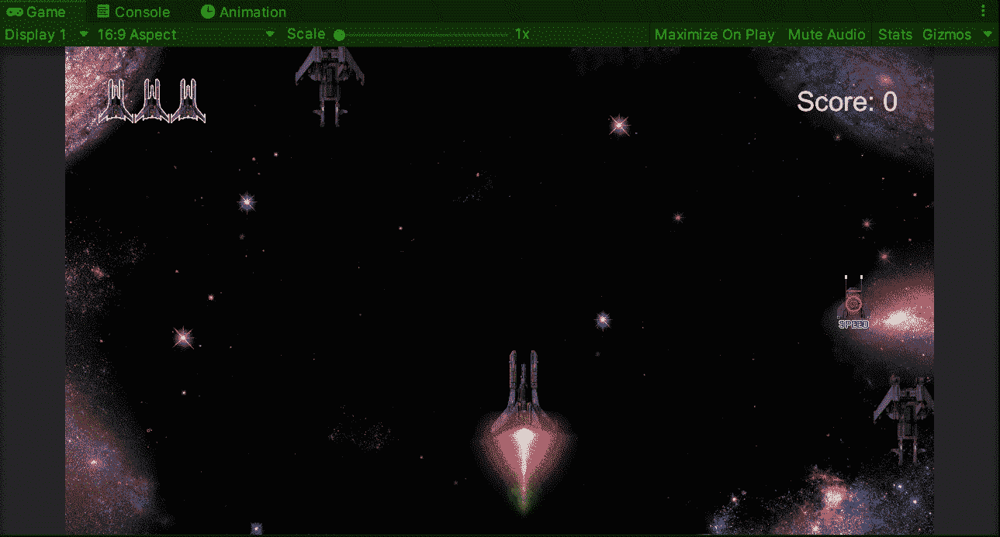

**目标**:在 Unity 中实现一个太空射击游戏的音效。

在上一篇文章中，我介绍了[如何在 Unity](/nerd-for-tech/using-audio-in-unity-61a925b622a5) 中开始使用音频，现在是时候为太空射击游戏实现音效了。

# 激光音效

为了在玩家飞船每次射击时实现一个激光音效，我们需要在玩家 gameobject 中添加一个音源组件。让我们确保 ***在唤醒时播放*** 属性被禁用，这样它只在拍摄时播放声音:

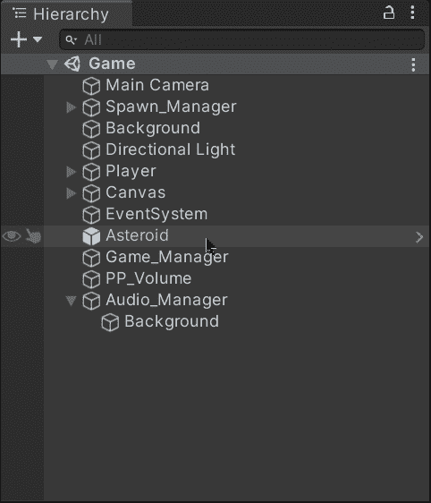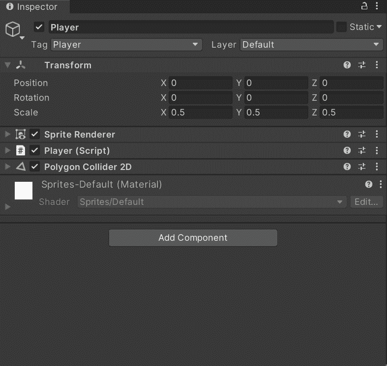

然后，让我们打开播放器脚本并创建 2 个新变量:

*   ***_ 音频剪辑***

这个数组将存储玩家在游戏中使用的不同音频文件的引用。例如，我们将只使用它来存储激光音效。

*   ***_ 音频源***

该变量将存储对播放器包含的音频源组件的引用，以在游戏中输入相应的音频文件。

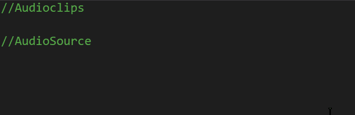

不要忘记使用**【serialize field】**将音频文件拖入检查器。

现在，让我们将激光声音效果文件从项目文件夹拖到检查器中:

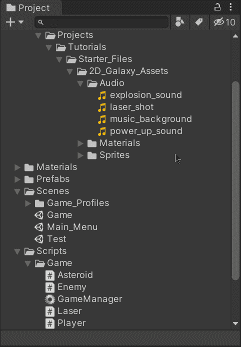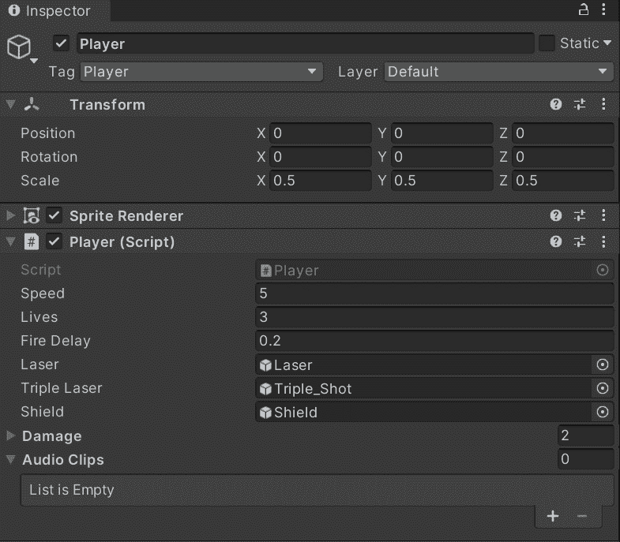

然后，在 ***开始*** 的方法中，让我们给新变量中的音频源组件赋值:

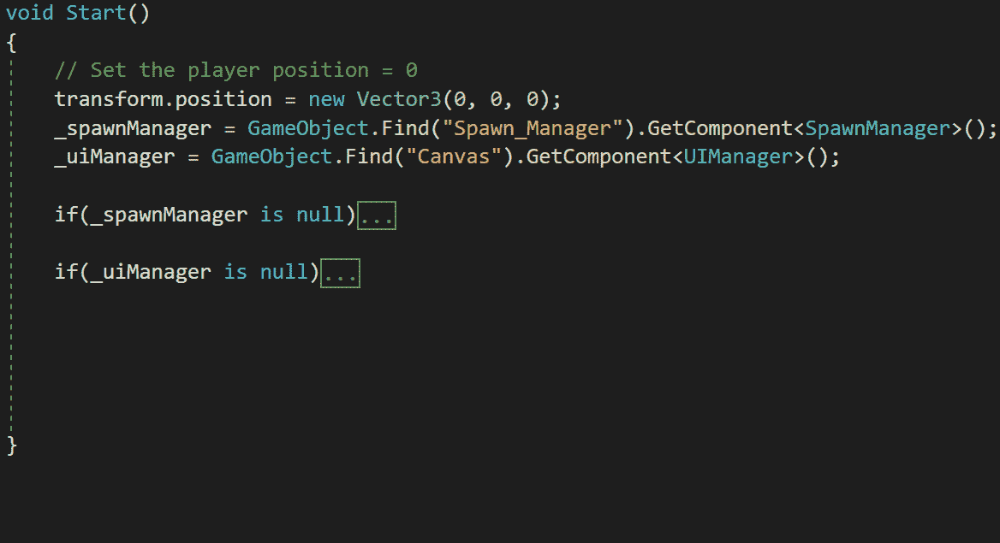

总是检查你分配的组件是否为空来调试错误。

为了播放不同的声音效果，让我们创建一个新函数，它将接收音频剪辑数组中声音文件的索引作为参数:

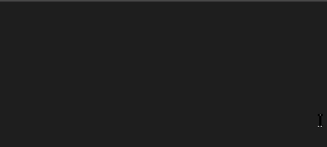

然后，让我们将各自的音频文件分配到音频源的 clip 属性中，用***Play****方法播放正确的音效:*

*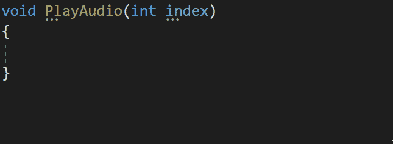*

*如果需要，您可以在将索引分配给音频源之前检查它是否存在于音频片段数组中。*

*如果您想了解更多关于此方法的信息，您可以访问 Unity 文档:*

* [## 音频源。玩

### 建议更改感谢您帮助我们提高 Unity 文档的质量。虽然我们不能接受所有的…

docs.unity3d.com](https://docs.unity3d.com/ScriptReference/AudioSource.Play.html) 

现在，在实例化激光射击的函数中，我们可以用音效的索引调用 ***PlayAudio*** 函数来播放它:

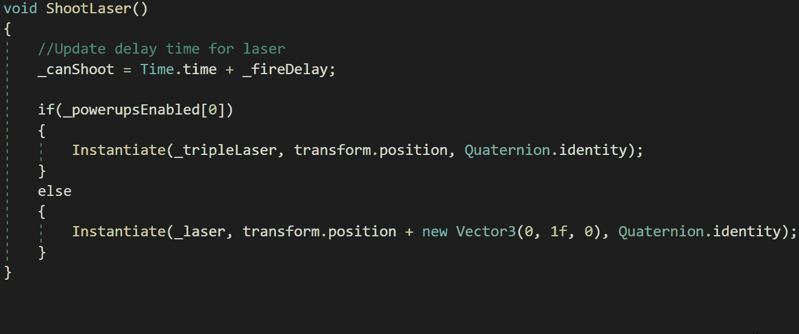

而且现在玩家每次射击都会播放激光音效。

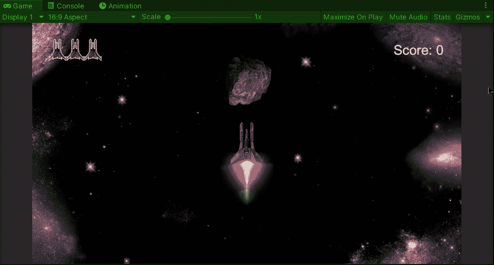

# 开机音效

另一个需要实现的音频是开机物品收集音效。在太空射击游戏中有 3 种不同的能量:

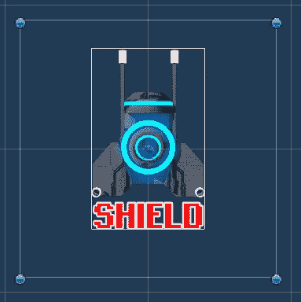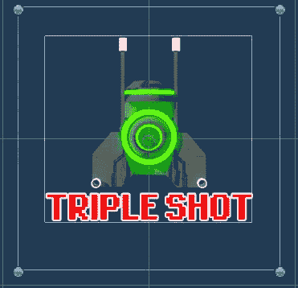

为了实现玩家收集每个加电物品时的声音，让我们打开 ***加电*** 脚本，让我们创建一个变量来存储对收集音效的引用:

> 注意:我们将使用不同的方法来播放声音效果。

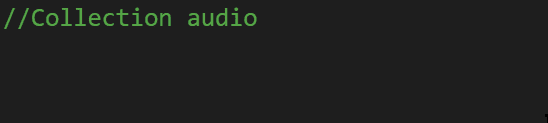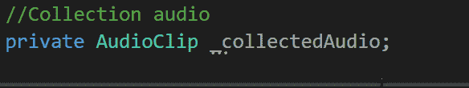

不要忘记使用**【串行字段】**来将音频文件拖到检查器中。

现在，让我们选择 3 个不同的启动物品的预设，让我们将声音效果拖到检查器中:

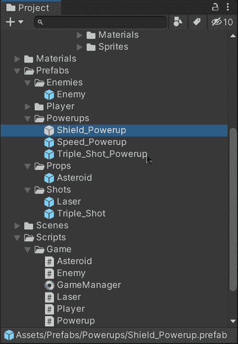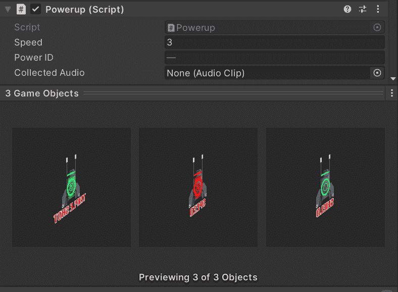

最后，为了在收集到加电时播放声音效果，让我们使用来自 ***AudioSource*** 类的***PlayClipAtPoint****方法，使用各自的音频剪辑和我们将在场景中播放声音的位置。*

*我们使用这种方法是因为当玩家收集到启动物品时，我们会立即销毁游戏对象，所以声音不会播放。***PlayClipAtPoint****提供了一种实例化音频源组件的方法，该组件将在游戏中播放声音，然后，当声音结束时，它将从场景中被处理掉。**

**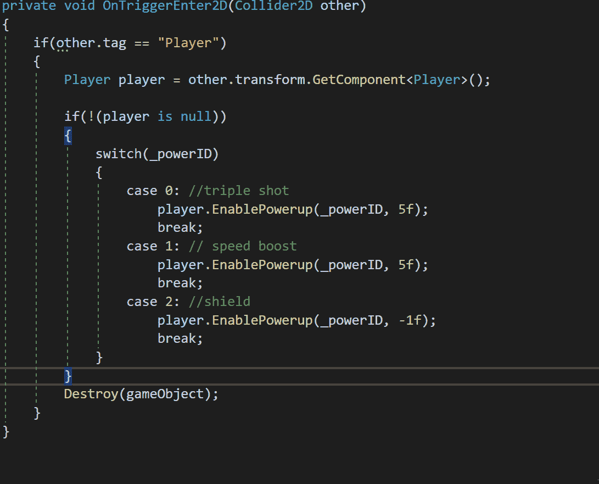**

**如果您想了解更多关于***playclip at point***方法的信息，您可以访问 Unity 文档:**

** [## 音频源。播放剪辑点

### 建议更改感谢您帮助我们提高 Unity 文档的质量。虽然我们不能接受所有的…

docs.unity3d.com](https://docs.unity3d.com/ScriptReference/AudioSource.PlayClipAtPoint.html) 

现在，每当玩家在游戏中收集一个异能时，由***PlayClipAtPoint***方法创建的实例就会播放收集音效。

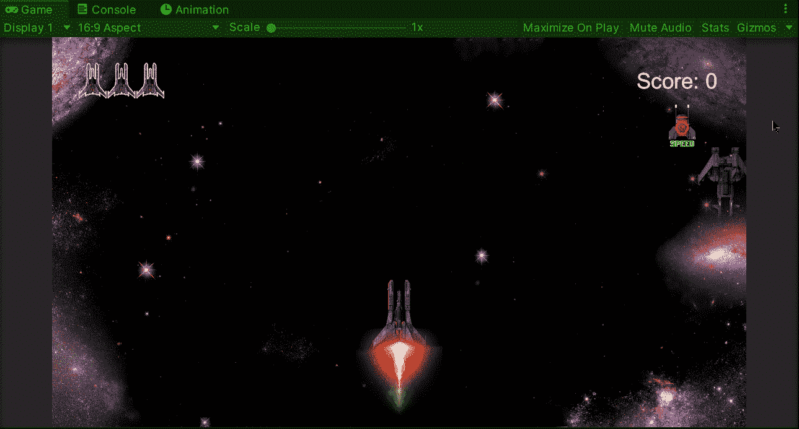

就是这样，你可以在 Unity 中为你的游戏实现音效！:d .我会在下一篇文章中看到你，在那里我将展示我的 Unity 太空射击游戏中添加的日常功能。** 

> ***如果你想了解我更多，请随时登陆*[***LinkedIn***](https://www.linkedin.com/in/fas444/)**或访问我的* [***网站***](http://fernandoalcasan.com/) *:D*****