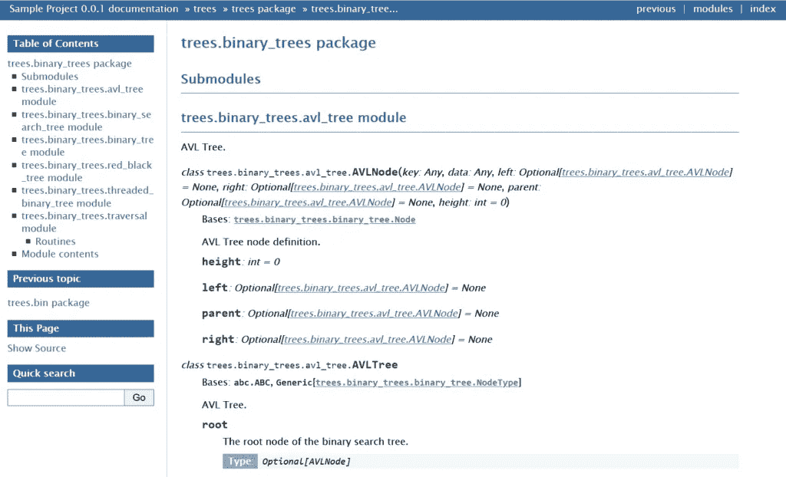
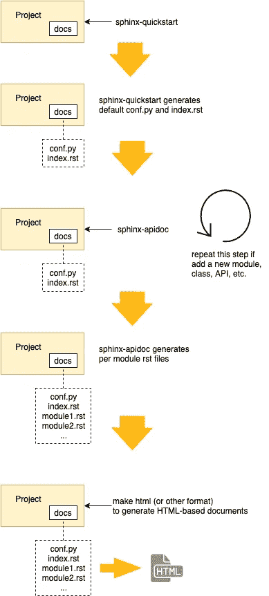
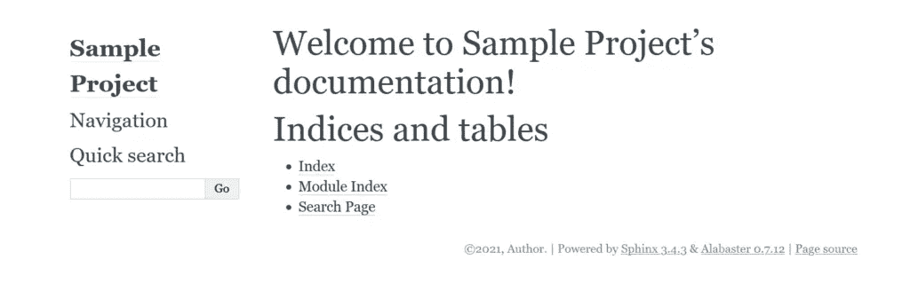

# 将 Sphinx 用于 Python 文档

> 原文：<https://medium.com/nerd-for-tech/using-sphinx-for-python-documentation-28ed52f1d5a7?source=collection_archive---------0----------------------->

*【更新时间:2021 年 1 月 14 日】*

作为开发人员，我们都知道代码文档化的重要性:好的代码不仅不言自明，而且文档化良好。然而，我们也很难保持文档最新，特别是当我们分开维护源代码和它的文档时。如果我们能够基于源代码或者基于代码注释来生成文档，我们就有更好的机会来更新文档。

[Sphinx](https://www.sphinx-doc.org) 是一个从代码中构建文档的工具。它支持多种编程语言，在 Python 项目中被广泛使用，包括 Python 官方网站。斯芬克斯的官方网站提供了许多有用的信息和参考。但是，对于第一次使用 Sphinx 的人来说，官网可能会铺天盖地。至少，这是我第一次尝试使用 Sphinx 时的体验。因此，我写了这篇文章，希望这篇文章能够为 Sphinx 新手提供一个简单明了的教程。

# 情节

本教程使用一个简单的 Python 项目(示例项目)来演示如何使用 Sphinx 生成基于 HTML 的文档。这个示例项目是一些类型的二分搜索法树和二叉树遍历的集合。按照 [NumPy docstring 风格](https://numpydoc.readthedocs.io/en/latest/format.html)有据可查。示例项目的主要目的是作为 Sphinx 教程的示例代码，并演示 NumPy 样式的文档字符串如何通过 Sphinx 转换成真实的文档。

示例项目可以从 [Github](https://github.com/shunsvineyard/python-sample-code) 下载。

```
$ git clone [https://github.com/shunsvineyard/python-sample-code.git](https://github.com/shunsvineyard/python-sample-code.git)
```

生成的文档如下图所示。也可通过[阅读文档](https://python-sample-code.readthedocs.io/en/latest/)获得。



# 假设和要求

本教程假设以下环境:

*   Python 3.9
*   狮身人面像
*   Ubuntu 20.04

注意:Sphinx 可以在 Linux 和 Windows 上运行。虽然本教程使用的是 Ubuntu，但是在 Windows 环境下的步骤是一样的。

# 斯芬克斯怎么用？

Sphinx 使用 [reStructuredText](https://docutils.readthedocs.io/en/sphinx-docs/user/rst/quickstart.html) 作为它的标记语言。Sphinx 生成文档的过程是这样的:

***项目源代码(Python 或其他支持的语言)——>restructured text 文件——>文档(HTML 或其他支持的格式)***

Sphinx 提供了两个命令行工具: **sphinx-quickstart** 和 **sphinx-apidoc** 。

*   **sphinx-quickstart** 设置一个源目录，并创建一个默认配置`conf.py`和一个主文档`index.rst`，作为文档的欢迎页面。
*   **sphinx-apidoc** 从所有找到的模块生成重构的文本文件。

简而言之，我们使用这两个工具来生成 Sphinx 源代码，即 reStructuredText 文件，并且我们修改这些 reStructuredText 文件，最终使用 Sphinx 来构建优秀的文档。

# 工作流程

正如软件需要开发人员的维护一样，编写软件文档也不是一蹴而就的。当软件改变时，它需要被更新。下图演示了基本的 Sphinx 工作流程。



以下部分详细介绍了工作流程的每个步骤。

# 准备

在开始使用 Sphinx 之前，我们需要设置我们的工作环境。

```
user@ubuntu:~$ python3.9 -m venv sphinxvenv
user@ubuntu:~$ source sphinxvenv/bin/activate
(sphinxvenv) user@ubuntu:~$ git clone https://github.com/shunsvineyard/python-sample-code.git
(sphinxvenv) user@ubuntu:~$ cd python-sample-code/
(sphinxvenv) user@ubuntu:~/python-sample-code$ python -m pip install -r requirements.txt
```

现在，我们有了 Sphinx 演示的样例项目和工作环境。因为示例项目已经包含 docs 文件夹，所以我们需要删除它。

删除 docs 文件夹后，示例项目的布局如下所示:

```
├── LICENSE
├── README.rst
├── requirements.txt
├── setup.py
├── tests
└── trees
    ├── __init__.py
    ├── __main__.py
    ├── bin
    │   ├── __init__.py
    │   └── tree_cli.py
    ├── binary_trees
    │   ├── __init__.py
    │   ├── avl_tree.py
    │   ├── binary_search_tree.py
    │   ├── binary_tree.py
    │   ├── red_black_tree.py
    │   ├── threaded_binary_tree.py
    │   └── traversal.py
    └── tree_exceptions.py
```

# 步骤 1:使用 sphinx-quickstart 生成包含 conf.py 和 index.rst 的 sphinx 源目录

假设我们想把所有与文档相关的文件放在`docs`目录中。因此，我们首先创建一个 Sphinx 文档目录，`docs`。然后，我们转到`docs`目录并运行`sphinx-quickstart`。

```
(sphinxvenv) user@ubuntu:~/python-sample-code$ mkdir docs
(sphinxvenv) user@ubuntu:~/python-sample-code$ cd docs/
(sphinxvenv) user@ubuntu:~/python-sample-code/docs$ sphinx-quickstart
```

一旦我们运行`sphinx-quickstart`，它会询问一些关于这个项目的问题。以下是这些问题的示例答案。

```
Welcome to the Sphinx 3.4.3 quickstart utility.

Please enter values for the following settings (just press Enter to
accept a default value, if one is given in brackets).

Selected root path: .

You have two options for placing the build directory for Sphinx output.
Either, you use a directory "_build" within the root path, or you separate
"source" and "build" directories within the root path.
> Separate source and build directories (y/n) [n]: y

The project name will occur in several places in the built documentation.
> Project name: Sample Project
> Author name(s): Author
> Project release []: 0.0.1

If the documents are to be written in a language other than English,
you can select a language here by its language code. Sphinx will then
translate text that it generates into that language.

For a list of supported codes, see
https://www.sphinx-doc.org/en/master/usage/configuration.html#confval-language.
> Project language [en]: 

Creating file /home/shunsvineyard/workspace/python-sample-code/docs/source/conf.py.
Creating file /home/shunsvineyard/workspace/python-sample-code/docs/source/index.rst.
Creating file /home/shunsvineyard/workspace/python-sample-code/docs/Makefile.
Creating file /home/shunsvineyard/workspace/python-sample-code/docs/make.bat.

Finished: An initial directory structure has been created.

You should now populate your master file /home/shunsvineyard/workspace/python-sample-code/docs/source/index.rst and create other documentation
source files. Use the Makefile to build the docs, like so:
   make builder
where "builder" is one of the supported builders, e.g. html, latex or linkcheck.
```

在`sphinx-quickstart`的结尾，它展示了如何构建文档。

```
You should now populate your master file ./source/index.rst and create other documentation
source files. Use the Makefile to build the docs, like so:
   make builder
where "builder" is one of the supported builders, e.g. html, latex or linkcheck.
```

如果我们在这里做`make html`，Sphinx 将生成默认文档，其中不包含任何关于样本项目的内容。



注意:Sphinx 不是一个像 Doxygen 一样提供全自动文档生成的工具。`sphinx-quickstart`只生成一些默认文件，如`index.rst`、`conf.py`等用户回答的基本信息。因此，我们需要做一些工作来使文件真实。

运行`sphinx-quickstart`后，文件夹的布局如下所示:

```
docs
├── Makefile
├── build
├── make.bat
└── source
    ├── _static
    ├── _templates
    ├── conf.py
    └── index.rst
```

注意`Makefile`是针对 Linux 的，`make.bat`是针对 Windows 的。

# 步骤 2:配置 conf.py

`sphinx-quickstart`生成几个文件，最重要的是`conf.py`，是文档的配置。虽然`conf.py`是一个配置文件，但它是一个真正的 Python 文件。`conf.py`的内容是 Python 语法。

使用 Sphinx 生成文档是高度可配置的。本节演示了最基本的配置:项目源代码的路径、文档的主题和扩展。

## 设置项目的路径

为了让 Sphinx 能够找到项目，我们需要取消对这三行的注释。

```
# import os
# import sys
# sys.path.insert(0, os.path.abspath('.'))
```

并更新项目的路径。

```
import os
import sys
sys.path.insert(0, os.path.abspath('../..'))
```

## 选择主题

Sphinx 提供了许多内置主题。默认是`alabaster`。

```
html_theme = 'alabaster'
```

在本教程中，我们将其改为`bizstyle`。

```
html_theme = 'bizstyle'
```

更多主题及其配置可以在 https://www.sphinx-doc.org/en/master/usage/theming.html[找到](https://www.sphinx-doc.org/en/master/usage/theming.html)

## 添加 NumPy 样式的扩展

示例项目对文档字符串使用 NumPy 样式。因此，我们需要添加扩展(napoleon)来解析 NumPy 样式的文档字符串。

```
extensions = [
    'sphinx.ext.napoleon'
]
```

这个扩展(napoleon)支持 NumPy 和 Google 风格的文档字符串，并提供了几个可配置的特性。对于示例项目，由于我们使用 NumPy 风格的文档字符串，我们应该禁用 Google 风格。

```
napoleon_google_docstring = False
```

napoleon 的其他设置可以在[https://www . sphinx-doc . org/en/master/usage/extensions/Napoleon . html # module-sphinx . ext . Napoleon](https://www.sphinx-doc.org/en/master/usage/extensions/napoleon.html#module-sphinx.ext.napoleon)找到

完整的 conf.py 示例可以在[https://github . com/shunsvineyard/python-sample-code/blob/master/docs/source/conf . py](https://github.com/shunsvineyard/python-sample-code/blob/master/docs/source/conf.py)中找到。

此外，Sphinx 有许多内置扩展，也支持自定义扩展。要了解更多信息，请访问[https://www . sphinx-doc . org/en/master/usage/extensions/index . html](https://www.sphinx-doc.org/en/master/usage/extensions/index.html)

现在，我们有了项目的基本配置。接下来，我们使用`sphinx-apidoc`从示例项目源代码中生成 reStructuredText 文件。

# 步骤 3:使用 sphinx-apidoc 从源代码生成 reStructuredText 文件

`sphinx-apidoc`是一个从源代码自动生成 reStructuredText 文件的工具，例如 Python 模块。要使用它，请运行

```
$ sphinx-apidoc -f -o <path-to-output> <path-to-module>
```

`-f`表示强制覆盖任何现有的生成文件。

`-o`表示放置输出文件的路径。

对于示例项目，我们运行以下命令。

```
(sphinxvenv) user@ubuntu:~/python-sample-code/docs$ sphinx-apidoc -f -o source/ ../trees/
```

狮身人面像-apidoc 的完整用法在[https://www.sphinx-doc.org/en/master/man/sphinx-apidoc.html](https://www.sphinx-doc.org/en/master/man/sphinx-apidoc.html)。

在示例项目中，`sphinx-apidoc`生成了几个文件，`modules.rst`、`trees.bin.rst`、`trees.binary_trees.rst`和`trees.rst`。项目的布局如下所示:

```
docs
├── Makefile
├── build
│   └── doctrees
│       ├── environment.pickle
│       └── index.doctree
├── make.bat
└── source
    ├── _static
    ├── _templates
    ├── conf.py
    ├── index.rst
    ├── modules.rst
    ├── trees.bin.rst
    ├── trees.binary_trees.rst
    └── trees.rst
```

# 步骤 4:编辑 index.rst 和生成的 reStructuredText 文件

`sphinx-quickstart`生成的另一个重要文件是`index.rst`。`index.rst`是作为欢迎页面的主控文档，包含“目录树”的根。当 sphinx-quickstart 创建 index.rst 时，toctree 最初是空的。

```
.. toctree::
   :maxdepth: 2
   :caption: Contents:
```

**将模块添加到 index.rst**

生成的`modules.rst`包含了所有的模块。所以我们需要将`modules.rst`添加到`index.rst`中。

要添加要在欢迎页面上列出的文档(`index.rst`，请执行以下操作

```
.. toctree::
   :maxdepth: 2
   :caption: Contents:

   modules
```

注意:当添加另一个 reStructuredText 文件时，请使用不带扩展名的文件名。如果文件有层次结构，请使用正斜杠“/”作为目录分隔符。

**将 README.rst 添加到 index.rst**

由于示例项目已经有了一个 readme 文件`README.rst`，在项目的顶层，我们可以将它添加到文档的欢迎页面。

1.  在`docs/source`下创建一个 readme.rst 文件，并添加行`.. include:: ../../README.rst`。(参见[https://github . com/shunsvineyard/python-sample-code/blob/master/docs/source/readme . rst](https://github.com/shunsvineyard/python-sample-code/blob/master/docs/source/readme.rst))
2.  将自述文件添加到`index.rst`，这样欢迎页面就会包含它。

在这两个步骤之后，`index.rst`看起来像是:

```
.. Sample Project documentation master file, created by
   sphinx-quickstart on Wed Jan 13 23:24:14 2021.
   You can adapt this file completely to your liking, but it should at least
   contain the root `toctree` directive.

Welcome to Sample Project's documentation!
==========================================

.. toctree::
   :maxdepth: 2
   :caption: Contents:

   readme
   modules

Indices and tables
==================

* :ref:`genindex`
* :ref:`modindex`
* :ref:`search`
```

完整示例见[https://raw . githubusercontent . com/shunsvineyard/python-sample-code/master/docs/source/index . rst](https://raw.githubusercontent.com/shunsvineyard/python-sample-code/master/docs/source/index.rst)。

注意:当我们添加一个新的模块、类、API 或者任何影响文档的代码变更时，我们需要重复步骤 3 和步骤 4 来更新文档。

# 步骤 5:构建文档

生成文档的最后一步是发出`**make html**`(如果我们想生成基于 HTML 的文档)。

```
(sphinxvenv) user@ubuntu:~/python-sample-code/docs$ make html
```

在我们运行了`make html`命令之后，在 docs 下创建了一个构建文件夹。另外，基于 HTML 的文档位于`build/html`。生成的文档如下所示:


# 结论

尽管我们仍然需要手动编辑生成的 reStructuredText 文件，但是 Sphinx 提供了一种更简单的方法来构建一个好的文档。它还具有通过`conf.py`和扩展进行配置和扩展的能力。要了解关于 Sphinx 的更多信息，请查看以下在线资源:

*   [斯芬克斯官网](https://www.sphinx-doc.org)
*   [令人敬畏的狮身人面像](https://github.com/yoloseem/awesome-sphinxdoc)
*   [reStructuredText 官网](http://docutils.sourceforge.net/rst.html)
*   [重组文本快速启动](http://docutils.sourceforge.net/docs/user/rst/quickref.html)

*原载于 2019 年 9 月 20 日*[*https://shunsvineyard . info*](https://shunsvineyard.info/2019/09/19/use-sphinx-for-python-documentation/)*。*