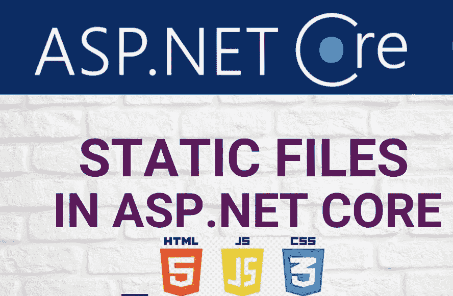

# 在 ASP.Net 核心 Web API 中使用静态文件(HTML、CSS、JS)

> 原文：<https://medium.com/nerd-for-tech/using-static-files-html-javascript-in-asp-net-core-web-api-f354676d385?source=collection_archive---------0----------------------->

在本文中，我们将了解如何向现有的 ASP.Net 核心 web API 项目添加静态文件或静态文件组。众所周知，API 项目只处理 API。让我们假设您想要添加几个静态文件来显示数据或显示某种配置。在应用程序开始时，如果我们可以通过选择基于 web 的模板而不是…