# 使用 Terraform 在 ECS 中部署 Centos 映像。

> 原文：<https://medium.com/nerd-for-tech/using-terraform-to-deploy-a-centos-image-in-a-ecs-c85c4df5c28f?source=collection_archive---------2----------------------->

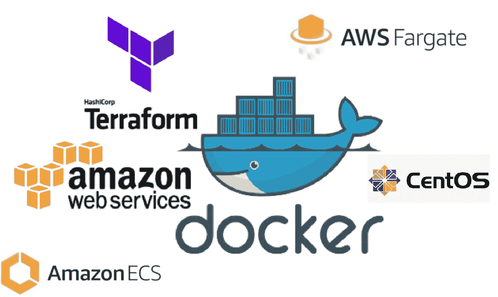

本周，我被要求使用 Terraform 将 Centos 图像推送到 ECS。这是我第一次使用 ECS，所以当被要求完成一项我以前从未做过的任务时，我总是做的第一件事就是尝试在 AWS 控制台中运行这些步骤。

在我登录、导航到 ECS 并创建集群之后，我立即面临一个决定…我应该选择哪个模板。法盖特？EC2？我从未听说过 Fargate，所以我开始做一些研究，看看 Fargate 到底是什么，以及我为什么会选择使用它。

Fargate 是一个无服务器环境，用户无需拥有、运行和管理其基础架构。Fargate 将提供、配置和扩展虚拟机集群来运行容器。使用 Fargate 时，唯一的要求是创建一个集群，创建 VPC 和子网是可选的。

今天的任务是一个相当小的任务，不需要 EC2 实例，所以我选择尝试 Fargate。我仔细检查并做出了正确的选择，然而，我遇到了第一个障碍…我如何将我的映像/容器推入 ECS？？我不确定…回到研究。

ECR！！我可以轻松地将我的容器从 AWS CLI 推送到 ECR，并在我的 ECS 任务定义中定义我的 ECR repo。完美！

在将我的容器推送到 ECR 之后，我转到 ECS 并创建了一个新任务(确保在任务中定义我的 ECR repo)。维奥拉。我的映像被部署到 ECR…从技术上讲，我的项目已经完成…但是我注意到映像不会停留在活动状态，而是停留在挂起状态，直到超时，在这种情况下它将停止。我探究了停止集装箱的细节，并意识到这是因为 ECS 无法拉动我的集装箱…更多研究。我发现了这个:

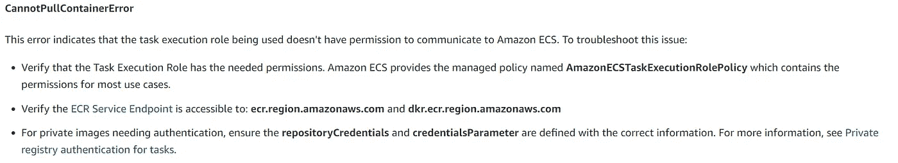

[https://AWS . Amazon . com/premium support/knowledge-center/ECS-task-stopped/](https://aws.amazon.com/premiumsupport/knowledge-center/ecs-task-stopped/)

我需要调整我在任务执行角色中的权限。我回去重新运行了一个新任务，但是，将 amazonectaskexecutionrolepolicy 添加到了任务执行角色…答对了。成功…现在让我们在地形中重建它！！

**实际分配的任务:**

您的团队需要您部署一个带有 CentOS 映像的 Docker 容器-

1.  从 Docker 注册表中提取一个 CentOS 图像。
2.  使用 docker 映像和 Terraform 创建 ECS 集群。

**先决条件:**

1.  一个 IDE。我用的是 AWS Cloud9。
2.  安装在您的 IDE 上的 Terraform。
3.  AWS CLI 应该在您的终端中配置。这是必需的，以便您可以使用您的凭据浏览脚本。否则，您需要在文件中列出您的访问代码和秘密访问代码。这是一个危险的选择，因为它很容易被复制。

我今天选择坚持使用单片安装，主要是因为不应该添加太多的资源！(我的第一个错误是认为这将是一个快速的项目)。我只使用了“main.tf”文件，但是，您可以将脚本分成多个。tf 文件，如果你选择。

## 步骤 1:创建一个目录，“main.tf”文件，并将 cd 放入该目录。

我创建了一个名为“*ECS-Centos image”*的目录，并在该目录中创建了一个名为*“main . TF”的文件。*此目录中以.结尾的任何文件。当我们应用 terraform 脚本时，将读取 tf。

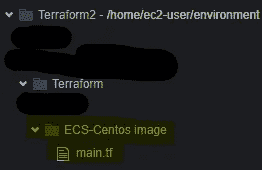

我现在将切换到我新创建的目录。

```
$ cd ECS-Centos image
```

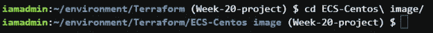

## 步骤 2:创建“main.tf”文件。

我的' **main.tf'** 文件的链接可以在[这里](https://github.com/dzyrowski/Terraform/tree/main/ECS-Centos%20image)找到。不过，我会按每一部分进行分解。

首先，我们将列出我们的提供商 Docker 和 AWS。

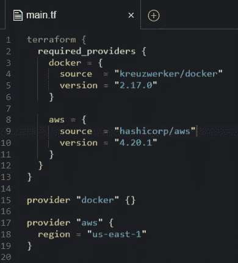

接下来，我们将创建一个 VPC 资源以及我们的子网。

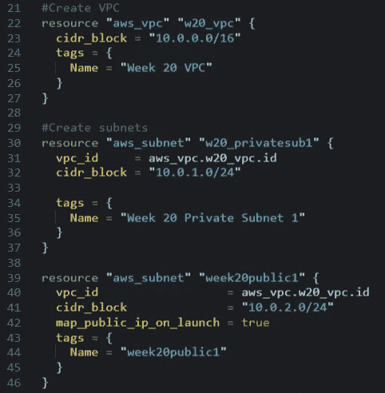

我选择在我的 VPC 中包含一个互联网网关。如果您愿意，您可以跳过这一步，但是如果您不包括 Internet 网关，您可能应该包括 Nat 网关。

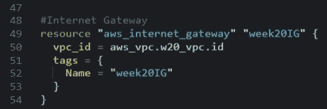

现在我们可以创建我们的 ECS 资源了。第 56 -59 行将为 ECS 群集创建一个名称，第 61-71 行包含 ECS 群集资源，第 73-109 行包含 Fargate 模块。

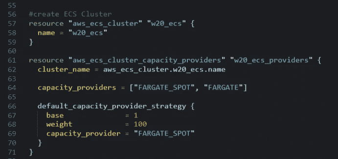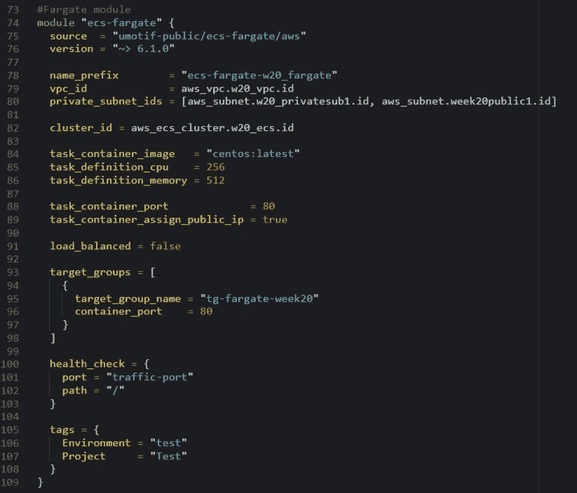

***我的兔子洞***

这是我迷路的地方…花费了无尽的时间…老实说，我仍然没有一个好的解决方案。我已经设置了我的 Trraform 提供者，创建了 ECS 集群，但是我仍然需要将我的容器推到 ECR。使用地形。

将映像推送到 ECR 并不困难，事实上，一旦创建了存储库，AWS 就会给出运行的命令(在 Terraform 中这也是一项相当容易的任务)。问题是没有好的方法可以使用 Terraform 把你的容器推到 ECR。我读过的每一篇文章都提到，Terraform 不是用来运行将容器推送到 ECR 的命令的。我花了两天时间进行研究，以确保我没有遗漏什么，有很多方法可以“创建”一个作品，但我是为初学者创建这篇文章/项目的，同样，这应该是一个相当小的任务。

经过几天的研究…我挥舞着白旗。我知道，如果我部署我的 Terraform 基础架构，Centos 映像将位于 ECS 集群中(这是我项目的术语“技术上”)…但是…容器永远不会处于活动状态。

对我来说，在这个项目处于这种状态时离开它并不容易，然而，我在两天的研究、尝试和错误以及与我的同事的交谈中获得的知识量使它变得易于管理。我从从未使用过 ECS、ECR 或 Fargate，到对它们的功能/不功能以及如何使用它们有了基本的了解。

我希望有一天回到这篇文章，并张贴第二部分…但让我们继续。(更新在文章底部！)

## 步骤 3:部署 Terraform 基础设施。

现在我们的 main.tf 文件已经完成，我们可以运行部署 Terraform 基础设施的步骤了。我们将从初始化后端开始:

```
$ terraform init
```

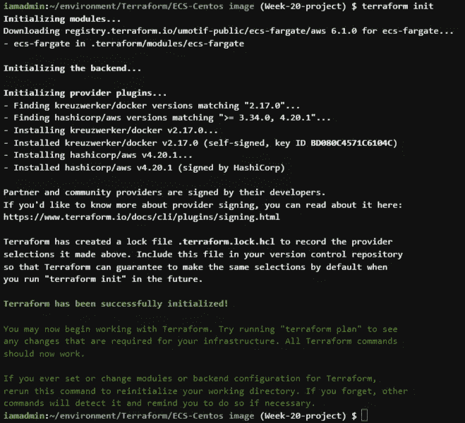

我喜欢确保我的代码格式正确，所以我将运行

```
$ terraform fmt
```

现在我可以运行我的地形计划命令了。这将评估地形配置并制定执行计划。

```
$ terraform plan
```

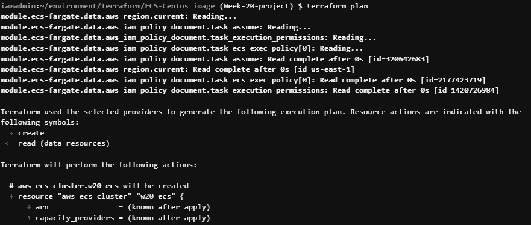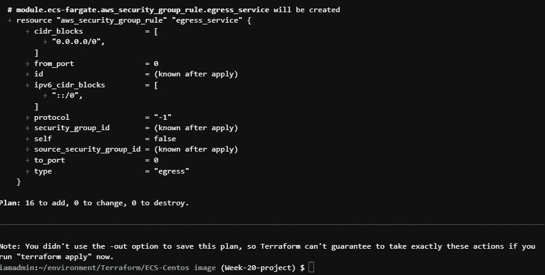

一旦我们同意将要发生的所有变化，并对我们的代码感到满意，我们就可以应用配置并构建基础设施。。

```
$ terraform apply
```

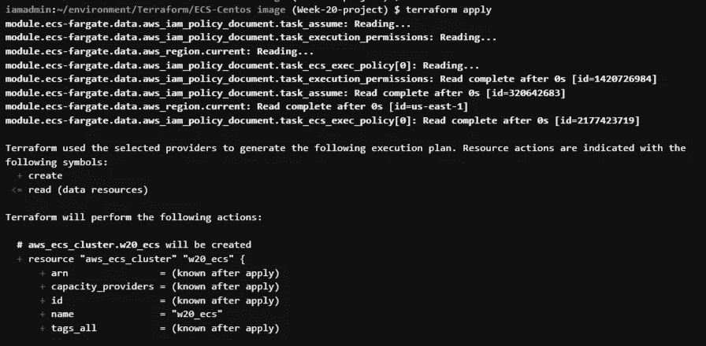

您需要用“是”确认您要执行以下操作。

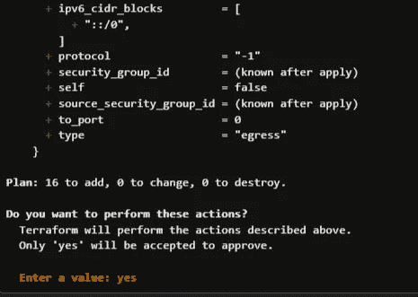

如果一切都已正确创建，您将收到一条确认完成的消息。

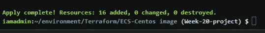

**步骤 4:在 AWS 控制台中验证一切工作正常**

让我们前往 AWS 控制台，看看我们完成了什么。

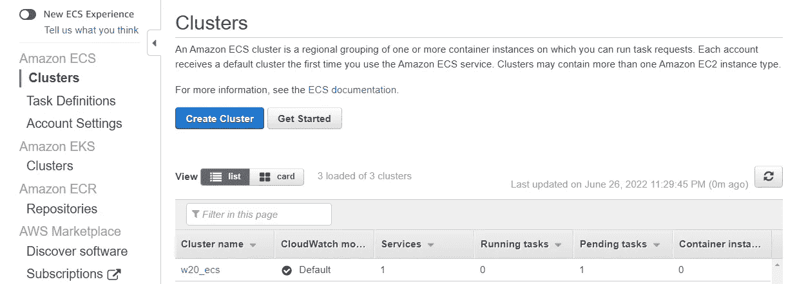

我们可以在上面看到，在我们代码的第 57/58 行创建了集群，**‘w20 _ ECS’**。

如果我们单击这个集群名称，我们可以看到我们的' **ecs-fargate-w20_fargate'** (创建了第 74 行)。

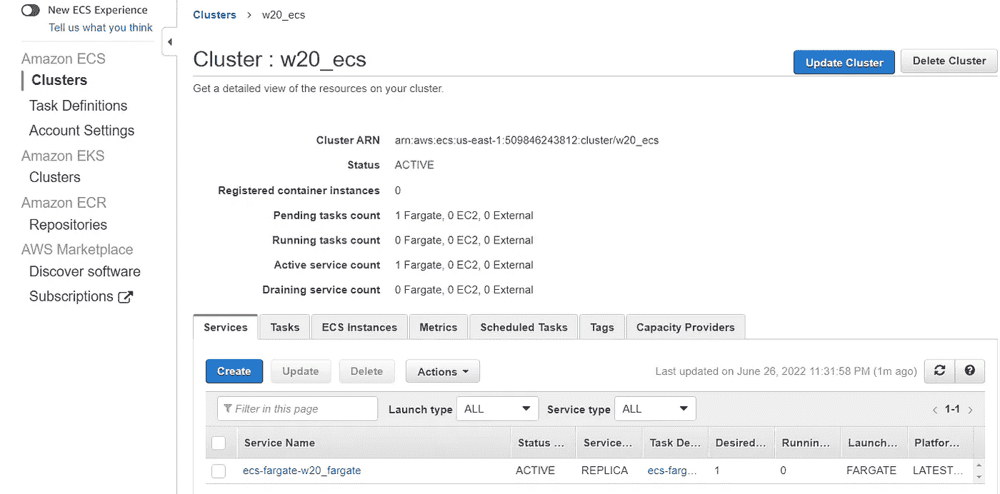

最后，如果我们选择**任务**，并选择“**任务 id”，**我们可以看到我们的 Centos 映像(来自第 84 行)被用于创建 ECS 集群的位置。

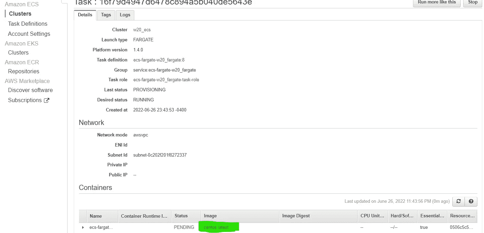

映像停留在挂起状态大约 5 分钟，直到超时并进入停止状态。

## **第五步:拆除基础设施**

现在，我们已经创建了资源，并验证了它们正在工作，我们需要拆除基础架构以避免收费。我们可以使用以下命令来实现:

```
$ terraform destroy
```

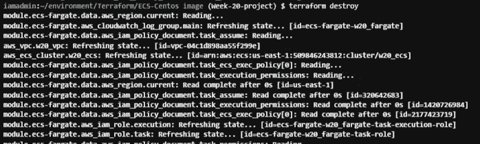

与 terraform apply 一样，我们必须确认我们想要销毁基础架构。

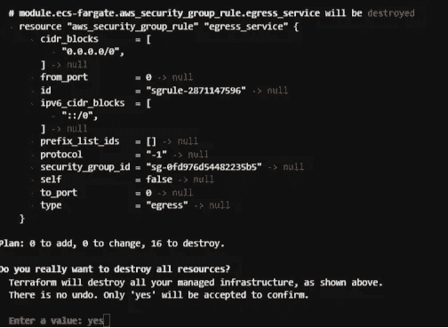

一旦所有东西都被销毁，你会得到一个确认。

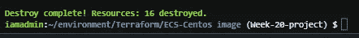

从技术上讲，任务已经完成，我们已经使用 centos docker 映像创建了一个 ECS 集群。

* *更新…实际上不需要 ECR！这是我发现的一篇没有 ECR 也能完成任务的文章！[https://medium . com/@ jamesaaronbanks/creating-an-ECS-cluster-using-a-centos-image-from-docker-with-terraform-166 BD 535051 b](/@jamesaaronbanks/creating-an-ecs-cluster-using-a-centos-image-from-docker-with-terraform-166bd535051b)