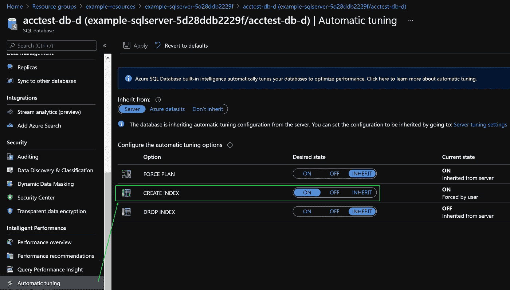

# 使用 Terraform 在单个 Azure SQL 数据库中启用自动调优模式

> 原文：<https://medium.com/nerd-for-tech/using-terraform-to-enable-automatic-tuning-mode-in-an-individual-azure-sql-database-1e2cf3e6a21f?source=collection_archive---------8----------------------->


调一下！—由 [cottonbro](https://www.pexels.com/nl-nl/@cottonbro?utm_content=attributionCopyText&utm_medium=referral&utm_source=pexels) 通过[像素](https://www.pexels.com/nl-nl/foto/hand-gezichtsloos-muziek-musicus-4708867/?utm_content=attributionCopyText&utm_medium=referral&utm_source=pexels)进行 Pic

# 💡介绍

Azure SQL Database 自动管理数据服务，这些服务持续监控您的查询，并确定您可以执行的操作，以提高工作负载的性能。您可以检查建议并手动应用它们，或者让 Azure SQL 数据库自动应用纠正措施—这就是所谓的自动调优模式。

可以通过以下方式在服务器或数据库级别启用自动调优:

*   蓝色门户 1️⃣
*   2️⃣ REST API 调用
*   3️⃣ T-SQL 命令

# 🔍挑战

正如你从上面的 1️⃣、2️⃣和 3️⃣看到的，目前不可能通过 Azure CLI 或 ARM (Azure Resource Manager)模板启用自动调整。但是不用担心——这个存储库中的示例提供了一个替代的部署选项。它扩展了 T-SQL 命令选项(3️⃣),使用 Terraform 在单个 Azure SQL 数据库中实现自动调优！

到目前为止，还不能使用 Terraform `azurerm_mssql_database`资源来启用此功能。因此，这个解决方案使用了`null_resource`地形资源和`sqlcmd`工具。

# 🔧它是如何工作的？

如[地形文件](https://registry.terraform.io/providers/hashicorp/null/latest/docs/resources/resource)所述:

> `null_resource`资源实现了标准的资源生命周期，但是没有采取进一步的行动。
> 
> `triggers`参数允许指定任意一组值，当这些值被更改时，将导致资源被替换。

关键属性是`depends_on = [azurerm_mssql_database.test]`和`triggers = { always_run = timestamp() }`。

```
resource "null_resource" "db_setup" {
  depends_on = [azurerm_mssql_database.test] triggers = {
    always_run = timestamp()
  } provisioner "local-exec" {
    command = "sqlcmd -S ${azurerm_mssql_server.example.name}.database.windows.net -d ${azurerm_mssql_database.test.name} -U ${var.administrator_login} -P ${var.administrator_login_password} -i ./auto-tuning.sql"
  }
}
```

这确保了`sqlcmd`实用程序总是在`terraform apply`中执行`auto-tuning.sql`命令。

```
-- Enable automatic tuning on an individual database
ALTER DATABASE current SET AUTOMATIC_TUNING (CREATE_INDEX = ON);
```

❗重要提示:请注意，在这个示例中,(生成的)MS SQL Server 管理员凭证用于执行`auto-tuning.sql`命令。

> 要使用自动调优，授予用户的最低要求权限是 Azure 的内置 SQL 数据库贡献者角色。您还可以考虑使用更高权限的角色，如 SQL Server 参与者、SQL 托管实例参与者、参与者和所有者。([自动调谐权限—微软文档](https://docs.microsoft.com/en-us/azure/azure-sql/database/automatic-tuning-enable#permissions))

# 📝要求

*   ✅ Azure 订阅
*   ✅ [Azure CLI](https://docs.microsoft.com/en-us/cli/azure/install-azure-cli)
*   ✅ [地形](https://learn.hashicorp.com/tutorials/terraform/install-cli)
*   ✅ [sqlcmd 实用程序](https://docs.microsoft.com/en-us/sql/tools/sqlcmd-utility?view=azuresqldb-current)

# 🔧使用

在克隆了这个存储库并安装了基本需求之后，在`./src/terraform`目录中运行以下命令:

```
# Login to an Azure subscription
az login# Initializes Terraform
terraform init# Plans and applies this sample's Azure infrastructure using Terraform
# It will prompt you for your current IP Address
terraform plan
terraform apply
```

🕐几分钟后，`terraform apply`的预期输出应该是:

```
null_resource.db_setup: Destroying... [id=630773934331976362]
null_resource.db_setup: Destruction complete after 0s
null_resource.db_setup: Creating...
null_resource.db_setup: Provisioning with 'local-exec'...
null_resource.db_setup (local-exec): (output suppressed due to sensitive value in config)
null_resource.db_setup: Creation complete after 0s [id=7937627834098869972]
```

✔️您可以使用 [Azure Portal](https://portal.azure.com/) 确认自动调优已启用，并打开 SQL 数据库自动调优设置:



# 🚿清理

您可以使用以下方式销毁此示例的 Azure 基础架构:

```
# Destroy this sample's Azure infrastructure using Terraform
terraform destroy
```

# 💙感谢您的阅读！

如果你觉得这有用，一些👏将非常感谢进一步传播这个词。此外，如果您有其他问题或想法，请在评论中告诉我，或者在 [GitHub](https://github.com/CarlosSardo/terraform-azure-sql-automatic-tuning) 中投稿。谢谢大家！

# 📗来源

[在单个数据库上启用自动调优— Microsoft docs](https://docs.microsoft.com/en-us/azure/azure-sql/database/automatic-tuning-enable#enable-automatic-tuning-on-an-individual-database)