# 使用动画系统| Unity

> 原文：<https://medium.com/nerd-for-tech/using-the-animation-system-unity-d80c8be71f87?source=collection_archive---------14----------------------->

## 统一指南

## 如何在 Unity 中使用动画系统的快速指南

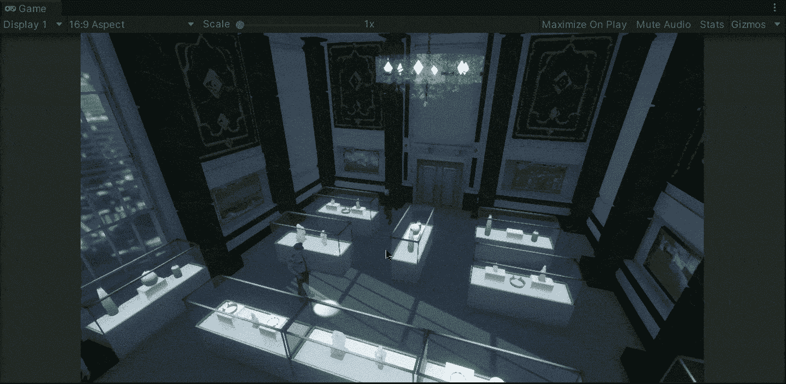

**目标**:使用 Unity 的动画系统在移动的 3D 模型中实现一对动画。

在上一篇文章中，我介绍了[如何用 Unity](/nerd-for-tech/point-click-to-move-unity-6e2a0ab858fc) 点击移动角色。现在，是时候使用 Unity 的动画系统在玩家移动或等待时实现各自的动画了。

# 玩家

我们已经用场景中相应的 3D 模型替换了原始的胶囊游戏对象:

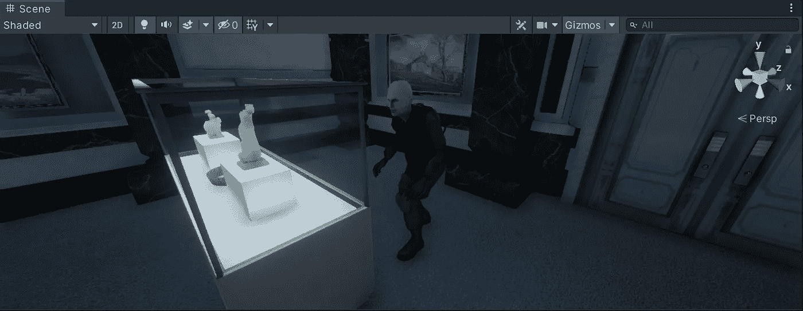

这个模型是一个预置，它是玩家游戏对象的子对象。为了开始制作模型的动画，让我们选择它，然后通过检查器给它附加一个新的**动画师**组件:

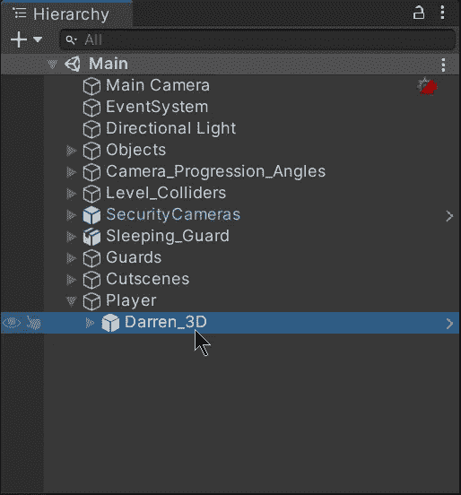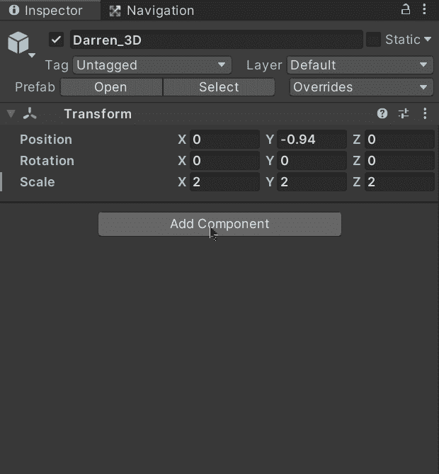

这个模型有 3 个不同的动画剪辑:

*   闲置的
*   扔
*   步行

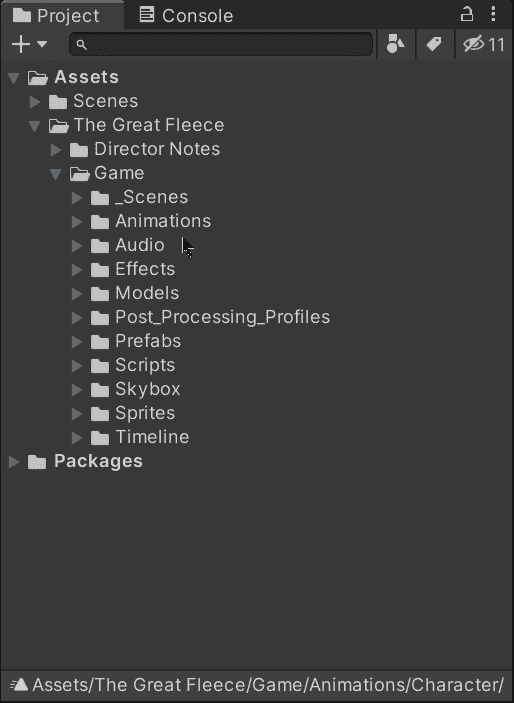

现在，为了控制动画剪辑，让我们创建一个新的**动画控制器**并将其拖动到我们模型中的 **Animator** 组件:

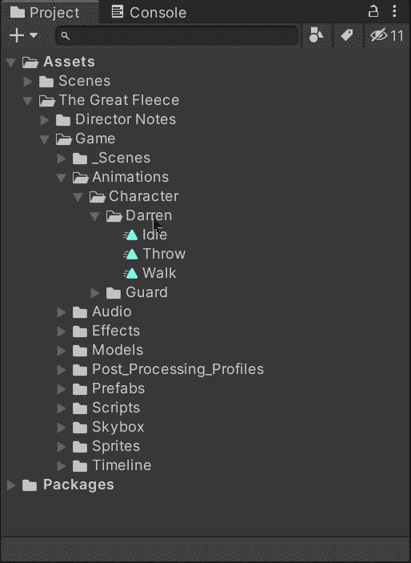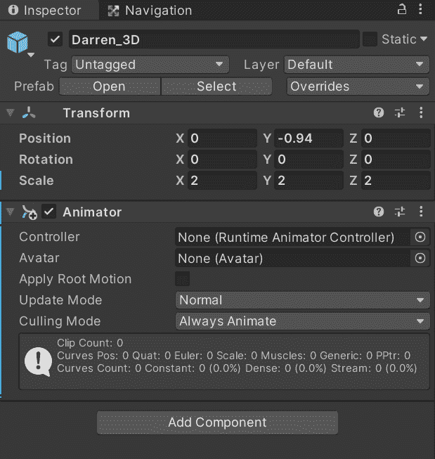

# 动画

然后，让我们双击控制器来提示 **Animator 窗口**:

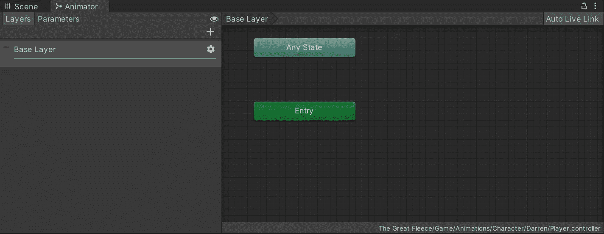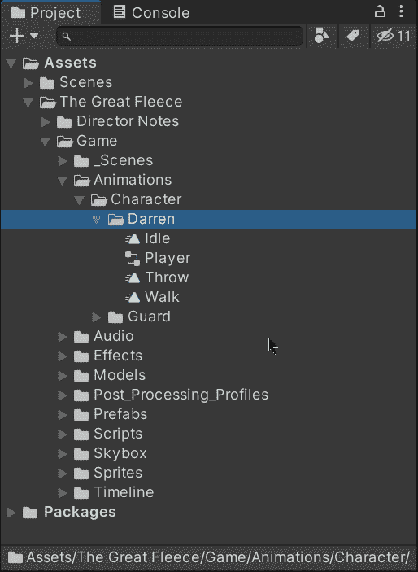

在**动画窗口**中，我们将能够定义模型的不同状态。它基本上作为一个 FSM(有限状态机)工作，控制我们的模型在不同状态下的动画。首先，让我们将*空闲*和*行走*动画剪辑拖入窗口:

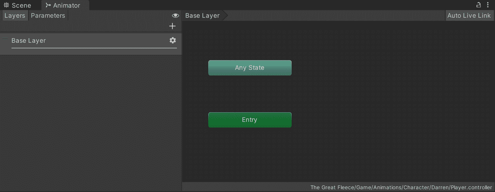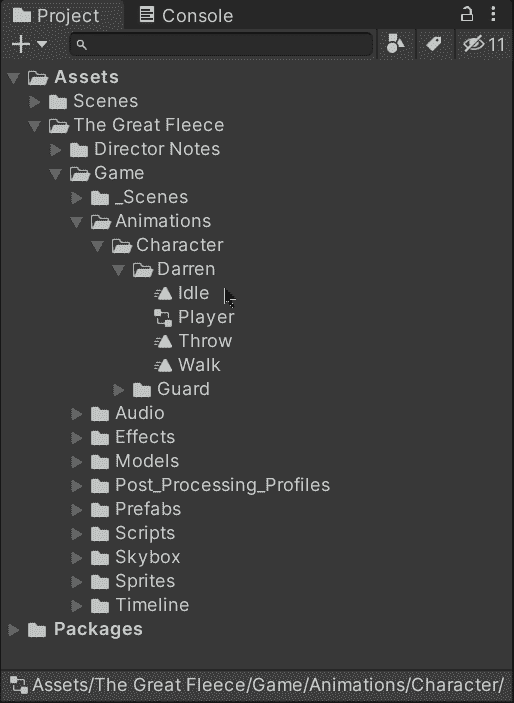

如您所见，我们添加的第一个动画剪辑被设置为默认状态。如果我们尝试像这样运行游戏，我们将能够看到*空闲*动画在我们的模型中默认播放:

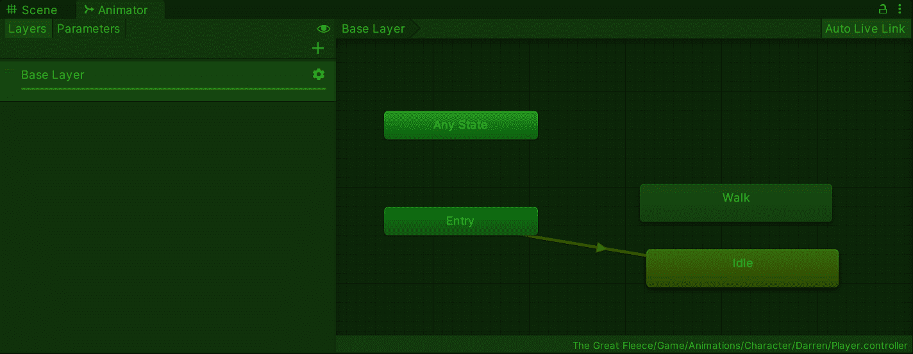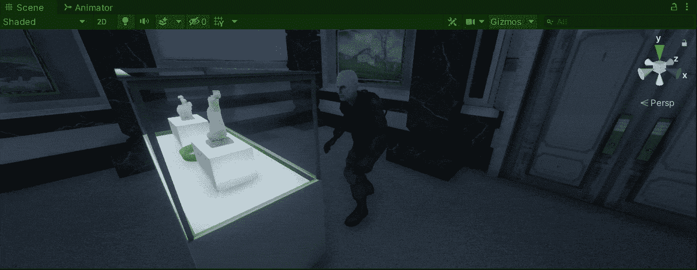

因此，为了进入和离开另一个状态，让我们创建一个双向的新转换:

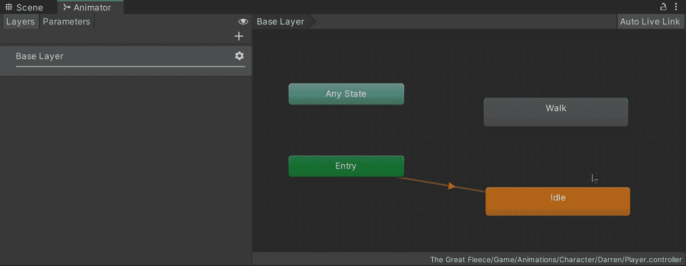

现在，为了控制过渡，我们需要创建一个新的 bool 参数来确定玩家是否在行走:

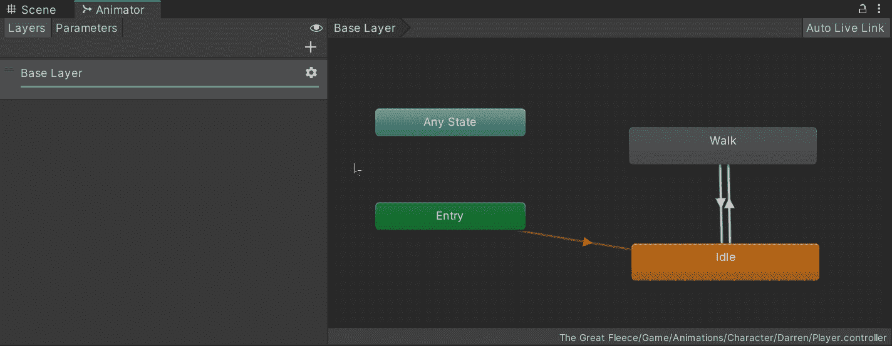

然后，要在转场中分配新参数，让我们选择相应的箭头。选中后，让我们禁用 ***具有退出时间*** 属性(无需等待动画结束即可更改状态)，并添加一个新条件来检查以下布尔值:

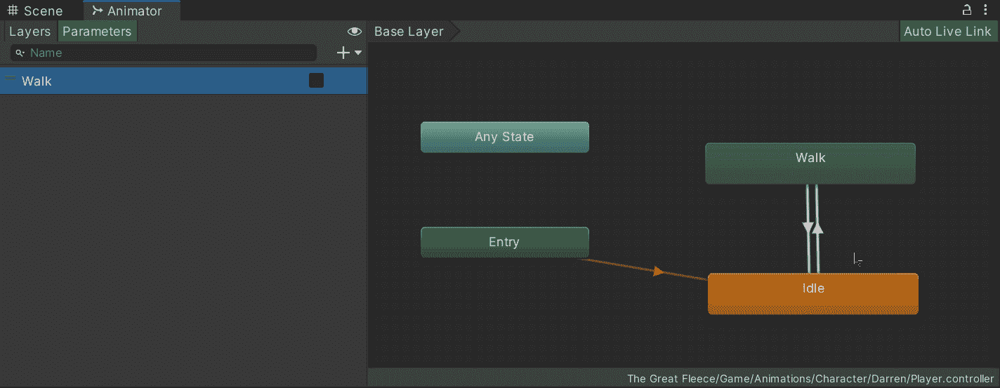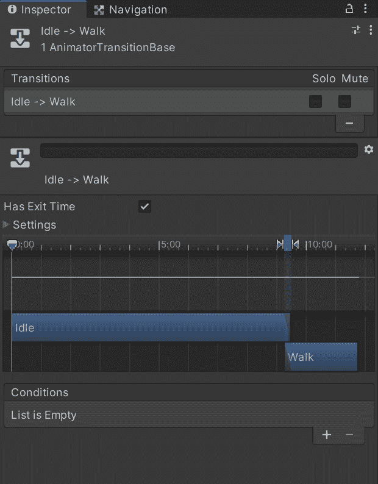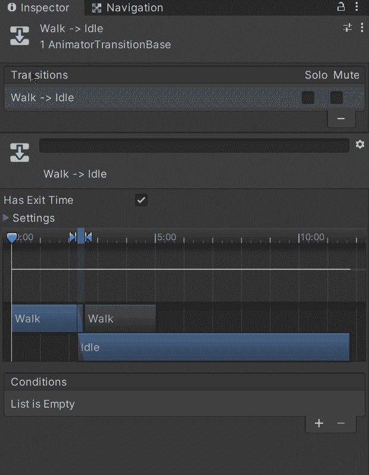

# 触发动画

现在，为了通过代码触发动画，让我们打开 **Player** 脚本并创建一个新的 **Animator** 变量来存储模型中组件的引用:

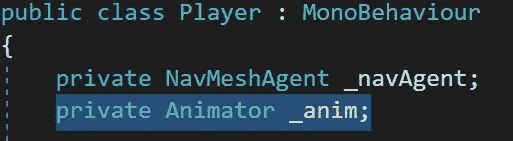

然后，在 **Start** 方法中，我们使用 **GetComponentInChildren** 方法初始化变量(因为 Animator 组件在子模型中):

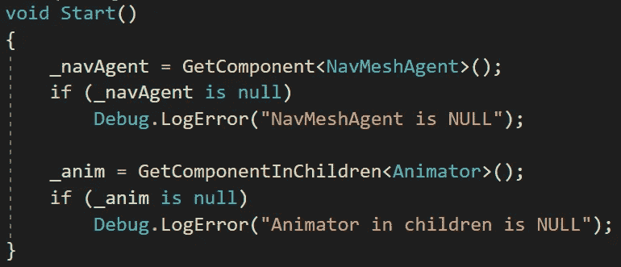

最后，为了触发动画，我们将使用 ***导航网格代理*** 的速度。如果你读了[的上一篇文章](/nerd-for-tech/point-click-to-move-unity-6e2a0ab858fc)，你会记得这个组件是附在玩家身上的，目的是控制它在场景中的移动。

由于 ***导航网格代理*** 的速度用 Vector3 表示，我们将使用 **sqrmagnitude** 来比较一个简单的 float 值。如果该值小于 1，我们将把我们的 Animator 组件中的 bool 设置为**假**，否则，bool 将被设置为**真**:

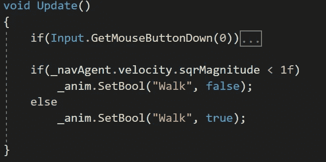

如果您想了解更多关于***Nav Mesh Agent***velocity 的信息，您可以访问 Unity 文档:

 [## 艾。NavMeshAgent-velocity - Unity 脚本 API

### 读取变量将返回基于人群模拟的代理的当前速度。正在设置变量…

docs.unity3d.com](https://docs.unity3d.com/es/2018.4/ScriptReference/AI.NavMeshAgent-velocity.html) 

这样，我们可以确定当玩家的 ***导航网格代理*** 停止时，我们将返回到空闲状态动画。如果我们在 Unity 中运行游戏，我们会注意到动画按预期工作:

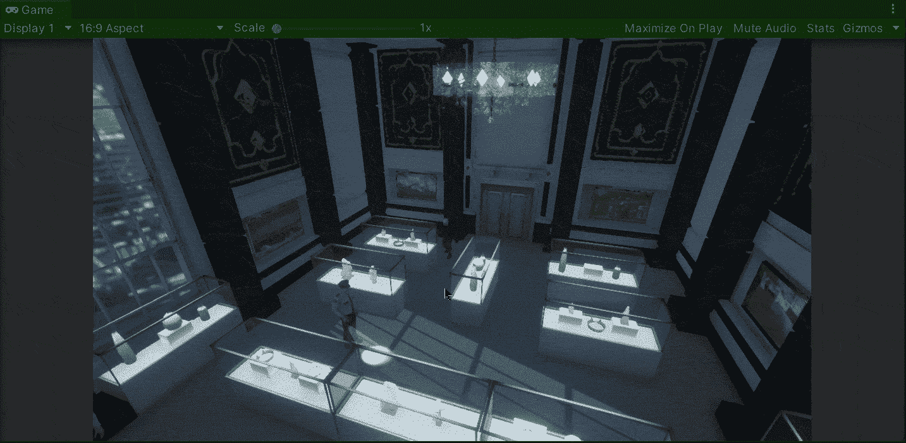

仅此而已，我们可以用 Unity 的动画系统！我会在下一篇文章中看到你，在那里我将展示如何用 Unity 创建一个模块化的航点系统。

> *如果你想了解我更多，欢迎登陆*[***LinkedIn***](https://www.linkedin.com/in/fas444/)**或访问我的* [***网站***](http://fernandoalcasan.com/) *:D**