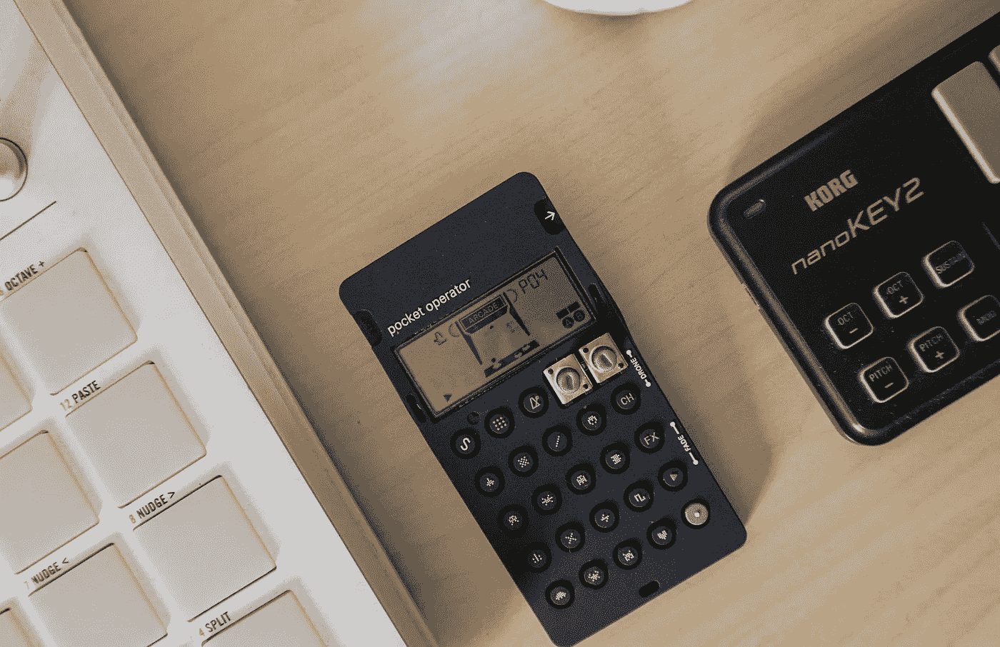
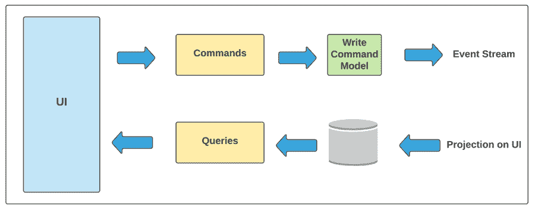
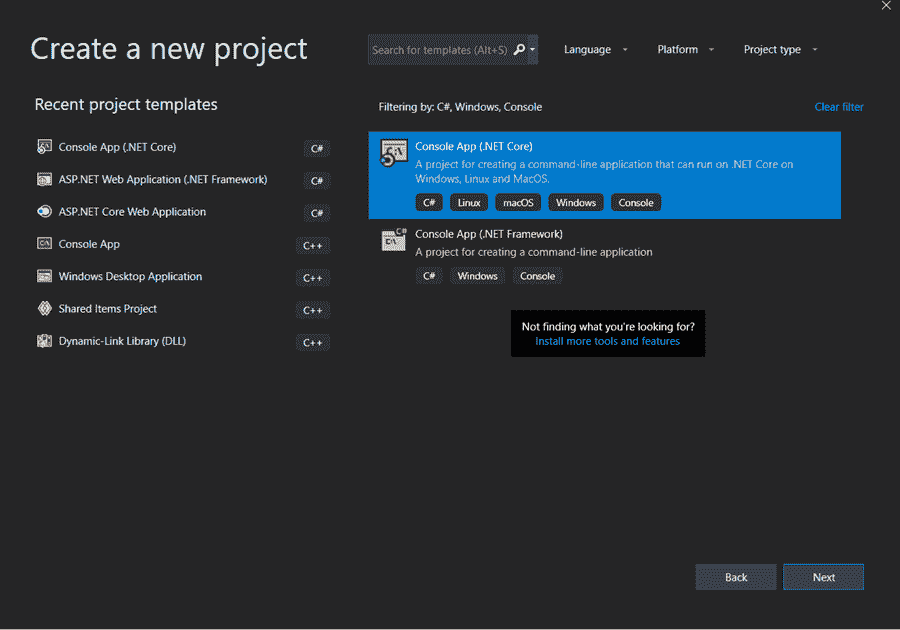
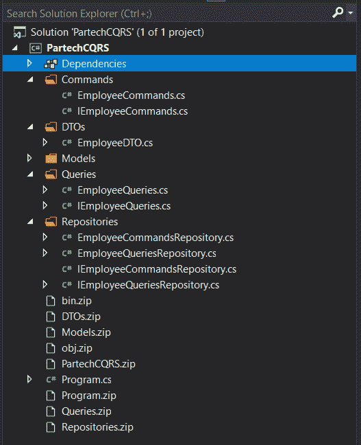

# 在 C#中使用 CQRS 模式

> 原文：<https://medium.com/nerd-for-tech/using-the-cqrs-pattern-in-c-710935425745?source=collection_archive---------18----------------------->



大多数开发人员习惯于使用 CRUD 操作(创建、读取、更新和删除),这些操作有助于在系统中划分任务。但是由于不同的框架、解决方案和复杂的基础设施，这种实践带来的复杂性使得开发人员的工作变得乏味。

这方面的一个主要问题是，当应用程序必须服务越来越多的客户时，您的模型可以有越来越多的表示。大多数时候，应用程序的架构设计是以类似 CRUD 的方式进行的，这意味着单个数据库(不管是否是关系数据库)既用于存储，又用作所有需求的查询中心。

当涉及到性能问题、可伸缩性独立性和弹性问题时，对将这些方面结合在一起的关注，特别是当微服务诞生时，要求开发人员以专门的方式创建每个实体。

这个问题的解决方案是 CQRS 模式。在本帖中，我们将探究什么是 CQRS 模式以及它是如何有用的。

**目录**

1.  什么是 CRUD？
2.  什么是 CQRS？
3.  CQRS 的特色
4.  为什么 CQRS 超过了克鲁德？
5.  CQRS 的工作
6.  CQRS 的实际实施
7.  结论

# 什么是 CRUD？

在构建 API 时，我们希望我们的应用程序执行以下四个功能:创建、读取、更新和删除。这个缩写叫做 CRUD。然而，CRUD 操作是在单个数据库上执行的，在为企业级应用程序操作时，数据争用是常见的。

在传统的体系结构中，单一的数据模型用于读取和更新数据库。这听起来很简单，并且适用于基本的 CRUD 类操作。然而，这种方法在复杂的企业应用程序中会变得不实用。例如，读取操作可以返回具有不同形状的不同数据传输对象。在右侧，涉及到复杂的验证和业务逻辑。因此，对象映射变得复杂。你最终会得到一个过于复杂、功能过多的模型。

为了解决这个问题，部署了 CQRS。让我们看看什么是 CQRS，为什么要使用它。

# 什么是 CQRS？

CQRS 主张指挥和查询责任分离。它是一种命令查询模式，可以将数据存储的读取和写入操作分开。CQRS 使用命令和查询模式，其中命令功能仅更新或写入数据，而查询功能返回数据。因此，使用两个不同的实体来读取和写入数据。区分数据的传输和检索变得很容易。在应用程序中使用 CQRS 可以最大限度地提高应用程序的性能、安全性和可伸缩性。

# CQRS 的特色

1.  **独立扩展:** CQRS 支持独立的读写工作负载。这导致更少的冲突竞争。
2.  **优化的模式**(抽象数据库设计):读操作使用一个为查询优化的模式，而写操作使用一个为更新优化的模式。
3.  **增强的安全性:**更容易确保正确的域实体(可能是命令或查询)执行各自的读写操作。
4.  **排除复杂性:**读写实体的分离排除了复杂性，因此应用程序变得灵活且可维护。大多数复杂的业务逻辑都进入了写操作。读取操作相对简单。
5.  **更简单的查询:**通过在 read 数据库中存储数据的物化视图，应用程序可以避免需要复杂查询的连接。

# 为什么 CQRS 超过了克鲁德？

在 CRUD 操作中，读取和写入工作负载通常是不对称的，在性能和可伸缩性方面有所不同。当两个操作在 CRUD 中的同一个数据集上同时执行时，就会发生数据争用。传统方法可能会对应用程序的性能产生负面影响，因为使用单个数据模型执行读写操作会增加数据存储和数据访问层的负载。管理应用程序的安全性和权限非常麻烦，因为应用程序中的每个实体都要读写数据，并且可能会在错误的上下文中暴露信息。

在 CQRS 模式中，命令以任务为中心，而不是以数据为中心。命令模式仅改变数据的状态(即写入)，但不返回数据。此外，遵循异步处理而不是同步处理。最好的部分是 CQRS 的‘查询’从不修改数据。该查询返回与命令不重叠的 DTO。

# CQRS 的工作



这里，命令和查询操作同时发生，但不会导致冲突，并且用于不同的目的。为读写操作提供独立的接口极大地简化了应用程序的设计。

在上图中，命令用于执行写操作，查询用于执行读操作，最终将其投射到用户界面模型上。

# CQRS 的实际执行

## 第一步

打开 visual studio 并创建一个新项目。选择控制台应用程序(。NET Core)，如下图所示。



## 第二步

通过给出项目标题和其他规范来配置您的项目。创建如下所示的文件夹和存储库，在 C#中实现 CQRS 模式。



现在让我们看看 CQRS 的工作和实施情况。在下面的程序中，只包括写操作，它包括一个接口和写库。

# 命令(写)模块

```
using ConsoleAppCQRSPattern.Models; namespace ConsoleAppCQRSPattern.Repositories { public interface IEmployeeCommandsRepository { ​ void SaveEmployee(Employee employee); } } using ConsoleApp CQRSPattern.Models; namespace ConsoleApp CQRSPattern.Repositories { public class EmployeeCommandsRepository: IEmployeeCommandsRepository { ​ public void SaveEmployee(Employee employee) { } } } The below program comprises only the read operations that constitute an interface and repository for reading and returning data.using PartechCQRS.DTOs; namespace PartechCQRS.Queries { public interface IEmployeeQueries { ​ EmployeeDTO FindByID(int employeeID); } } using System; using ConsoleAppCQRSPattern.Models; namespace ConsoleAppCQRSPattern.Repositories { public class EmployeeQueriesRepository: IEmployeeQueriesRepository { public Employee GetByID(int employeeID) { // Below is for demo purposes only return new Employee() { Id = 100, FirstName = "John", LastName = "Smith", DateOfBirth = new DateTime(2000, 1, 1), Street = "100 Toronto Street", City = "Toronto", ZipCode = "k1k 1k1" }; } } }
```

接下来，我们将分别研究读和写这两个中间层组件。

# 查询(读取)存储库

```
using PartechCQRS.Models; namespace PartechCQRS.Repositories { public interface IEmployeeQueriesRepository { ​ Employee GetByID(int employeeID); } } using System; using PartechCQRS.Repositories; using PartechCQRS.DTOs; namespace PartechCQRS.Queries { public class EmployeeQueries { ​ private readonly IEmployeeQueriesRepository _repository; ​ public EmployeeQueries(IEmployeeQueriesRepository repository) ​ { ​ _repository = repository; ​ } ​ public EmployeeDTO FindByID(int employeeID) ​ { ​ var emp = _repository.GetByID(employeeID); ​ return new EmployeeDTO ​ { ​ Id = emp.Id, ​ FullName = emp.FirstName + " " + emp.LastName, ​ Address = emp.Street + " " + emp.City + " " + emp.ZipCode, ​ Age = Convert.ToInt32(Math.Abs(((DateTime.Now - emp.DateOfBirth).TotalDays) / 365)) - 1 ​ }; ​ } } }
```

# 命令(写)存储库

```
Using PartechCQRS.Models; namespace PartechCQRS.Commands { public interface IEmployeeCommands { ​ void SaveEmployeeData(Employee employee); } } using PartechCQRS.Models; using PartechCQRS.Repositories; namespace PartechCQRS.Commands { public class EmployeeCommands : IEmployeeCommands { ​ private readonly IEmployeeCommandsRepository _repository; ​ public EmployeeCommands(IEmployeeCommandsRepository repository) ​ { ​ _repository = repository; ​ } ​ public void SaveEmployeeData(Employee employee) ​ { ​ _repository.SaveEmployee(employee); ​ } } }
```

这里很明显，我们有不同的操作处理组件。另外两个类是主雇员类，它反映了我们的存储项和 DTO 类。这是查询(读取)操作以指定格式返回数据所需要的。

```
namespace PartechCQRS.DTOs { public class EmployeeDTO { ​ public int Id ​ { ​ get; ​ set; ​ } ​ public string FullName ​ { ​ get; ​ set; ​ } ​ public int Age ​ { ​ get; ​ set; ​ } ​ public string Address ​ { ​ get; ​ set; ​ } } } ​ using System; namespace PartechCQRS.Models { public class Employee { ​ public int Id ​ { ​ get; ​ set; ​ } ​ public string FirstName ​ { ​ get; ​ set; ​ } ​ public string LastName ​ { ​ get; ​ set; ​ } ​ public DateTime DateOfBirth ​ { ​ get; ​ set; ​ } ​ public string Street ​ { ​ get; ​ set; ​ } ​ public string City ​ { ​ get; ​ set; ​ } ​ public string ZipCode ​ { ​ get; ​ set; ​ } } }
```

最后，我们从主程序类中调用上述操作。它创建对象来访问和保存使用查询(读)操作返回的数据，并使用命令(写)操作显示数据。

```
using PartechCQRS.Queries; using PartechCQRS.Repositories; using System; namespace PartechCQRS { class Program { ​ static void Main(string[] args) { ​ // Command the Employee Domain to save data ​ var employeeCommand = new EmployeeCommandsRepository(); ​ Console.WriteLine( "Employee data stored"); ​ // Query the Employee Domain to get data ​ var employeeQuery = new EmployeeQueries(new EmployeeQueriesRepository()); ​ var emp = employeeQuery.FindByID(100); ​ Console.WriteLine("Employee ID:{employee.Id}, Name:{employee.FullName}, Address:{employee.Address}, Age:{employee.Age}"); Console.ReadKey(); } } }
```

因此，查询和命令通过为 saveEmployeeData 类创建对象并检索数据来读写数据，从而独立工作。

# 结论

CQRS 设计模式是一种整体方法，与传统的 CRUD 操作相比，它极大地简化了设计，消除了冗余和复杂性。在构建复杂的企业应用程序时，确保实现 CQRS 模式以避免复杂性。

*原载于*[*https://www . partech . nl*](https://www.partech.nl/nl/publicaties/2021/05/using-the-cqrs-pattern-in-c-sharp)*。*