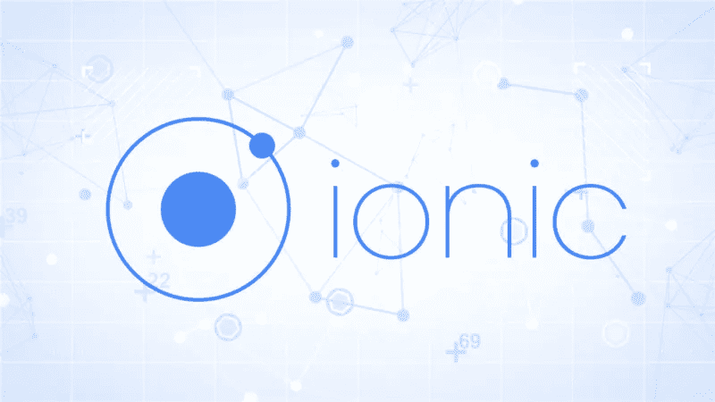

# 使用 Ionic 框架开发支持桌面浏览器的移动应用

> 原文：<https://medium.com/nerd-for-tech/using-the-ionic-framework-to-develop-mobile-applications-supporting-desktop-browsers-bd15230bcbb5?source=collection_archive---------17----------------------->

Ionic 框架在帮助开发者构建混合移动应用方面做得很好，但是桌面浏览器支持怎么样呢？许多人希望创建一个与移动应用程序功能相同或相似的网站。

不幸的是，这并不像你想象的那么容易，主要是由于 Ionic 浏览器支持的局限性。Ionic 从来没有被设计成做除了移动应用以外的任何事情，至少在版本 1 中是这样。仍处于测试阶段的版本 2 实际上增加了对桌面浏览器的支持，并创建了 Windows 10 通用应用程序和与éelectron 的集成。

在 Ionic 2 正式发布之前，仍然有其他选项可以将您的网站部署为混合移动应用程序，反之亦然。

# 配置 Ionic 以支持桌面浏览器

在深入研究[在桌面浏览器上部署 Ionic 应用](https://www.weboccult.com/services/ionic/)的选项之前，我先简单解释一下如何配置 Ionic 来完成这项工作。

由于 Ionic 并不打算在桌面浏览器上使用，它将需要几个调整才能正常工作。

首先，除了为移动应用程序构建界面之外，您还需要构建 Ionic 应用程序，以便为桌面浏览器在单独的文件夹中构建文件和依赖项。Ionic 使得以这种方式构建你的项目更加容易，因为默认的文件结构已经分别为 Android 和 iOS 文件配置了文件夹。

要对此进行配置，您必须将项目配置为动态加载模型、路由报告并编译每个文件夹中的关联模型文件。

Ionic 使用 Gulp 在本地运行您的应用程序，并编译所有相关的项目文件。您还需要配置您的自定义 Gulp 任务，以便专门为桌面浏览器运行、创建和提供文件。这里有一个配置这个的教程。

您还需要创建一个变量来确定用户是否从桌面浏览器使用您的应用程序，并将其注入到您的指令中，以便在应用程序中使用。爱奥尼亚有它检测平台的方式。但是，这种方法无法检测桌面浏览器。创建检测非常简单，只需设置一个正则表达式或用户代理检测，并将其绑定到一个变量，以便在整个项目中使用。

一旦您的项目得到适当配置，您就应该准备好构建支持桌面浏览器的应用程序了。需要注意的一点是，一些可用的 ionic 指南不能很好地与桌面浏览器一起工作，所以一定要不断地测试它们在不同浏览器上的使用，以确保它们不会破坏任何东西。

# 选项 1 —使用 Ionic 2 构建您的应用

让我们去掉一个显而易见的选项——你可以用 Ionic 2 构建一个生产应用。现在，让我们解决下一个显而易见的问题，那就是它目前处于测试阶段。最重要的是，Ionic 2 采用 Angular 2 构建，Angular 2 最近刚刚发布，还没有太多时间用于大规模生产环境。因此，在这一点上，我更有信心用 Angular 2 而不是 Ionic 2 来构建一个应用程序。

虽然一些开发人员已经用 Ionic 2 创建了小样本应用程序，但我不知道有谁用最新版本将大规模应用程序投入生产。我不认为任何人(以一种好的方式)会去尝试做这样的事情。不仅有大量潜在的障碍需要克服，Angular 2 也被完全重写，很少有开发者体验过，给故事情节增加了额外的一层复杂性和学习曲线。

还需要注意的是，Ionic 2 不支持任何浏览器，但是它支持 Edge。随着 Internet Explorer 使用的下降，一旦 Ionic 2 进入生产发布状态，它可能是构建支持桌面浏览器的跨平台应用程序的可行候选。

# 选项 2 —将您现有的网站移植到 Ionic

如果你已经有一个现有的网站，并且没有开始一个新的项目，有一些方法可以将其集成到 Ionic 移动应用程序中。根据你现有网站的工作方式，这可能是一项大工程。

如果您现有的网站是用 Angular 构建的，并且用户界面中呈现的大部分数据是 AJAX 调用或 JSON 文件的结果，那么所涉及的工作会少得多。虽然您可以将所有项目文件移动到 Ionic 项目中，但您无法利用 Ionic 的移动应用程序功能。使用这种方法迁移文件的最佳方式是计划如何实现控制器和服务，而无需为在新的 Ionic 应用程序中使用而进行太多修改。大部分工作应该集中在为 Android 和 iOS 构建新的界面上，

假设它不是用 Angular 构建的，而是使用 Java 或。Net 来编译您的页面。在这种情况下，你将不得不通过将前端提升为独立编译的后端代码来重建网站的大部分。然而，这可能是一个很好的机会，使你现有的网站现代化，同时结合其他可能已经在你的路线图策略上的变化。

# 选项 3 —为 Ionic 重新构建您的应用程序

虽然这无疑是最广泛的选择，但它将是部署应用程序最干净的方式，也是性能最好的方法。如果你的应用最初不是用 Angular 构建的，这可能是你最好的选择之一。因为您已经有大量的工作要重新构建您的应用程序，所以您最好抓住机会以正确的方式构建它。

因为您的应用程序是专门为 Ionic 设计的，所以设置和路由模型可能比执行迁移要自然得多。通过这种方式，您将有可能在您的移动应用程序中充分使用 Ionic 的方法和指南，并在您的三个不同平台(桌面浏览器、Android 和 iOS)之间拥有更多可重用的组件。

# 选项 4 —用离子和电子创建您的应用

最后一个选择是使用电子平台和 Ionic 来构建你的应用程序。Electron 是一个构建混合应用程序的平台，类似于 Ionic 使用 WebView 构建混合应用程序的方式，但它旨在构建桌面应用程序。同样，有一个很好的教程可以用来设置您的项目，以便同时运行这两个平台。

应该注意的是，我上面提到的教程涵盖了初始设置，但不是用来构建生产应用程序的，所以继续开发可能会有更多的挑战。此外，向组合中添加另一个平台会使您的项目面临更多的依赖性和更多的潜在问题。

在我看来，在不添加电子依赖的情况下，构建支持桌面浏览器的 Ionic 项目可能更容易，尤其是因为没有太多的文档可用于这种类型的设置。

# 结论

尽管 Ionic 并不打算用于桌面应用程序，但支持它们的方法足够标准，足够安全，可以推荐在生产环境中试用。此外，一些生产应用程序已经使用这种方法来支持带有 Ionic 的桌面浏览器。或者，市场上有许多移动应用程序开发平台可以满足您的需求。虽然 Ionic 无疑是混合移动应用程序开发的最佳平台之一，但其他平台无需额外配置就可以原生支持桌面浏览器。

在 Ionic 2 生产就绪之前，支持桌面浏览器的最佳选择可能是配置您的 Ionic 项目，如本文开头所述。

如果你觉得这篇文章有帮助，我写了一些你可能会觉得有益的附加主题，包括规划你的移动应用程序的指南和用 Ionic 开发移动应用程序的技巧。

## 让 Aptude 专家实施您的移动解决方案。

作为移动应用程序开发的专家，web sculpture 拥有确保您的移动应用程序根据您的需求而设计的知识和专业技能。从定制的企业移动应用程序到以用户为中心的移动应用程序，如果您正在寻找移动解决方案，我们已经找到了答案。你可以在这里阅读更多关于我们的移动开发服务。