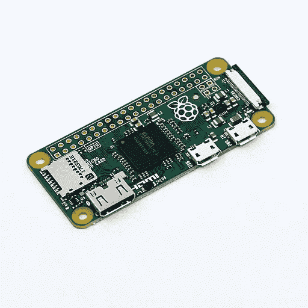

# 使用 Raspberry Pi Zero 作为 aWiFi 范围扩展器和 IOT 设备

> 原文：<https://medium.com/nerd-for-tech/using-the-raspberry-pi-zero-as-a-wifi-range-extender-and-an-iot-device-108d8e47ce5?source=collection_archive---------2----------------------->



Raspberry pi zero 是一款功能出众的神奇设备。通过内置的 wifi 和蓝牙，它可以很容易地变成一个 IOT 设备来控制各种外围设备。在这篇文章中，我将解释，我如何从零开始把我的 pi zero 变成一个 wifi 范围扩展器。

初始设置说明是针对 Mac OS 的，但是它们也可以很容易地用于任何版本的 linux。首先，我们需要在微型 sd 卡上刻录最新版本的 raspbian lite 操作系统。你可以从这里得到它[https://downloads.raspberrypi.org/raspbian_lite_latest](https://downloads.raspberrypi.org/raspbian_lite_latest)。下载并解压缩。img 文件。使用微型 sd 卡读卡器将微型 sd 卡插入其中一个 USB 驱动器。通过键入以下命令，打开终端窗口并列出所有磁盘

```
diskutil list
```

您将获得所有连接驱动器的列表，并可以轻松识别新插入的卡。在我的例子中，设备被列为/dev/disk2。完成后，通过键入以下命令卸载该设备

```
diskutil unmountDisk /dev/disk2
```

接下来我们烧掉。我们下载到磁盘的 img 文件

```
sudo dd bs=1m if=filename.img of=/dev/disk2
```

几分钟后，图像文件将被写入 micro sd 卡。

然后，我们将 sd 卡装回去(Mac OS 会自动为我们这样做)，并创建一个名为“ssh”的空白文件。这是为了让我们能够 ssh 到我们新造的圆周率零。在 Mac 上，sd 卡将显示为/Volumes/boot，我们需要在该文件夹中创建“ssh”文件。接下来，我们需要在我们的 Pi 上设置 internet 来下载所需的包。我们可以用两种方法做到这一点，

1.  使用 wpa_supplicant 通过 Wifi
2.  通过 USB 使用 RNDIS

第一种方法相当简单，在空白的“ssh”文件所在的文件夹中创建一个名为 wpa_supplicant.conf 的文件，并输入以下详细信息，替换路由器的 SSID 和密码

> 国家=美国
> 
> ctrl _ interface = DIR =/var/run/wpa _ supplicant GROUP = netdev
> 
> update_config=1
> 
> 网络={
> 
> ssid="MyRouterSSID "
> 
> psk="MyRouterPasswd "
> 
> }

对于第二种方式，您需要设置您的 pi +mac 来通过 USB 启用互联网共享。查看此[链接了解更多详情](https://gist.github.com/superdodd/06b91ba03899e47beb43078b27dc601e)。

下一步是把微型 SD 卡放在 Pi zero 上，等待几秒钟，让它启动。我们现在将 ssh 到 Pi 并安装 2 个包，

> [Hostapd](https://wiki.gentoo.org/wiki/Hostapd) : hostapd 是一个用户空间守护软件，支持网络接口卡作为接入点和认证服务器。
> 
> Dnsmasq :dnsmasq 是提供域名系统缓存的免费软件，一个动态主机配置协议服务器…

我们在 ssh 终端上以下面的方式做到这一点

```
sudo apt-get update
sudo apt-get install hostapd dnsmasq
```

安装后，我们禁用 hostapd 和 dnsmasq，这样它们就不会在启动时自动启动。

```
sudo systemctl disable hostapd
sudo systemctl disable dnsmasq
```

下一步是编辑/etc/hostapd/hostapd.conf 文件。输入以下详细信息

```
interface=uap0
ssid=PiAP 
hw_mode=g
channel=11
macaddr_acl=0
auth_algs=1
ignore_broadcast_ssid=0
wpa=2
wpa_passphrase=password
wpa_key_mgmt=WPA-PSK
wpa_pairwise=TKIP
rsn_pairwise=CCMP
```

您可以根据需要更改 ssid 和 wpa_passphrase。

接下来，为了使 hostapd 能够使用该文件，我们将编辑/etc/default/hostapd，并向其中添加以下行

```
DAEMON_CONF="/etc/hostapd/hostapd.conf"
```

接下来编辑/etc/dnsmasq.conf，并在末尾添加以下几行

```
interface=uap0
no-dhcp-interface=lo,wlan0
bind-interfaces
server=8.8.8.8
domain-needed
bogus-priv
dhcp-range=192.168.2.2,192.168.2.50,12h
```

我们的接入点将给出 192.168.2.2 到 192.168.2.50 范围内的 IP 地址，我们将使用谷歌的 DNS 服务器(8.8.8.8)进行域名解析。

接下来编辑/etc/network/interfaces 以添加我们的虚拟设备

```
 iface uap0 inet static
  address 192.168.2.1
  netmask 255.255.255.0
  network 192.168.2.0
  broadcast 192.168.2.255
  gateway 192.168.2.1
```

接下来添加一个将启动 hostapd 和 dnsmasq 服务的脚本，该脚本名为/usr/local/bin/piapstart，包含以下内容

```
#!/bin/bash
# Create the virtual device
/sbin/iw dev wlan0 interface add uap0 type __ap
ifup uap0# Route all the packets coming on this interface, this will enable #us to access internet through wlan0
sysctl net.ipv4.ip_forward=1
iptables -t nat -A POSTROUTING -s 192.168.2.0/24 ! -d 192.168.2.0/24 -j MASQUERADE

systemctl start dnsmasq
systemctl start hostapd
```

我希望我的 Pi zero 是完全可移植的，并且能够通过网页轻松编辑 SSID，我可以通过 Pi zero 访问点访问该网页。为此，我在 pi zero 上安装了 apache 和 php。

```
sudo apt-get install apache php
```

我编写了一个简单的 php 脚本，它将获得所需的详细信息，并将其写入 wpa_supplicant.conf 文件。你可以在这里找到脚本和其他文件[。我们可以很容易地从这样的网络浏览器中访问它](https://github.com/venkymani/PizeroAP)

http://raspberrypi.local/ssidconfig.php

最后，我们需要将所有这些内容放在启动脚本/etc/rc.local 中

```
#Start the Access point daemon
/bin/bash /usr/local/bin/piapstart# Enable wlan0 using wpa_supplicant and use the conf file created by #our php script 
wpa_supplicant -Dnl80211 -iwlan0 **-c**/var/www/html/wpa_supplicant.conf **-B -d**#delay by 10 seconds so that the wlan0 connection comes upsleep 10#get an ip address from the wifi routerdhcpcd wlan0
```

使用/etc/network/interfaces 自动启用 wlan0 不起作用，wlan0 链接总是关闭，所以通过启动脚本启动它是我能找到的唯一选项。Wpa_supplicant 帮助建立到路由器的连接，dhcpcd 从路由器获取 ip 地址。

每次我们使用 php 脚本更改 SSID 细节时，我们都需要重启 Pi zero 以使更改生效。在这种模式下使用 Pi 零点，我们可以将它用于许多生产级的实际情况，用户可以使用 Pi 零点控制他的所有设备。

感谢以下输入链接

[Pi 零无头设置](https://gist.github.com/superdodd/06b91ba03899e47beb43078b27dc601e)

[Raspberry Pi Zero W 同时作为 wifi 客户端和接入点](https://blog.ithasu.org/2017/11/raspberry-pi-0w-as-both-wifi-client-and-access-point/)

php 脚本和示例的源文件。conf 文件可以从[这里](https://github.com/venkymani/PizeroAP)下载