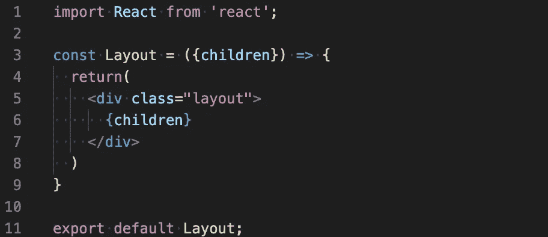
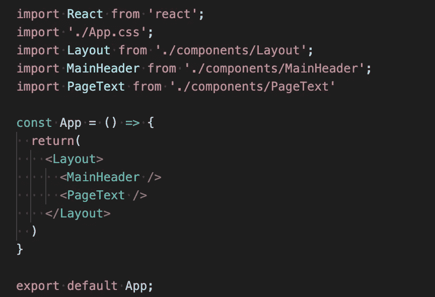

# 使用 React 子属性创建可重用的布局组件

> 原文：<https://medium.com/nerd-for-tech/using-the-react-children-prop-to-create-reusable-layout-components-93667aedc881?source=collection_archive---------5----------------------->

瑞安·昆塔尔在 [Unsplash](https://unsplash.com?utm_source=medium&utm_medium=referral) 上拍摄的照片

*TLDR:你可以在 React 中创建一个可重用的布局组件，而不需要知道它的嵌套组件，通过使用 React 的“子”属性。通过将子属性传入布局组件，您可以将{ children }的 JSX 添加到组件中，这将在您调用它时将任何嵌套组件注入布局中。*

**什么是儿童道具？**

React 很棒，因为它允许开发人员创建可重用的 UI 组件集。正因为如此，开发人员能够从一组常见的构建块中快速创建一个漂亮的交互式网页。这种灵活性带来了设计挑战，因为您永远无法完全确定较小的组件将如何与布局组件交互。

为了纠正这种不确定性，React 添加了 children prop，它可以被传递到父组件中，以指定任何嵌套组件应该呈现在哪里。这个特性有助于提高组件的可重用性，并消除了设计约束，比如组件在编写时需要知道它们的所有子组件。

**使用子属性创建布局组件**

布局组件是一个很好的工具，可以为整个页面甚至是页面的一部分添加可重用的结构。作为开发人员，我们并不总是知道在一个布局中是要有 1 个还是 2 个文本组件，或者是一个主要的还是部分的标题。为了应对这种不确定性，我们可以使用 children 属性为要呈现的布局组件的子元素创建一个占位符。

为了展示这一点，我将创建一组小组件和一个布局组件来展示如何使用子组件。

让我们首先从编写布局组件开始。我将使用一个功能组件，因为在本例中我们不担心存储状态:

图一。用 props.children 创建我们的布局组件

这里我们创建并返回一个普通的 div，这并不太令人兴奋。有趣的是我们如何将孩子作为道具传递给我们的布局组件。

我们将“{children}”传递给 Layout，它只是 props.children，但使用析构进行了简化。这样做的目的是允许我们获取嵌套在布局组件中的任何子组件，并将它们作为嵌套组件呈现在该组件中。

我们有 JSX“{ children }”的地方就是我们的嵌套组件将以它们声明的任何顺序呈现的地方。这种简单的方法是严格的，因为我们无法控制组件呈现的顺序，或者应用于它们的其他样式。但是，有一种方法可以绕过子元素的呈现顺序。

children prop 返回一个对象数组，对象的索引标签允许在特定的地方调用组件。这为创建组件的结构提供了更多的灵活性，因为您可以为标题、文本、图像或任何其他将放置在布局组件中的子元素添加额外的样式。(我建议，如果您走这条路，为其他开发人员提供良好的文档，说明预期的内容和预期的位置)。

随着布局组件的编写，我们现在将在我们的主应用程序组件中调用它:

图二。用嵌套组件设置我们的布局组件

我已经创建并导入了另外两个组件，“MainHeader”和“PageText”，这两个组件对于本演示并不重要。只需知道一个返回 h1 头元素，另一个返回文本 div 元素。如您所见，我们在布局组件中嵌套了这两个组件。

布局然后呈现这个:

图 3。带有嵌套子组件的渲染布局组件

布局组件接受 MainHeader 和 PageText 作为嵌套组件，它们存储在 props.children 中，然后在布局中的 div 包装器中返回。这个简单的例子表明，我们能够在布局组件上设置样式，并接受任意数量的应用了样式的组件或元素。

不管我们传入 React 组件还是常规 HTML 元素，我们在 Layout 中声明的任何东西都将被翻译成 props 上的子元素，然后可用于我们的 div 包装器。这非常强大，让我们能够构建真正可重用和灵活的布局组件

**最终想法**

使用 props.children 是创建可重用布局组件的好方法。请在评论中告诉我你是如何或者打算使用 props.children 在你的项目中创建更干净、更模块化的组件的！

1.  为什么用合成代替继承
2.  什么是道具.儿童道具是什么
3.  使用 props.children 创建可重用的布局组件

**注意事项**

【https://reactjs.org/docs/composition-vs-inheritance.html 