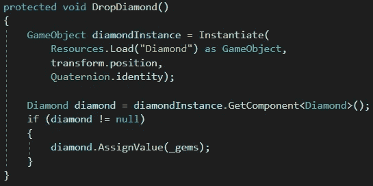
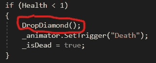

# 在 Unity 中使用资源文件夹

> 原文：<https://medium.com/nerd-for-tech/using-the-resources-folder-in-unity-44d7465ab746?source=collection_archive---------19----------------------->

**目标:**创建一个可以被任何脚本使用的资源预置。

我们希望我们的敌人在被击败时丢下一颗可收集的钻石。我们的敌人继承了我们的*敌人*剧本，但是实际上从来没有*敌人*的实例。因此，如果我们想分配钻石预置，我们必须分配给每种类型的敌人。工作量太大了。

相反，我们将把钻石预置放在名为 *Resources* 的文件夹中。你可以拥有任意多的文件夹名称 *Resources* ，分散在你的项目资产结构中，Unity 会把它们作为一个单独的池。

在我们的*敌人*脚本中，我们将创建放下钻石的方法。首先，它使用*资源实例化钻石预置。加载*。然后它发现实例化对象上的*钻石*脚本使用它的 *AssignValue* 方法来传入这个敌人的钻石应该值多少分(更强硬的敌人可能会给更多的奖励)。

当我们的敌人死亡时，它会调用 *DropDiamond* 方法。就是这样！

