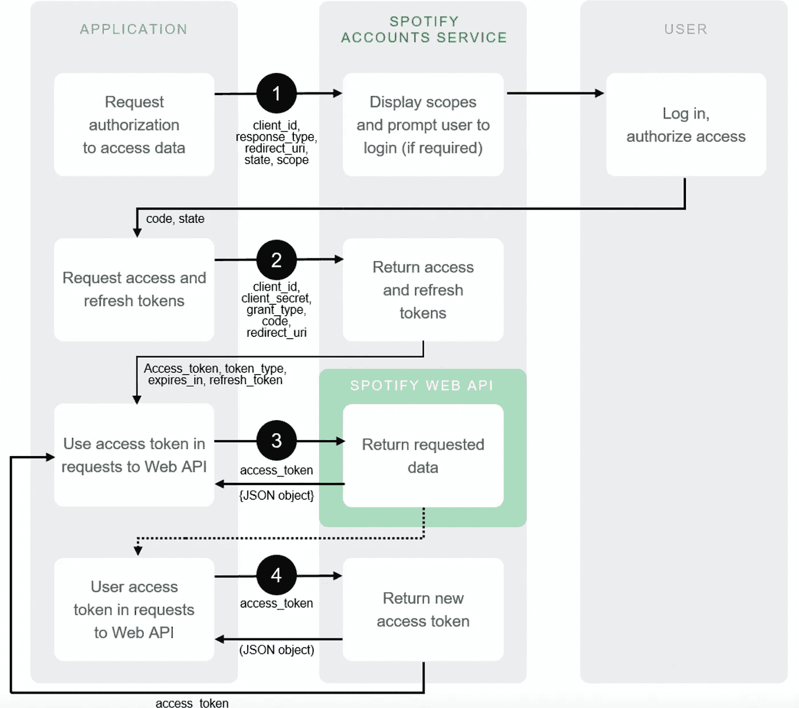
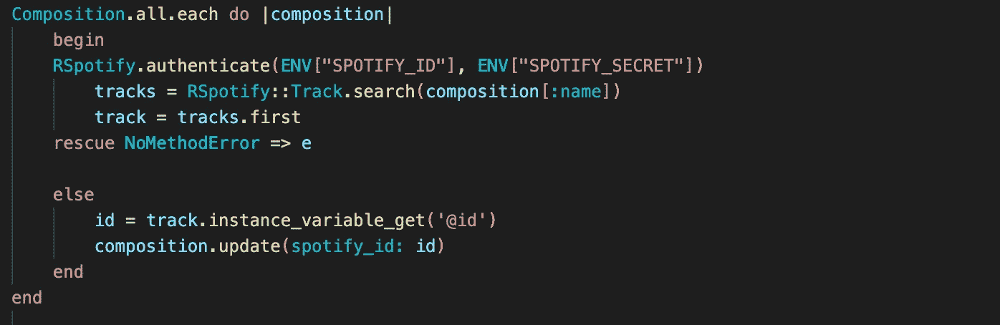
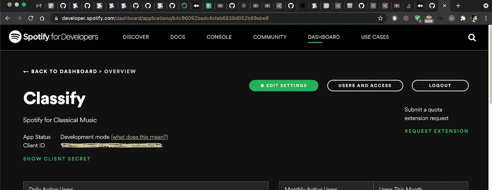
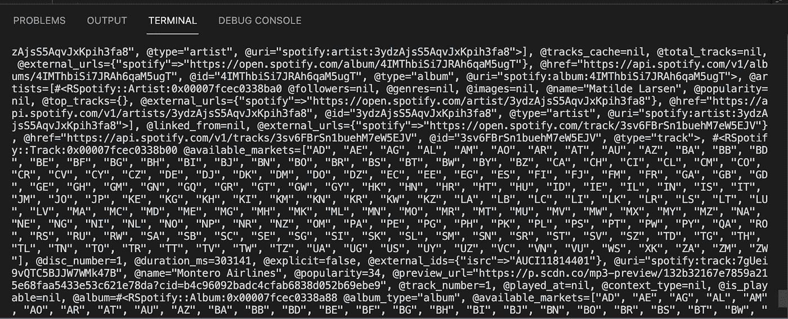
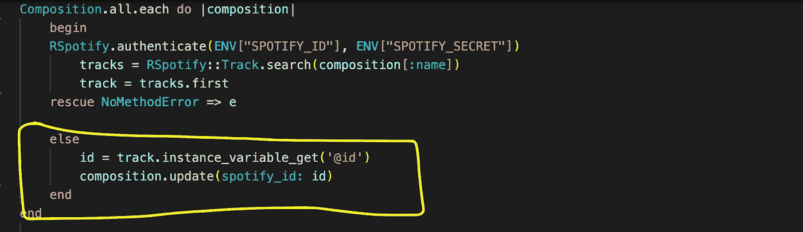
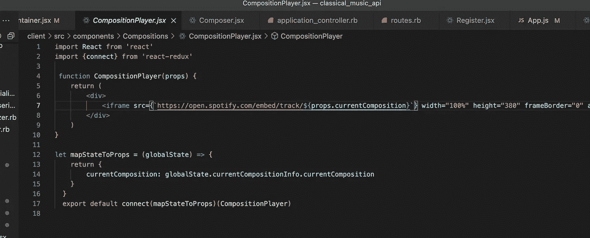

# 使用 Spotify API

> 原文：<https://medium.com/nerd-for-tech/using-the-spotify-api-ad11410c0a6?source=collection_archive---------6----------------------->

Spotify API 是一个强大的资源，允许用户访问 Spotify 服务器上的数据宝库。你可以提取单首歌曲，你可以深入到播放列表，甚至用户的数据！然而，与其他 API 相比，进入 Spotify 的门槛很高，Spotify 的文档对于一个新兴的开发者来说可能更令人望而生畏。

看看 Spotify 开发者网站上费力的授权流程就足以让我相信，他们不希望太多人访问他们的 API:



幸运的是，如果你不需要访问与 Spotify 用户或播放列表相关的数据，你可以避开 Spotify 的 oAuth 流程。对于我的项目——Spotify 的古典音乐克隆——我只需要搜索 Spotify 的歌曲数据库，就可以将它们嵌入浏览器。幸运的是，有一种更简单的方法。

进入 RSpotify gem——一个 Ruby 工具，让你从 Ruby 后端搜索 Spotify 数据库。完整的文档可以在这里找到:[https://github.com/guilhermesad/rspotify](https://github.com/guilhermesad/rspotify)

只需添加:

```
gem 'rspotify'
```

那就去你的宝石档案吧

```
bundle
```

一旦你安装了 gem，你就可以从 Spotify API 下载数据，并使用这些数据作为你的数据库的种子。下面是我如何使用 RSpotify gem 进行搜索和播种的:



种子中. rb

让我们把这个街区打破。构图召唤我的同名模特。对于数据库中的每个合成实例，Ruby 将向 RSpotify 发送一个带有两个认证密钥的请求，您可以通过开发人员工具从 Spotify 获得这两个认证密钥:



登录时，您将获得一个客户端 ID 和一个客户端密码

我已经在我的。env 文件，我建议您也这样做。这与使用 API 密钥和其他不希望发布到 github 的敏感信息的方法相同，恶意行为者可能会利用这些信息。

RSpotify gem 允许您按艺术家、专辑或曲目进行搜索。RSpotify 搜索的结果将作为活动记录实例返回:



这意味着访问宝贵的 Spotify ID(如果你想在网站上嵌入歌曲，这是你需要的)需要。实例变量获取方法:



别忘了@！

一旦你从 Spotify 获得 ID 并保存到后端，你可以从前端获取它并动态地将其插入到 Spotify 嵌入式播放器中，如下所示:



这样，你就可以在自己的应用程序上播放 Spotify 上的歌曲。令人惊讶的是，像 Spotify 这样的应用程序对他们的数据是如此慷慨，开发者会很好地利用它们！