# 使用 Unity 动画系统

> 原文：<https://medium.com/nerd-for-tech/using-the-unity-animation-system-bfaf160e50d6?source=collection_archive---------29----------------------->

现在我们有了我们的运动和摄像机的跟随，让我们将胶囊占位符切换到我们实际的精灵，并为他的运动获得动画。首先，我们将拖动我们的 sprite 作为我们的 player capsule 的子对象，并关闭 capsule 的网格渲染器。从那里，我们想要增加碰撞器和导航网格区域来包含我们的新玩家精灵:

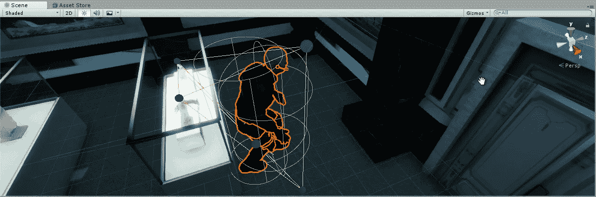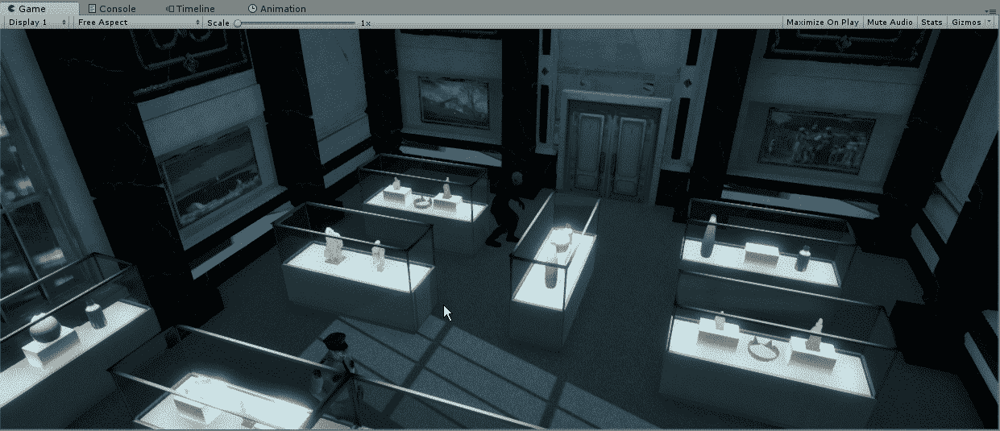

现在我们有他在游戏中，下一步是让他的动画工作，使它不只是一个棋子在地板上滑动。首先，我们需要在特定对象的动画文件夹中创建一个 animator 控制器:

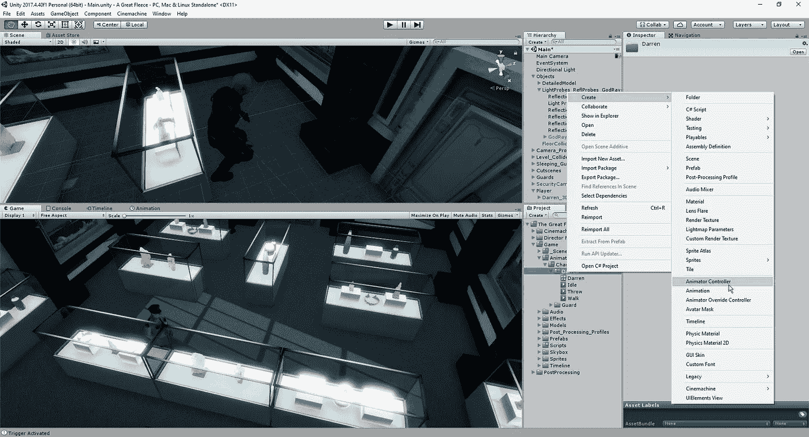

从这里，我们将打开我们的 animator 控制器，并被带到一个 animator 窗口，在该窗口中，我们将把我们的各种动画连接到特定的命令:

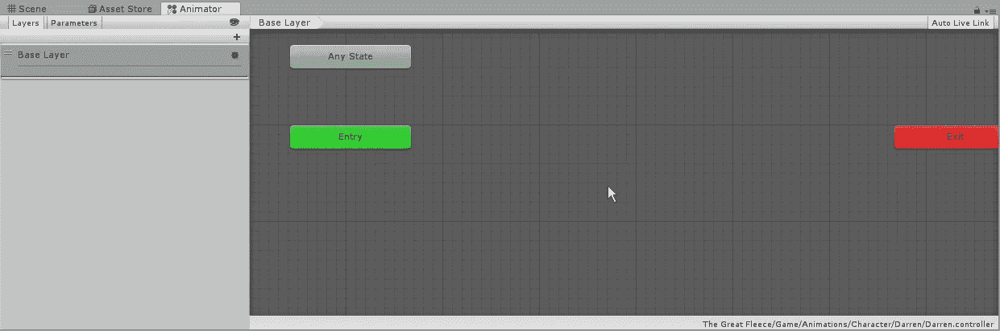

为了让我们的对象使用这些动画，我们需要为它们附加一个 animator 组件，并将控制器拖到指定的位置:

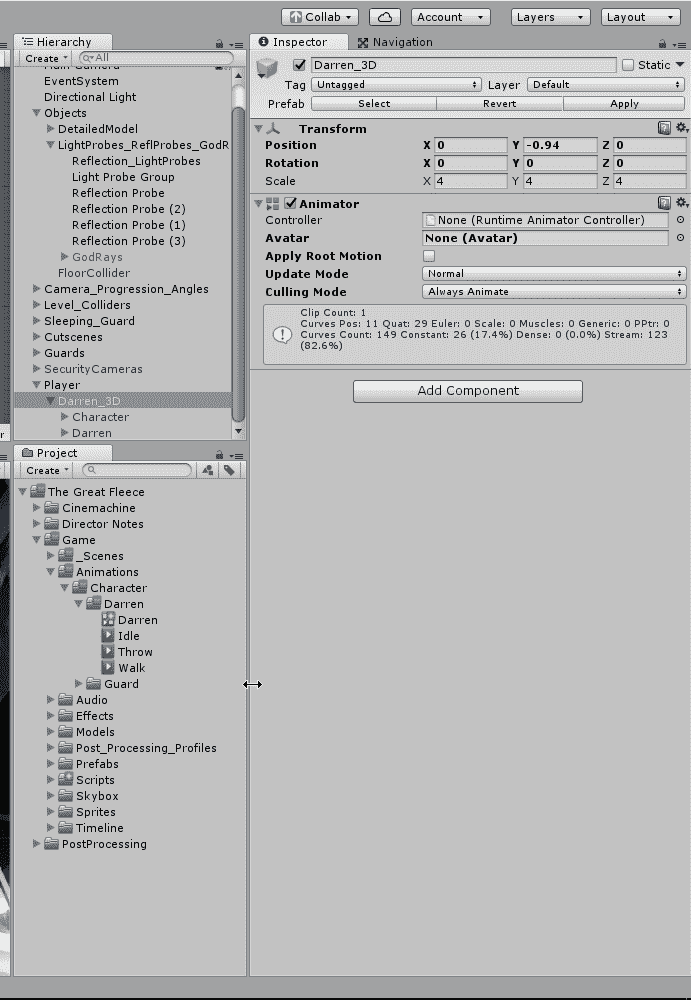

最后，在为各种动画设置环境之前，我们可以将将要使用的不同动画拖到窗口中，并连接到我们可玩角色的初始状态:

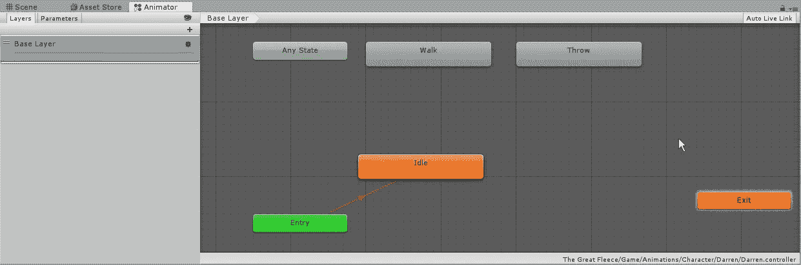

从这里，我们将创建一个到行走状态的转换，以及从行走回到空闲状态的转换:

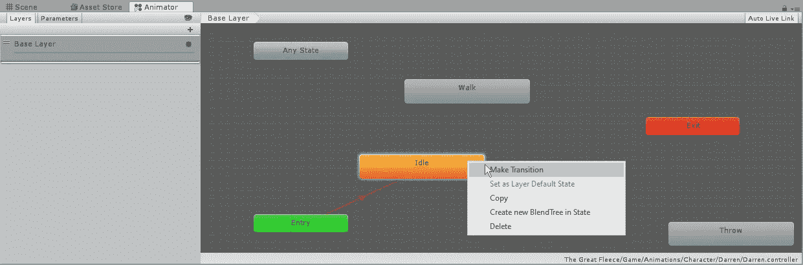

因为我们不希望我们的动画在到达终点时继续播放，所以我们需要确保关闭退出时间，这样一旦我们的玩家停止，他就不会在动画的剩余时间里原地踏步:

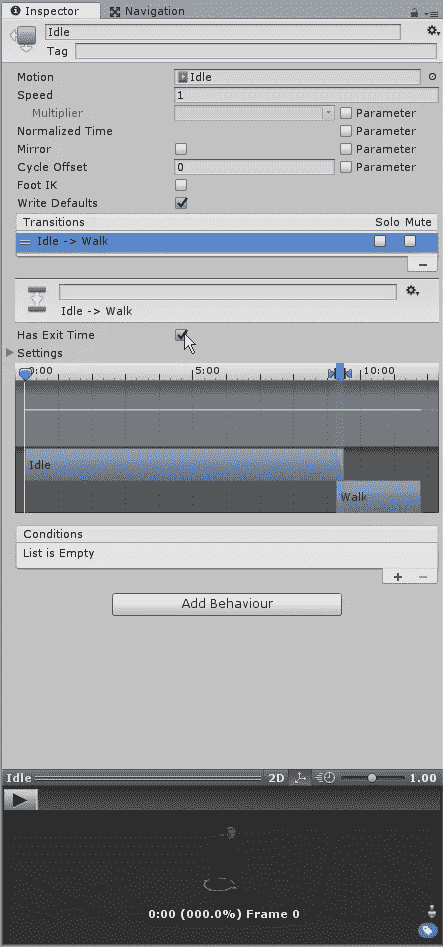

最后，我们需要为我们的玩家创建一个 bool，我们可以操纵它，让 unity 知道我们希望玩家何时过渡到另一个动画:

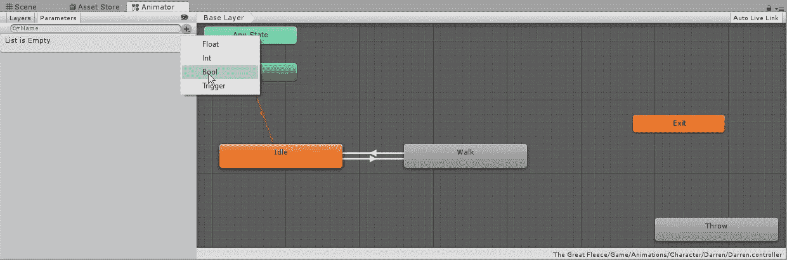

在我们创建转换方法之前，让我们看看单击语句 on 和 off 是否会在两种状态之间转换:

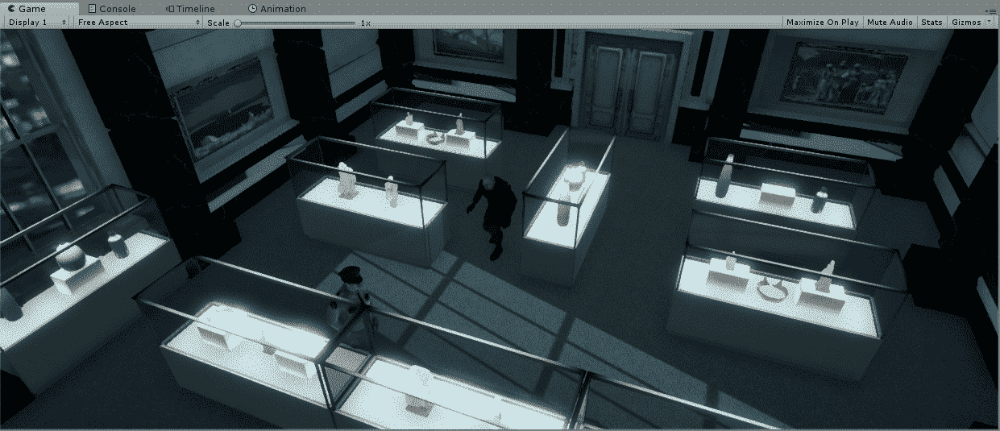

为了创建这个逻辑，我们需要进入我们的播放器脚本并为它创建新的代码:

首先，我们需要为我们的动画师创建逻辑，以便我们可以与我们为它设置的参数进行交互。因为我们的 sprite 是我们正在使用的 player 对象的子对象，所以我们必须确保将它作为子对象来拉。
接下来，我们需要为我们的行走创建一个 bool 来在真与假之间切换。从这里开始，我们还需要一个新的 Vector3，这样我们就可以在已经存在的 if 语句之外调用 hitInfo.point。
最后，我们将设置我们的逻辑来计算玩家和终点之间的距离，并告诉 Unity 当它是一个小于 1 的值时，我们要关闭行走动画:

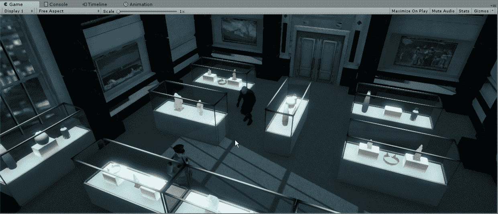

如果我们觉得我们的球员在地板上滑动得太多了，我们可以在 Unity inspector 的 Nav Mesh 代理中调整一些设置:

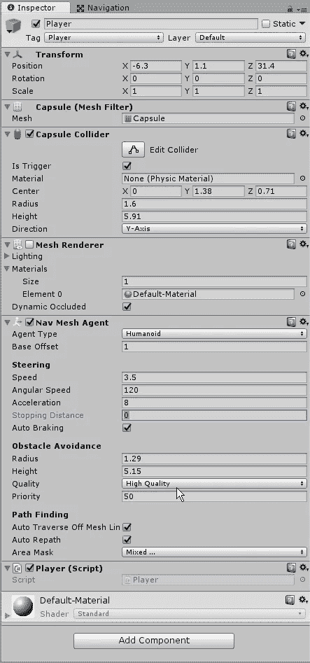

现在我们已经设置好了玩家的动画，我们可以开始着手游戏的下一部分了。