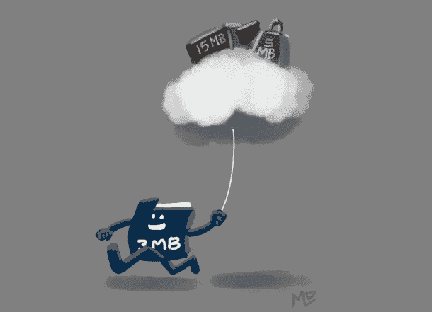
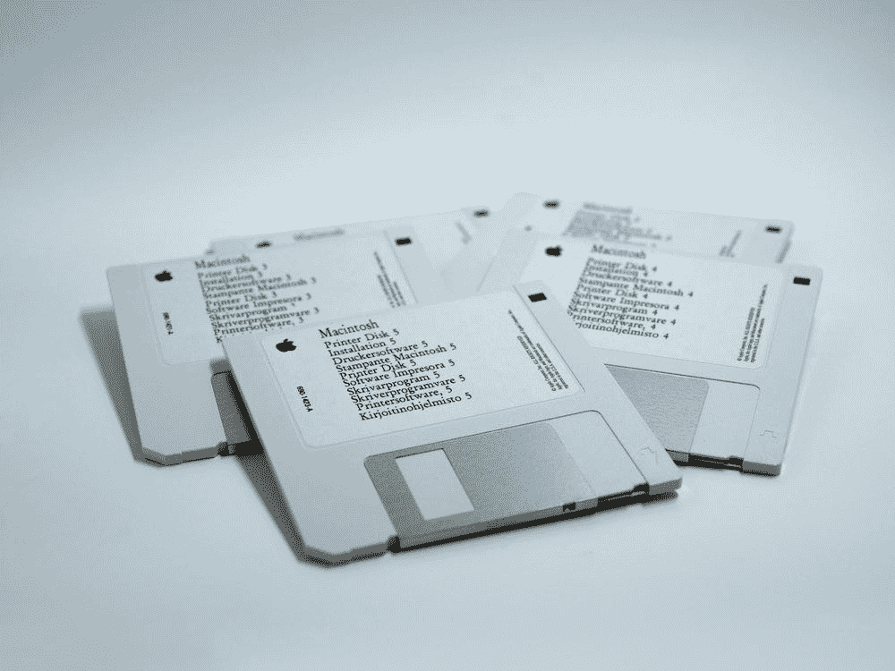
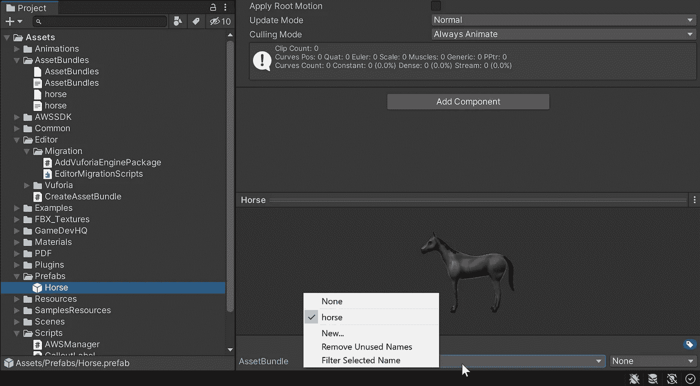
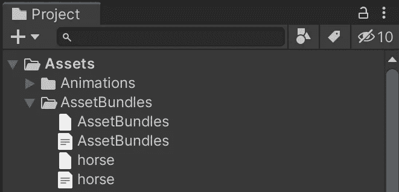
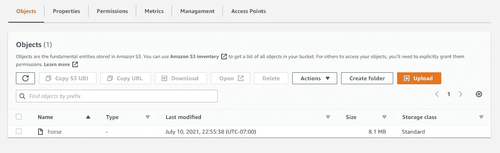
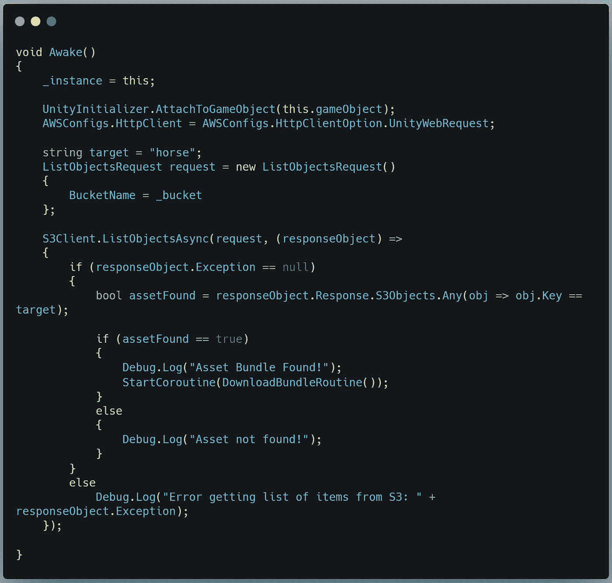
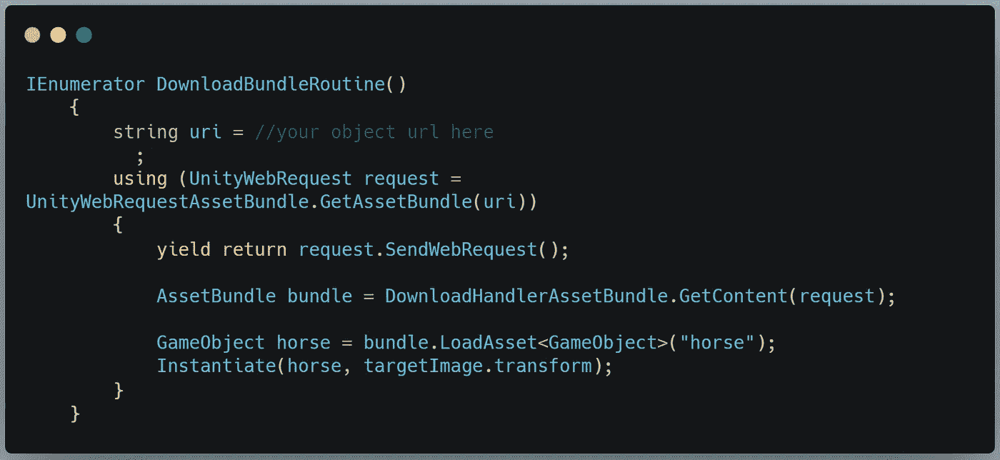

# 使用 Unity 资产捆绑包和 AWS

> 原文：<https://medium.com/nerd-for-tech/using-unity-asset-bundles-and-aws-82b79c4ae883?source=collection_archive---------3----------------------->

## 通过在云上浮动大型资产来减轻您的应用程序

2021 年迈克尔·戴维斯

比方说，你有一个应用程序，它的大部分被捆绑在资产中，你想在一个有大小限制的介质中部署你的应用程序。

好吧，也许不是我想的那样。但是你明白了。

我们可以通过将您的大型资产收集到资产包中，然后将这些资产包存储在您的 AWS bucket 中以便在运行时检索来解决这个问题。现在你正在将带宽从应用商店转移到用户身上，所以不要期望这是解决你沉重的应用问题的神奇方法。但是把这个工具放在你的工具箱里会很有帮助。

让我们看一眼。

**创建资产包**

首先，你需要[从 Unity 网站获取创建资产包的编辑器代码](https://docs.unity3d.com/Manual/AssetBundles-Workflow.html)。在**资产>编辑器**中创建一个名为 CreateAssetBundle 的新 C#脚本(如果您还没有编辑器文件夹，请创建它——脚本必须在这个文件夹中，否则它将无法工作)。

你不能复制和粘贴这个，但这是你在 Unity 网站上寻找的。

现在，您的资产菜单将有一个选项**构建资产包**。

在此之前，我们必须将资产添加到捆绑包中。我有一个大的 3D 模型，我想离开我的项目，所以我将在我的项目视图中选择它的预设，并在检查器中查看。在最底部有一个下拉菜单，用于将资产分配到资产捆绑包。

我们还需要在项目中创建一个名为 **Assets > AssetBundles** 的文件夹来保存结果。

现在，当我们选择**构建资产捆绑包**时，它会将所有标记的对象处理到 Asset Bundles 文件夹中的一个文件中。

接下来，我们需要获取输出文件(不是文本或清单，只是包的文件——在我的例子中是“horse ”)并将它拖到我们的 AWS S3 桶中。

一旦您将该文件放入存储桶，您就可以在 AWS S3 控制台中打开该文件并找到它的直接下载链接。复制那个链接，因为我们将需要它在运行时访问文件。

接下来，我们需要创建一个 AWSManager 类来处理所有的数据下载。我在本文的[中详细介绍了如何创建经理。我们将根据本文](https://michael-l-davis.medium.com/getting-started-with-aws-in-unity-2978a8fead60)中的下载部分修改基本设置。

不同之处在于，我们不是在找到文件时创建数据流，而是启动一个协程来创建一个 Unity Web 请求，该请求将直接下载和实例化模型。

这就是你所需要的。现在，资产将从存储桶自动加载到您的应用程序中。

感谢阅读。明天我将开始另一个新项目。跟随 Unity 获得更多乐趣。