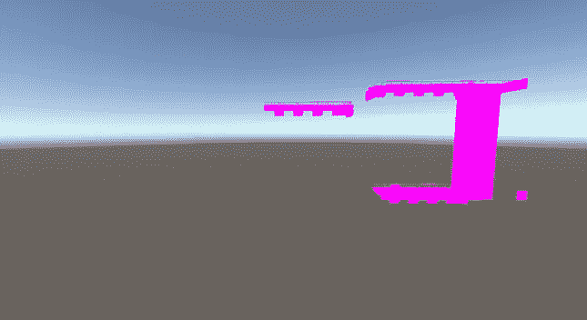
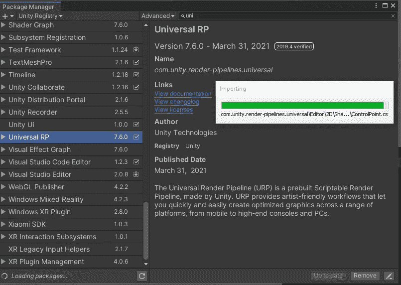
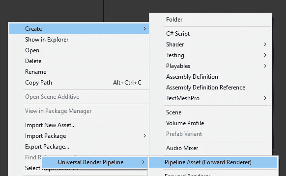
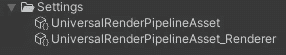
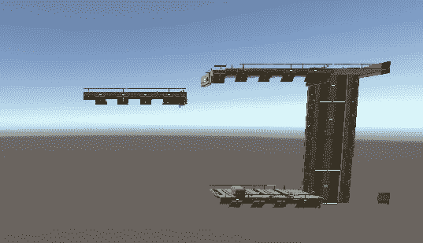
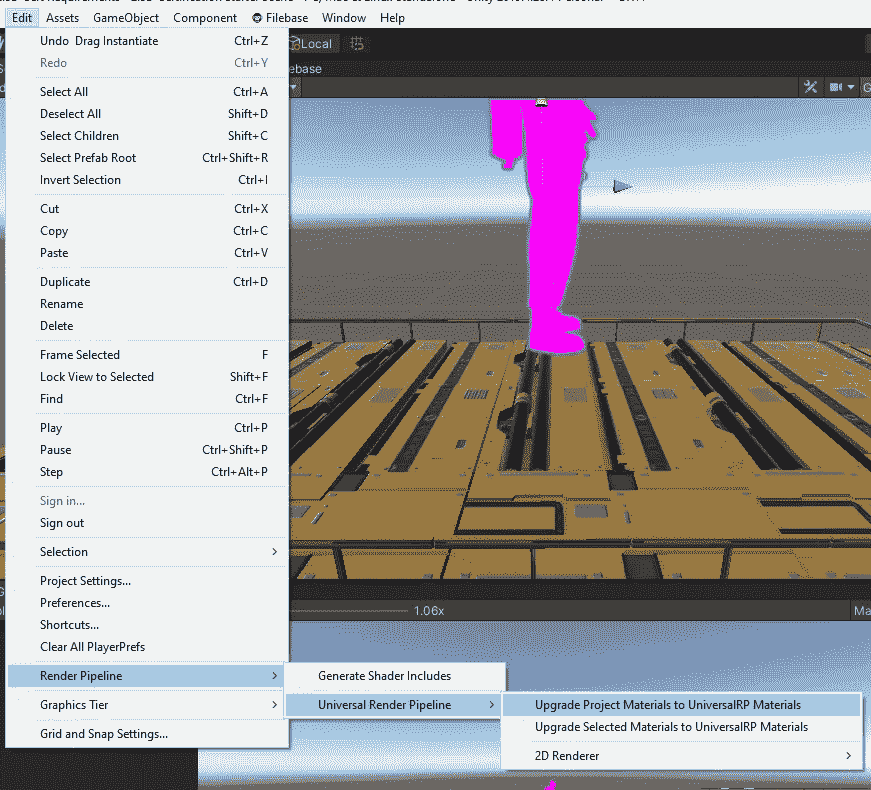

# 使用 Unity 的通用渲染管道

> 原文：<https://medium.com/nerd-for-tech/using-unitys-universal-render-pipeline-c3a869d9e3ac?source=collection_archive---------24----------------------->

**目标:**升级我们的项目以利用*通用渲染管道*。

在 URP 之前…

我们在新的 Unity 项目中引入了一些看起来很酷的资产。但是当我们在我们的场景中弹出它们的时候，它们是…嗯，粉红色的。不是我们想要的那种坚韧不拔的精神。这些资产旨在与*通用渲染管道*一起使用。下面是如何安装 *URP:*

在菜单栏上，进入*窗口* → *包管理器*。在*包管理器*中，搜索*通用 RP* 并*安装*它。

我们将通过右键单击项目资产并转到*创建→渲染→通用渲染管道→管道资产(正向渲染器)*来创建一个新资产。默认情况下，这实际上会创建两个名为*UniversalRenderPipelineAsset*和*UniversalRenderPipelineAsset _ Render*的资产。

现在，我们将返回菜单栏*编辑→项目设置→图形*并选择我们的新资产。

Unity 会自动更新你的物体上的材质来使用渲染管道！

…在 URP 之后！

如果材质没有自动更新，或者如果后来引入了新的资源，请转到*编辑→渲染管道→通用渲染管道→将项目材质更新为通用材质*以强制更新。

