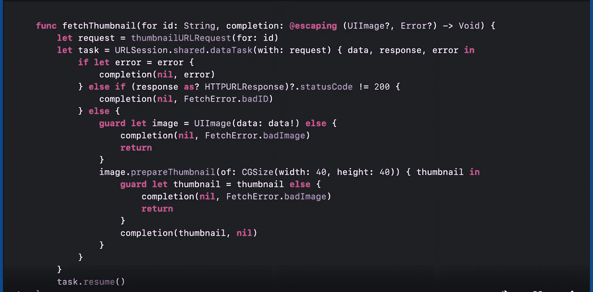

# 通过 Swift 5.5 异步/等待和可编码使用 URL 会话

> 原文：<https://medium.com/nerd-for-tech/using-url-sessions-with-swift-5-5-aysnc-await-codable-8935fe55fbfc?source=collection_archive---------0----------------------->

创建支持异步/等待的具有 URL 会话的 API 管理器。


[Zan](https://unsplash.com/@zanilic?utm_source=unsplash&utm_medium=referral&utm_content=creditCopyText) 在 [Unsplash](https://unsplash.com/s/photos/macbook-xcode?utm_source=unsplash&utm_medium=referral&utm_content=creditCopyText) 上的照片

众所周知，在 WWDC-21 中，苹果在 Swift 中引入了异步(async)功能，允许我们运行复杂的异步代码，就像同步代码一样。也就是说，我们现在不必为我们的结果编写复杂的回调完成处理程序或管理委托，因为 async/await 会处理它。
到目前为止，它只针对 iOS 15 及以上版本推出，但我确信苹果肯定也在考虑对较低版本的 iOS 提供支持。



这是来自 https://developer.apple.com/videos/play/wwdc2021/10132/ WWDC 会议[的代码的可视化表示，其中他们使用 fetch thumbnail 作为例子来区分完成处理程序和 aysnc/await 之间的语法和复杂性差异。](https://developer.apple.com/videos/play/wwdc2021/10132/)


使用 async/await 清除代码。

现在让我们进入主题。

我们已经知道有大量的网络库可用，如 Alamofire、AFNetworking 和 Moya，但在这里，我们创建了非常简单的方法，没有任何依赖性来支持我们的 URL 会话网络调用。

让我们首先创建我们在创建 API 管理器时需要的所有必需品。

创建一个枚举来声明我们将发起的请求的类型。

```
enum RequestType: String {case postRequest = "POST"case getRequest = "GET"}
```

创建一个包含所有端点的字符串类型的枚举。

```
enum Endpoint: String {case getProducts = "get/products"}
```

为我们的 Api 管理器创建一个具有有用属性的类。

```
class ApiManager {var baseURL = "https://api.spoonacular.com/"static var shared = ApiManager()private var request: URLRequest?private init () {} }
```

现在让我们创建所有的助手方法，它们将支持我们的 get/post 调用，并且可以根据每个人的需要进行定制。

对于 GET API 调用，我们需要将参数作为 URL 组件发送。我们可以编写一个方法，将所有参数附加到 URL 中，然后我们可以创建一个 URL 请求，并将其发送到我们的 URLSession。

```
private func createGetRequestWithURLComponents(url:URL,parameters: [String:Any],requestType: RequestType) -> URLRequest? {var components = URLComponents(string: url.absoluteString)!components.queryItems = parameters.map { (key, value) inURLQueryItem(name: key, value: "\(value)")}components.percentEncodedQuery = components.percentEncodedQuery?.replacingOccurrences(of: "+", with: "%2B")request = URLRequest(url: components.url ?? url)request?.httpMethod = requestType.rawValuereturn request}
```

对于我们的 POST 请求，我们需要创建一个 URL 请求和一个 httpBody，我们需要将它们发送到我们的 API。

```
private func createPostRequestWithBody(url:URL, parameters: [String:Any], requestType: RequestType) -> URLRequest? {request = URLRequest(url: url)request?.httpMethod = requestType.rawValuerequest?.addValue("application/json", forHTTPHeaderField: "Content-Type")request?.addValue("application/json", forHTTPHeaderField: "Accept")if let requestBody = getParameterBody(with: parameters) {request?.httpBody = requestBody}request?.httpMethod = requestType.rawValuereturn request}
```

这个方法将我们的参数字典转换成我们需要分配给 httpBody 的数据。

```
private func getParameterBody(with parameters: [String:Any]) -> Data? {guard let httpBody = try? JSONSerialization.data(withJSONObject: parameters, options: .prettyPrinted) else {return nil}return httpBody}
```

创建一个方法来区分我们的 get/post 请求并相应地操作。

```
private func createRequest(with url: URL, requestType: RequestType, parameters: [String: Any]) -> URLRequest? {if requestType == .getRequest {return createGetRequestWithURLComponents(url: url,parameters: parameters,requestType: requestType)}else {return createPostRequestWithBody(url: url,parameters: parameters,requestType: requestType)}}
```

*现在终于到了有趣的部分！！！:D***确保你在模型中使用了可编码协议。**

我们将有一个单独的方法，每当我们发出一个 API 请求时，这个方法都会被调用，这个方法会处理所有的事情。我们使用泛型来直接转换我们的可编码模型，所以我们不必单独创建方法来转换每个特定的模型。

```
func sendRequest<T:Codable>(model: T.Type,with endpoint: Endpoint,requestType: RequestType,parameters: [String:Any]) async -> Result<T, Error>? {if #available(iOS 15.0, *) {do {let url = URL(string: baseURL+endpoint.rawValue)!guard let urlRequest = createRequest(with: url,requestType: requestType,parameters: parameters) else {return nil}let (data, _) = try await URLSession.shared.data(for: urlRequest)let parsedData = try JSONDecoder().decode(model.self, from: data)return .success(parsedData)}catch {return .failure(error)}}return nil}
```

**需要注意的三件事:**

1.  我们用 async 标记了我们的方法，因为我们在方法中使用 await。一个 aysnc 函数可以被挂起，并且可以以一种非常独特的方式移交线程的控制权。
2.  我们使用了 await 关键字，告诉编译器暂停对函数的控制，并将控制交给系统，而不是将控制交还给我们的函数，由系统决定哪个任务更重要。酷吧？！！
3.  为了使用异步函数，我们总是需要将我们调用的函数也标记为异步。

现在将我们的所有代码添加到 ApiManager 类中以使用它。；)

让我们用可编码协议创建一个演示模型

```
struct MyModel: Codable {var id: String?var description: String?}
```

现在在你的任何一个方法中都这样调用它！

```
class YourClass {func sendApiCall() async {guard let result = await ApiManager.shared.sendRequest(model: MyModel.self, with: .getProducts, requestType: .postRequest, parameters: ["":""]) else {return}switch result {case .success(let mymodel):print(mymodel)case .failure(let error):print(error.localizedDescription)}}}
```

这就是现在，请让我知道如果你们有任何问题。

谢谢大家！
快乐编码。

[设拉子汗](/@shirazkhan030)