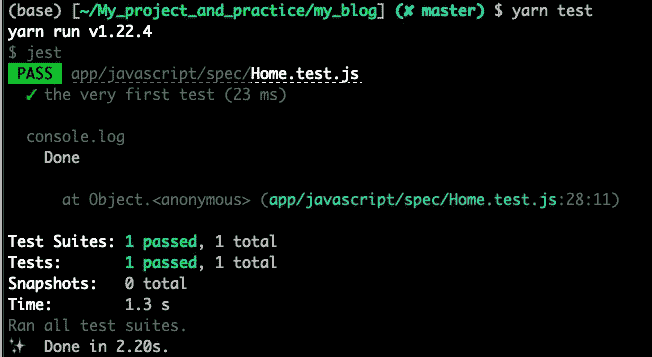
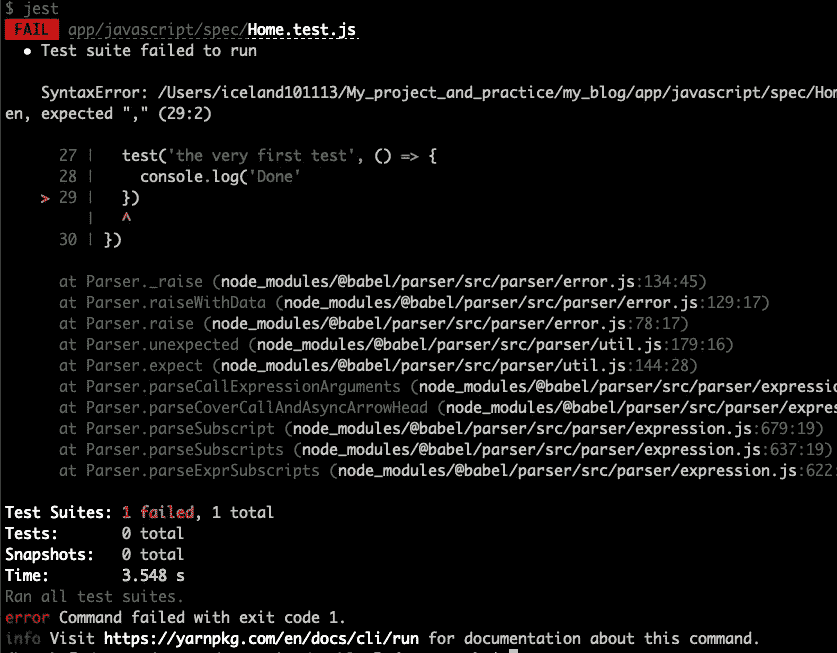
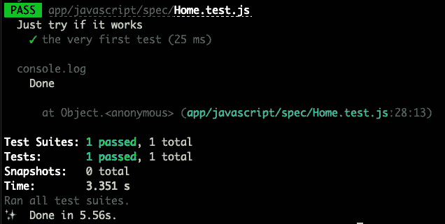
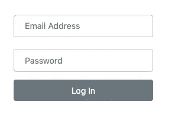
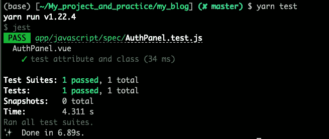
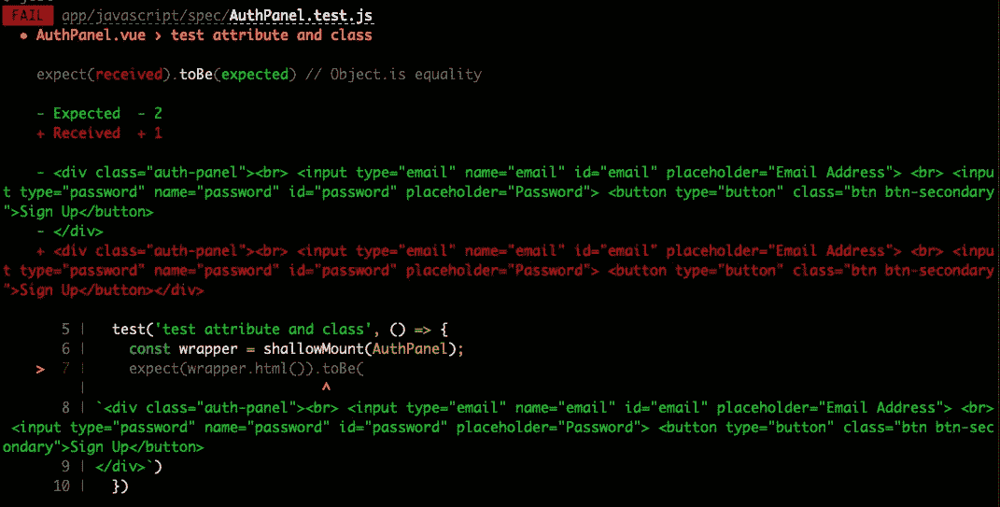

# 使用 Vue Test Utils 和 Jest 测试 Rails 中 Webpacker 下的 Vue.js

> 原文：<https://medium.com/nerd-for-tech/using-vue-test-utils-with-jest-to-test-vue-js-under-webpacker-in-rails-93eda970834f?source=collection_archive---------6----------------------->


当谈到 Ruby on Rails 项目的测试时， [RSpec](https://rspec.info/) 一定是人们最常使用的工具。通过使用 RSpec，我们可以很容易地为我们的 Rails 项目编写一个好的测试脚本，并彻底测试我们的项目。但是在 Rails 6 在项目中默认集成了 [Webpacker](https://webpack.js.org/) 之后，我们将有更多的机会在 Rails 项目中实现 Javascript 框架，并且 RSpec 可能不再足以让我们彻底测试我们的 Rails 项目，包括测试那些 Javascript 函数，那么这是我们在 Rails 项目中测试 Webpacker 下的那些 Javascript 函数和脚本的好方法吗？答案之一是使用 [Vue 测试工具](https://vue-test-utils.vuejs.org/)和 [Jest](https://jestjs.io/) 。在下一节中，我将展示如何在 Rails 项目中使用 Vue Test Utils 和 Jest 在 Webpacker 下设置和测试 Vue.js。

## 软件包安装

在开始测试之前，我们的项目中需要安装一些包。

安装 [Vue 测试工具](https://vue-test-utils.vuejs.org/)和`[vue-jest](https://github.com/vuejs/vue-jest)`加工 [vue 单列组件](https://vuejs.org/v2/guide/single-file-components.html)。

```
yarn add @vue/test-utils
yarn add vue-jest --dev
```

安装 babel-core，因为我们将在测试中使用`babel`并导入 vue 单个文件组件`.vue`扩展。

```
yarn add babel-core@bridge --dev
```

## 设置配置

安装完所有的包之后，在开始测试之前，需要在`package.json`中添加一些设置。

将`scripts`添加到`package.json`，您可以通过`yarn test`运行您的测试

```
"scripts": {
   "test": "jest"
}
```

您可以定义测试的位置。要做到这一点，您可以将`roots`添加到`package.json`中，您还需要告诉 Jest 使用`vue-jest`转换`.vue`文件，使用`babel-jest`转换`.js`文件，为此需要如下设置`moduleFileExtensions`和`transform`参数。测试环境也需要澄清，所以`testEnvironment`参数需要在`package.json`中设置[示例配置设置](https://github.com/iceland101113/my_blog/blob/master/package.json)如下。

```
"jest": {
   "roots": [
       "app/javascript/spec"
    ],
   "moduleFileExtensions": [
       "js",
       "json",
       // tell Jest to handle `*.vue` files 
       "vue"
    ],
   "transform": {
       // process `*.js` files with `babel-jest` 
       "^.+\\.js$": "babel-jest",
       "^.+\\.vue$": "vue-jest"
    },
   "testEnvironment": "jsdom"
}
```

## 写作测试

首先，在测试根目录(`app/javascript/spec`)下创建一个测试文件，文件名以`.test.js`结尾

比如创建一个`Home.test.js`(脚本如下)。起初，我只是想试试是否所有的设置都已完成，并且`.test.js`可以运行，所以我只在测试脚本中添加了`console.log('Done!')`。然后，运行`yarn test`

```
test('the very first test', () => {
    console.log('Done!')
})
```

运行`yarn test`后，如果测试文件可以运行并且所有测试都通过，控制台中的结果可能如下图所示。它会显示绿色通行证。



但是如果一些测试失败了，你可能会看到一些红色的失败结果，如下图所示。



[Vue 测试工具](https://vue-test-utils.vuejs.org/)的代码风格类似于 RSpec。您也可以使用`describe`函数来添加更多关于您正在测试的内容的描述。例如，我们可以在测试函数之外添加`describe`函数来描述更多关于测试的内容。

```
describe('Just try if it works', () => {
  test('the very first test', () => {
    console.log('Done')
  })
})
```

运行`yarn test`，控制台中的结果将显示我们在`describe`函数中输入的描述。



在检查了测试文件可以运行之后，我们可以在 Rails 项目中测试一些 vue 组件。在测试文件中，首先要导入 [Vue Test Utils](https://vue-test-utils.vuejs.org/) ，我们还需要导入我们要测试的 Vue 组件。示例代码如下。

```
import { mount, shallowMount } from '[@vue/test-utils](http://twitter.com/vue/test-utils)'
import Home from '../src/components/XXX.vue'
```

导入 [Vue 测试工具](https://vue-test-utils.vuejs.org/)时，应导入`mount`或`shallowMount`。它们都可以用来包装 vue 组件，并在测试时呈现它们。这两种方法工作原理相似。唯一的区别是`shallowMount`不渲染子组件，所以它允许我们单独测试组件，以确保测试中不包含子组件。 [Vue Test Utils](https://vue-test-utils.vuejs.org/) 为我们提供了很多测试 Vue 组件的方法，例如，它提供了一个 [find 方法](https://vue-test-utils.vuejs.org/api/wrapper/#find)来查找组件中的一个元素，它还提供了一个 [html 方法](https://vue-test-utils.vuejs.org/api/wrapper/#html)来检查组件 html 是否如预期的那样。

比如在[我的示例项目](https://github.com/iceland101113/my_blog)中有一个`AuthPanel.test.js`来测试 [AuthPanel 组件](https://github.com/iceland101113/my_blog/blob/master/app/javascript/src/components/AuthPanel.vue) `AuthPanel.vue`。更多信息，AuthPanel 组件是我在这个项目的登录页面上使用的一个组件



我们可以在下面的`AuthPanel.test.js`中看到， [Vue 测试工具](https://vue-test-utils.vuejs.org/)和`AuthPanel.vue`是进口的。在这种情况下，我想测试组件是否按预期呈现，所以我使用`shallowMount`包装组件`AuthPanel.vue`并呈现它，然后使用 [html 方法](https://vue-test-utils.vuejs.org/api/wrapper/#html)检查组件是否按预期呈现。

```
import { shallowMount } from '[@vue/test-utils](http://twitter.com/vue/test-utils)'
import AuthPanel from '../src/components/AuthPanel.vue'describe('AuthPanel.vue', () => {
  test('check html', () => {
    const wrapper = shallowMount(AuthPanel);
    expect(wrapper.html()).toBe(
`<div class="auth-panel">
  <br> 
  <input type="email" name="email" id="email"> 
  <br> 
  <input type="password" name="password" id="password"> 
  <button type="button" class="btn btn-secondary">Sign Up</button>
</div>`)
  })
})
```

运行`yarn test`后，如果测试通过，并在控制台显示绿色通过，这意味着组件正如我们预期的那样渲染。



但是如果测试失败，控制台中的结果将显示与我们预期的不同，如下图所示，我们可以按照说明修改我们的代码。



看完上面的例子，我们对如何在 Rails 项目中的 Webpacker 下开始测试 Vue.js 有了一个基本的想法。我只分享使用 [html 方法](https://vue-test-utils.vuejs.org/api/wrapper/#html)来测试 vue 组件，但实际上， [Vue Test Utils](https://vue-test-utils.vuejs.org/) 提供了更多有用的方法供我们在测试中实现，所以我会在以后分享更多相关主题的文章。我在本文示例中提供的源代码可以在下面我的 Github 页面的 repo 中找到。如果你对设置和脚本的细节感兴趣，请点击下面的链接。感谢您的观看！

[](https://github.com/iceland101113/my_blog) [## 冰岛 101113/我的博客

### 这个网站是一个由 VueJS 和 Ruby on Rails 构建的单页应用程序，它是两个博客作者的简单博客…

github.com](https://github.com/iceland101113/my_blog) 

## 参考

[](https://vue-test-utils.vuejs.org/) [## 简介| Vue 测试工具

### 测试 Vue 组件的实用程序

vue-test-utils.vuejs.org](https://vue-test-utils.vuejs.org/) [](https://www.wyeworks.com/blog/2018/01/16/Testing-Vuejs-in-Rails-with-Webpacker-and-Jest/?utm_source=rubyweekly) [## 用 Webpacker 和 Jest 在 Rails 中测试 Vue.js

### 在我正在做的项目中，我的任务是研究如何将 Vue.js 与我们现有的 Rails 集成在一起…

www.wyeworks.com](https://www.wyeworks.com/blog/2018/01/16/Testing-Vuejs-in-Rails-with-Webpacker-and-Jest/?utm_source=rubyweekly)  [## 贡献者

### 快速、可靠、安全的依赖关系管理。

yarnpkg.com](https://yarnpkg.com/package/vue-jest) [](https://ithelp.ithome.com.tw/articles/10247755) [## 玩轉 Storybook: Day 17 Unit Test with JEST - iT 邦幫忙::一起幫忙解決難題，拯救 IT 人的一天

### 用 Storybook 搭配測試方法，從元件開發到完成整個專案，可以增加開發者的信心，不會擔心改 A 錯 B 的狀況發生，因為從邏輯面及 UI 面都能被完整的測試到。…

ithelp.ithome.com.tw](https://ithelp.ithome.com.tw/articles/10247755) [](https://reactgo.com/vue-testing-mount-vs-shallowmount/) [## Vue 测试工具中安装和浅安装的区别

### 在本教程中，我们将了解 vue 测试工具中 mount 和 shallowMount 方法的区别…

reactgo.com](https://reactgo.com/vue-testing-mount-vs-shallowmount/) [](https://vueschool.io/lessons/mounting-components-with-vue-test-utils) [## 使用 Vue 测试工具安装组件——我们的 Vue.js 课程...

### 当我们测试我们的 vue.js 组件时，我们需要一种挂载和呈现组件的方法。在这节课中，我们将看到…

vueschool.io](https://vueschool.io/lessons/mounting-components-with-vue-test-utils) [](https://vuejs.org/v2/guide/single-file-components.html) [## 单个文件组件- Vue.js

### vue . js——渐进式 JavaScript 框架

vuejs.org](https://vuejs.org/v2/guide/single-file-components.html)