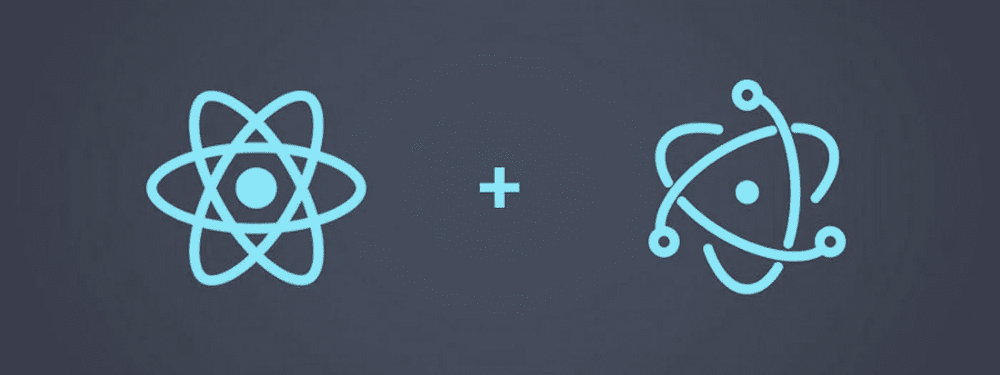
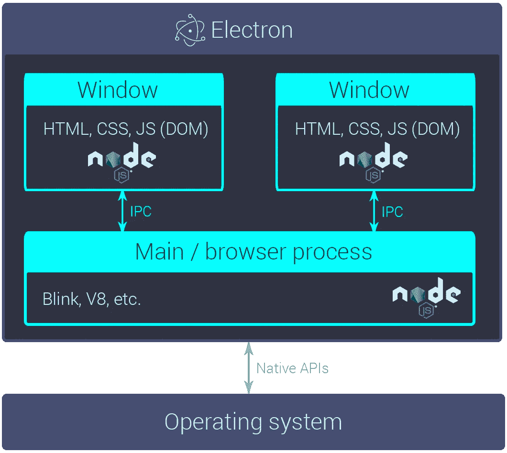
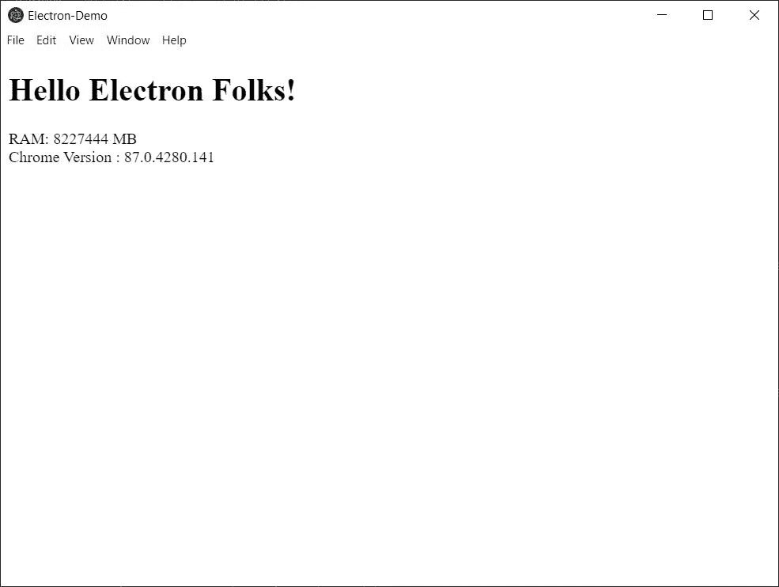
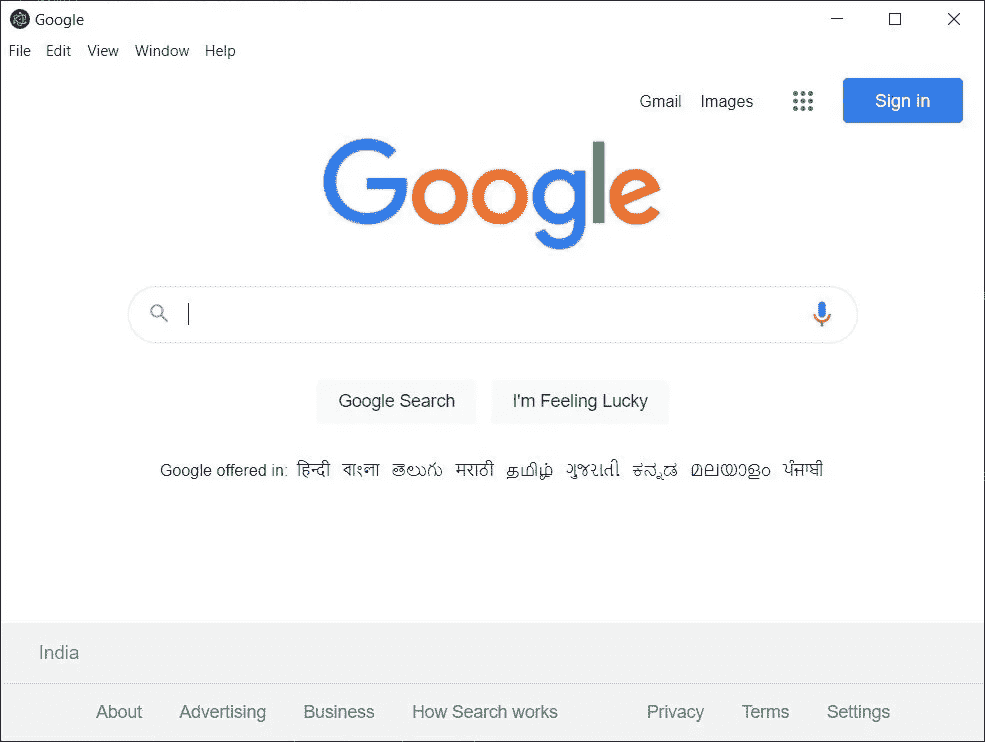
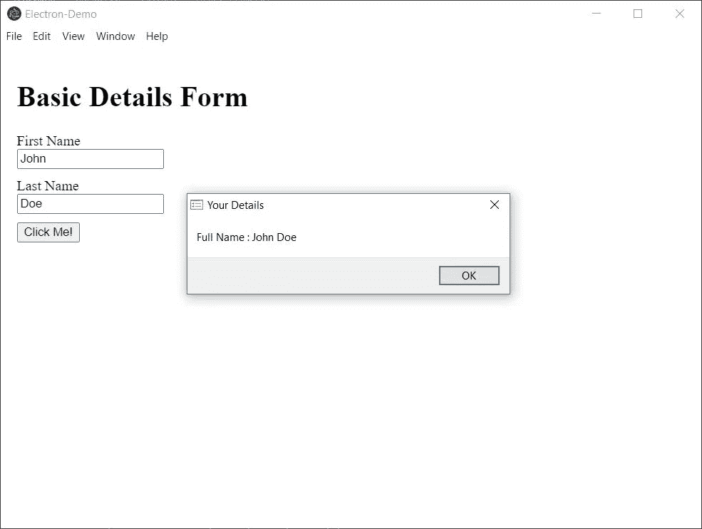

# 使用 Web 技术创建您的第一个跨平台的电子桌面应用程序

> 原文：<https://medium.com/nerd-for-tech/using-web-technologies-to-create-your-first-cross-platform-desktop-application-with-electron-8180ec0c087e?source=collection_archive---------4----------------------->



反应和电子

我必须承认，在我多年的经验中，建立一个在桌面环境下运行的软件对我来说听起来很乏味，因为我一直认为我必须学习一套全新的工具。

但当我遇到 Electron 时，我意识到桌面应用程序开发不再像以前那样令人生畏。

> 什么是电子？亚原子粒子如何帮助我开发软件？

首先，当我说 [Electron](https://www.electronjs.org/) 时，我指的是允许使用 HTML、CSS、JavaScript 等 web 技术开发桌面 GUI 应用程序的开源软件框架。

# 为什么是电子？

## 跨平台

有许多工具可以帮助你开发在不同操作系统上运行的软件，但是只有少数工具能够提供跨平台的兼容性。值得庆幸的是，电子确实如此，这也是它如此受欢迎的主要原因之一，同时允许 Web 开发人员将他们的网站建设经验用于软件开发。

## 复用性

由于我们使用 web 技术，相同的 UI 源代码可以作为一个功能良好的网站部署在您喜欢的任何服务上。所以我们很重视**这个原则*代码一旦产生，就到处使用。***

## 安全性

从微软团队这样的大规模基于网络的软件到 Visual Studio Code 和 Atom 这样的代码编辑器都是在 electronic 中开发的。如果这还不能证明 Electron 提供的安全级别，我不知道还有什么可以证明。

## 表演

如果在开发过程中采取适当的措施(只加载您需要的内容)，与本机应用程序相比，Electron 在性能方面会有很大的提高。

## 成本和时间

我们正在使用我们作为 Web 开发人员的经验来开发桌面应用程序，这节省了我们了解各种桌面应用程序开发工具和从头开始的时间，也帮助我们跳过不同平台的不同原生功能。

# 电子的架构？一个黑匣子？



体系结构

让我们看看电子是如何工作的。

1.  当您启动一个电子应用程序时，主进程请求打开窗口对象(您在前端看到的那个)。
2.  当准备好/以编程方式定义时，加载窗口对象或通常称为渲染器进程。

没有本机功能的桌面应用程序是不完整的，所以下面是它在电子应用程序中的工作方式。

1.  前端的渲染器进程引发一个事件。
2.  渲染器进程向主进程发出事件(在 [NodeJS](https://nodejs.org/en/) 中编码)。
3.  主进程不断地监听各种事件，在这种情况下，让我们假设我们已经对事件进行了编码，以将文件写入本地文件系统。
4.  主进程在接收到事件后，通过访问本地 API 对其进行操作，在我们的示例中，本地 API 将写入计算机文件系统。

# 用电子构建的流行软件

1.  Visual Studio 代码(VS 代码)
2.  松弛的
3.  长牙
4.  邮件春天
5.  网络电话
6.  不和谐(我个人最喜欢的，因为它有很多特性)
7.  WhatsApp 桌面
8.  原子

# 我们怎么做呢？

现在我已经了解了电子是如何工作的，以及为什么你应该花时间去掌握它。

现在，我们必须使用这些基础知识来开发我们可以使用的东西。这意味着我们现在开始编码。

## 先决条件

1.  [节点 JS](https://nodejs.org/en/download/)
2.  代码编辑器//我用 [VS 代码](https://code.visualstudio.com/download)
3.  有一些 NodeJS 和前端开发的经验
4.  快乐而新鲜的头脑

## 入门指南

我假设您已经满足了本教程的所有先决条件，尤其是最后一个以及 NodeJS 和您的代码编辑器安装。

您可以通过在终端中键入以下命令来验证 NodeJS 安装

```
node -v
npm -v
```

如果上面的命令没有打印出 NodeJS 和 NPM 的版本，您需要仔细阅读它们的官方文档，并在继续下一步之前安装它。

所以现在我们需要访问[电子官网](https://www.electronjs.org/docs/tutorial/quick-start)了解一些基本信息比如如何在本地设置电子。但是它是可选的，因为我将一步一步地讲解它。

## 创建项目

您需要在您的计算机中创建一个目录来保存项目的源代码，我将只使用终端来完成此类任务，因此您可以执行以下命令来创建目录并在其中移动

```
mkdir electron-demo
cd electron-demo
```

## 电子在哪里？

在安装 Electron 之前，您需要用下面的命令初始化项目。

```
npm init -y
```

上面的命令将在您的根目录下创建一个基本的`***package.json***`文件。随着本教程的深入，我们将使用该文件来创建脚本并在项目中安装 npm 包。

现在，我们需要通过在终端中键入以下命令来将 Electron 安装到项目中

```
npm i --save-dev electron
```

这个命令将在你的项目根目录下生成一个名为`node_modules`的文件夹和一个`package-lock.json`。你可以通过进入`node_modules`并寻找`electron`目录来验证电子的安装。

标志将电子安装为一个 dev 依赖项。我们为什么这么做？因为当我们打包一个应用程序时，它的运行不再需要电子。

# 编写应用程序代码

## 配置 main.js

`main.js`是我们电子申请的入口文件。但是`main.js`只是一个名字，也是惯例，因为它将运行控制应用程序生命周期和访问本地 API 的主进程。
你可以随意命名，唯一的事情是在`package.json`中指定`main`文件，但是记住，只能有一个主文件。
所以，让我们在你的项目根目录下创建一个`main.js`，并把下面的代码放入其中。

基本电子代码

现在，让我们看看代码中有什么。

*   **线 1:** 我们正在从电子封装导入`app`和`BrowserWindow`。`app`是控制应用程序事件生命周期的模块，而`BrowserWindow`创建并管理我们在 UI 中看到的窗口。您可以单独访问`[app](https://www.electronjs.org/docs/api/app)`和`[BrowserWindow](https://www.electronjs.org/docs/api/browser-window)`文档来探索它们和它们的事件。
*   **第 5 行:**我们正在用给定的选项创建一个浏览窗口。留下那些不言自明的，让我们过一遍`nodeIntegration`和`enableRemoteModule`。
    1。 **nodeIntegration** :允许 BrowserWindow 访问 NodeJS API。
    2。 **enableRemoteModule** :使浏览器窗口能够访问
    远程模块**和**模块**主**进程和**渲染器**进程**之间的通信。**
*   **第 16 行:**我们正在窗口内加载`index.html`文件。接下来我们将创建该文件。
*   **第 18 行:**我们告诉窗口在它自己关闭的时候退出`app`。
*   **第 23 行:**我们告诉`app`当它完成加载时创建窗口。
*   **第 25 行:**我们正在添加一个新的监听器，当应用程序不再有任何打开的窗口时，它会尝试退出应用程序。这在 macOS 中是不需要的，所以`if`语句。
*   **第 31 行:**我们正在添加一个新的监听器，只有当应用程序被激活后没有可见窗口时，它才会创建一个新的浏览器窗口。例如，在第一次启动应用程序之后，或者重新启动已经运行的应用程序。

## 创造 index.html

现在我们需要创建我们将在浏览器窗口中看到的文件。在我们的例子中，它是我们创建`main.js`时在**行 16** 中定义的`index.html`。

基本电子 HTML

在上面的代码中，让我们关注如何打印内存，以及浏览器窗口运行的 Chrome 版本。
脚本标签正在用流程模块打印信息，该模块只对 BrowserWindow 对象可用，因为我们在上面写`main.js`时启用了`nodeIntegration`。

现在我们已经设置了后端和前端，我们如何看到结果呢？

1.  为此，我们需要在`package.json`中添加一个脚本。所以打开它，在`scripts`里面添加一个新的条目`"start" : "electron ."`
2.  我们还需要指向我们的入口点 NodeJS 文件，在我们的项目中是`main.js` 。所以我们修改`"main": "main.js"`。

所以`package.json`会开始如下图。

现在，我们需要做的就是运行脚本，我们可以通过进入终端，导航到根目录，并键入以下命令来完成。

```
npm start
```

如果一切正常，我们应该会看到下面的屏幕弹出。



带`index.html`的基本电子窗

有用的提示——我们已经将主进程编程为加载名为`index.html`的文件，但是我们也可以通过`window.loadURL('https://google.com')`而不是`main.js`中的`window.loadFile('index.html')`将预先存在的网站直接加载到窗口中。因此，我们不需要编写大量代码来将我们的网站移植到桌面应用程序中。电子帮你搞定了。



将网站直接加载到浏览器窗口

但为了实验起见，我们会保持在`window.loadFile('index.html')`。

# 进程间通信

如果它不与**本地 API 交互，它就不是桌面应用程序。因此我们将执行一个基本操作来展示电子在这方面的能力。
我们可以用 IPC(进程间通信)模块来实现。
主进程和渲染器进程分别使用`ipcMain`和`ipcRenderer`模块。**

我们将遵循的流程如下:

1.  在**浏览器窗口**中发生一个事件，它向主进程发出一个信号和可选数据。
2.  **主进程**响应**事件信号**，可能会将一些数据返回给**渲染器进程** (BrowserWindow)或在后端执行操作，或者两者兼而有之。

注意——这是可能的，因为我们在创建浏览器窗口时启用了`main.js`中的**远程模块**。

## 让我们来看看实际情况。

index.html 国际残奥委会赛事

在上面的代码中，让我们关注一下`<script>..</script>`标签里面的内容。

1.  我们正在从电子包中加载 ipcRenderer 模块，该模块仅对我们可用，因为我们在`main.js`中启用了`remoteModule`。
2.  我们在 HTML 中的一个按钮上添加了一个`click`事件监听器，它将发出一个名为`performActions`的信号供主进程监听。
3.  我们还发送了一个包含两个输入字段`firstName`和`lastName`的对象，作为主流程执行所需操作的参数。

现在，事件在哪里处理？我们在`main.js`中这样做。

了解新代码吗？好吧，让我给你解释一下。

1.  与之前的`main.js`相比，第一个不同是现在我们导入了 2 个额外的包，称为`ipcMain`和`dialog`。
2.  当我们添加一个事件监听器(`performActions`)时，`ipcMain`在**第 36 行**起作用。
3.  在我使用本机功能的例子中，我使用从表单(`firstName` & `lastName`)接收的数据，并创建一个出现在浏览器窗口中的本机对话框。

注意——显示对话框是用户的选择，我想让教程尽可能简单易懂。

一个实际的例子是使用 NodeJS 的`fs`模块将数据存储在本地文件系统的某个地方，并在第一次启动或任何其他事件时将其发送到`BrowserWindow`。



IPC 结果

> 对话框和模态有什么不同？

Modal 是一个定制的 CSS 元素，它在所有平台上都保持不变。但是通过访问**本地 API**创建的对话框会根据操作系统而改变。

有太多的原生模块让我无法一一介绍，所以你可以[点击这里](https://www.electronjs.org/docs)在官方文档中探索它们。

系统中有多种类型的对话框，你可以在这里探索它们[。](https://www.electronjs.org/docs/api/dialog)

关于使用 Web 技术创建第一个跨平台桌面应用程序的教程**到此结束**

你也可以访问这个项目的 [Github 库](https://github.com/tusharguliany/electron-demo)来查看完整的源代码。

# 电子的替代品？

## 摆动

**优点**

1.  开放源码
2.  大量的功能，如调试工具，热重装
3.  基于 Dart 语言

**缺点**

1.  仍在开发中
2.  与 Java 或 Kotlin 相比，社区支持乏善可陈

## B4X

**优点**

1.  伟大的社区
2.  简单快捷
3.  实时代码交换//热重装
4.  非常强大的物联网//跨平台支持蓝牙/BLE、MQTT、TCP/UDP、串行、NFC、Websockets、HTTP/2，是物联网项目的理想工具

**缺点**

1.  依赖于 Java 的桌面环境

## wxWidgets

**赞成者**

1.  成熟的
2.  真正的本地外观和感觉
3.  开放源码

**缺点**

1.  繁重的编译结果

## 质子原生

**优点**

1.  非常快
2.  反应风格
3.  完全跨平台兼容
4.  轻量级选手
5.  React 本地应用可重用代码
6.  本地组件

**缺点**

1.  与电子相比，我发现社区支持非常枯燥。
2.  此时组件的数量非常少。

## 其他工具

1.  JavaFx
2.  NodeGUI
3.  React 桌面
4.  摇摆

# 下一步是什么？

现在我们可以浏览[文档](https://www.electronjs.org/docs/all)来体验完整的工具集。

由于 NodeJS 是用于**主进程的语言服务，**您可以将它与 React、Angular 等前端技术相结合，创建全面的全栈桌面应用程序，通过充分利用 NodeJS 和 NPM 库的潜力，为您提供现代定制应用程序的外观和感觉，以及可靠和功能丰富的本机环境。

您还可以通过访问关于发布的官方文档来学习如何打包您的应用程序，并公开提供给每个人使用。

**如果你喜欢这篇文章，请鼓掌或评论，或者两者兼而有之。更多即将到来。**

**您也可以进入我的** [**Github 个人资料**](https://github.com/tusharguliany) **查看我的作品，或者访问我的**[**LinkedIn**](https://www.linkedin.com/in/tusharguliany/)**如果您对本文或任何其他内容有任何疑问或反馈，请亲自与我联系。**

**快乐编码……**