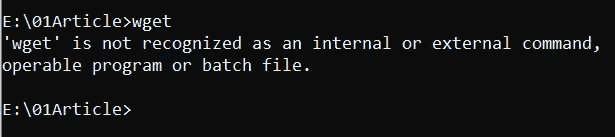
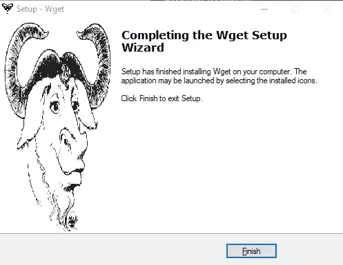
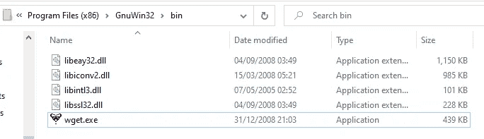
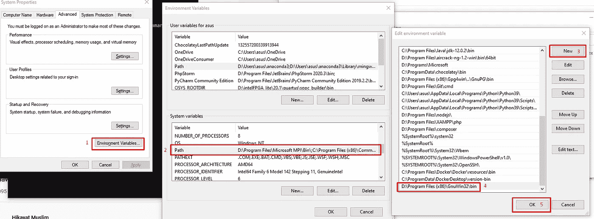
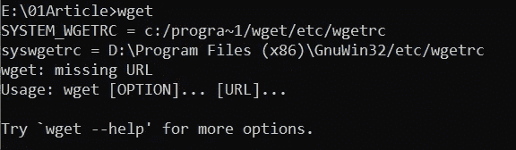
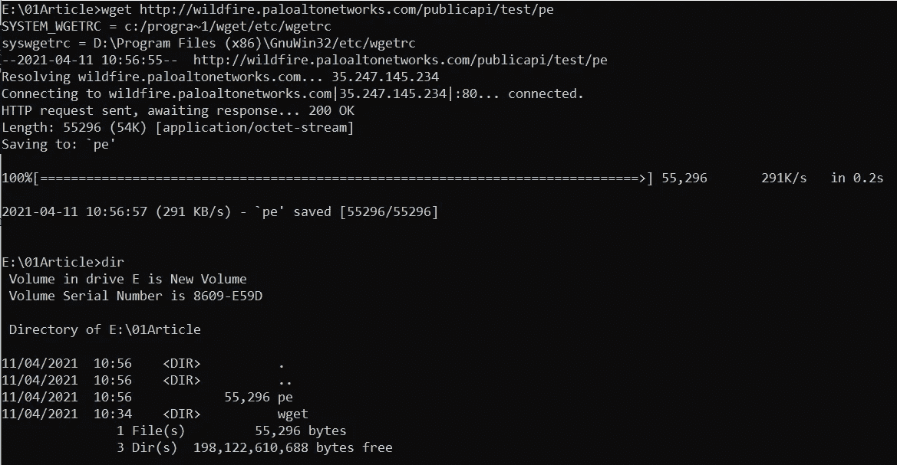

# 在 Windows 10 环境下使用 Wget 命令

> 原文：<https://medium.com/nerd-for-tech/using-wget-command-in-windows-10-environment-d766b8f526e9?source=collection_archive---------3----------------------->

卡莱布·塔普在 [Unsplash](https://unsplash.com/s/photos/goat?utm_source=unsplash&utm_medium=referral&utm_content=creditCopyText) 上的照片

Wget 是 GNU 项目产品之一，用于从 web 服务器中检索内容。它的名字来源于“万维网”和“获取”，它可以用于通过 HTTP，HTTPS 和 FTP 下载。正如您所记得的，如果您是 Linux 用户并进入 Windows 环境，默认情况下不会安装该功能。

Wget 尚未安装

在本教程中，我想分享如何在命令行中安装 wget，这样你就可以通过使用这个命令轻松地从任何网站中提取信息。如果你对像终端一样使用命令行感兴趣。之前，我也构建了简单的教程来在命令行中安装 Nano text editor，这里是 [**链接**](https://handhikayp.medium.com/install-nano-text-editor-in-windows-10-26d48aa998d4) 。不用多说，让我们开始吧

# 准备

要在 Windows 环境中使用 Wget，您需要首先下载 GnuWin 安装程序。你可以在 [SourceForge](https://sourceforge.net/projects/gnuwin32/files/wget/1.11.4-1/wget-1.11.4-1-setup.exe/download?use_mirror=excellmedia) 中获得设置。下载后，只需进行正常安装。

安装完成

# 装置

仅仅因为你已经安装了它，并不意味着它将工作，你仍然需要添加 wget 到环境变量，这样命令行将识别命令。这是步骤

## 1.找到 wget 目录

在我的例子中，程序安装在这个文件夹中

d:\ Program Files(x86)\ GNU win32 \ bin

## 2.打开环境变量

您可以在 windows 任务栏的搜索按钮中轻松搜索环境，并执行以下步骤

添加到环境变量中

# 测试

瞧啊。，现在您可以使用命令行来测试它。如果它仍然不工作，只是重新启动你的命令行，做同样的事情

成功了

现在你可以在 windows 环境下用 wget 从网上下载一些东西，就像这样

下载成功

# 结论

祝贺你到此为止，我希望这篇文章对一些人有用。也别忘了！

有好看的代码！！！😎