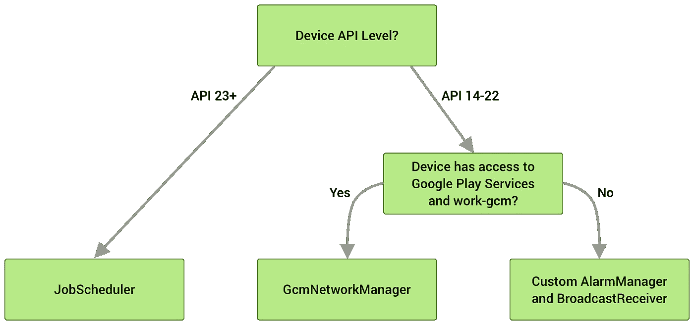

# 使用工作管理器— Android

> 原文：<https://medium.com/nerd-for-tech/using-workmanager-android-f7a70781d3ff?source=collection_archive---------3----------------------->


照片由[JESHOOTS.com](https://www.pexels.com/@jeshoots-com-147458?utm_content=attributionCopyText&utm_medium=referral&utm_source=pexels)从[派克斯](https://www.pexels.com/photo/black-twin-bell-alarm-desk-clock-on-table-714701/?utm_content=attributionCopyText&utm_medium=referral&utm_source=pexels)拍摄

工作管理器适用于不需要立即运行的工作，即使应用程序退出或设备重启，也需要**可靠运行**。对于长期运行的后台任务，推荐使用工作管理器

例如:

*   向后端服务发送日志或分析
*   定期将应用程序数据与服务器同步

在 Workmanger 之前，有不同的作业调度 API，其中一些工作在特定的 android 版本上，或者需要安装 google play 服务。

另一方面，WorkManager 可以在冰淇淋三明治以上的所有 android 版本上工作，并且独立于 google play 服务
之外，WorkManager 使用基于以下标准的底层作业调度服务:



## **工作管理器的优势**

*   与以前的 API 相比，WorkManager 的一个优点是，您可以定义约束，以便仅在满足这些约束时才执行任务。例如，您希望仅在设备连接到 Wifi 时下载用户喜爱的音乐。
*   WorkManager 还允许您链接您的请求，以便它们按顺序运行，并且一个请求只有在成功执行之前才会执行
*   工作管理器允许您使用灵活的调度窗口[安排工作](https://developer.android.com/topic/libraries/architecture/workmanager/how-to/define-work)运行[一次](https://developer.android.com/reference/androidx/work/OneTimeWorkRequest)或[重复](https://developer.android.com/reference/androidx/work/PeriodicWorkRequest)。还可以标记和命名工作，允许您安排独特的、可替换的工作，并一起监控或取消工作组。此外，WorkManager 坚持节能功能和最佳实践，如[瞌睡模式](https://developer.android.com/training/monitoring-device-state/doze-standby)，因此您不必担心。
*   有时工作会失败。WorkManager 提供了[灵活的重试策略](https://developer.android.com/topic/libraries/architecture/workmanager/how-to/define-work#retries_backoff)，包括一个可配置的[指数退避策略](https://developer.android.com/reference/androidx/work/BackoffPolicy)。

对于工作管理器，我们需要在我们的项目 Gradle 中有一个工作运行时 ktx 依赖项

```
implementation "androidx.work:work-runtime-ktx:2.5.0"
```

# **实现工作管理器需要 2 个步骤**

# **第一步**

创建一个 Worker 类，您可以在其中定义要在后台执行的工作。

dowork()方法异步运行，也就是说，它不会在任务执行时暂停我们的主 UI 线程。dowork()应该返回一个结果来显示工作成功完成。我们还可以将输出作为结果的一部分。

在上面显示的用例中，我们正在获取用户列表。如果获取了所有用户，我们将返回 Result.success()。如果有任何异常，我们将返回 Result.retry()，它将告诉 WorkManger 根据重试策略稍后再试一次

# 第二步

工作管理器允许两种方式来安排工作

*   [OneTimeWorkRequest](https://developer.android.com/reference/androidx/work/OneTimeWorkRequest)
    如果您想要安排您的工作，并且它应该只执行一次，那么就使用 OneTimeWorkRequest
*   如果您希望定期重复您的工作，您可以使用 PeriodicWorkRequest

在下面的例子中，我们将使用 [PeriodicWorkRequest](https://developer.android.com/reference/androidx/work/PeriodicWorkRequest) ，因为我们需要定期每隔几分钟同步数据。

我们设置了一些限制，只是说 WorkManger 要启动网络，电池不能太低。

在 PeriodicWorkRequest。构建器我们需要定义 repeatInterval，这意味着在多少时间间隔后应该再次执行任务。在这里，我们使用 PeriodicWorkRequest。*MIN _ PERIODIC _ INTERVAL _ MILLIS*表示 15 分钟。因此，我们的任务将每隔 15 分钟运行一次。

*暂时就这样吧！！
感谢您的阅读，不要忘记与您的开发伙伴分享:)*