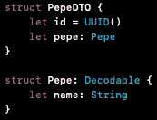
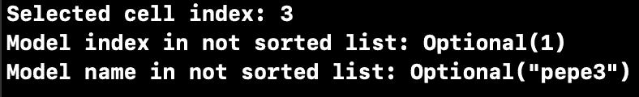

# 索引路径上的 UUID

> 原文：<https://medium.com/nerd-for-tech/uuid-over-indexpath-3ac126e85304?source=collection_archive---------9----------------------->

你好。

今天我想建议当 **UICollectionView** 中的项目或者 **UITableView** 中的单元格被选中时，开始使用[**【UUID】**](https://developer.apple.com/documentation/foundation/uuid)在列表中查找合适的模型，而不是使用 **IndexPath** 。

出于本文的目的，我假设您熟悉使用 **IndexPath** 从数组中检索合适的模型。

我将使用我上一篇文章 [**中的 project 解决可重用单元格问题**](https://rafal-prazynski.medium.com/resolve-reusable-cell-problem-47476d17a0ed) 并对其进行一点点调整，以恰当地表达本文的意图。

那么各个班级的情况如何呢？

## MOCK.swift

我在这里声明了包含要显示的图像名称的非排序响应。响应模型(**佩佩**)被包裹在[**DTO**](https://en.wikipedia.org/wiki/Data_transfer_object)**(**佩佩托**)结构中，该结构包含类型 [**UUID**](https://developer.apple.com/documentation/foundation/uuid) 的属性 *ID* 。这个 *ID* 将用于识别我稍后将展示的列表中的型号。**

****

**Pepe 结构**

## ****CollectionView.swift****

**这里我用下面的方法声明了一个协议**CollectionViewCellInteractionProtocol**:**

> **func selectedItem(位于索引路径:索引路径)**

**该方法将委托动作到 **UICollectionView** 之外。
不要在对象之间创建紧密的连接是一个好习惯，使用协议进行解耦也是一个好方法。这种方法给了我们更多的灵活性。**

**从**uicollectionview delegate**方法中的**CollectionViewCellInteractionProtocol**调用方法:**

> **func collection view(_ collection view:UICollectionView，didSelectItemAt index path:index path)**

## **collectionviewcell builder . swift**

**这里我用下面的方法声明了一个协议**CollectionViewCellBuilderProtocol**。：**

> **func selected model(id 为:UUID)**

**我们需要这个方法来通知**CollectionViewCellBuilder**外部哪个 UUID 被选中了。**

**此外， **PepeBuilder** (这里是展示其工作原理的文章: [**解决可重用单元问题**](https://rafal-prazynski.medium.com/resolve-reusable-cell-problem-47476d17a0ed) )包含闭包声明 ***selectedModel、*** 用于处理单元上的用户交互，并将在协议**CollectionViewCellInteractionProtocol**的方法实现中调用**

## **这一切是如何运作的:**

1.  **在**视图控制器**中，未排序的模拟模型被创建( **PepesModel** )，保存在全局变量中并传递给**collectionviewcell builder**以及**视图控制器**正在实现**collectionviewcell builder 协议**。**
2.  **在**collectionviewcell builder**中是**pep 到**的排序列表，按其属性名*，创建 **PepeCollectionViewCell 的**viewmodel**，**将那些**viewmodel**传递给 **PepeBuilder** 并实现闭包***selected model****。*实现***selected model***是从**CollectionViewCellBuilderProtocol**中调用的方法，用于根据选中的单元格传递 UUID。***
3.  *****ViewController** 从**CollectionViewCellBuilder**接收选择的 UUID，并从未排序列表中检索模型。***
4.  ***假设用户点击了索引 4 处的项目，那么我们应该会看到这些日志:***

******

## ***它给了我们什么？***

***在上面的例子中，我们有两个不同的列表:第一个是排序的，第二个不是。多亏了 UUID，我们不需要再去整理第二个了。此外，如果显示的单元格的顺序发生任何变化，我们也不需要担心两个独立列表的索引同步。***

***感谢阅读，祝**好运！*****

> ***完整代码:[https://github.com/Rafal-Prazynski/UUID_over_IndexPath](https://github.com/Rafal-Prazynski/UUID_over_IndexPath)***