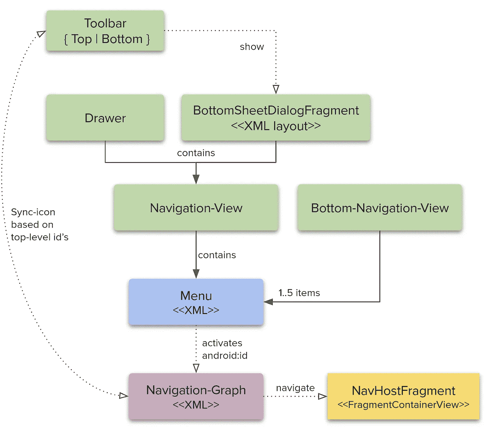
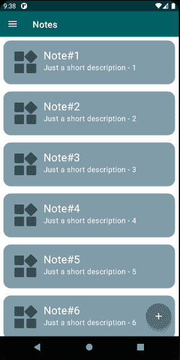
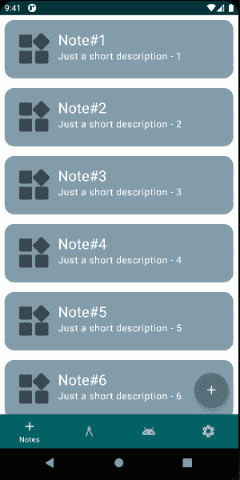
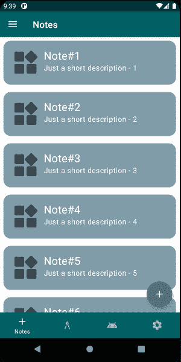
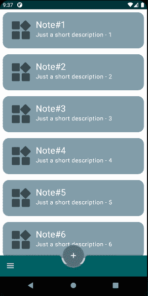
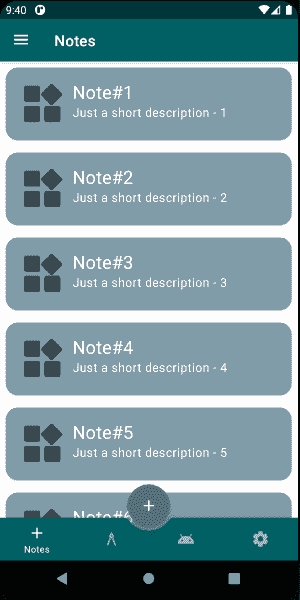
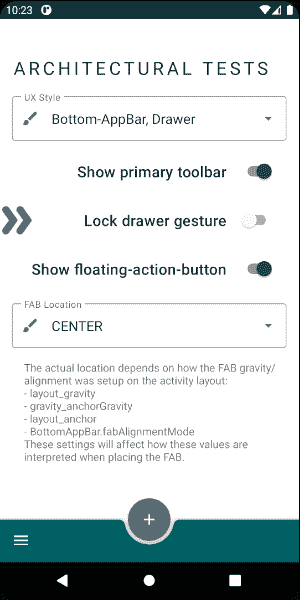

# UX 政策—第二部分

> 原文：<https://medium.com/nerd-for-tech/ux-policies-5ce77bc26304?source=collection_archive---------13----------------------->

## UX 模式

这是系列文章的一部分。目标、基础、项目结构、文章摘要见 [*Android::简体*](https://sites.google.com/view/migueltt/home_en)

**务必先阅读** [**UX 政策篇第一部分:问题**](https://miguelt.medium.com/ux-policies-bbbb432dc5fc) **！**

知识库:[https://gitlab.com/migueltt/simpleandroid](https://gitlab.com/migueltt/simpleandroid)

B 基于[第一部分](https://miguelt.medium.com/ux-policies-bbbb432dc5fc)，你的应用应该根据你的需求有一个标准化的结构，定义适用于所有屏幕的导航和交互的主要 UI 组件，除了一些例外。

此时，您可能已经非常熟悉这些[模式和组件](https://material.io/components?platform=android)，但是请继续阅读！最后，为了给整个项目提供结构，我将向您展示这个策略是什么样子的。另外，结尾有个转折。

首先，有 5 件重要的事情需要考虑:

1.  `Drawer`和`BottomSheetDialog`包含一个`NavigationView`
2.  `NavigationView`项目被定义为 XML 资源中的菜单`<item..>`。`android:id`必须与导航图中使用的相同——这样，当选择一个项目时，它会自动通知`nav-controller`导航到该目的地
3.  `BottomNavigationView`和`NavigationView`可能包含它们自己的`Menu` XML 资源，这取决于你想如何组织你的`destinations`
4.  `Toolbars`(顶部或底部)和`Drawer`可以同步工作——对于顶层`android:id`,`Toolbar`显示 3 条图标，而对于非顶层，显示一个后退箭头图标
5.  导航图必须被认为是你所有导航需求的真实来源——这意味着，没有更多的片段事务或定制解决方案来创建片段——应用程序必须始终使用`destination`来浏览“屏幕”

UI 组件关系

这种结构将允许您毫不费力地添加新模块，因为所有组件都将同步，而不必添加自定义代码，因此，这应该是您在添加新功能时的长期策略:

*   定义一个新的模块(片段、视图模型等),将相关的类分组到一个包中——只关注模块的特性
*   将你的`destinations`加入导航图
*   向`Menu`资源中添加新条目

**其次**，使用现成的组件来定义应用程序要使用的 UX 模式，以简化开发——以后您可以随着对架构的熟悉而改进。

以下是六种常见的 UX 模式(截至 2021 年 4 月)，你现在可以使用标准的 Android Material 组件来实现:

*   **工具栏+抽屉**:传统方式。只有一个顶部工具栏，左边的`Drawer`包含导航项目。这里没有问题，唯一的问题是这种模式看起来和感觉都很旧。在大屏幕上，你的应用很难使用——用户必须“触及”左上角来激活`Drawer`，或者交换双手来滑动左边缘——这与系统范围的手势导航相冲突。

工具栏和抽屉

*   底部导航视图:一种新的方法，但是只有当你有多达 5 个目的地时才有用。为了适应其他目的地，你必须引入一个顶部工具栏。只有当你 100%确定你可以把所有的目的地放在底部时，才使用这种方法——人们可能会争辩说`BottomNavigationView`应该只包含顶部的`destinations`，其他二级屏幕应该使用不同的机制出现，比如菜单。

底部导航视图

*   **工具栏+抽屉+底部导航-视图**:前两种模式的混合。这解决了仅使用`BottomNavigationView`时的问题，因为`Drawer`可以显示额外的`destinations`。在某些情况下，您可能希望在`Drawer`中显示所有目的地。

工具栏、抽屉和底部导航视图

*   **底部-应用程序栏+抽屉**:这种模式在过去几年里已经成为一种常态。让你更容易与应用程序互动，因为一切都可以用一只手操作，尤其是在大显示屏上。通常包含一个`Drawer`，默认情况下它出现在左手边，对于右手用户来说激活有点困难。您可以通过使用`android:layoutDirection`来解决这个问题，但是要小心，因为您必须在子组件上显式地设置这样的属性，如果用户在从右向左的语言环境中，这可能会搞砸。使用`BottomAppBar`的好处是`FloatingActionButton`可以很好地放在一个摇篮里，这个摇篮也可以在运行时修改为右边，转换为`scale`或`slide`。

底部应用栏和抽屉

*   **底部应用栏+底部表单对话框**:和上一个一样，但是用了`BottomSheetDialogFragment`代替了`Drawer`。下面的动画在底部工作表中显示了一个标题，这可能是你不应该包含在你的应用程序中的。

底部应用程序栏和底部表单

*   **工具栏+抽屉+底部应用栏+底部导航视图**:这是一种非标准模式，因为它混合了所有以前的模式(除了底部表单)。这里的主要目的是为用户提供对某些模块的快速访问。如果你有 3 或 5 个主`destinations`，我建议不要用这种模式，因为其中一个会被中间的`FloatingActionButton`切断——见下面的动画。在这种情况下，`FloatingActionButton`托架被推动(偏移)了一些倾角，以避免切断某些物品。只有当你真的需要那个`FloatingActionButton`摇篮的时候才使用这个模式。

**现在，转折**。所有的动画实际上都在同一个应用程序中。而且没有，app 没有多个`Activities`或者`Fragments`，只有一个`Activity`。

> [Simple::Android project](https://gitlab.com/migueltt/simpleandroid) 使用多种可在运行时更改的 XML 布局定义了所有这六种模式——查看变体`debug`中的`[ActivityMain](https://gitlab.com/migueltt/simpleandroid/-/blob/develop/app/src/debugQA/java/com/simpleandroid/modules/ActivityMain.kt)`。

UX 风格切换器

*   每个 UX 模式都是使用独立的 XML 布局定义的
*   每个 XML 布局都使用 ViewBinding，允许我们为每个布局定义扩展函数——参见[解耦绑定](https://miguelt.medium.com/decoupling-binding-57566dc7b17d)
*   从`[FragmentSettings](https://gitlab.com/migueltt/simpleandroid/-/blob/develop/app/src/main/java/com/simpleandroid/modules/settings/FragmentSettings.kt)`，用户可以改变 UX 风格
*   除了我们将在下一部分描述的其他功能外，还允许改变风格
*   动画展示了在保持`Fragment`和导航状态的同时，整体结构是如何变化的

当然，你的应用不需要这么复杂——你只需要选择一种 UX 风格。这个运行时 UX 开关只是作为一个概念验证添加的，用来展示实现一个简单而有效的 Android 架构是多么容易。

查看 [UX 政策——第 3 部分:实施](https://miguelt.medium.com/ux-policies-part-3-d6937e2dda57),了解如何在不影响项目期限的情况下实现同样的简单性。