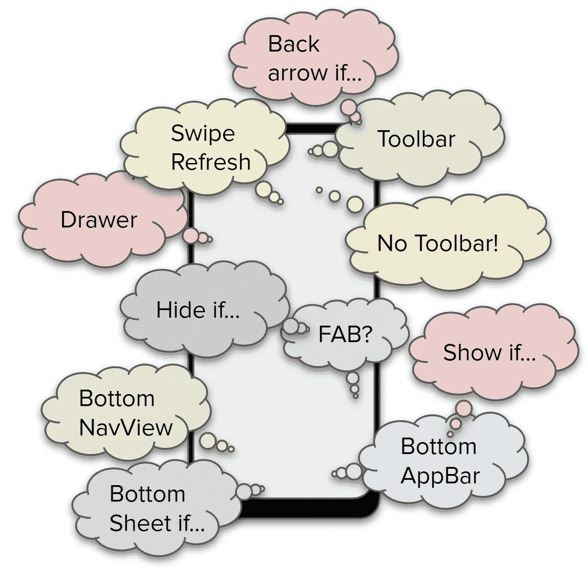

# UX 政策—第 1 部分

> 原文：<https://medium.com/nerd-for-tech/ux-policies-bbbb432dc5fc?source=collection_archive---------12----------------------->

## 问题是

这是系列文章的一部分。目标、基础、项目结构、文章摘要见 [*Android::简体*](https://sites.google.com/view/migueltt/home_en)

务必先阅读文章[单活动](https://miguelt.medium.com/single-activity-2659f6ac09e8)！

知识库:[https://gitlab.com/migueltt/simpleandroid](https://gitlab.com/migueltt/simpleandroid)

M 现代 Android 应用遵循[单活动原则](https://www.youtube.com/watch?v=2k8x8V77CrU)，即你的单个`Activity`包含所有主要组件，如`Toolbar`(顶部或底部)、`Drawer`、`BottomSheetDialog`，甚至一个`BottomNavigationView`，所有这些组件*围绕*一个容器(`NavHostFragment`)，该容器在`navigation-graph`中托管所有的`Fragments`。

这听起来很简单，但是当定义需要特定 UX 模式的不同模块时，事情就变得复杂了:

*   需要后退手势的屏幕序列
*   需要特殊工具栏设计的屏幕
*   有些屏幕应该阻止显示抽屉(如果支持的话)
*   菜单应该根据屏幕上下文变化
*   工具栏导航图标处理后退手势和扩展抽屉之间的功能
*   浮动操作按钮仅适用于某些屏幕
*   工具栏标题应该与屏幕同步

…再加上更多的 UX 需求，这将迫使您不断添加更多的代码来处理此类用例——最糟糕的是:当应用更改来处理额外的用例时，有时会出现错误。

UX 的噩梦

根据你想以多快的速度向市场发布你的应用，你可能需要做出一些牺牲:

*   关注材质 UX 模式:大部分安卓 UX 工具箱都提供了基于[材质组件](https://material.io/)的现成组件——稍加调整，你就可以实现大部分的应用主题化。
*   与 UX 设计师密切合作，确保他们明白 UI 的改进将会到来，一旦你有了核心功能，一些行为(过渡，动画)将会被包含进来。整体 UX(也就是 UI+行为)可以逐步提高。
*   专注于那些“必须的”——否则，你永远不会发布你的应用。
*   应用程序主题化非常重要，但是要小心:定义新的 UX 模式并不像看起来那么简单。你需要定义每个 UI 控件的外观，以及启用、禁用、点击、长时间点击、悬停、涟漪效果时的不同状态；显示/隐藏时的过渡/动画；等等…等等…
    大多数 Android 应用程序只是应用不同的颜色，并依赖于开箱即用的材料组件——因为时间就是金钱，你越早发布应用程序，对每个人都越好——你可以稍后花时间逐步使你的应用程序更“有吸引力”，更接近你的最终愿景。

好了，现在你说服所有人使用核心[材料组件](https://material.io/)。那么，下一步是什么？你必须兑现你的承诺。

*   高效的资源管理(内存、cpu、本地存储)
*   所有模块的核心功能(列表、分页、API 调用、缓存机制、离线支持、所有屏幕尺寸、不同方向等)
*   处理一些边缘情况，屏幕有不同的装饰(例如，不同的工具栏，在不同的位置)
*   跨所有屏幕的无缝和一致的导航
*   用户被重定向到特定屏幕的不同通知类型
*   深层链接支持和 web 集成
*   每个交互的分析/指标(访问的屏幕、UI 事件等)

这些是所有 Android 项目都有的挑战和问题，根据你采取的方法，你将会是…

*   …成功，因为您的架构提供了结构，使整个项目在未来几年变得简单有趣…
*   或者，…在你采取的每一个步骤上挣扎，添加越来越多的代码只是为了让事情工作，这将增加更多的复杂性，几个月后，你将结束一个“重构子项目”，只是扔掉你写的所有意大利面条式的代码。

所以，让我们开始吧——查看 [UX 政策第二部分:UX 模式](https://miguelt.medium.com/ux-policies-5ce77bc26304)