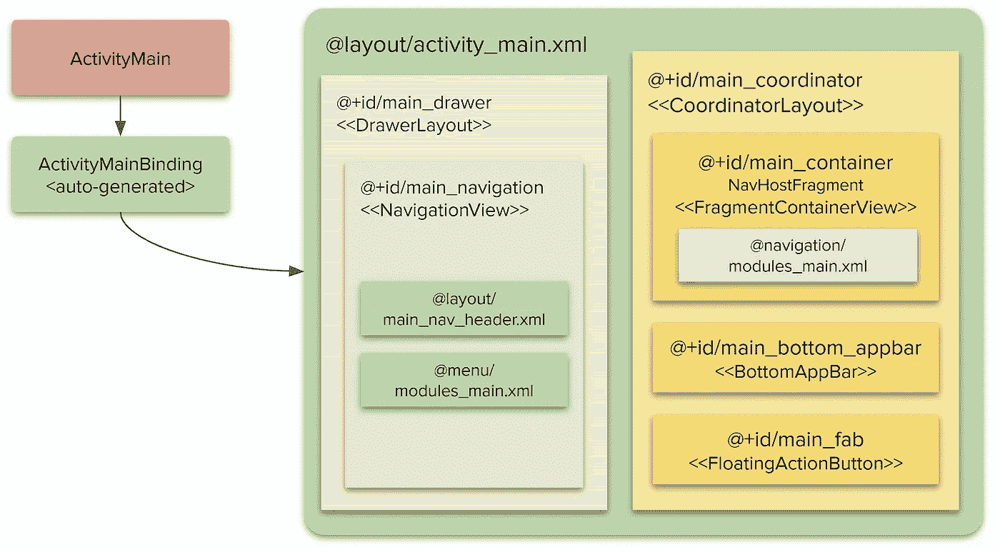

# UX 政策—第 3 部分

> 原文：<https://medium.com/nerd-for-tech/ux-policies-part-3-d6937e2dda57?source=collection_archive---------23----------------------->

## 实施

这是系列文章的一部分。目标、基础、项目结构、文章摘要见 [*Android::简体*](https://sites.google.com/view/migueltt/home_en)

**务必先阅读文章** [**第一部分:问题**](https://miguelt.medium.com/ux-policies-bbbb432dc5fc) **和** [**第二部分:UX 模式**](https://miguelt.medium.com/ux-policies-5ce77bc26304) **！**

储存库:[https://gitlab.com/migueltt/simpleandroid](https://gitlab.com/migueltt/simpleandroid)

本文将关注于 [SimpleAndroid 应用](https://gitlab.com/migueltt/simpleandroid)的实际 UX 策略实现，它包含了您可以在您的项目中使用的实用程序——因此，您可以随时查看[源代码](https://gitlab.com/migueltt/simpleandroid)。为了让事情更清楚，我在每个地方都添加了注释。

[单一活动原则](https://miguelt.medium.com/single-activity-2659f6ac09e8)的意思就是:一个`Activity`来统治他们所有人！这样的`Activity`应该定义 main-UI 组件:

*   工具栏→显示上下文“快捷方式”(如弹出菜单、图标)
*   主模块的导航项目(例如在`Drawer`或`BottomNavigationView`内——甚至两者都有！)
*   需要时应该出现的上下文`FloatingActionButton`

> 为了简化事情，我定义了两种不同的变体:
> - `debug`:经典的一种，用于开发和测试——包括几个结构来试验应用程序，还包括一个 UX 风格的切换器。
> - `debugQA`:应该被认为是我们的`release`变体——只是为了简化而添加的，这样我们就可以使用仿真器执行这两种变体，而不必提供签名配置。这个变体使用了 BottomAppBar+Drawer UX 风格。

为了设置组件同步，我使用了扩展函数，可以在以下位置找到:

*   对于变体`debugQA` — [UxPolicies.kt](https://gitlab.com/migueltt/simpleandroid/-/blob/develop/app/src/debugQA/java/com/simpleandroid/ui/UxPolicies.kt) :管理我们简单的 BottomAppBar+Drawer UX 风格
*   对于变体`debug` — [UxPolicies.kt](https://gitlab.com/migueltt/simpleandroid/-/blob/develop/app/src/debug/java/com/simpleandroid/ui/UxPolicies.kt) :更复杂的版本，因为它管理了[第 2 部分](https://miguelt.medium.com/ux-policies-5ce77bc26304)中描述的所有以前的 UX 风格

为了简单起见，我将解释一下`debugQA` ( [UxPolicies.kt](https://gitlab.com/migueltt/simpleandroid/-/blob/develop/app/src/debugQA/java/com/simpleandroid/ui/UxPolicies.kt) )的基本原理——请随意查看[其他](https://gitlab.com/migueltt/simpleandroid/-/blob/develop/app/src/debug/java/com/simpleandroid/ui/UxPolicies.kt)更复杂的实现。

1.  `fun AppCompatActivity.getTopLevel(..)`返回导航图中定义的被视为顶级的所有模块 id——因此，如果选择了顶级模块,`Toolbar`将不会变为返回箭头。因为顶级 id 应该被认为是静态的，`getTopLevel(..)`从`integer-array`资源中检索那些 id。
2.  `fun AppCompatActivity.setupNavComponents(..)`使用几个 Material-Components 函数来同步所有 main-UI 组件。
3.  `interface UxPolicies`为每个*行为*定义了`UxRules`，一旦`Fragment`显示，我们希望在`Activity`上进行更改。
4.  `interface UxPoliciesLiveData`与`interface UxPolicies`类似，但提供了`LiveData`组件，因此`Fragment`可以交互修改`Activity`。
5.  `setupUxPolicies(..)`是执行所有策略和规则的地方——在`navHostFragment`中添加一个`FragmentManager.FragmentLifecycleCallbaks`实例，每当创建一个`Fragment`时，执行 UX 策略，如果需要的话定义默认规则——注意，每当导航控制器切换`Fragment`时，这是您想要使用的回调。在我们的例子中，每当创建一个`Fragment`时，我们想要执行 UX 策略。
6.  `fun UxPolicies.enforceUxPolicies(..)`在`setupUxPolicies(..)`中使用，以便应用 UX 模式的所有规则。
7.  `fun UxPoliciesLiveData.enforceUxPolicies(..)`与`UxPolicies.setupUxPolicies`相似，但应用基于`LiveData`组件的策略。
8.  其他不言自明的扩展功能(例如显示/隐藏工具栏)

注意有两个额外的扩展功能(检查`[NavigationUIHelper.kt](https://gitlab.com/migueltt/simpleandroid/-/blob/develop/app/src/main/java/com/simpleandroid/ui/NavigationUIHelper.kt))`:

*   `fun NavigationView.setupWithNavControllerExt(NavController)`解决标准`NavigationUI.setupwithNavController(..)`的问题。Google 实现的问题在于，无论何时选择一个菜单项，它总是会创建一个`Fragment`，即使它当前正在显示。这将强制重新创建此类`Fragment`的所有状态，甚至是`Fragment`级别的视图模型。
*   `fun BottomNavigationView.setupWithNavControllerExt(NavController)`，就像前一项一样，如果用户点击当前选择的菜单项，它将重新创建已经选择的`Fragment`，丢失所有之前的状态——这种实现避免了重新创建`Fragment`。

那么，所有这些东西是怎么聚在一起的呢？

*   首先，您必须遵循 Google 关于 XML 布局和组件的指导方针
*   第二，你应该遵循我关于如何去耦合绑定 T21 的建议，因为这将简化你的代码并为整个项目提供更多的结构

对于第一个要点(XML 布局)，我对变体`debugQA`中的`ActivityMain` XML 布局使用了 ViewBinding，其中所有主 UI 组件都被标识为`android:id="@+id/main_<xxx>`——这里没有什么新内容:



变体调试 QA 中的 activity_main.xml

对于第二个要点([解耦绑定](https://miguelt.medium.com/decoupling-binding-57566dc7b17d))，我已经将所有与 UI 相关的语句提取到`[ActivityMainBindingExt.kt](https://gitlab.com/migueltt/simpleandroid/-/blob/develop/app/src/debugQA/java/com/simpleandroid/modules/ActivityMainBindingExt.kt)`中，在本例中，它只包含一个扩展函数`fun ActivityMainBinding.setup(..)`:

```
fun ActivityMainBinding.setup(activity: ActivityMain) {
    activity.setContentView(*root*)
    val topLevel = activity.*getTopLevel*(R.array.*modules_top*)
    (activity.*supportFragmentManager*.findFragmentById(
        R.id.*main_container* ) as NavHostFragment).*apply* **{** activity.*setupNavComponents*(
            navController = *navController*,
            primaryToolbar = mainBottomAppbar, 
            drawer = mainDrawer,
            navigationView = mainNavigation,
            topLevel = topLevel
        )
        *setupUxPolicies*(
            navHostFragment = this,
            primaryToolbar = mainBottomAppbar,
            drawer = mainDrawer,
            floatingActionButton = mainFab,
            topLevel = topLevel
        )
    **}** }
```

这就是全部要求！

*   `@+id/main_bottom_appbar`将根据在`@+id/main_container`内显示的每个`Fragment`上的 UX 政策显示/隐藏
*   `@+id/main_navigation`将与`@+id/main_container`同步——为此，`@menu/modules_main.xml`和`@navigation/modules_main`为每个`Fragment`定义相同的`@id’s`
*   `@+id/main_drawer`应与`@+id/main_bottom_appbar`同步，如果`Fragment`是顶层图标，导航图标允许打开`Drawer`——否则，应显示一个返回箭头
*   根据 UX 政策，如果`Fragment`有要求，应显示`@+id/main_fab`
*   如果一个`Fragment`需要隐藏一个 main-UI 组件，那么它应该实现`UXPolicies`并覆盖属性`uxRules`，提供您需要的规则
*   如果`Fragment`需要显示或隐藏任何主界面组件，那么执行`UxPoliciesLiveData`并相应地更新`MutableLiveData`规则

在所有这些设置之后，继续向`@menu/modules_main.xml`和`@navigation/modules_main.xml`中添加更多模块是非常容易的。

举个例子，

*   允许交互地切换几乎任何主界面组件——即使你改变了方向，因为这是我们的“测试”版本，你甚至可以在 UX 风格之间切换
*   包括自己的工具栏，甚至自己的导航主机控制器，因此，它不需要任何主用户界面组件
*   `[FragmentNotes](https://gitlab.com/migueltt/simpleandroid/-/blob/develop/app/src/main/java/com/simpleandroid/modules/notes/FragmentNotes.kt)`指定浮动动作按钮的动作，依赖于默认的 UX 规则

如果你需要不同的 UX 风格(例如，顶部工具栏、底部导航视图等等)，请随意查看`[debug MainActivity](https://gitlab.com/migueltt/simpleandroid/-/blob/develop/app/src/debug/java/com/simpleandroid/modules/ActivityMain.kt)`版本——但是要小心！这个版本允许在运行时切换不同的 UX 风格，这是你应该避免的——你的应用应该只使用一种 UX 风格，以简化用户的交互方式。