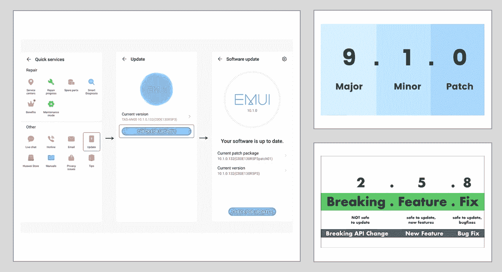

# 1.0.0 版—采用更好的版本控制机制

> 原文：<https://medium.com/nerd-for-tech/v1-0-0-go-for-a-better-versioning-mechanism-118d39445d0a?source=collection_archive---------7----------------------->

## 版本化您的软件版本以避免维护开销。

如果你曾经在手机或笔记本电脑上更新过你现有的应用程序，那么软件版本化对我们所有人来说都是很常见的。

软件版本——由 Sajitha 修改

作为一个技术出身的人，我也从未对版本化感兴趣，直到我理解了背后的真正原因…