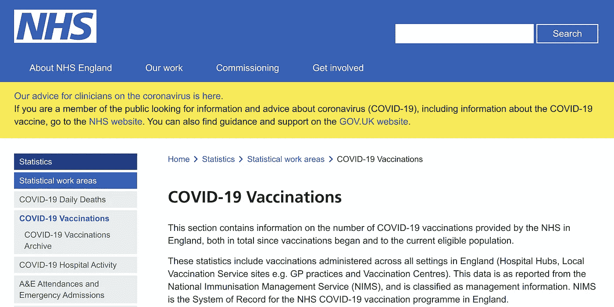
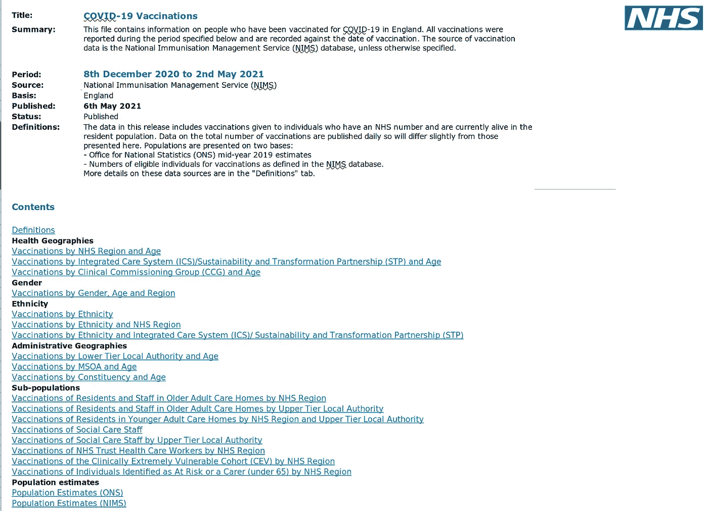
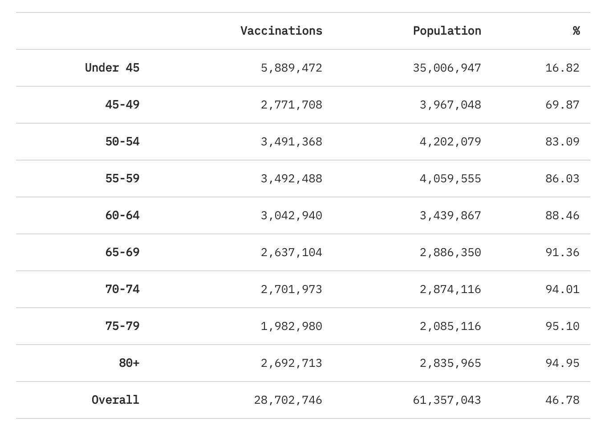
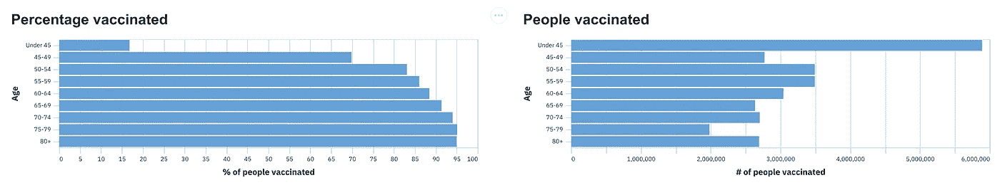
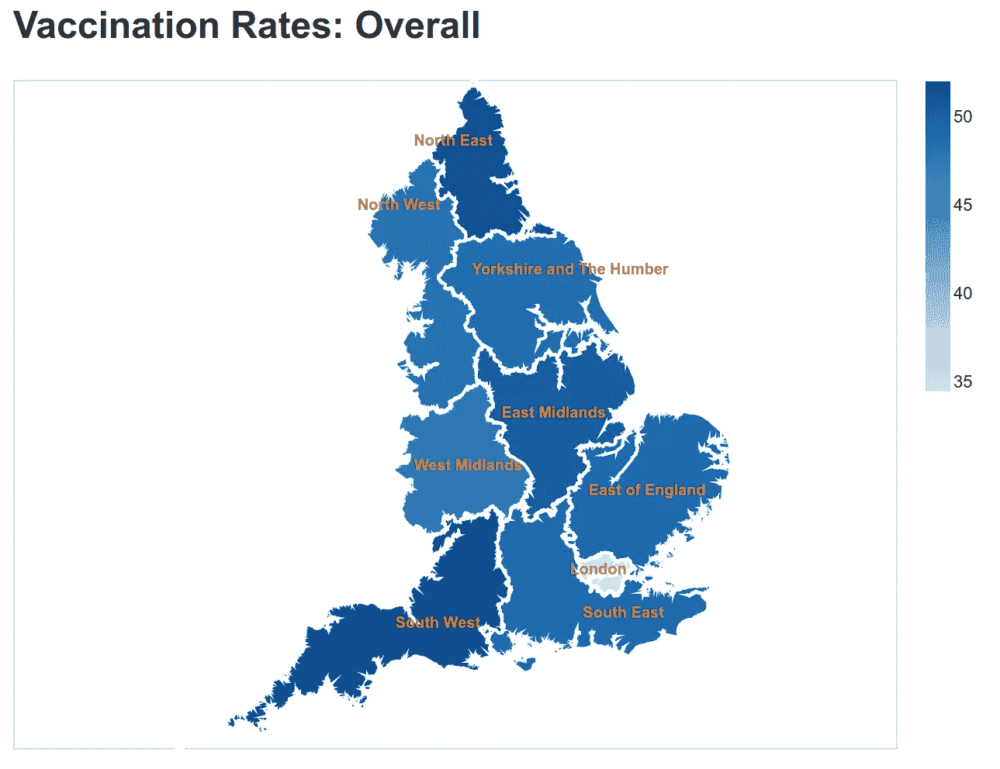
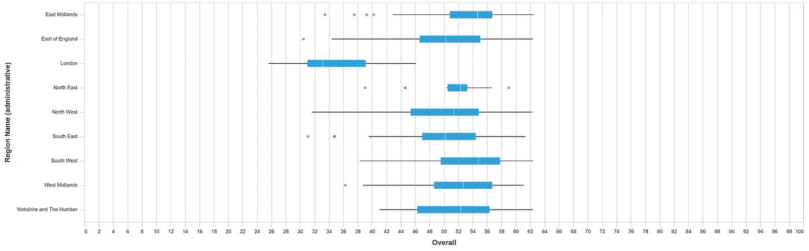
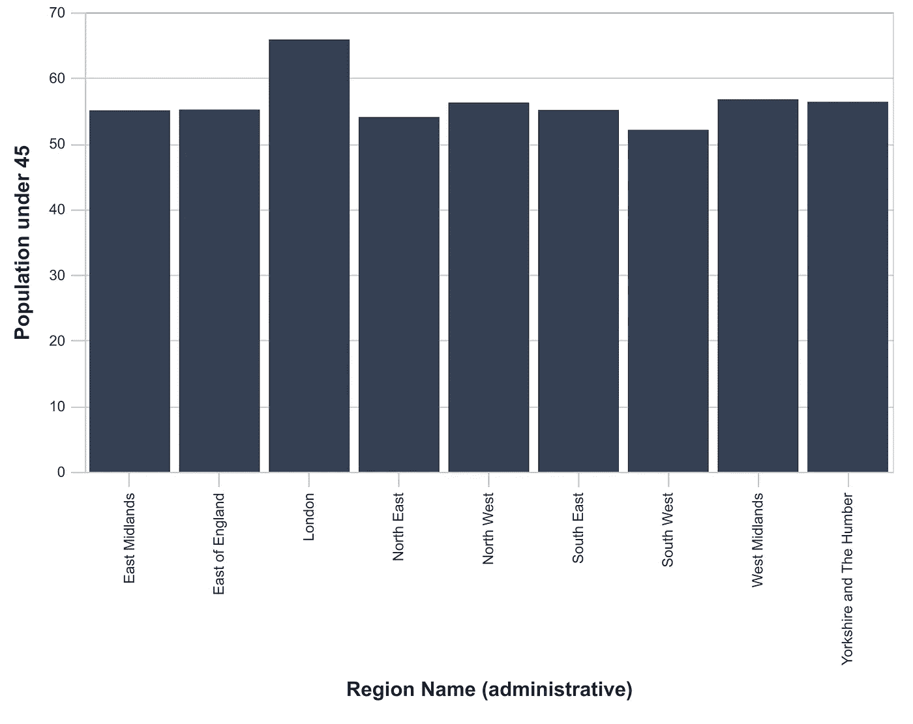
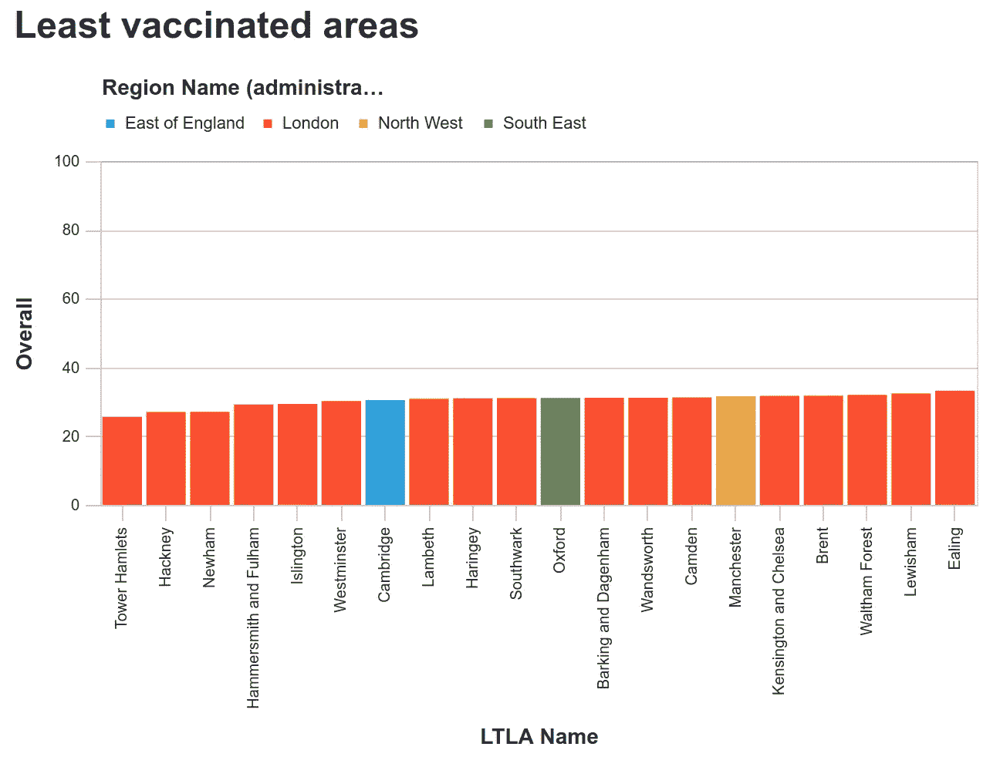
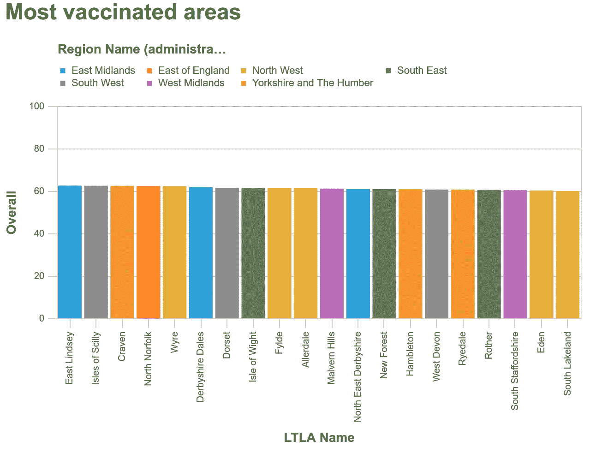
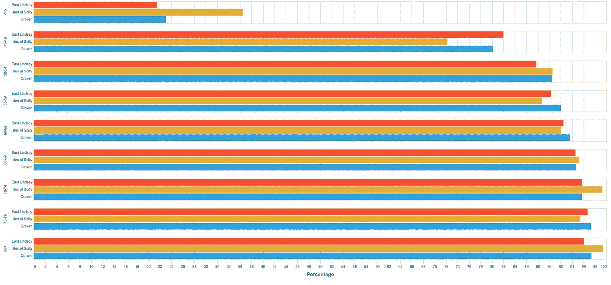

# 接种英格兰疫苗:进展如何？

> 原文：<https://medium.com/nerd-for-tech/vaccinating-england-hows-it-going-89ee0b8e2da3?source=collection_archive---------17----------------------->

## Covid 疫苗接种在英格兰不同地区的开展情况如何？

在 Covid 数据的世界里，周四下午是我最喜欢的时间，因为那是英国国民医疗服务系统发布每周疫苗接种电子表格的时候。

在这篇博文中，我们将探究电子表格中发布的数据，以了解疫苗在该国不同地区的推广情况。

NHS 英格兰 Covid 疫苗接种数据网站

# 数据前导码

该电子表格包含按年龄组和地区提供的疫苗接种数量的数据，以及每个地区的人口估计数。

该数据比官方仪表盘上显示的总数据晚几天，因此我们在进行分析时需要记住这一点。

下面的截图显示了电子表格和[中包含的数据，在之前的博客文章](https://www.markhneedham.com/blog/2021/04/17/england-covid-vaccination-rates-the-data/)中，我展示了如何使用 Pandas 提取电子表格的不同部分。

NHS 英格兰 Covid 疫苗接种电子表格

那么我们能从挖掘数据中学到什么呢？

# 按年龄组分类的疫苗接种

让我们先看看每个年龄组接种疫苗的人数。下表显示了绝对数字:

按年龄组分类的疫苗接种

总的来说，不到 47%的人或 28，702，746 人至少接种过一次 Covid 疫苗，在所有 65 岁以上的年龄组中，接种疫苗的人的比例超过 90%。

根据[官方数据显示](https://coronavirus.data.gov.uk/details/vaccinations)，截至今天，英国已有 29232101 人至少接种了一剂疫苗，其中 266165 人是自 2021 年 5 月 2 日以来接种的。

考虑到这一点，我们仍然有不到 30 万人的缺口，这可以通过电子表格中的以下说明得到部分解释:

> 仅纳入了疫苗接种日期在 2020 年 12 月 8 日至 2021 年 5 月 2 日之间的记录。
> 
> LTLAs 的总和不等于英格兰的总数。这是因为在英格兰接种疫苗的少数人在苏格兰或威尔士有注册地址，或者他们的地址未知。

虽然我们的数字相差不远，但我认为这些数据足够好，可以继续我们的分析。

直到我开始查看这些数据，我才明白一件事，尽管 45 岁以下的人很少接种疫苗，但从绝对数字来看，这个群体接种了最多的疫苗:

按年龄组分列的接种疫苗人口百分比

我们目前正在给 40 岁的人接种疫苗，所以 45 岁以下的人数在未来几周只会增加。

# 按地区分列的疫苗接种

现在，让我们来看看各地区的疫苗推广情况。该数据集包含按行政区域和地方当局(地方议会)划分的疫苗数量。

我们将从行政区域的总体疫苗接种率开始:

按行政区域分列的疫苗接种率

从这张地图上，我们可以看到伦敦正在苦苦挣扎，而西南、东北和西南却做得很好。

这张地图显示了整个行政区域的总体疫苗接种率，但我们也可以在地方议会一级分析这些数据。

有很多地方议会(据我统计有 314 个)，所以让我们先来看看地方议会是如何运作的，按地区分组。下面的方框图为我们提供了事情进展的高层次概述。

地方议会疫苗接种方框图(按地区分组)

这张图表更清楚地显示了伦敦接种疫苗的人数比全国其他地方少得多。伦敦最好的地方议会仅占其他地区议会的 25%。伦敦也是接种疫苗最少的地方，尽管英格兰东部和东南部的一些异常值表现稍好。

无可否认，伦敦有大量 45 岁以下的人口，66%以上的人口在这个年龄以下。其他地方大约 55%的人口年龄在 45 岁以下。

英格兰不同地区 45 岁以下的人口

但是，即使我们假定伦敦是无辜的，如果我们看看年龄较大的人群，例如 80 岁以上的人的疫苗接种率，情况也是一样的

各地区 80 岁以上人群的疫苗接种率

对于这一群体，伦敦约有 87%的人口接种了疫苗，而其他地区都超过了 90%。

# 地方议会接种疫苗

现在，让我们放大到地方一级的地方当局(地方议会),在更精细的层次上看看发生了什么。

下面的图表显示了 20 个最少接种疫苗的地区，按地区分类:

接种疫苗最少的地区

不出所料，这主要是由伦敦行政区主导的，排名倒数第三的都在东伦敦。我想知道在城镇的那个地方去疫苗接种中心是否更困难，或者除了年轻人口之外，疫苗接种率较低是否还有其他原因。

我们还可以看看 20 个接种疫苗最多的地区:

大多数接种疫苗的地区

东中部地区在这方面做得很好，有 3 个地方议会进入了前 12 名。西北部是赢家，有 6 个地方议会进入前 20 名。遗憾的是，伦敦没有代表。事实上，在排名前 200 的地方议会中，没有一个伦敦地方议会。

我们将通过查看所有年龄组中一些表现最好的领域来结束这篇博文。下面我们可以看到一个图表，显示了前 3 个地方议会按年龄组接种疫苗的人数:

接种疫苗最多的地方议会

虽然东林赛总体表现最好，但锡利岛在几个组别中胜出。

希望我们能尽快在所有类别中获得接近 100%的数字！

# 概括起来

我希望看到当地疫苗方面的进展是有趣的，我当然觉得这很有趣。

用于生成本文中的图表和表格的代码可以在[github.com/mneedham/covid-vaccines](https://github.com/mneedham/covid-vaccines)获得

你也可以在 share.streamlit.io/mneedham/covid-vaccines/main/app.py[的](https://share.streamlit.io/mneedham/covid-vaccines/main/app.py)找到一个拥有交互式图表版本的 Streamlit 应用程序