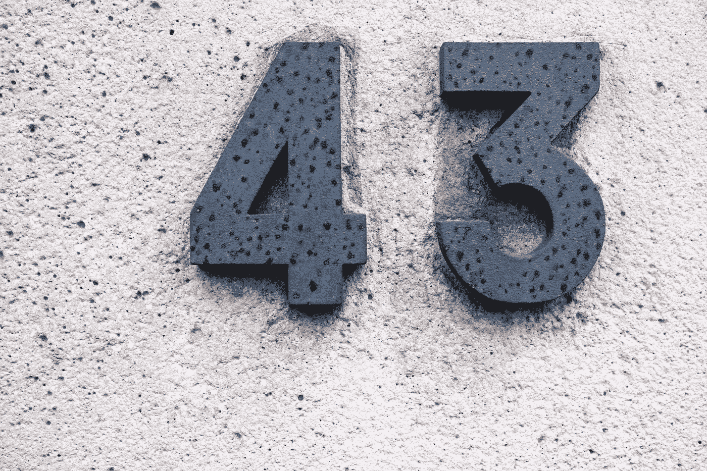
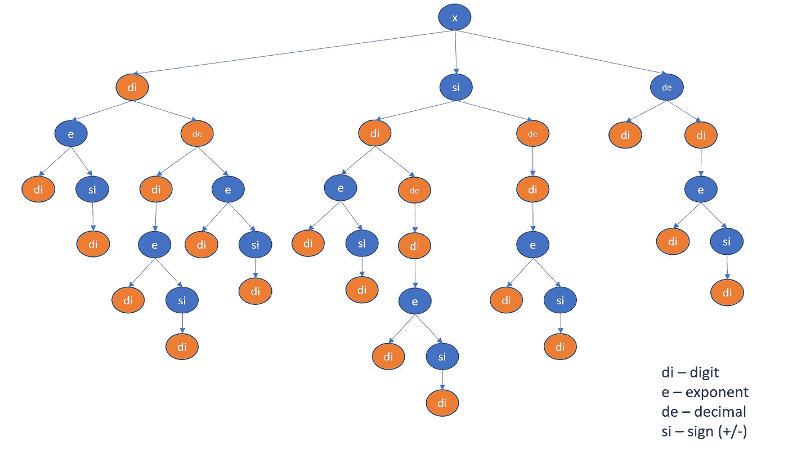
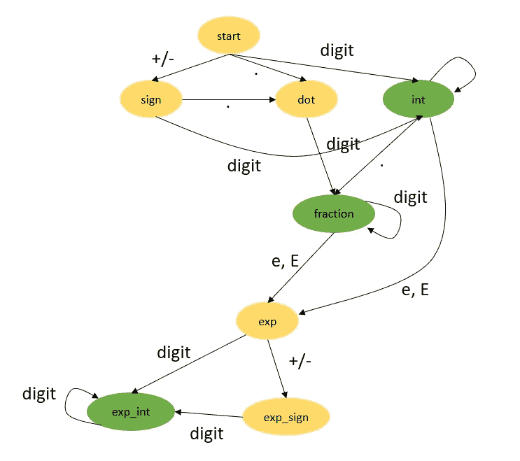

# 有效数字— Linkedin 面试问题

> 原文：<https://medium.com/nerd-for-tech/valid-number-daily-challenge-may-bb469d04ceb0?source=collection_archive---------18----------------------->



迈克尔·范·克尔克霍夫在 [Unsplash](https://unsplash.com/s/photos/number?utm_source=unsplash&utm_medium=referral&utm_content=creditCopyText) 上拍摄的照片

今天的问题来自每日 Leetcode 编码挑战赛——五月版。这是一个难以回答的问题。让我们看看问题陈述。

## [65。](https://leetcode.com/problems/valid-number/)有效号码

一个**有效数字**可以分成以下几个部分(按顺序):

> 1.一个十进制数**或一个整数**。
> 2。(可选)一个`'e'`或`'E'`，后跟一个**整数**。

一个**十进制数**可以分解成以下几个部分(按顺序):

> 1.(可选)一个符号字符(`'+'`或`'-'`)。
> 2。以下格式之一:
> 3。至少一位数字，后跟一个点`'.'`。
> 4。至少一位数字，后接一个点`'.'`，后接至少一位数字。
> 5。一个点`'.'`，后跟至少一个数字。

一个**整数**可以分成以下几个部分(按顺序):

> 1.(可选)符号字符(或者`'+'`或者`'-'`)。
> 2。至少一位数字。

## 示例:

有效数字:

```
["2", "0089", "-0.1", "+3.14", "4.", "-.9", "2e10", "-90E3", "3e+7", "+6e-1", "53.5e93", "-123.456e789"]
```

无效数字:

```
["abc", "1a", "1e", "e3", "99e2.5", "--6", "-+3", "95a54e53"]
```

## 理解问题

这个问题是找到有效的模式，看看我们是否能找到给定字符串的模式。如果我们为每个字符绘制决策树，那么我们得到如下结果



如果我们列出所有以数字或小数结尾的路径，我们将得到所有可能有效模式的列表。

```
'xd','x.d','xd.','xd.d','xsd','xsd.','xsd.d','xded','x.ded', 'xd.ed','xd.ded','xsded','xsd.ed','xsd.ded','xdesd','x.desd', 'xd.esd','xd.desd','xsdesd','xsd.esd','xsd.desd','xs.d','xs.ded', 'xs.desd'
```

我们只需检查给定的单词是否具有上述任何模式。为了生成模式，我们忽略重复出现的数字。我们只用一个符号“d”来表示它们。

代码实现:

```
def isNumber(s):
    valid_patterns = ('xd','x.d','xd.','xd.d','xsd','xsd.',
              'xsd.d','xded','x.ded','xd.ed','xd.ded',
              'xsded','xsd.ed','xsd.ded', 'xdesd', 'x.desd', 
              'xd.esd', 'xd.desd', 'xsdesd', 'xsd.esd', 
              'xsd.desd', 'xs.d', 'xs.ded', 'xs.desd'
              ) patttern = 'x'
    for ch in s:
        if ch == '+' or ch == '-': patttern += 's'
        elif ch == 'e' or ch == 'E': patttern += 'e'
        elif ch.isdigit():
            if patttern[-1] != 'd': patttern += 'd'
        elif ch == '.': patttern += '.'
        else: return False

    return patttern in valid_patterns
```

**复杂性分析**

*   时间复杂度:O(n)，其中 N 是给定字符串的长度。
*   空间复杂度:O(1)

## 方法 2

使用 DFA(确定性有限自动机)。该概念基于有限状态机。我们的目标是达到最终状态。将上面的决策树重新排列成一个有限状态机，我们得到如下结果。



实现上述状态，并检查我们是否处于有效状态。

```
def isNumber(s) -> bool:
    # states
    start       = 0
    int_sign    = 1
    integer     = 2
    point       = 3
    frac        = 4
    exp         = 5
    exp_sign    = 6
    exp_int     = 7 # inputs
    digit       = 1
    sign        = 2
    dot         = 3
    e           = 4 def classify(c):
        if c in '0123456789': 
            return digit
        if c == '.': 
            return dot
        if c in '+-': 
            return sign
        if c in 'eE': 
            return e
        raise ValueError machine = {
        start   : {sign:int_sign, digit:integer, dot:point},
        int_sign: {digit:integer, dot:point},
        integer : {digit:integer, dot:frac, e:exp},
        point   : {digit:frac},
        frac    : {digit:frac, e:exp},
        exp     : {digit:exp_int, sign:exp_sign},
        exp_sign: {digit:exp_int},
        exp_int : {digit:exp_int},
    } state = start
    for c in s.strip():
        try:
            state = machine[state][classify(c)]
        except: 
            return False
    return state in [integer, frac, exp_int]
print(isNumber('1E9' ))
```

关于有限状态的更多理解，请参考这段 youtube 视频。

编码快乐！！