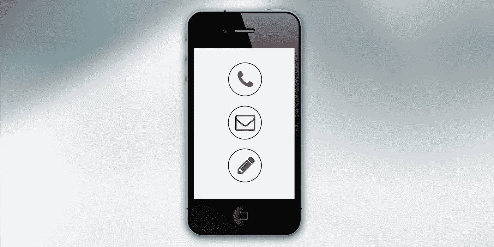

# 在 Swift 中验证电子邮件地址

> 原文：<https://medium.com/nerd-for-tech/validate-an-email-address-in-swift-2097513dda73?source=collection_archive---------15----------------------->

电子邮件可被用作网络钓鱼企图、恶意软件和各种其他威胁的载体，因此验证电子邮件地址已成为保护您业务的重要步骤。然而，没有理由让这项重要的任务变得复杂；可以在 Swift 中使用以下 API 来完全验证电子邮件地址，确保与它交互以及检查语法是安全的。



要使用这个 API，只需用下面的代码调用函数:

```
import Foundation
#if canImport(FoundationNetworking)
import FoundationNetworking
#endifvar semaphore = DispatchSemaphore (value: 0)let parameters = "\"<string>\""
let postData = parameters.data(using: .utf8)var request = URLRequest(url: URL(string: "[https://api.cloudmersive.com/validate/email/address/full](https://api.cloudmersive.com/validate/email/address/full)")!,timeoutInterval: Double.infinity)
request.addValue("application/json", forHTTPHeaderField: "Content-Type")
request.addValue("YOUR-API-KEY-HERE", forHTTPHeaderField: "Apikey")request.httpMethod = "POST"
request.httpBody = postDatalet task = URLSession.shared.dataTask(with: request) { data, response, error in 
     guard let data = data else {
          print(String(describing: error))
          semaphore.signal()
          return
     }
     print(String(data: data, encoding: .utf8)!)
     semaphore.signal()
}task.resume()
semaphore.wait()
```

瞧啊。您的响应将立即返回，并提供一些有用的信息，包括地址、语法、域、SMTP 等的有效性。