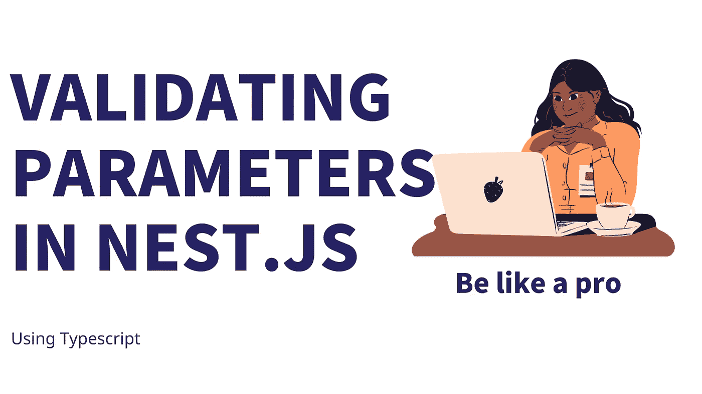

# 验证 NestJS 中的传入和传出参数

> 原文：<https://medium.com/nerd-for-tech/validate-income-and-outgoing-parameters-in-nestjs-50f5d1e9555c?source=collection_archive---------0----------------------->



# 简介:

我们应该总是**关心**什么样的**数据将**传入我们的 **REST API。**有时我们需要**移除额外的参数**，有时我们需要**检查类型**。一些变量应该作为一个**数字**发送，其中一些是**字符串**或者可能是**时间**或 **URL。**

问题是，即使我们对传入的数据进行了验证，大多数时候我们也会忘记验证我们的响应。但是:
**为什么要验证外向参数？由于一些消费者正在消费我们的响应，我们应该小心我们将要在一些现有代码中改变什么。很可能由于我们的改变，反应也会改变。有时，我们删除或添加一个新的参数，这可能会打破我们的消费者。**

# 准备 NestJS:

在开始编写验证之前，我们应该在我们的项目中添加一个管道来捕获来自验证的错误。

为此，我们只需要对`main.ts`的下面一行

```
const app = await NestFactory.create(AppModule);app.useGlobalPipes(new ValidationPipe()); <------ Add this lineawait app.listen(3000);
```

# 传入参数:

首先，让我们假设我们有一个表单，它负责从用户那里获取数据，并将他/她注册到我们的数据库中。
我们需要的字段类似于下面的代码(您可以在本节末尾找到完整的代码) :

```
string name;
string birthday;
string imagePath;
number age; // age can be optional
```

对于传入的数据，我们必须为每个端点创建一个 **DTO** 文件，例如，这里我们有一个`register.dto.ts`文件。

下一步是安装相关的包来验证 DTO

```
npm install class-validator class-transformer
```

Typescript 本身正在处理**装饰器**。因此，像下面的代码一样，我们很容易为每个参数添加验证:

`class-validator`支持许多装饰者，对于他们中的每一个，它都有许多选项。所以，我推荐你看看他们的文档[https://github.com/typestack/class-validator](https://github.com/typestack/class-validator)。

# 传出参数:

传出的问题是，在作为响应发送之前，我们必须手动**调用**的**验证函数** **。**

因此，流程的第一步是**通过`class-transformer`包将**对象**转换为**类**。下面的代码可以将您的对象转换为类，并在有错误时抛出。**

下一步是通过我们的验证类扩展我们当前的 dto，然后在将它作为响应传递之前轻松地调用验证函数。

在这里，这就是我们将如何使用我们在一个样本控制器

我希望你会发现这篇文章很有用，**如果你有任何问题就问**我，如果你想成为一名职业✌️，就**跟随**

# 培养

这里，我提供了一个视频来为 Nest 中的传入和传出参数创建一个验证函数。JS，我们也将在那里测试更多的类验证器的装饰器