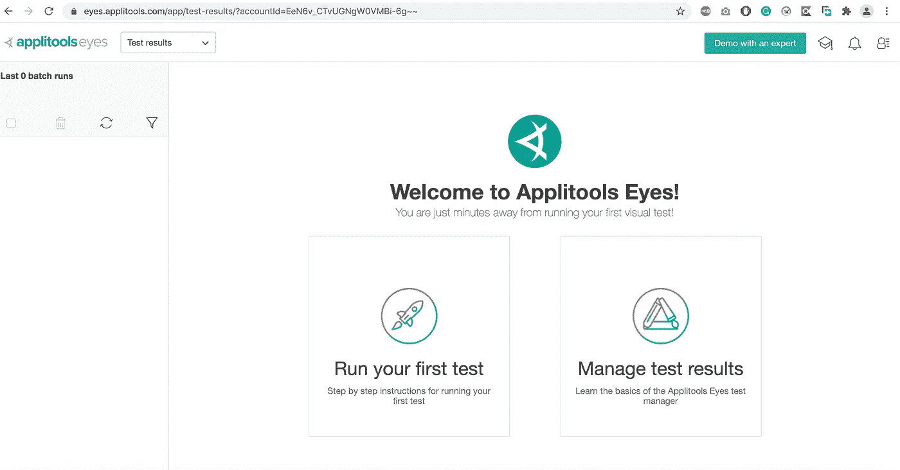
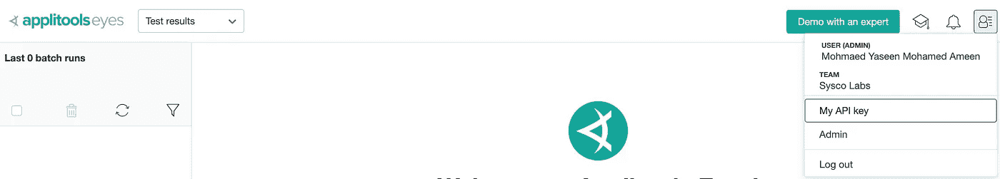
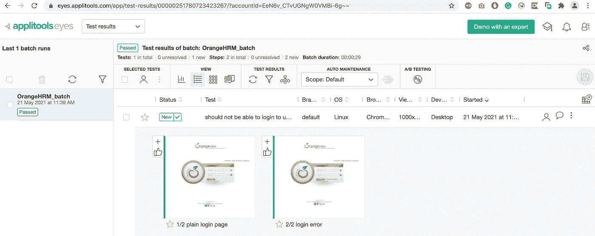
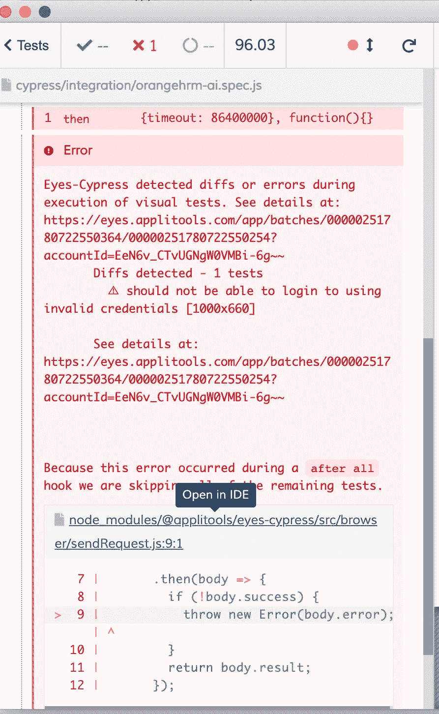
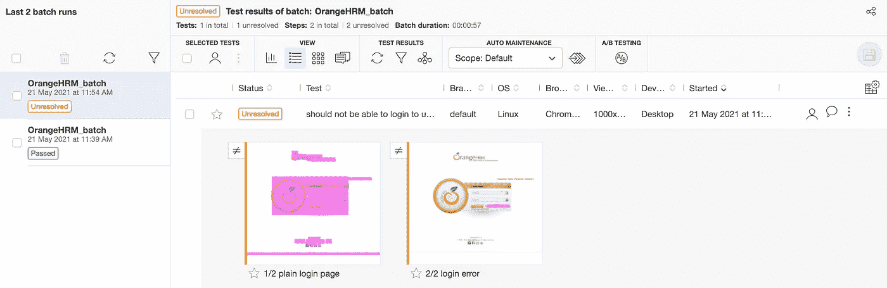
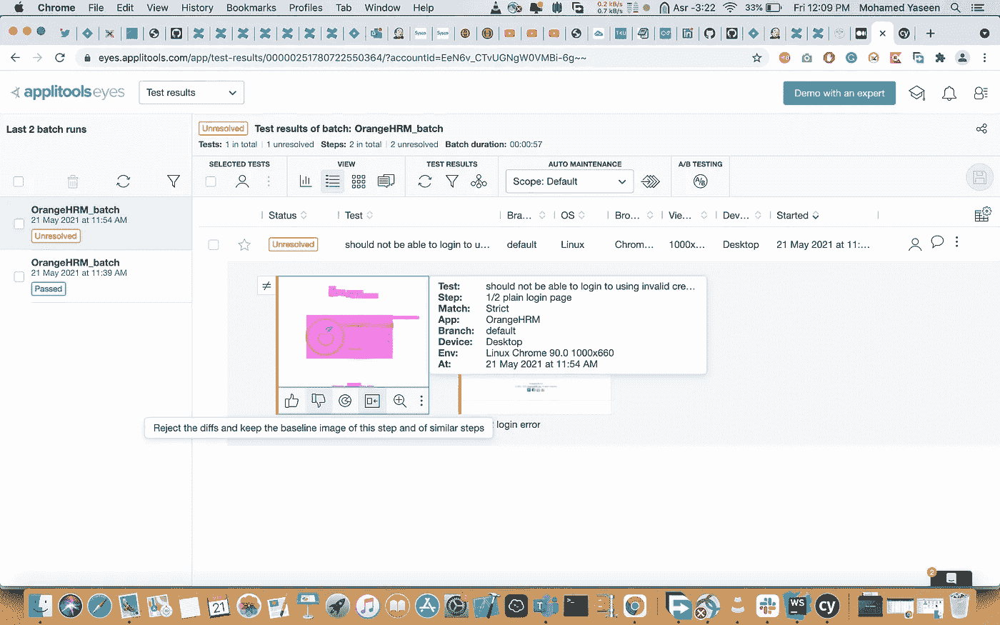
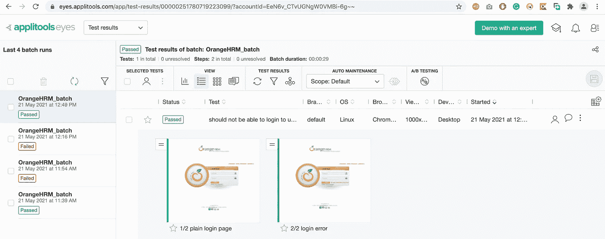
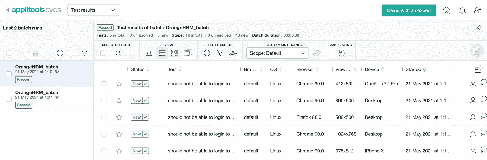

# 使用 AI 和 Cypress 验证 UI

> 原文：<https://medium.com/nerd-for-tech/validating-ui-using-ai-with-cypress-c029ea6b6aa4?source=collection_archive---------15----------------------->


**什么是 Applitools**

Applitools 正在为自动化视觉测试构建云服务。
Applitools Eyes 在所有浏览器、设备和屏幕分辨率上自动验证 UI 布局、内容、功能和外观的正确性。它还支持没有它只能手工完成的自动化测试。更多细节见[http://applitools.com](http://applitools.com/)。

**与 Cypress 集成的应用工具**

前往[http://applitools.com](http://applitools.com/)点击开始按钮进行注册。注册成功后，您可以使用您的凭据登录。然后，您可以看到如下所示的空主页:



然后从用户部分复制 API 密钥，如下所示:



然后导出并将密钥设置为环境变量。

```
export APPLITOOLS_API_KEY={coppied_key}
set APPLITOOLS_API_KEY=...
```

让我们做一些代码来看看结果。在此之前，我们必须使用以下 npm 命令为我们的项目安装和设置 Applitools SDK。

```
npm install @applitools/eyes-cypress --save
npx eyes-setup
```

让我们创建一个名为 orangehrm-ai.spec.js 的测试文件来进行可视化验证。

```
import {Login} from "../pages/Login";
const login = new Login();

describe('AI Validation',()=>{
    beforeEach('navigate to login page',()=>{
        *//cy.eyesOpen - open the eyes for take screenshots* cy.eyesOpen({appName:'OrangeHRM',batchName:'OrangeHRM_batch'})
        login.navigate();
    })
    afterEach('',()=>{
        *//cy.eyesClose - close the eyes for take screenshots* cy.eyesClose();
    })
    it('should not be able to login to using invalid credentials',()=>{
        *// cy.eyesCheckWindow - take a screen shot of the login page and will compare to do with baseline image* cy.eyesCheckWindow('plain login page');
        login.login('Admin','admin');
        cy.eyesCheckWindow('login error');
    })
})
```

现在，您可以在 Applitools 网站上看到使用批次名称创建的基本映像，如下所示:



让我们在登录页面上介绍一个新的 bug 和新的特性改进

```
1\. Bug - **( Username : Admin | Password : admin123 ) removed from the Page** 2.Improvement - **User Credentials are invalid**
```

通过使用 cy.pause()命令。

```
import {Login} from "../pages/Login";
const login = new Login();

describe('AI Validation',()=>{
    beforeEach('navigate to login page',()=>{
        *//cy.eyesOpen - open the eyes for take screenshots* cy.eyesOpen({appName:'OrangeHRM',batchName:'OrangeHRM_batch'})
        login.navigate();
    })
    afterEach('',()=>{
        *//cy.eyesClose - close the eyes for take screenshots* cy.eyesClose();
    })
    it('should not be able to login to using invalid credentials',()=>{
        *// cy.eyesCheckWindow - take a screen shot of the login page and will compare to do with baseline image* cy.pause();
        cy.eyesCheckWindow('plain login page');
        login.login('Admin','admin');
        cy.pause();
        cy.eyesCheckWindow('login error');
    })
})
```

Applitools 网站指出了两个未分类的问题。



让我们对 Applitools 中的差异进行分类。然而，对于第一个图像，选择“不喜欢”按钮以表明这是一个错误，同样地，对于第二个图像，选择“喜欢”按钮以接受该更改作为新的改进。然后 Applitools 将新图像更改为第二基础图像。通过点按磁盘映像来存储更改。我们再跑一次。



现在，您可以看到有一个失败，因为新的 impromenet 作为基础映像进行了更改。让我们要求开发人员修复错误并重新运行测试。



现在你可以看到 bug 被修复，新的改进被接受。多简单啊。

**十字弯弓检查**

让我们做一些修改来检查不同的浏览器。在 cy.eyesOpen()节中定义一些浏览器和设备。

```
import {Login} from "../pages/Login";
const login = new Login();

describe('AI Validation',()=>{
    beforeEach('navigate to login page',()=>{
        *//cy.eyesOpen - open the eyes for take screenshots* cy.eyesOpen({
            appName:'OrangeHRM',batchName:'OrangeHRM_batch',
            browser:[
                **{name:'chrome',width:1024,height:768},
                {name:'chrome',width:800,height:600},
                {name:'firefox',width:500,height:500},
                {deviceName:'iPhone X'},
                {deviceName: 'OnePlus 7T Pro'}**
            ]
        })
        login.navigate();
    })
    afterEach('',()=>{
        *//cy.eyesClose - close the eyes for take screenshots* cy.eyesClose();
    })
    it('should not be able to login to using invalid credentials',()=>{
        *// cy.eyesCheckWindow - take a screen shot of the login page and will compare to do with baseline image* cy.eyesCheckWindow('plain login page');
        login.login('Admin','admin');
        cy.eyesCheckWindow('login error');
    })
})
```

现在，您可以看到我们在整个测试中定义的所有设备的结果如下:

