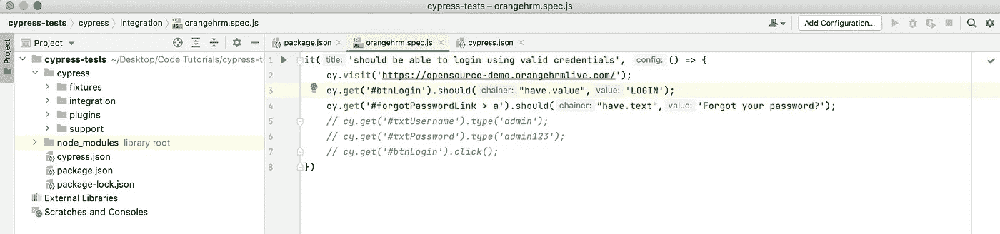
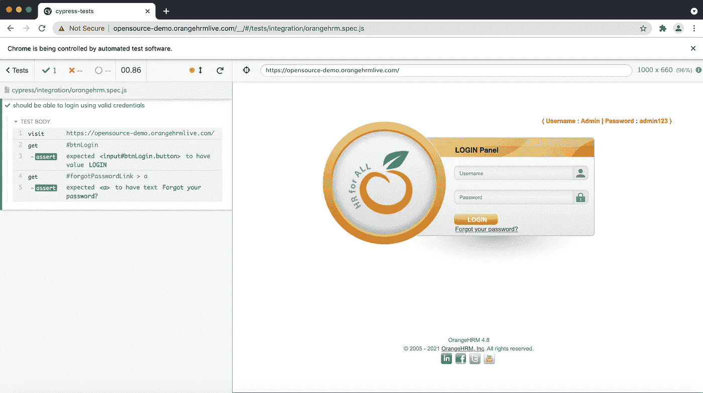
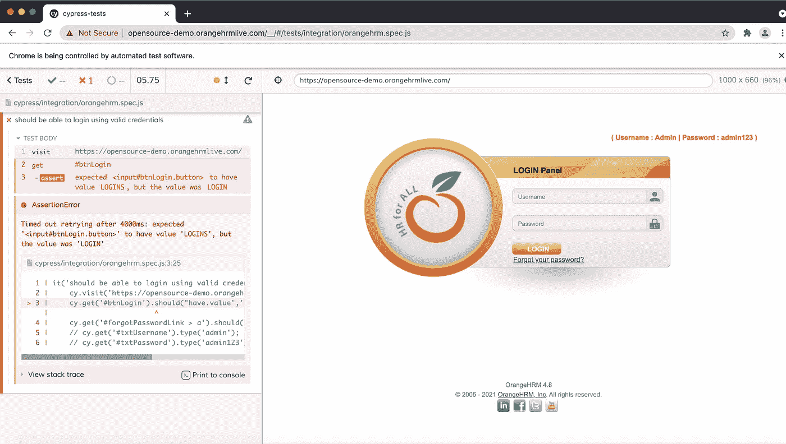
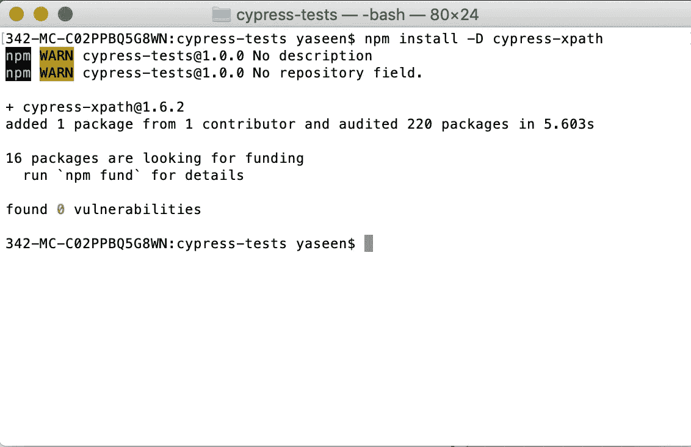
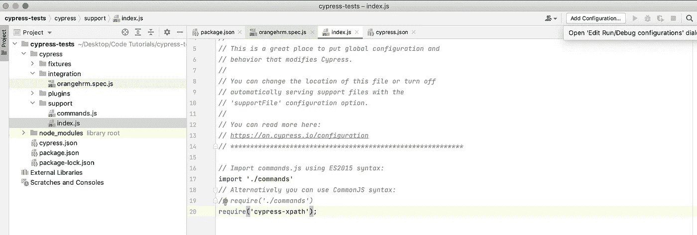
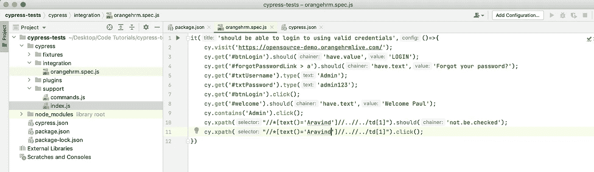
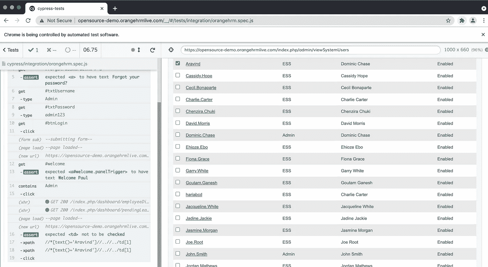

# 用 Cypress-Xpath 模块在 Cypress 中验证

> 原文：<https://medium.com/nerd-for-tech/validations-in-cypress-with-cypress-xpath-module-1ee164dcadb3?source=collection_archive---------16----------------------->


我们需要验证登录按钮和忘记密码链接在页面上可用。


我们需要验证登录按钮和忘记密码链接是否可用，并在页面上显示初始化文本。



我们的主张被通过了。因此，现在我将通过在我们的测试中将 LOGIN 更改为 LOGINS 来使测试失败。如你所见，它得到了断言，但它等待了 4 秒，以防发生变化。Cypress 将等待验证，看看错误有多好。它用漂亮而简洁的英语准确地显示出了错误以及失败的原因。



现在，我们将向测试添加一个验证。该测试将通过登录到页面来扩展，并验证 Aravind 在管理模块中默认情况下没有被选中。为此，我们需要对我们的代码库启用 XPath 验证。因为存在带有动态 id 的数据，所以我们需要通过用户名来选择用户，但是 Cypress 没有使用 XPath 的能力。所以我们需要通过下面的命令将 cypress-xpath 模块安装到我们的代码中。

```
npm install -D cypress-xpath
```



然后包含在项目的 cypress/support/index.js 中

```
require(‘cypress-xpath’);
```



所以成功了，通过了。