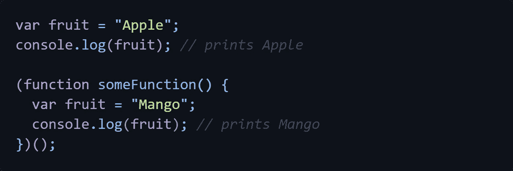
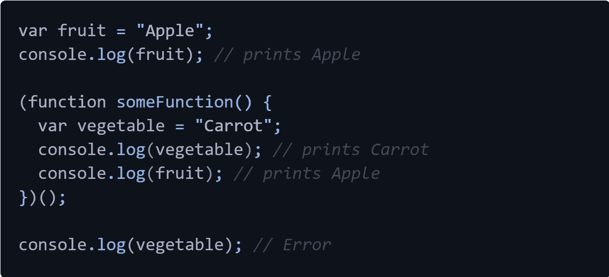
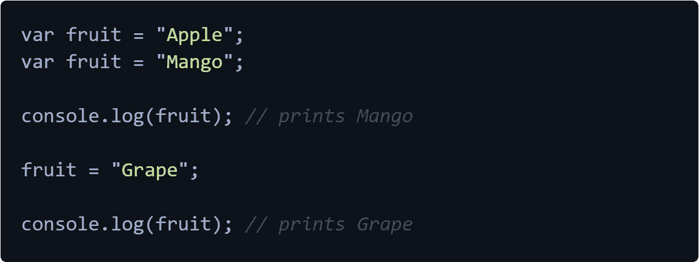
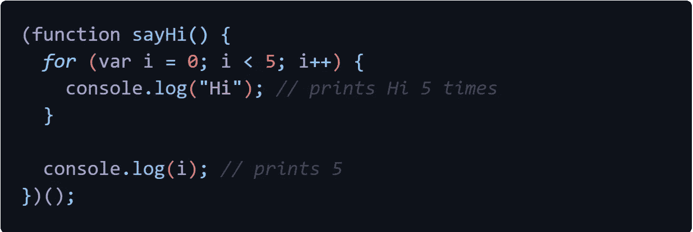
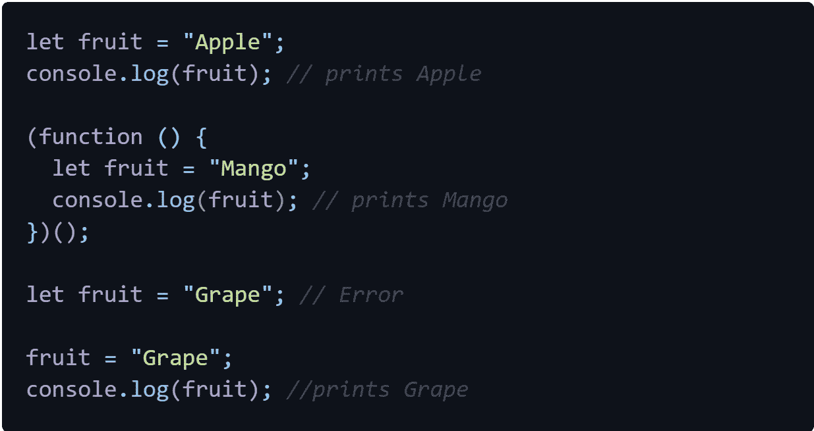
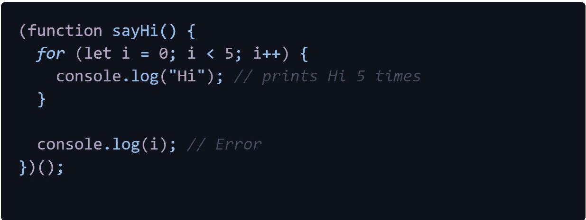
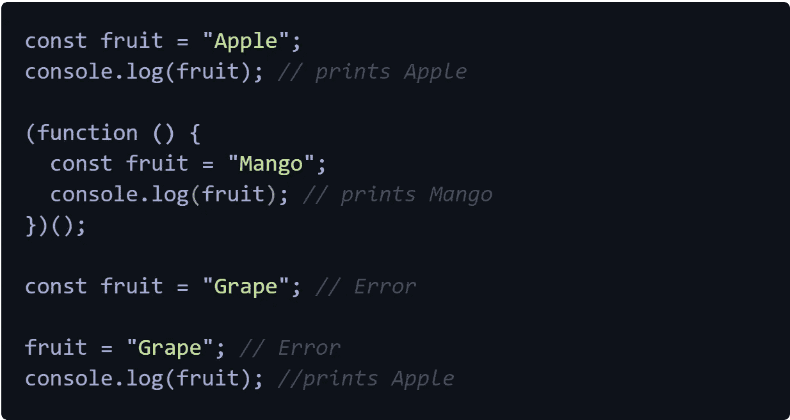
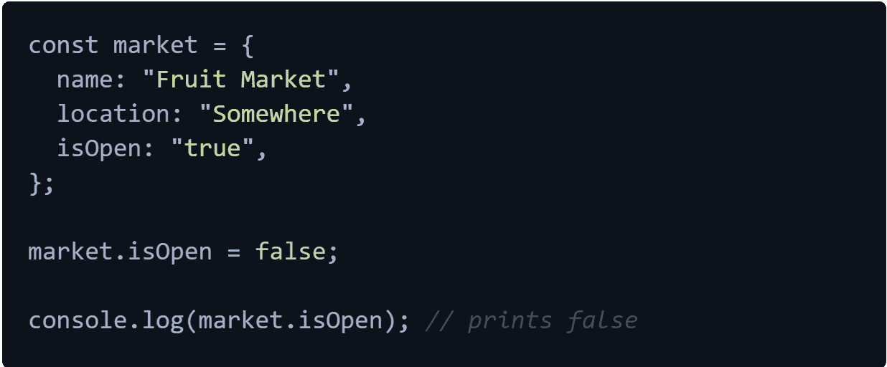

# JavaScript 中的 Var、Let 和 Const

> 原文：<https://medium.com/nerd-for-tech/var-let-and-const-in-javascript-15e41cf90f01?source=collection_archive---------1----------------------->

在 JavaScript 中，var、let 和 const 是创建变量的三种方式。这里，我们就来说说这三种方式的适用范围和区别。

## 变量声明的一点历史

在 JavaScript 之初，有一种方法可以声明变量和，那就是使用 var 关键字。然后在 ES6 中引入了 let 和 const，但是不能马上使用。现在，所有主流的浏览器都兼容 let 和 const 语法，并且大多数开发者现在都使用 let 和 const。

## 定义变量

使用 var 关键字声明的变量作用于当前执行上下文。这意味着如果它们在函数内部，我们只能在函数内部访问它们。如果它们不是，它们是我们可以在任何地方访问的全局范围的一部分。请看下面的例子，以便更好地理解。

这里芒果属于功能范围，苹果属于全局范围。如果我们试图访问一个全局变量。但是如果我们试图访问一个函数作用域的变量，这是不可能的。看下面另一个例子。

使用 var 关键字的一个问题是它们可以在同一个范围内被重新声明。这将带来一些严重的问题，如果我们在同一个范围内使用相同的名字声明另一个变量，新的变量将替换旧的变量。var 也可以更新。

var 的另一个问题是，这些变量不是块范围的，这意味着如果我们有条件语句，它们的范围不是该语句，而是整个函数或全局范围。

## 让

这是 var 声明的改进版本。使用这种方式的变量声明消除了我们前面讨论的所有问题。let 创建块范围的变量。此外，它们不能重新申报，但可以更新。下面的例子表明使用 let 比 var 更好。

查看下面的示例，了解更多关于块范围内 let 的行为。

## 常数

常量变量不能更新或重新声明。这种方式用于声明常数。与 let 声明相同，const 声明是块范围的。不像 var 和 let，如果我们用 const 来声明一个必须初始化的变量。

如果我们在创建对象时使用 const，我们仍然可以更新对象内部的属性。为了更好的理解，请参考下面的例子。

我个人更喜欢使用 let 和 const 而不是 var，并且使用 const 来声明常量变量，如果它不是常量，则总是使用 let 来声明变量。