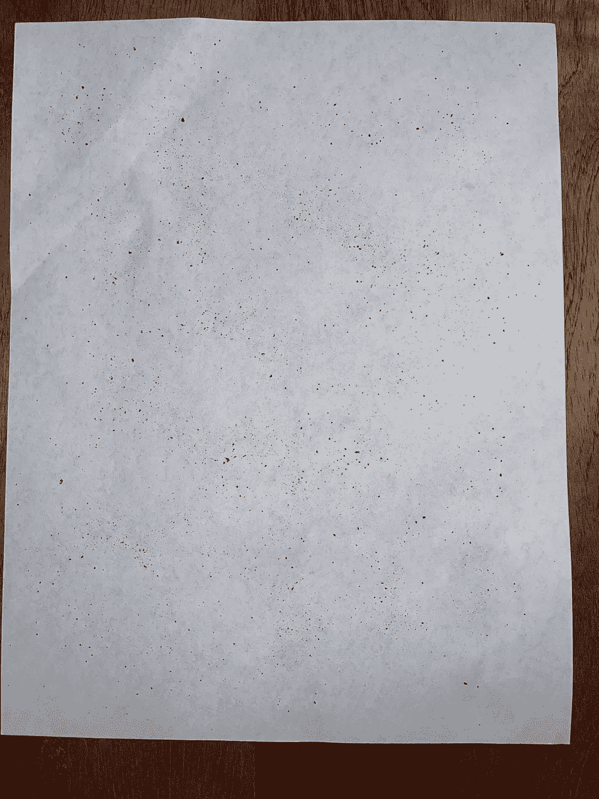
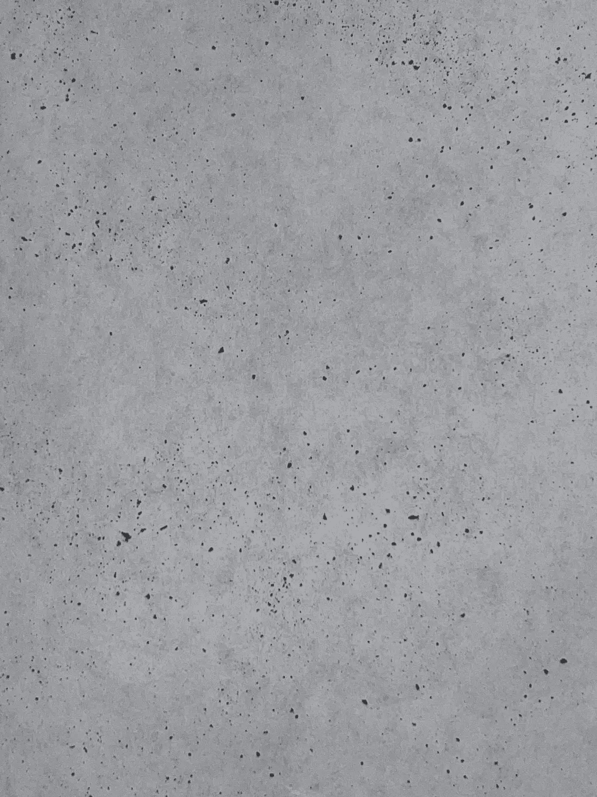
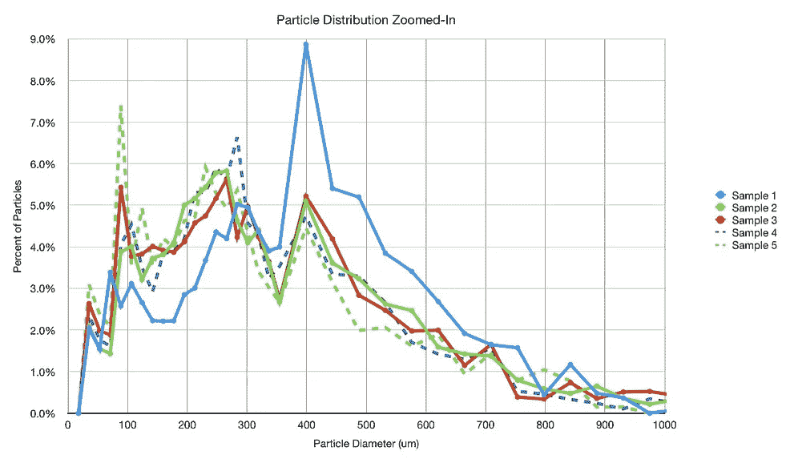
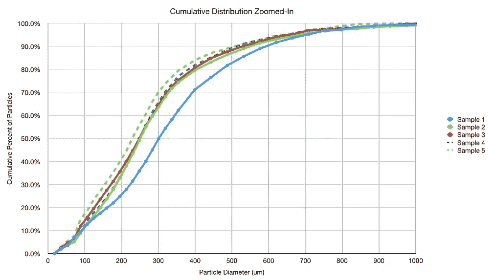
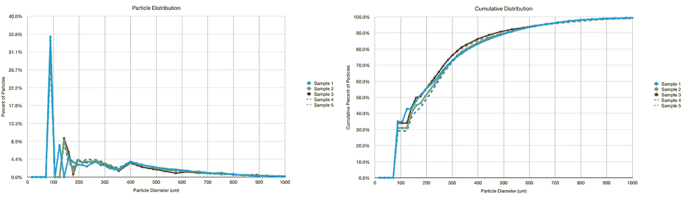

# 咖啡颗粒分布测量的可变性

> 原文：<https://medium.com/nerd-for-tech/variability-in-coffee-particle-distribution-measurement-593115aa5a75?source=collection_archive---------17----------------------->

## 咖啡数据科学

## 合格算法性能

我想知道如何重复测量咖啡颗粒。与激光或筛选技术相比，该方法仍然没有很好的性能，主要是因为从 2D 图像中估计体积。然而，如果它可以提供一致的结果，那么它是一个有用的工具，让我了解研磨分布的变化如何影响拍摄。

为了检查可变性，我取了一些相同研磨的样品，并将它们相互比较。对于每一张，我都拍了两张照片:普通的和放大的。我用这张纸的正常图像来计算像素/毫米，然后我知道我放大了多少，就缩放这个因子。

所有图片由作者提供

我通常会看着放大的图像，以获得更多关于罚款的细节(<100um). In this view, the distributions seem to align well except for one sample which seems to have a huge spike at 400um diameter.

So I looked at the normal view to verify because for the normal view, 400um is easily resolved (it’s less than 200um that is tricky for that view). In this view, the distributions line up very well, and the blimp isn’t in the first sample, which suggests it was an error in the zoomed in photo.

It should be noted that there is a high spike at the lowest bin which could be a threshold issue for the image. However, it is consistent across samples, so with respect to understanding variability, it is shows a consistency in measurement.

There is some varibility in the distributions, but the amount of variability is low enough for me to have confidence using a single sample per coffee grind when evaluating grind distributions.

If you like, follow me on [Twitter](https://mobile.twitter.com/espressofun?source=post_page---------------------------) 和 [YouTube](https://m.youtube.com/channel/UClgcmAtBMTmVVGANjtntXTw?source=post_page---------------------------) ，我在那里发布不同机器上的浓缩咖啡拍摄视频和浓缩咖啡相关的东西。你也可以在 [LinkedIn](https://www.linkedin.com/in/robert-mckeon-aloe-01581595?source=post_page---------------------------) 上找到我。也可以在[中](https://towardsdatascience.com/@rmckeon/follow)或者 [Patreon](https://www.patreon.com/EspressoFun) 上关注我。

# [我的进一步阅读](https://rmckeon.medium.com/story-collection-splash-page-e15025710347):

[浓缩咖啡系列文章](https://rmckeon.medium.com/a-collection-of-espresso-articles-de8a3abf9917?postPublishedType=repub)

[工作和学校故事集](https://rmckeon.medium.com/a-collection-of-work-and-school-stories-6b7ca5a58318?source=your_stories_page-------------------------------------)

[个人故事和关注点](https://rmckeon.medium.com/personal-stories-and-concerns-51bd8b3e63e6?source=your_stories_page-------------------------------------)

[乐高故事启动页面](https://rmckeon.medium.com/lego-story-splash-page-b91ba4f56bc7?source=your_stories_page-------------------------------------)

[摄影启动页面](https://rmckeon.medium.com/photography-splash-page-fe93297abc06?source=your_stories_page-------------------------------------)

[使用图像处理测量咖啡研磨颗粒分布](https://link.medium.com/9Az9gAfWXdb)

[改进浓缩咖啡](https://rmckeon.medium.com/improving-espresso-splash-page-576c70e64d0d?source=your_stories_page-------------------------------------)

[断奏生活方式概述](https://rmckeon.medium.com/a-summary-of-the-staccato-lifestyle-dd1dc6d4b861?source=your_stories_page-------------------------------------)

[测量咖啡磨粒分布](https://rmckeon.medium.com/measuring-coffee-grind-distribution-d37a39ffc215?source=your_stories_page-------------------------------------)

[咖啡萃取](https://rmckeon.medium.com/coffee-extraction-splash-page-3e568df003ac?source=your_stories_page-------------------------------------)

[咖啡烘焙](https://rmckeon.medium.com/coffee-roasting-splash-page-780b0c3242ea?source=your_stories_page-------------------------------------)

[咖啡豆](https://rmckeon.medium.com/coffee-beans-splash-page-e52e1993274f?source=your_stories_page-------------------------------------)

[浓缩咖啡滤纸](https://rmckeon.medium.com/paper-filters-for-espresso-splash-page-f55fc553e98?source=your_stories_page-------------------------------------)

[浓缩咖啡篮及相关主题](https://rmckeon.medium.com/espresso-baskets-and-related-topics-splash-page-ff10f690a738?source=your_stories_page-------------------------------------)

[意式咖啡观点](https://rmckeon.medium.com/espresso-opinions-splash-page-5a89856d74da?source=your_stories_page-------------------------------------)

[透明 Portafilter 实验](https://rmckeon.medium.com/transparent-portafilter-experiments-splash-page-8fd3ae3a286d?source=your_stories_page-------------------------------------)

[杠杆机维修](https://rmckeon.medium.com/lever-machine-maintenance-splash-page-72c1e3102ff?source=your_stories_page-------------------------------------)

[咖啡评论和想法](https://rmckeon.medium.com/coffee-reviews-and-thoughts-splash-page-ca6840eb04f7?source=your_stories_page-------------------------------------)

[咖啡实验](https://rmckeon.medium.com/coffee-experiments-splash-page-671a77ba4d42?source=your_stories_page-------------------------------------)