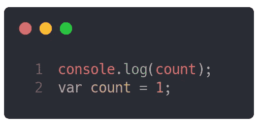
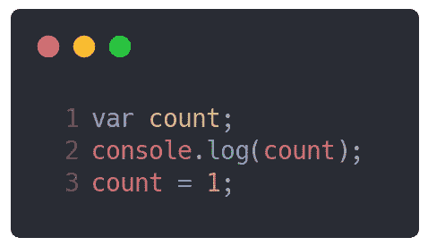
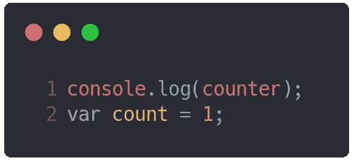
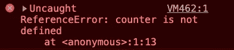
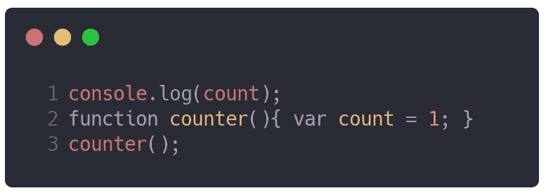
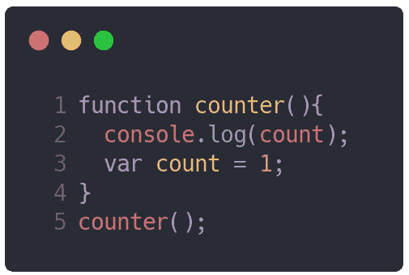
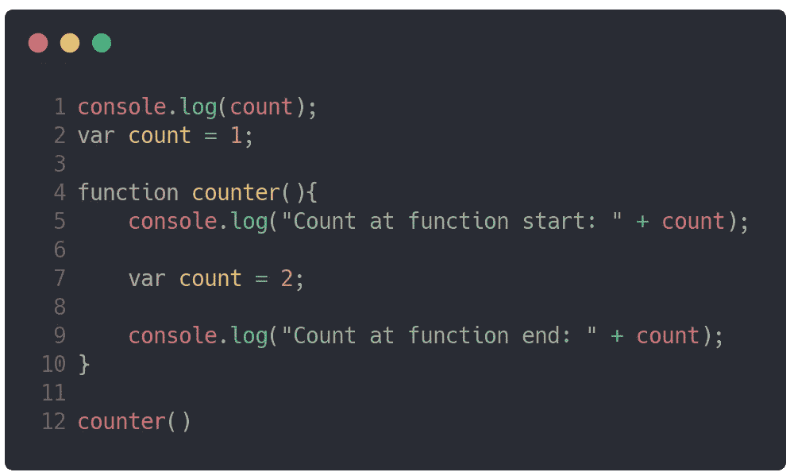
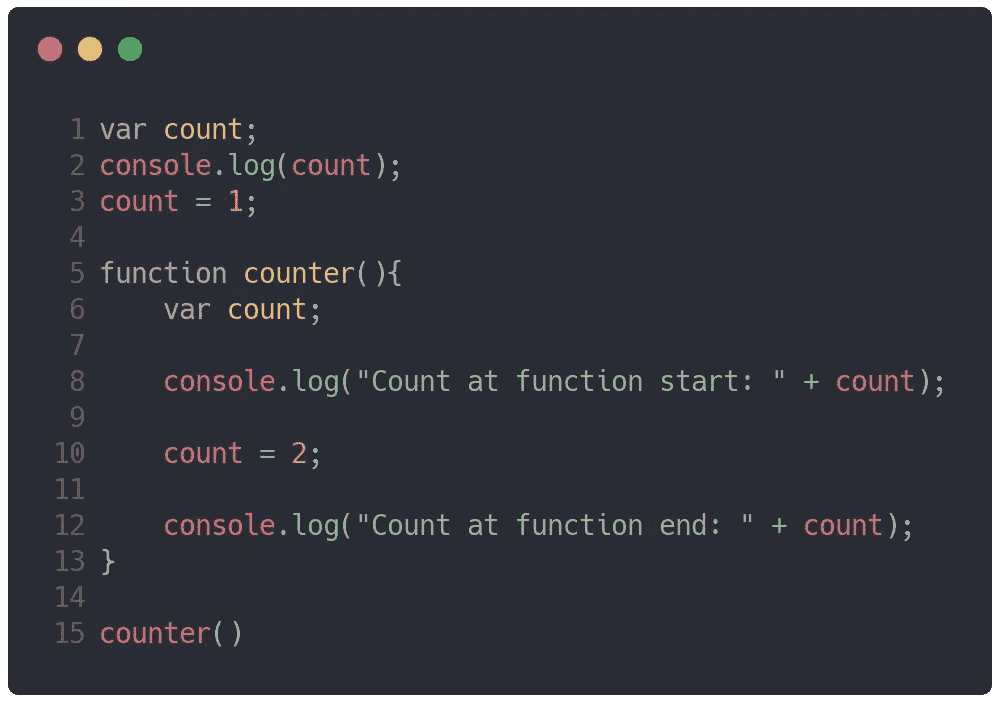
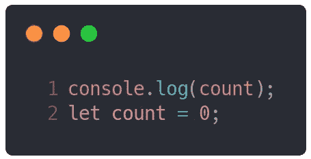
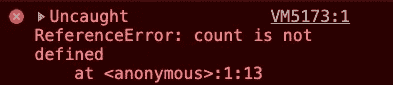

# Javascript 中的变量提升

> 原文：<https://medium.com/nerd-for-tech/variable-hoisting-in-javascript-9dcc5d6886ba?source=collection_archive---------9----------------------->

照片由 [Artem Sapegin](https://unsplash.com/@sapegin?utm_source=unsplash&utm_medium=referral&utm_content=creditCopyText) 在 [Unsplash](/s/photos/javascript?utm_source=unsplash&utm_medium=referral&utm_content=creditCopyText) 上拍摄

# 介绍

让我们首先从回答这个问题开始: ***下面给出的代码输出会是什么？***

产量是多少？

如果您猜测输出为`undefined`，那么您是正确的！这是吊装。从逻辑上讲，这应该会产生一个错误，因为您试图访问在 log 语句之后声明的变量，但这并没有发生。为什么？让我们理解！

提升发生在全局执行上下文的创建阶段。全局执行上下文有两个执行阶段:*创建*和*执行*。

# 技术上发生了什么？

在*创建*阶段，Javascript 引擎将变量声明添加到内存中，并用值`undefined`初始化它。因此，你得到的值是`undefined`。

在*执行*阶段，代码将如下所示:

在执行阶段，代码看起来会像这样。

> **注**:上面的代码只是让你理解的东西。引擎实际上并不移动顶部的代码。代码保持键入时的状态。

太好了！这是吊装！

> **注意** : Javascript 只提升声明，不提升初始化。这意味着无论何时遇到一个声明，它都会以一个未定义的值添加到内存中。实际的初始化值不是在编译时添加到内存中，而是在运行时添加。

# 如果变量根本不存在呢？

这是理解吊装的一个大问题。当 Javascript 代码中存在声明时，就会发生提升(声明的位置也很重要)。让我们举一个例子。让我们运行这段代码:

这段代码的输出是什么？

代码的输出是:

因此，当变量不存在(没有声明)时，提升将不工作。

# 如果变量的范围不同呢？

让我们了解一下，如果变量在函数内部声明，而在函数外部访问，会发生什么。让我们考虑这个代码:

这段代码的输出会是什么？

从逻辑上讲，由于局部变量和作用域的概念，不能在外部访问`count`变量。因此，我们可以猜测输出应该还是一个错误。以下是输出:

所以，我们猜对了！我们不能访问`counter()`函数范围之外的变量。但是吊装呢？为什么没有发生吊装？原因是因为执行上下文。当 Javascript 代码执行时，会创建一个全局执行上下文。因此，全局范围内的任何变量都被提升，但在这种情况下，`count`变量在函数`counter()`中被初始化和声明。`counter()`函数有它的执行上下文！记住，*提升发生在每个执行上下文*中。因此，如果我们在计数器函数中的变量声明前添加一个`console.log()`语句，变量`count`将被提升。让我们来测试一下吧！代码:

输出会是什么？

是的，正如我们预测的那样，我们得到的输出是`undefined`。

# 同名变量在不同作用域声明怎么办？

这又是一个令人兴奋的问题！让我们考虑这个代码:

输出会是什么？

让我们从逻辑上来看这个问题。由于提升，第 1 行的`console.log(count)`将打印`undefined`。在这之后，函数`counter()`被添加到调用堆栈中，并且`counter()`函数有了它的执行上下文。由于变量`count`在`counter()`功能执行上下文中被提升，第 5 行的`console.log()`将再次变为`undefined`。接下来，第 9 行的`console.log()`将打印`2`，因为声明的`count`变量将被赋值为`2`。在执行阶段，它看起来像这样:

在执行阶段，它看起来会像这样。

对于那些想知道的人，为什么前面代码中第 5 行的`console.log()`语句没有打印出值:1？这是因为范围链。由于`console.log()`语句在函数内(局部范围)，Javascript 将在`counter()`函数内寻找变量`count`。如果它遇到了变量，它将提供对遇到的变量的引用。否则，Javascript 将开始在全局范围内寻找变量(沿着范围链)。在我们的例子中，由于变量`count`在`counter()`函数的执行上下文中被提升，Javascript 返回存储在内存中的初始值(`undefined`)。

> **注意**:提升发生在创建阶段。上述过程发生在执行阶段，因此 Javascript 可以返回变量的值。

以下是上述代码的执行上下文的可视化表示:

可视化工具链接:[https://ui.dev/javascript-visualizer/](https://ui.dev/javascript-visualizer/)

现在，这都是关于可变提升。如果发生了提升，但是我们收到一个错误，该怎么办？让我们了解他们！

让我们考虑一个例子。看一下这个简单的代码，然后猜猜输出会是什么:

输出会是什么？

嗯，如果你猜的是`undefined`，那你就不正确。在这里，事情变得复杂。如果执行这段代码，我们会得到一个错误:

为什么我们会收到一个错误？这是因为所谓的**时间死区。**当引擎遇到带有`let`关键字的变量时，它会将变量添加到内存中，而不进行任何初始化(发生提升，但没有`undefined`的值)。只有当引擎在运行时遇到它的实际声明(`let count = 0`)时，变量才会被初始化。如果声明不包括初始化(`let count;`)，那么引擎将为`count`变量赋值`undefined`。总之，在运行时引擎评估`count`变量初始化之前，不能访问该变量。这被称为**时间死区**。我们收到这个错误是因为我们试图在变量创建和初始化之间访问`count`变量。

> **注意** : Javascript 吊声明(`var`、`let`、`const`、`function`、`class`)。这里唯一的概念是`let`和`const`声明没有初始化，但是`var`声明是用`undefined`初始化的。

# 结论

提升并不意味着 Javascript 代码被引擎移到顶部。它基于一个叫做词汇环境的概念。提升不仅发生在变量上。它出现在类、函数、变量等声明中。提升是默认的 Javascript 行为。为了避免提升的后果(未定义的变量)，我们应该在作用域的顶部声明我们的变量。

我的下一篇文章将讨论 Javascript 中的函数提升。如果你喜欢这篇文章，掌声会激励我写更多这样的文章😃。