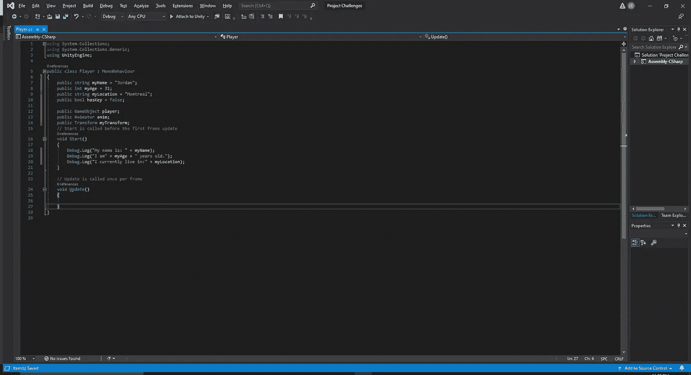
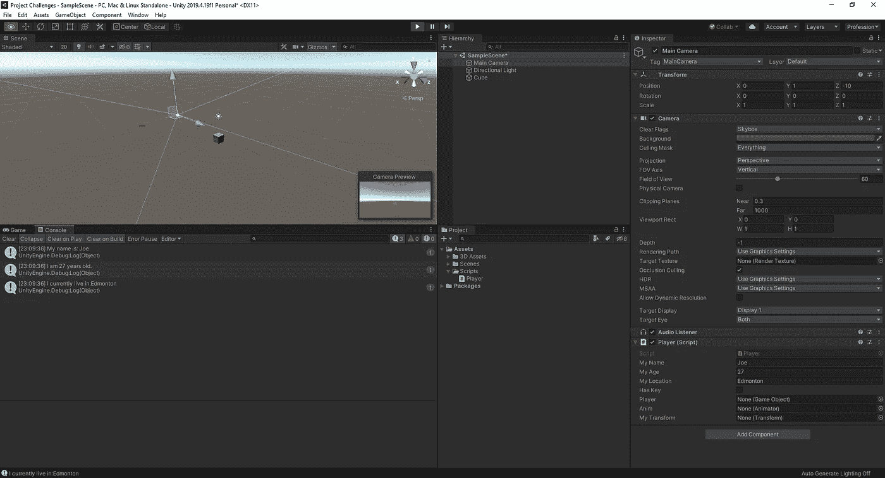
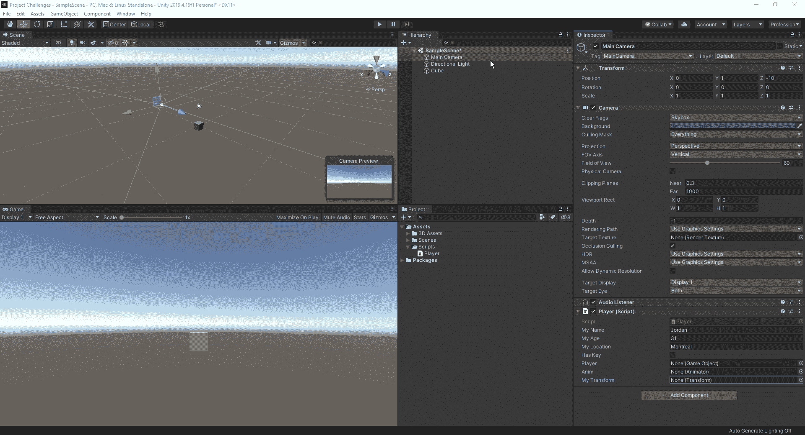
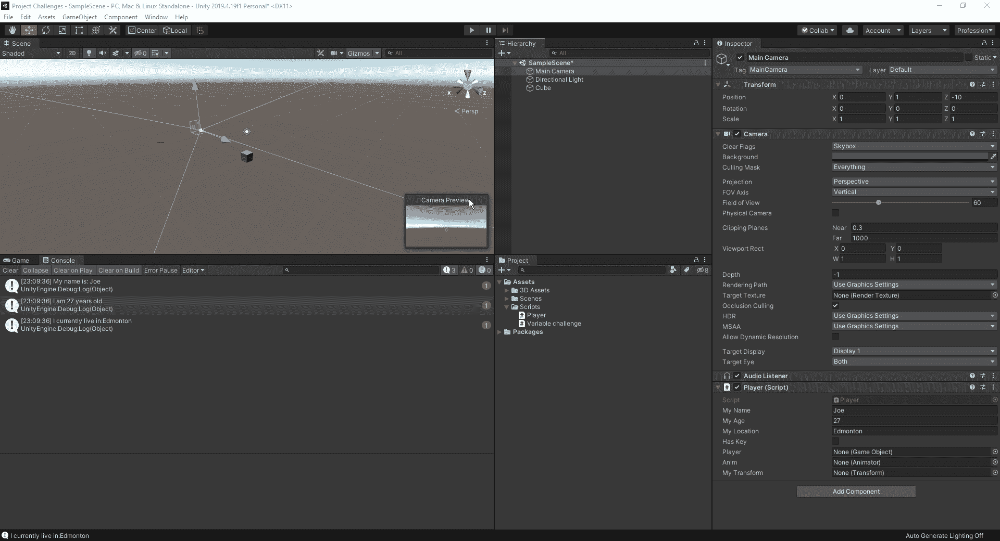
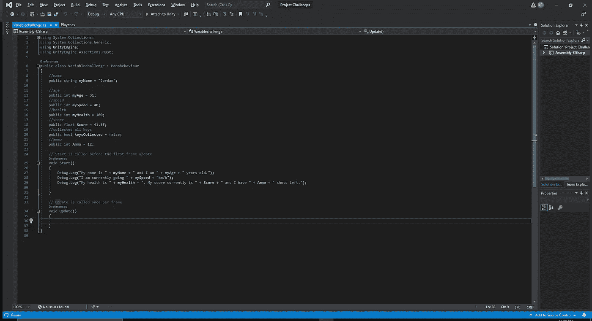
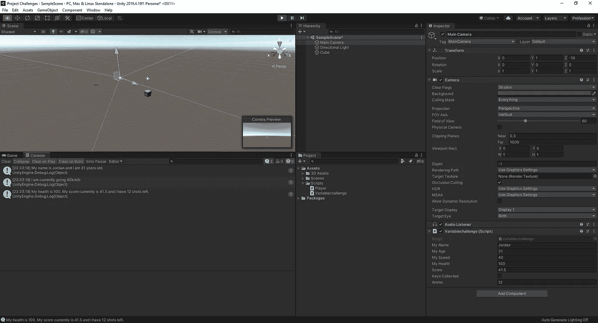
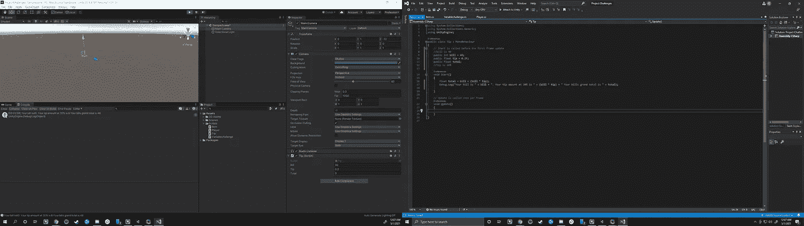
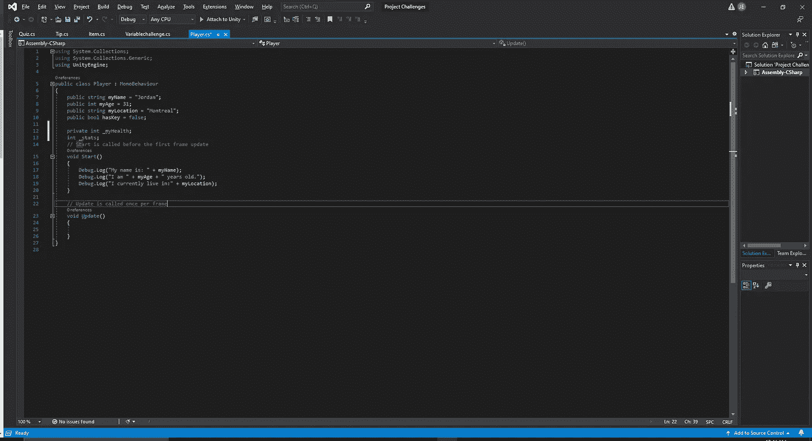

# 变量

> 原文：<https://medium.com/nerd-for-tech/variables-7c4cb06a757e?source=collection_archive---------14----------------------->

所以，在我们开始调整我们的球员之前，我们应该有一个简单的关于变量的概述，以及如何在基础水平上工作。变量就像装有信息的盒子。我们在游戏中看到的一些常见的东西是你在糖果粉碎游戏中得到的分数、你的名字、你的健康状况等等。

有三个必需组件和可选的第四个组件。它们是公共/私有引用，数据类型，每个变量都需要一个名字，可选的第四个是一个值。

公共引用，任何人都可以在编辑器中访问和操作它。

私有引用，只有有权访问脚本的人才能调整变量。

数据类型，这是定义我们的变量。4 种流行的数据类型是:

字符串→它们是文本的字符，如名称、句子、工具提示

布尔→这些是正确或错误的陈述。比如，如果你对一个敌人造成了伤害，是否足以杀死它，否则它仍然活着。我们将在以后的文章中更详细地讨论 bools。

浮点值→这是我们在游戏中使用的十进制值，如行进距离、闪避几率或临界速度。每当我们处理浮点值时，我们必须确保在数字的末尾加一个 f，例如 10f。

整数→这是某个东西的整体值，比如生命值、获得的点数或一个剪辑中剩余的子弹。

# 测试变量

现在我们知道了什么是变量，让我们试着在我们的脚本中做一些，看看当我们在 Unity 中玩我们的场景时会发生什么。

如您所见，我们测试了各种不同的变量类型。我们有一串文本，一个整数和一个布尔值。然而，为了查看当我们点击 play 时这些变量发生了什么，我们必须使用 debug。在控制台中查看出现了什么。这是一个很好的简单的方法，用来测试您添加到脚本中的内容，看看它是否按照您想要的方式运行。是否像弹出你的名字或年龄一样简单，或者像你的物体接触到你场景中的东西。

正如我们在控制台中看到的，我们在 void start 中键入的所有内容都显示了出来。现在，如果我们想改变周围的一些变量，我们可以直接从检查器并调整它，而不是每次都去脚本，因为我们设置我们的变量是公共的。

接下来，我们将把我们的转换添加到我们在脚本中创建的变量中，只需点击并向下拖动它。

这让我们可以随时知道物体的位置。它还向我们展示了只需单击、拖放您希望从其他对象输入的信息到我们创建的变量中是多么容易。如果我们希望将所有变量重置为我们之前创建的脚本中的默认值，需要做的就是单击脚本组件末尾的 3 个点，然后选择 reset。

组件重置

现在，让我们把事情做得更详细一点，增加几行脚本，并加入一些更有趣的句子。

这里我们使用了更多的变量，数据类型也各不相同。为了我们的调试。日志，我们创造了完整的句子，而不是简单的“我的年龄是 __”。如果它是一个长句子，在结构之间输入了变量，我们必须确保在开头的末尾放置一个空格，然后在句子的下一部分的开头放置一个空格。

# 提示示例

让我们创建一个简单的例子，说明如何在一个脚本中制作一个小费计算器，并让它在 Unity 中为您打印总数。

正如我们所看到的，你可以很容易地让 Unity 为你做数学计算。当你需要编写更复杂的代码来决定击中一个敌人时它还剩下多少生命值，你的致命一击几率，它会对你的攻击造成多少额外伤害，或者杀死一个怪物会给你的下一关带来多少%的收益时，这就派上用场了。

如果我们在同一个数据类型后面有多个值，并且一个项目的多个类型有不同的值，我们可以为每个变量共享同一行，并且在每个项目之间放一个逗号。这样，我们就不需要多次输入数据类型，只需要将不同类型的变量赋给该数据类型。

最后，我们将回顾最佳实践，使您的编码遵循更多的。net standard，它让你和任何可能与你一起工作的人的生活更加轻松。当你创建一个 public 或者 private 的时候，为了帮助区分它们，我们给任何一个 private 变量加一个 _。

同样，我们没有把 public 或 private 放在数据类型的前面，Unity 会把它赋值为 private 值，所以我们总是把 _ 放在类型变量名称的前面。现在我们对变量有了更多的了解，我们可以回到我们正在开发的游戏中，更多地使用速度变量，这样我们就不会以极快的速度飞过屏幕。