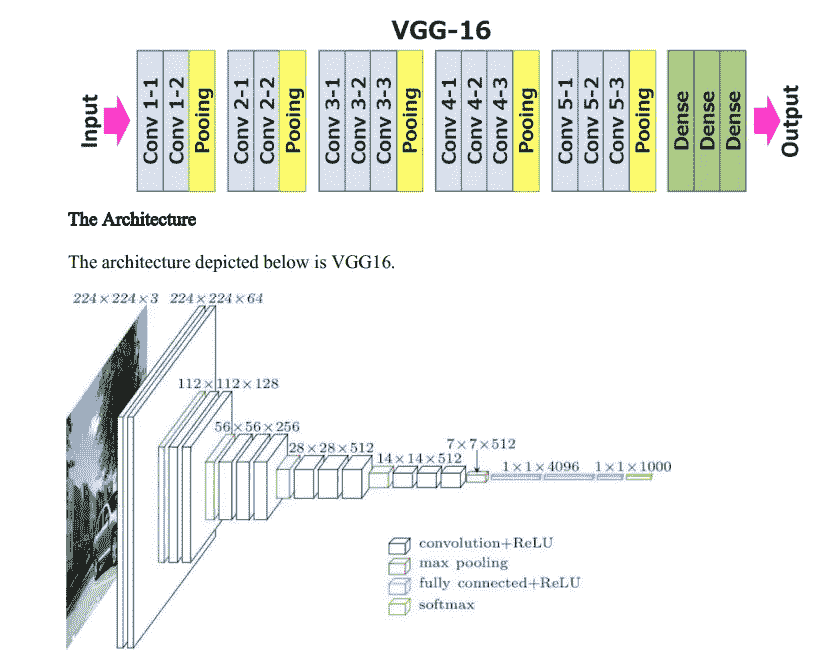

# VGG 16 最简单的解释

> 原文：<https://medium.com/nerd-for-tech/vgg-16-easiest-explanation-12453b599526?source=collection_archive---------6----------------------->

VGG16:它是由牛津大学的 K. Simonyan 和 A. Zisserman 在论文“用于大规模图像识别的非常深的卷积网络”中提出的卷积神经网络模型。该模型在 ImageNet 中取得了 92.7%的 top 5 测试准确率，ImageNet 是属于 1000 个类别的超过 1400 万个图像的数据集。它是提交给 ILSVRC-2014 的著名模型之一。它通过用多个 3×3 内核大小的滤波器相继替换大内核大小的滤波器(第一和第二卷积层中分别为 11 和 5 个)来改进 AlexNet。VGG16 接受了数周的训练，使用的是英伟达 Titan Black GPUs。

Cov1 层的输入是固定大小的 224 x 224 RGB 图像。图像通过卷积(conv)堆栈。)层，其中滤光器与非常小的感受野一起使用:3×3(这是捕捉左/右、上/下、中心概念的最小尺寸)。其中一种配置也利用 1×1 卷积滤波器，可视为输入通道的线性变换。卷积步长固定为 1 像素，即 Conv 的空间填充。层输入是这样的，空间分辨率在卷积后保持不变，即对于 3×3 Conv，填充是 1 像素。层次。空间池由遵循某些 Conv 的五个最大池图层执行。层次。最大池在 2×2 像素窗口上执行，步长为 2。三个全连接(FC)层跟随卷积层的堆栈(在不同的架构中具有不同的深度):前两个各具有 4096 个信道，第三个执行 1000 路 ILSVRC 分类，因此包含 1000 个信道。最后一层是 softmax 层。全连接层的配置在所有网络中都是相同的。所有隐藏层都配备了校正(ReLU)非线性。还要注意的是，没有一个网络(除了一个)包含局部响应归一化(LRN)，这种归一化不会提高在 ILSVRC 数据集上的性能，但会导致内存消耗和计算时间增加