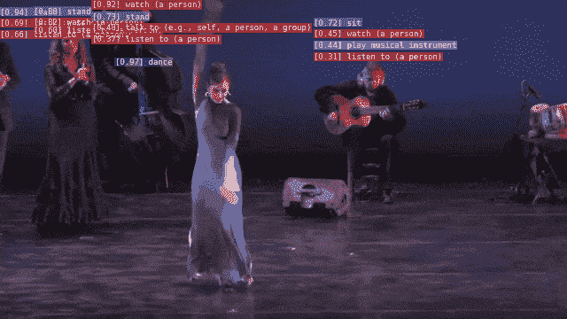

# 使用 PytorchVideo 的视频分类

> 原文：<https://medium.com/nerd-for-tech/video-classification-using-pytorchvideo-cd8567d266cd?source=collection_archive---------9----------------------->

## 现在用几行代码对任何视频进行分类



一种基于 PyTorchVideo 的视频动作检测模型。

脸书最近发布了一个名为 Pytorch 的视频库。通常，到目前为止，基于视频的框架从来没有让我兴奋过，因为它需要很高的计算成本和内存。但是有了 Pytorchvideo，这两个问题都处理得相当有效率。它不仅速度超快，而且在移动硬件的支持下，对内存的要求也不高。

所以在这篇博客中，我将给你一个 5 分钟的图书馆演示。

# 关于 PytorchVideo

PyTorchVideo 是一个深度学习库，用于视频理解的研究和应用。它提供了 PyTorch 中最先进的视频模型、数据集、转换和工具的易用、高效和可重复的实现。

除此之外，它还可以考虑其他形式，如音频和文本。此外，它还支持使用[加速器](https://pytorchvideo.readthedocs.io/en/latest/accelerator.html)包的移动设备。

现在让我们看看 PyTorch 的视频。首先，我们来看一段 youtube 视频。

我们来给上面的视频分类。

首先，安装 pytorchvideo 库包

```
pip install pytorchvideo
```

此外，导入包含类的 JSON 文件

```
!wget [https://dl.fbaipublicfiles.com/pyslowfast/dataset/class_names/kinetics_classnames.json](https://dl.fbaipublicfiles.com/pyslowfast/dataset/class_names/kinetics_classnames.json)
```

最终代码

这就是使用 PytorchVideo 对视频进行分类的全部内容。希望你喜欢！