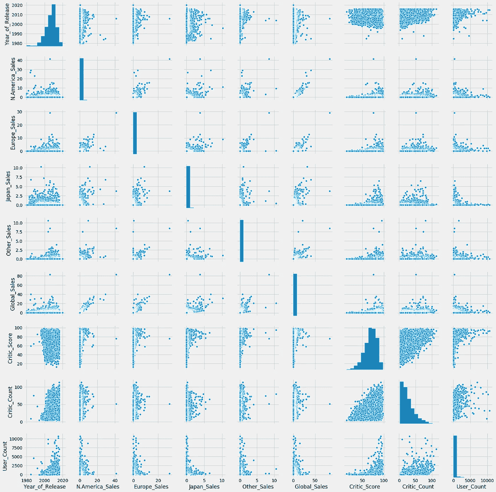
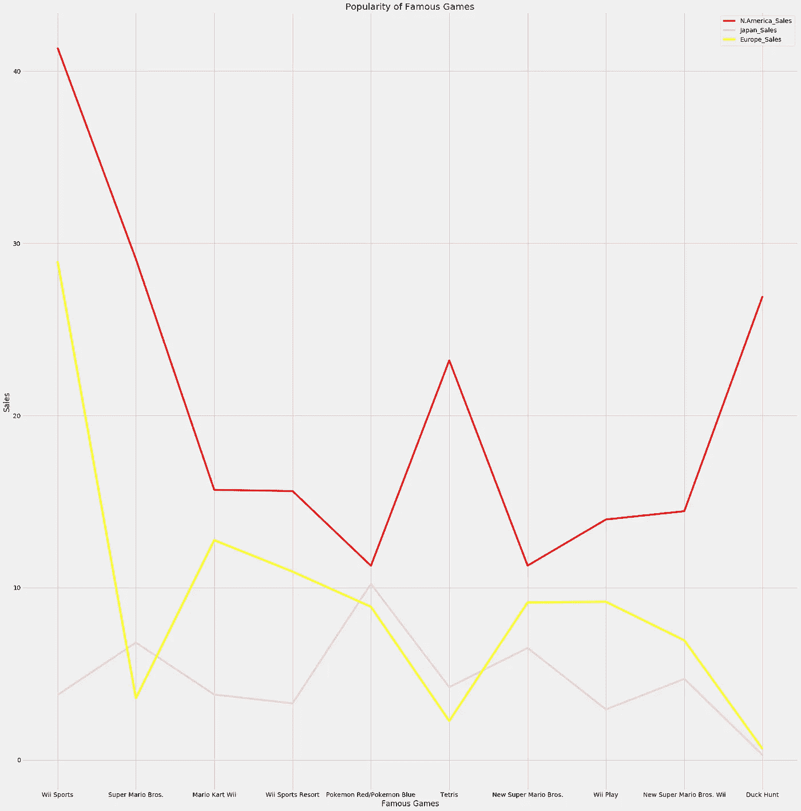
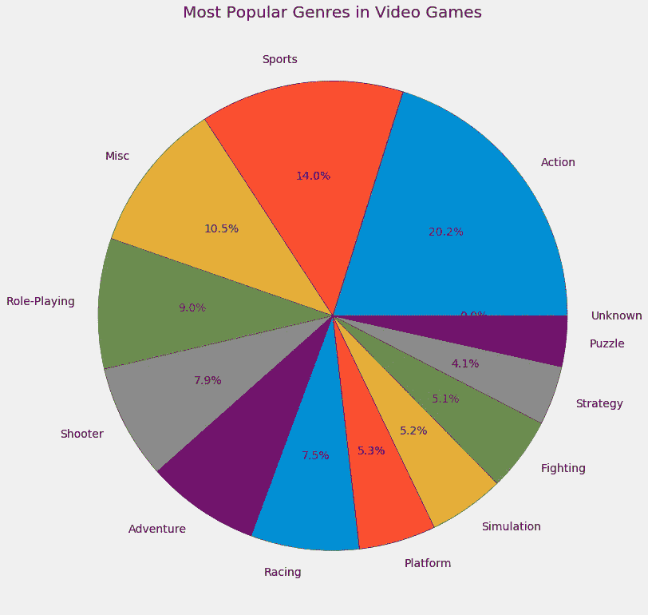
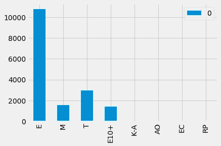

# 用 Python 进行视频游戏销售分析

> 原文：<https://medium.com/nerd-for-tech/video-game-sales-analysis-with-python-68c60648820f?source=collection_archive---------0----------------------->


# 目标是将数据转化为信息，将信息转化为洞察力。-卡莉·弗洛里纳

无论你是数据科学家还是 ML 工程师，数据分析都是你生活中不可或缺的一部分。吴恩达在他的一次网络研讨会上说，他的团队在他们的研究实验室中做的大部分工作是数据清理和分析，然后将它们输入到 ML 模型中。这表明在应用 ML 或 DL 算法之前理解和分析数据是多么重要。

在这篇博客中，我们将使用一个很酷的数据集，它包含了 2015 年以来世界各地的视频游戏销售数据。我努力让这个博客尽可能的有趣，保持它的简单和简短。

声明:该数据来自 2015/16 年，因此不包含最新发布的游戏。

## 包含代码和数据集的 github repo 的链接在博客的末尾。我还分享了一些很棒的资源，供数据科学初学者参考。

先决条件:启动前确保安装了 matplotlib、numpy、seaborn 和 pandas。

PANDAS 与 MATPLOTLIB 和 SEABORN 相结合，为数据分析提供了广泛的机会。这三个库是 Python 中最广泛使用的数据分析库，这就是你关注这个博客所需要的。

**EDA 周期:**理解数据质量、描述、形状、模式、关系，并将其可视化以便更好地理解。我们将经历一段有趣的旅程，绘制很酷的图表，饼状图，找出最好的游戏，发行商，评论家分数等等。

所以，不要再拖延了，让我们开始吧。

```
**import** **pandas** **as** **pd**
**import** **seaborn** **as** **sns**
**import** **matplotlib.pyplot** **as** **plt**
**import** **numpy** **as** **np**#Read the csv file
df = pd.read_csv('E:/videogame/Video_Games_Sales_as_at_22_Dec_2016.csv')
df.head(20)#Check first 20 rows of our data
```

## 我们数据集中的列:

游戏名称，平台(如 PS2，PS3，Wii 等)，发行年份，游戏类型，评论家评分，用户评分，评级。

检查数据集中的行数和列数

```
df.shape
(16719, 16)
#16719 rows and 16 columns#Some statistical analysis of our data
df.describe()
#this gives count, mean, avg etc of all columns containing numerical values.
```

df.describe()为我们提供了包含数值的列的统计概述。下面我只使用了列来显示结果。(同样，它给出了所有其他数字列的统计输出。)

名词（noun 的缩写）美国 _ 销售

*   数量:16179
*   最大值:41360000
*   最小值:0.000000
*   标准:0.813514
*   25%: 0.000000
*   50%: 0.080000
*   75%: 0.240000
*   平均值:0.263330

```
df.info()
#Displays the type of values each column in dataset like if the column has float, int, object values,etc.
```

## 过滤

让我们通过过滤全球销售额最高的游戏来看看哪个游戏统治了全球销售额市场。

产出:Wii Sports(2015 年全球销量最受欢迎的游戏)

过滤是我经常使用的东西，对于从数据集中提取特定信息非常重要。下面是一个很棒的视频，让你开始在熊猫中过滤。

## 一些体育游戏:

假设你最喜欢的游戏类型是体育，我们知道大多数顶级体育游戏都是由 EA 发行的。所以我们会过滤掉所有 EA 做的游戏。我们将使用 [groupby](https://pandas.pydata.org/pandas-docs/stable/reference/api/pandas.DataFrame.groupby.html) 函数。

g [roupby](https://pandas.pydata.org/pandas-docs/stable/reference/api/pandas.DataFrame.groupby.html) 所做的是，它将返回我们数据集中 Publisher 列中包含 Electronic Arts(EA)的所有行。

将 E.A .制作的游戏按年份降序分组后的产量:

*   国际足联 16 强(2015)
*   国际足联足球 13 (2012)
*   模拟人生 3 (2009)
*   星球大战前线(2015)
*   ……..
*   教父(JP sales) (2006)
*   通灵侦探(1995)

Seaborn 是一个很棒的库，可以用几行代码绘制出很棒的可视化效果。在这里了解更多关于 Seaborn [的信息。](https://seaborn.pydata.org/tutorial.html)

sns.pairplot(df):绘制数据集中的成对关系。

默认情况下，该函数(sns.pairplot(df))将创建一个轴网格，这样`data`中的每个数值变量将在 y 轴上的一行中共享，在 x 轴上的一列中共享。对角轴被区别对待，绘制一个图来显示该列中变量的数据的单变量分布。

```
sns.pairplot(df)
```



通过分析不同列之间的上述成对关系，我们可以得出许多结论，如检测异常值、回归分析、对数据没有贡献的列等。

让我们用 matplotlib 对比一下一些最著名的游戏在美国、日本和欧洲的销量:

```
plt.style.use('fivethirtyeight')
fig = plt.figure(figsize=(25,25))
plt.plot(df['Name'].head(10), df['N.America_Sales'].head(10), color='red', label='N.America_Sales')
plt.plot(df['Name'].head(10), df['Japan_Sales'].head(10), color ='pink', label='Japan_Sales')
plt.plot(df['Name'].head(10), df['Europe_Sales'].head(10), color='yellow', label='Europe_Sales')
plt.tight_layout()
plt.legend()
plt.xlabel('Famous Games')
plt.ylabel('Sales')
plt.title('Popularity of Famous Games')
```



## 就销量而言 EA vs 任天堂

```
Nin = (df['Publisher']=='Nintendo')
EA = (df['Publisher']=='Electronic Arts')
*#filtering out EA sports and Nintendo to compare which company dominates*
```

## 任天堂(日本电子游戏公司及其开发的电脑游戏名称)

```
*#Nintendo sales across various regions*
print(df['Japan_Sales'][Nin].sum())
print(df['Europe_Sales'][Nin].sum())
print(df['N.America_Sales'][Nin].sum())
print(df['Global_Sales'][Nin].sum())#Output for Nintendo458.15             #Japan sales of EA
419.01             #Europe_Sales of EA
816.9700000000001  #N.America Sales of EA
1788.81            #Global_Sales of EA
```

## 电子艺界游戏公司

```
*#EA sales across various regions*
print(df['Japan_Sales'][EA].sum())
print(df['Europe_Sales'][EA].sum())
print(df['N.America_Sales'][EA].sum())
print(df['Global_Sales'][EA].sum())#Output for EA14.350000000000001 #Japan sales of EA
373.90999999999997 #Europe_Sales of EA
599.5              #N.America Sales of EA
1116.96            #Global_Sales of EA
```

## 就销售额而言，任天堂在所有地区都超过了艺电。

## 根据评论家的看法，哪些游戏是最好的？让我们找出答案。

```
filter2 = (df['Critic_Score']==df['Critic_Score'].max())df['Name'][filter2] *#best games according to critic scores*#Below were the top 4 games according to critic score in 2015.51           Grand Theft Auto IV
57           Grand Theft Auto IV
227     Tony Hawk's Pro Skater 2
5350                 SoulCalibur
```

让我们绘制一个很酷的饼状图，找出哪些游戏流派发布的游戏数量最多。



观看下面的视频，了解如何制作这样的酷饼图。

## 游戏中的分级系统

现在，我们的数据集中还有一个评级列。它包含像 E，M，T，E10+，K-A，AO，RP 这样的值。现在让我们来看看它们的含义:

*   每个人都可以玩。
*   男:17 岁以上
*   t:适合青少年
*   K-A:儿童对成人
*   AO:仅限成人
*   RP:评级待定
*   E10+:10 岁以上可以玩

要了解更多关于视频游戏如何分级的信息，点击[这里](https://www.esrb.org/ratings-guide/)。

## 下面是一个简单的条形图，用于检查有多少游戏属于每个分级类别。

熊猫很少用于绘图，但它有时非常有用。要了解更多关于熊猫数据可视化的信息，[点击这里](https://pandas.pydata.org/pandas-docs/stable/user_guide/visualization.html)。

```
**from** **collections** **import** Counter
a = list(df['Rating'])
letter_counts = Counter(a)
d = pd.DataFrame.from_dict(letter_counts, orient='index')

d.plot(kind='bar')
```



## 时间序列

```
#Convert to datetime format so pandas can process it.
df['Year_of_Release'] = pd.to_datetime(df['Year_of_Release'], format='%Y')df['Year_of_Release'].min()
#Timestamp('1980-01-01') (earliest game).df['Year_of_Release'].max()
#Timestamp('2015-01-01') (latest game) 
```

想学时间序列分析？观看下面的视频。

数据分析不限于此，您当然可以做很多事情，如绘制 3D 图、直方图、查找数据集不同列之间的数学关系、散点图、检测异常值等。我建议你用这些数据分析/想象更酷的东西。

暂时就这样了。如果你喜欢这个博客，别忘了留下一些掌声。如果您有任何疑问，可以通过 L[ink din](https://www.linkedin.com/in/kaif-kohari-a34433190/)联系我。

## 链接到代码和数据集，[点击这里](https://github.com/Kaif10/Video-Game-Data-Analysis)。

一些非常棒的免费资源，供初学者学习 Python 中的数据分析和可视化:

1.  【https://www.youtube.com/playlist? list = PL-osie 80 tetvipoqomveez 1 hrrcevtzb _
2.  [https://www.youtube.com/playlist?list = PL-osie 80 tetswmv 9 i9 c 58 MDD csskifdds](https://www.youtube.com/playlist?list=PL-osiE80TeTsWmV9i9c58mdDCSskIFdDS)
3.  [https://seaborn.pydata.org/tutorial.html](https://seaborn.pydata.org/tutorial.html)
4.  [https://www.youtube.com/playlist?list = plqvvaa 0 qudc-3 szzjep 6n 6 b 0 adrrkyl-](https://www.youtube.com/playlist?list=PLQVvvaa0QuDc-3szzjeP6N6b0aDrrKyL-)
5.  [https://github.com/guipsamora/pandas_exercises](https://github.com/guipsamora/pandas_exercises)