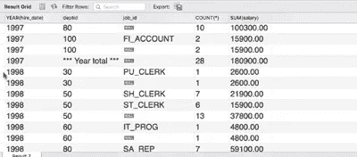
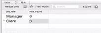

# SQL 的视图和基本代码

> 原文：<https://medium.com/nerd-for-tech/views-and-basic-codes-for-sql-b65fd96e5a54?source=collection_archive---------4----------------------->

**数据库管理系统中的视图:**

**简单查看:**

创建视图 first_view 或将其替换为 SELECT * FROM employees

**复杂视图:**

创建视图 emp_dep 作为 SELECT first_name，department_name，salary，hire_date

来自员工 e，部门 d，其中 e . department _ id = d . department _ id；

更新雇员集 first _ name = ' r . David ' WHERE first _ name = ' David '；

这里，原始数据集已经更改，当然派生表也按照相同的场景进行了更改。

**水平视图:**

CREATE VIEW IT _ Programmers AS SELECT * FROM employees WHERE job _ id = ' IT _ PROG '；

**垂直视图:**

创建视图 emp_contact 作为 SELECT 名字，姓氏，电子邮件，电话号码 FROM employees。

**行列视图:**

将部门联系人视图创建为选择名字、姓氏、电子邮件、电话号码

来自 department_id =50 的员工；

**群组视图:**

创建视图 count _ dept AS SELECT department _ id，count(*)AS count FROM employees GROUP BY department _ id。

**带视图的 DML:**

**简单视图:**

将视图 s1 创建为 SELECT * FROM student

插入 s1 值(30，' XYZ '，60，' xy@dfd.com '，' M ')；

***和***

更新 s1 SET grad_marks =80 其中 roll = 30

**其他一些操作:**

创建视图 s3 作为 SELECT * FROM student，其中 grad _ marks > 40

插入 s3 值(35，' Name1 '，30，' nam@gg '，' M ')；

即使 grad_marks 低于 40 也没有错误。原来的表只是改了一下。

**检查选项:**

将视图 s4 创建为 SELECT * FROM student，其中 grad_marks>50，带有检查选项；

插入 s4 值(40，' XYZ '，40，' hyd@dfd.com '，' M ')；

检查选项错误，因为分数小于 50。

**检查本地:**

将视图 s5 创建为 SELECT * FROM s4，其中 gender = 'M '带有本地检查选项；

插入 s5 值(21，' Fun '，55，' ggg@dg '，' F ')；

错误检查选项失败，因为性别为“F”

插入到 s5 值中(31，'好玩'，55，' gg@dg '，' M ')；

执行

插入到 s5 值中(45，'好玩'，45，' ggd@dg '，' M ')；

错误检查选项失败，因为标记少于 50。

插入 s4 值(22，'玩具'，65，'邮件'，' F ')；

执行

**显示数据库中的所有视图:**

SELECT * FROM information _ schema . views 其中 table _ schema = ' hr

**从另一个数据库复制表:**

创建工作台<new_table>(从<database>中选择*)。)；</database></new_table> 

**将值插入列**

插入学生

值(100，' Amit_Sharma '，' M '，null，8987654534)；

插入学生

值(101，'前岛亚美 _ 夏尔马'，' F '，null，9087654534)；

**复制数据集**

创建表格 Stud1

SELECT * FROM Student

**删除行**

从中删除

**下降柱**

改变工作台下降

**更换**

SELECT *，REPLACE(geo_location，' _ '，' ')FROM bank _ inventory

**重命名表**

更改表重命名<new_name>；</new_name>

**重命名列**

更改表将列<column_name>重命名为<new_name>；</new_name></column_name>

**向表中添加列**

ALTER TABLE<table_name>ADD<column_name>VARCHAR(10)不为空；</column_name></table_name>

ALTER TALE 用户添加<column_name>布尔默认为真；</column_name>

**将值更新到数据库:**

设置 SQL _ safe _ updates = 0；

更新员工数据

SET last_name='hathway '其中 EMP _ id = 1；

emp_data —表

姓氏—列名

emp_id —条件，

**创建/删除索引**

在(列名)上创建索引<index_name>；</index_name>

将上的<index_name>下降；</index_name>

显示来自的索引；查看索引描述。默认情况下，甚至主键也是一种索引。

**MySQL 中的聚合函数**

总和( )、AVG( )、最小值( )、最大值( )、计数( )、中值( )、方差( )、标准差()等

要检查这些聚合函数，我们不能使用 WHERE 过滤条件，我们必须使用 HAVING 子句。WHERE 子句仅用于非聚合函数。

**设置操作符**

工会工会所有

**时间**

世界时间表:

[**https://www.worldtimebuddy.com/**](https://www.worldtimebuddy.com/)

选择日(现在( ))、月(现在( ))、年(现在( ))、小时(现在( ))、分钟(现在( ))、秒(现在())；

SELECT CURRENT _ TIMESTAMP()；

**懂日期的好东西 _ 格式:**

[https://www . MySQL tutorial . org/MySQL-date _ format/#:~:text = To % 20 format % 20a % 20 date % 20 value % 20 To % 20a % 20 具体到% 20a % 20 下面的表% 20 for % 20a % 20 list % 20 of % 20 预定义%20](https://www.mysqltutorial.org/mysql-date_format/#:~:text=To%20format%20a%20date%20value%20to%20a%20specific,table%20below%20for%20a%20list%20of%20predefined%20)

**将字符串转换为日期:**

DATE_FORMAT(STR_TO_DATE( 【T42，' %d-%m-%Y ')，' %d-%m-%Y ')

**将数据集中的文本转换为日期:**

更新<table_name></table_name>

SET <column_name>= STR_TO_DATE( <column_name>，' % d-% m-% Y ')；</column_name></column_name>

更改表格<table_name></table_name>

修改<column_name>日期；</column_name>

**撤收:**

选择年份(雇佣日期)，

IFNULL(department_id，' ***年合计*** ')作为 deptid，COUNT(*)，SUM(薪金)

来自员工

按年份(聘用日期)、部门标识分组，并汇总；

输出:

**案例分组依据:**

选择案例

当职位名称为“经理”时，则为“经理”

当职位名称像“职员”时，则是“职员”

以 job_role 结尾，COUNT(*)以 role_count 结尾

来自工作

其中职位名称如“%经理”或职位名称如“%职员”

分组依据(案例

当职位名称为“经理”时，则为“经理”

当职位名称像“职员”时，则是“职员”

END)；

