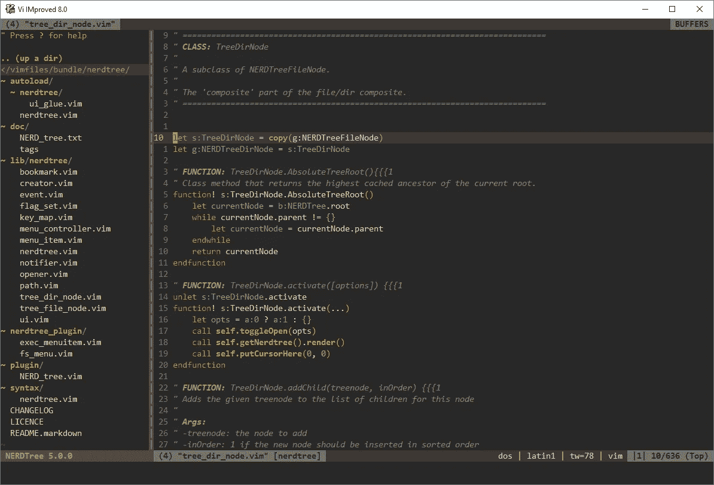
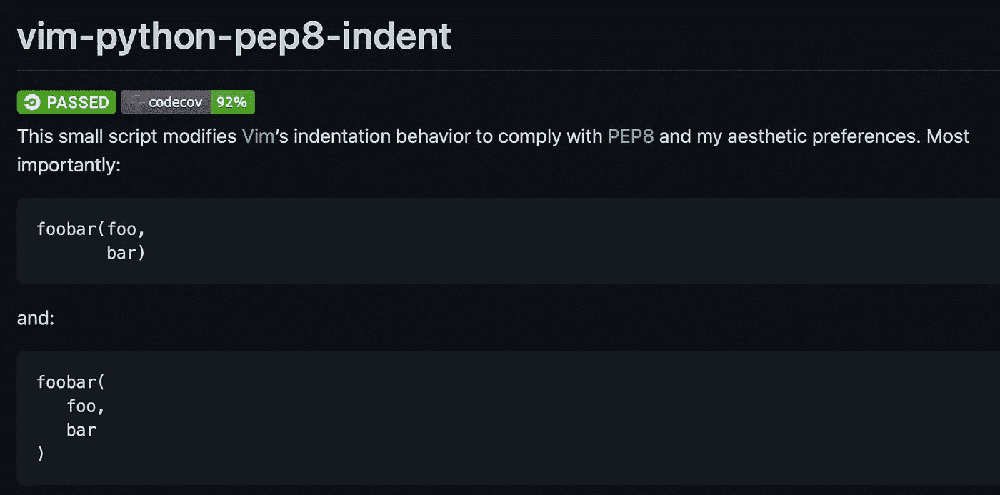
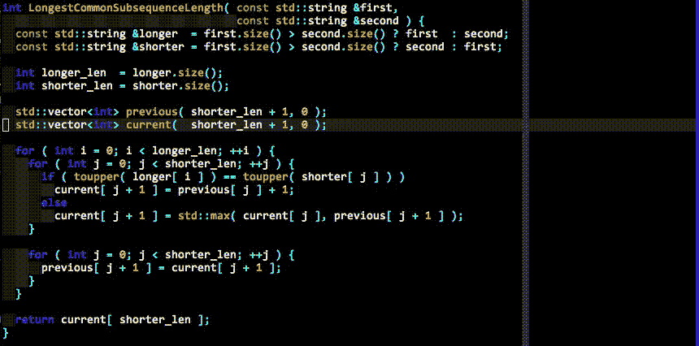

# Vim 作为 Python 2021 的 IDE

> 原文：<https://medium.com/nerd-for-tech/vim-as-an-ide-for-python-2021-f922da6d2cfe?source=collection_archive---------1----------------------->


[去飞溅](https://unsplash.com/photos/DXzjhO5Hpc4)

Vim(或 [NeoVim](https://neovim.io/) )是我最喜欢的文本编辑器/ IDE。我喜欢它的可扩展性、适应性和终端内的灵活性。

在我开始之前，[这里有一个安装 Neovim](https://rafaelnexus.com/tutorials/what-is-neovim-and-how-to-install-it-with-python-support/) 的快速指南。

# 必需品；要素

*   junegunn/vim-plug 是一个非常流行的极简插件管理器
*   [tpope/vim-commentation](https://github.com/tpope/vim-commentary)允许您按 gcc 注释掉一行，或按 gc 在可视模式下注释选择
*   [jeetsukumaran/vim-Python sense](https://github.com/jeetsukumaran/vim-pythonsense)提供了一些特定于 Python 的文本对象&动作来帮助您在文件中导航
*   [junefunn/fzf](https://github.com/junegunn/fzf.vim) 使用模糊搜索帮助你尽可能快地找到那个文件( [fzf 还可以做很多事情，不仅仅是找到文件](https://pragmaticpineapple.com/improving-vim-workflow-with-fzf/))

**其他流行插件🔥**

*   scroolose/nerd tre 是 vim 编辑器中的一个文件系统浏览器



纳特树

*   [liuchengxu/vista.vim](https://github.com/liuchengxu/vista.vim) 查看&搜索 LSP 符号并显示项目的类、函数和方法的概述

# 刻痕

*   [vim jas/vim-python-pep 8-indent](https://github.com/Vimjas/vim-python-pep8-indent)用于尼斯自动缩进✨



如此令人满意😍

另一种设置缩进的常见方法是手动将以下内容添加到。vimrc:

```
set tabstop=8 softtabstop=0 expandtab shiftwidth=4 smarttab
```

# 林挺&修理

*林挺，即语法检查*

林挺有很多很好的选择&修复 Vim。我最喜欢的是 Syntastic & ale，都是很棒的棉绒。

您可能还想安装以下软件，它们是语法检查器可以使用的便利工具:

```
pip install pycodestyle | python style guide checkerpip install vulture | finds ‘dead’/unused codepip install pylint | Linting
```

## 句法的

*   vim-syntastic/syntastic 非常流行，但是它是同步的，这会导致 UI 延迟。
*   Syntastic 安装、设置和使用都非常简单。我使用 Syntastic 年了:我喜欢它。

## ALE —异步 Lint 引擎

*   [ale](https://github.com/dense-analysis/ale) 是另一个 fab 棉绒&固定器。
*   麦芽酒太棒了。到目前为止，我更喜欢它而不是 Syntastic。
*   当您将光标移动到有错误的行时，ALE 会在屏幕底部显示错误消息。
*   使用:lopen 你可以看到一个完整的问题列表。

ALE 可以按照你想要的任何方式进行配置。我是这样设置我的:

```
let g:ale_linters = {'python': 'all'}
let g:ale_fixers = {'python': ['isort', 'yapf', 'remove_trailing_lines', 'trim_whitespace']}let g:ale_lsp_suggestions = 1
let g:ale_fix_on_save = 1
let g:ale_go_gofmt_options = '-s'
let g:ale_go_gometalinter_options = '— enable=gosimple — enable=staticcheck'
let g:ale_completion_enabled = 1
let g:ale_echo_msg_error_str = 'E'
let g:ale_echo_msg_warning_str = 'W'
let g:ale_echo_msg_format = '[%linter%] [%severity%] %code: %%s'
```

*   加上一些额外的设置。pylintrc 使样式警告静音。要生成您的 pylintrc，请执行以下操作:`pylint --generate-rcfile > ~/.pylintrc` (或者用您想要放置它的位置替换~/😊).

# 代码完成及更多

我们已经介绍了 ALE，它有代码完成功能，但还有更多！

如果你已经安装了 ale 并且想要另一个插件来完成代码，记得设置这个(我的~/里有这行代码)。vimrc)


## 绝地-维姆

*   [davidhalter/jedi-vim](https://github.com/davidhalter/jedi-vim) 用于基于 [Jedi](https://github.com/davidhalter/jedi) 的 Python 代码完成，这是一个 Python 语言服务器。

## CoC——征服完成

*   我将 coc.nvim 与 coc-jedi 一起使用，COC-Jedi 是用于 [jedi-language-server](https://github.com/pappasam/jedi-language-server) 的 coc.nvim 包装器。😊
*   [neoclide/coc.nvim](https://github.com/neoclide/coc.nvim) 是一个智能感知引擎。安装 coc 扩展或配置语言服务器以支持 LSP。(Nodejs 是先决条件)。
*   pappasam/coc-jedi 是一个可以用于 Python 的扩展
*   一旦你安装了 coc.nvim &绝地语言服务器，使用`:CocInstall coc-jedi`安装 coc-jedi
*   这里有一篇关于 coc 如何表现以及为什么应该使用 coc-jedi 的博文:[如何编写 coc.nvim 扩展](https://samroeca.com/coc-plugin.html#coc-plugin)

## 你完成了我

*   ycm-core/YouCompleteMe 使用 Jedi，代码在您键入时自动完成
*   它还支持许多其他语言和 Python



来自 YouCompleteMe 自述文件

瞧啊！您已经将 vim 作为一个巧妙的 Python IDE。

如果*真的*想的话，你甚至可以用鼠标:(在 Neovim 中，用`:set mouse=a`)。🐭