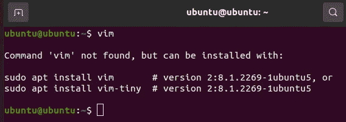
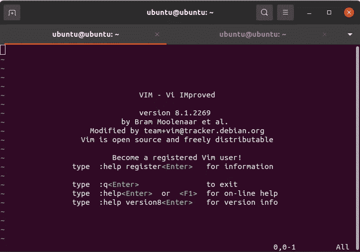
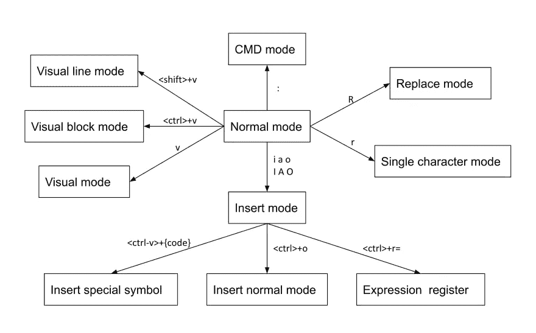

# VIM——改进的 VI 编辑器

> 原文：<https://medium.com/nerd-for-tech/vim-the-improved-vi-editor-4c66ca7f1798?source=collection_archive---------1----------------------->


**概述:**
Vim 的作者，**布莱姆·米勒**，从 Amiga 的 Stevie 编辑器的一个端口派生出 Vim，并于 1991 年向公众发布了一个版本。Vim 设计用于命令行界面和图形用户界面中的独立应用程序，VIM 基本上是 VI 的改进版本，这意味着它具有比 VI 编辑器更多的功能。VI 源于旧的基于 NIX 或 UNIX 的系统，功能有限。

**VIM 的特点:** 1。与 VI 相比具有更多功能。
2。允许你添加一些插件(插件可以更好的控制高亮显示和配置等。)
3。多级撤销和重做(这样你就可以及时退回几个命令)
4。命令模式有许多命令可以轻松地浏览文件和操作文本。
5。它允许你分屏编辑多个文件，也可以让你编辑压缩存档文件中的文件。
6。运行外部命令。

如果你想使用 VIM，你可以在你的系统中找到它或者安装它。
要在系统中找到它只需简单地做

```
$ vim
```



在上面的截图中，系统没有安装 vim。使用下面的命令安装 vim。

```
$ sudo apt install vim #for Debian based distros-or-$ sudo yum install vim #for RHEL based distros
```

一旦在您的系统上安装了 vim 并运行$ vim，那么输出将是:-



如果我试着做$ VI，输出将和上面的截图一样。

**在 VIM 中执行不同操作的不同模式:** 当在 VIM 编辑器中编辑一个文件时，你需要经历 3 种不同的模式，如命令模式、插入模式、执行模式、可视模式



*   默认情况下，当您进入 vim 编辑器时，您处于命令模式。命令模式用于命令各种操作，如在编辑器中移动等。
*   要进入插入模式，请按 I 或 I。插入模式将文本添加到文件中。
*   按 V 进入可视模式，可视模式使得在 Vim 中突出显示和操作文本更加容易
*   替换模式 **a** 允许您通过直接在现有文本上键入来替换它。在进入这个模式之前，进入正常模式，把你的光标放在你想要替换的第一个字符上。然后按“R”(大写 R)进入替换模式。现在，无论您键入什么，都将替换现有文本。
*   按 Esc 键进入命令模式，然后按':'键，再按 w 和 q 的不同组合来保存或退出更改。

**浏览文件:** 在 VIM 编辑器中编辑文件时，可以使用各种快捷键进行浏览。导航是文本编辑的一个重要部分，也是使用文本编辑器的一种非常有效的方式。将这些导航技巧轻松上手，会节省很多时间。

> ***VIM 行导航***
> 以下是可以逐行完成的四种导航。

*   k-向上导航
*   j-向下导航
*   l-导航右侧
*   h-导航左侧

使用 VIM 中的重复因子，我们可以进行 N 次该操作。例如，您可以在命令模式下键入“10j”向下移动 10 行。

要导航到同一行中的不同位置，您可以使用以下选项

*   0 —转到当前行的开头。
*   ^ —转到该行的第一个非空白字符。
*   $ —转到当前行的末尾。
*   g_ —转到该行的最后一个非空白字符。

> ***VIM 撤销/重做*** 撤销/重做是我最喜欢的最好的功能之一。

*   U —撤消
*   。—重做
*   4u —撤消 4 个步骤

> ***删除单词/行*** *该功能有助于逐个删除单词或整行*

d-删除整行，下一行上移
dw -删除一个单词
d$ -删除整行，在删除行的位置留下空白。

> ***VIM 屏幕导航***
> 以下是与屏幕中显示的文本相关的三种导航。

*   H —转到当前屏幕的第一行。
*   M —转到当前屏幕的中间一行。
*   L —转到当前屏幕的最后一行。
*   ctrl+f —向前跳一个全屏。
*   ctrl+b —向后跳一个全屏
*   ctrl+d —向前(向下)跳半个屏幕
*   ctrl+u —向后(向上)跳半个屏幕

> **VIM 特殊导航**

您可能希望在文件中进行一些特殊的导航，包括:

*   N% —转到文件的第 n 个百分比行。
*   NG —转到文件的第 n 行。
*   g-转到文件的末尾。
*   ` "—转到上次关闭文件时处于正常模式的位置。
*   `^ —转到上次关闭文件时处于插入模式的位置。
*   g-转到文件的开头。

> **VIM 字导航**

您可能希望进行一些与单词相关的导航，例如:

*   e-将您带到当前单词的末尾。
*   e-将您带到当前单词的末尾。
*   b —带您到上一个(之前的)单词。
*   B —带您到上一个(之前的)单词。
*   w —带您到下一个单词。
*   W —带您到下一个单词。

WORD — WORD 由一系列非空白字符组成，用空格分隔。单词——单词由一系列字母、数字和下划线组成。

举例说明单词和单词之间的区别

*   192.168.1.1 —单个单词
*   192.168.1.1 —七个单词。

> **VIM 段落导航**

*   **{** —带您到当前段落的开头。通过反复按{移动到上一段的开头。
*   **}** —转到当前段落的末尾。一次又一次地按}移动到下一段的结尾，一次又一次。

> **VIM 搜索导航**

*   **/i** —搜索一个模式，你将带你到它的下一次出现。
*   **？i** —搜索一个模式，它会将你带到它的前一次出现。
*   ***** —在光标下转到下一个出现的当前单词。
*   **#** —转到光标下当前单词的上一个出现位置。

> **VIM 代码导航**

**%** —转到代码内匹配的大括号或圆括号。

> ***复制、粘贴&替换*** *这一功能使工作变得像在普通文本编辑器中一样简单*

*   要复制一行，请按 y 键，将光标放在该行的开头，然后按 p 键，放在要粘贴该行的位置。
*   要选择文本，请键入 v 进入可视模式，然后通过突出显示选择所需的文本，完成后按 y 键。转到新位置按 p 粘贴。

# 感谢阅读！维明快乐！！！